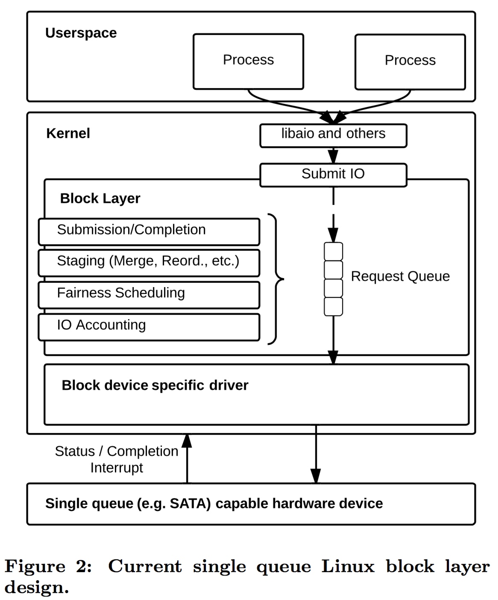
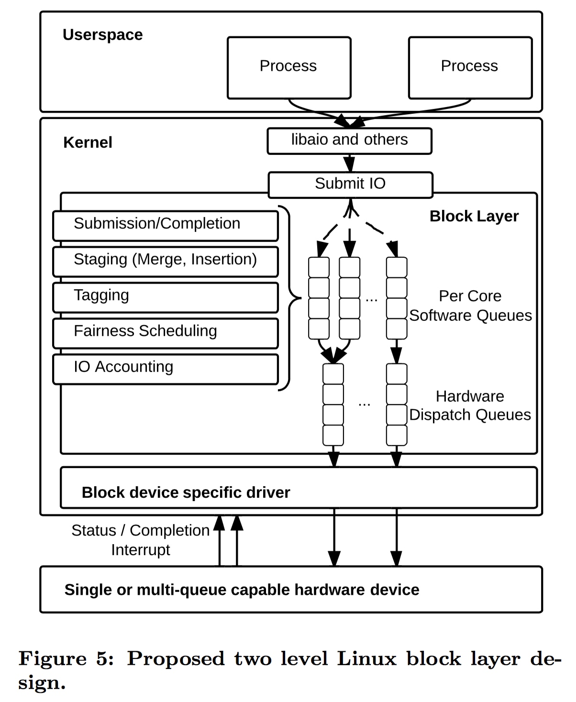
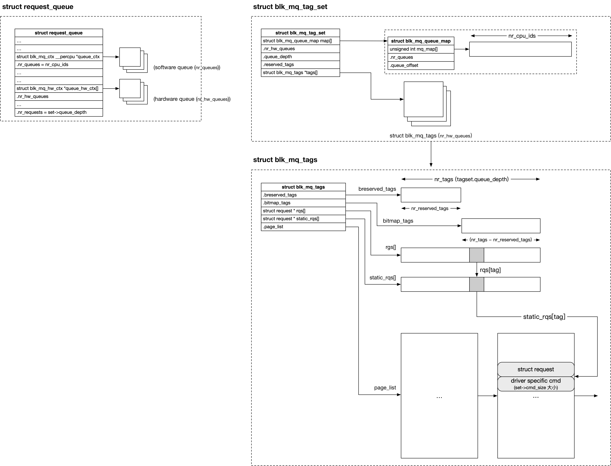

## Block - 8 Multiqueue


### Intro

#### single request queue

single request queue 中，每个 block device 只有一个 request queue (struct request_queue) 与一个 IO scheduler request queue

所有 CPU 提交的对该 block device 的 IO request 实际都由该 IO scheduler request queue 组织并管理，每个 CPU 在访问 request queue，例如将 pending request 添加到 IO scheduler request queue、或从 IO scheduler request queue 取出一个 pending request 之前，都必须首先获取 request queue 的锁




#### multiple request queue

Linux 3.19 开始支持 multiple request queue 机制，multiqueue 的出现主要基于以下因素

一些 block device 例如 SSD 支持 multiple hardware queue，当 block layer 只支持 single request queue 时，为了利用 multiple hardware queue 的特性，在 block device driver 内部实现了 multiple request queue；但是在 block device driver 中实现 multiple request queue 存在以下问题，代码重复、不易维护、无法实现 IO scheduling、QoS 控制等，因而 block device driver 需要 block layer 将其中相同的逻辑抽象出来，也就是 block layer multiqueue

当 block device 支持 multiple hardware queue 特性时，block layer multiqueue 可以充分利用这一特性提高设备的性能；而即使设备不支持 multiple hardware queue 特性，block layer multiqueue 也可以提高设备性能，这是因为在 single request queue 中，所有 CPU 共享同一个 request queue，此时当 CPU 上运行的进程向该 request queue 提交 IO request 时，就必须首先获取该 request queue 的锁，因而多个 CPU 实际上对同一个 request queue 的锁进行竞争，而在 multiqueue 机制中，如果维护 per-CPU request queue，那么 CPU 在提交 IO request 时就不必再对锁进行竞争，而即使之后将 request queue 中的 IO request 转移到 hardware dispatch queue 时，多个 request queue 需要对同一个 hardware dispatch queue 进行竞争，由于 request queue 中会对相邻的 IO request 进行合并，因而此时 single hardware dispatch queue 锁的竞争程度比原来的 single request queue 锁的竞争程度要小很多，从而提高设备性能

此外在 NUMA 系统中，在传统的 single request queue 框架下，多个 NUMA node 上的 CPU 共享同一个 single request queue，因而 CPU 在访问 single request queue 时存在大量的 remote memory access；而在 multiqueue 中则可以在当前 CPU 所在的 NUMA node 中，分配该 software queue 对应的 hardware dispatch queue 的描述符，从而减小 remote memory access，提高系统性能


在 multiqueue 中，每个 block device 同样只有一个 request queue (struct request_queue)，但拥有多个 per-CPU software request queue 与多个 hardware dispatch queue




### Tagset




```c
tagset.nr_hw_queues = 
tagset.queue_depth =
tagset.reserved_tags =
blk_mq_alloc_tag_set(&tagset)

queue = blk_mq_init_queue(tagset);
```

multiqueue 框架下使用 tagset 来封装设备的 hardware queue 相关的信息

```c
struct blk_mq_tag_set {
    unsigned int        nr_hw_queues;
    unsigned int        queue_depth;    /* max hw supported */
    unsigned int        cmd_size;   /* per-request extra data */
    ...
};
```

@nr_hw_queues 描述 hardware queue 的数量

@queue_depth 描述 hardware queue depth 即一个 hardware queue 可以处理的 request 的数量上限，request queue 的 @nr_requests 字段实际上就来自该字段

@cmd_size 在分配 request 时，实际分配 (sizeof(struct request) + cmd_size) 大小的内存，这些预留的 cmd_size 大小的内存用于存储 block device specific 的数据


#### tag

支持 multiqueue 框架的 block device 通常是高速设备例如 NVMe 设备，这类设备使用的 hardware queue 通常支持同时并行处理多个 request，此时 blkdev driver 在接收到一个完成的 request 时，必须提供某种机制对同时处理的多个 request 进行区分，从而判断当前完成的 request 是之前下发的哪一个 request

multiqueue 中使用 tag 机制实现这一功能，即给每个处理的 request 分配一个 tag 以标识该 request，tag 机制实际上就是实现了 tag 与 struct request * 指针之间的映射

blkdev driver 在向 device controler 下发一个 request 的时候，会同时下发该 request 的 tag；当 blkdev driver 接收到一个完成的 request 的时候，会同时获取该 request 的 tag，此时通过 tag 机制就可以完成从 tag 到对应的 struct request * 指针的映射，从而获取对应的 request 


#### tag map

从以上 tag 机制的原理可以看出，每个 hardware queue 需要维护一组独立的 tag 资源，multiqueue 中使用 tag map 来管理每个 hardware queue 的 tag 资源，每个 hardware queue 都有一个对应的 tag map

```c
struct blk_mq_tags;
```


tagset 的 @tags[] 数组维护了所有 hardware queue 对应的 tag map，数组的 index 即为 hardware dispatch queue 的编号，@tags[index] 就描述了编号为 index 的 hardware dispatch queue 对应的 tag map

```c
struct blk_mq_tag_set {
    struct blk_mq_tags  **tags;
    ...
};
```


每个 hardware dispatch queue 的 @tags 字段就描述了其对应的 tag map，实际上就指向 tagset 的 @tags[@queue_num]

```c
struct blk_mq_hw_ctx {
	struct blk_mq_tags	*tags;
	...
};
```


##### tag bitmap

tag 实际就是一个 int 类型的编号，因而可以使用 bitmap 来管理和分配一个 hardware dispatch queue 中所有的 tag

```c
struct blk_mq_tags {
    struct sbitmap_queue bitmap_tags;
    struct sbitmap_queue breserved_tags;

    unsigned int nr_tags;
    unsigned int nr_reserved_tags;
    ...
};
```

@bitmap_tags 与 @breserved_tags 这两个 bitmap 即用于管理该 hardware dispatch queueu 的 tag

@tagset->queue_depth 参数描述了一个 hardware queue 同时可以容纳的 pending request 的数量，其值也保存在 @nr_tags 字段（包含 @reserved_tags）

这些 @tagset->queue_depth 数量的 tag 主要分为两部分

- @tagset->reserved_tags 参数描述了需要预留的 IO request 的数量，其值也保存在 @nr_reserved_tags 字段，这些配额用于在紧急情况下分配 request；@breserved_tags 就专用于 reserved IO request 对应的 tag 的分配，其大小为 reserved_tags
- 剩余的 (queue_depth - reserved_tags) 数量的 IO request 才是最终可用于处理 normal read/write IO 的 request；@bitmap_tags 就用于 normal read/write IO request 对应的 tag 的分配，其大小为 (queue_depth - reserved_tags)


tag 分配的入口为 blk_mq_get_tag()，这一过程中如果传入的 @data->flags 参数设置有 BLK_MQ_REQ_RESERVED 标志，那么就会从 @breserved_tags bitmap 分配 tag，否则从 @bitmap_tags bitmap 分配


##### request array

```c
struct blk_mq_tags {
    struct request **rqs;
    struct request **static_rqs;
    struct list_head page_list;
    ...
};
```

bio enqueue 时往往伴随着 request 结构的分配（当 bio 不能与已有的任何 pending request 合并时就需要给该 bio 创建对应的 request），由于一个 hardware queue 同时可以容纳的 pending request 的数量是有限的，即最多能够同时容纳 @queue_depth 个 IO request，因而实际上可以维护一个 static request array，其中包含 @queue_depth 个 struct request，当 bio enqueue 需要创建 request 时，就可以直接从 static request array 中为其分配一个 request，从而提升效率

tag map 初始化过程中，会分配多个连续内存块，每个内存块为 16 个 page frame 大小，所有内存块保存在 @page_list 链表中。这些内存块用于存储 request 结构，因而所有内存块实际构成了一个 static request array，每个 request 包含 struct request 与 driver specific cmd 两部分

同时 @static_rqs[] 是一个 struct request * 指针数组，该数组中的每个元素依次指向 @page_list 链表维护的内存块中的各个 request，即 static_rqs[0] 指向这些内存块中的第一个 request，static_rqs[1] 指向这些内存块中的第二个 request，依次类推


##### request allocation

bio enqueue 时，当 bio 不能与 request queue 中已有的任何 request 合并而需要给该 bio 创建对应的 request 时，需要为其分配一个新的 request，同时为新创建的 request 分配一个 tag，具体逻辑为

1. 假设为 normal read/write IO，那么从 @bitmap_tags bitmap 中分配一个 tag，即找到第一个空闲的 bit，记为 idx，那么这个 request 分配的 tag 就是 (reserved_tags + idx)
2. 使用 tag 作为 index，static request array 中该下标对应的 request 即 @static_rqs[tag] 即为该 bio 对应的 request
3. 同时将分配的 request 的地址保存在 @rqs[tag] 中

因而 @rqs[] 数组保存了当前该 hardware queue **已经分配** 的 request，其中 tag 作为 index，@rqs[tag] 即为分配的 request 的地址


分配的 tag 保存在 request 的 @tag 字段

```c
struct request {
	int tag;
	...
};
```
