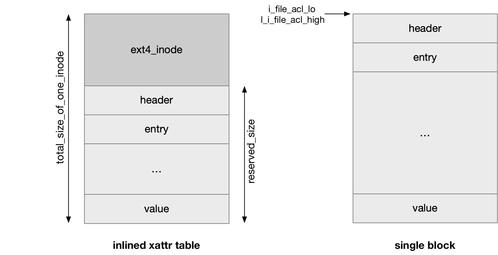
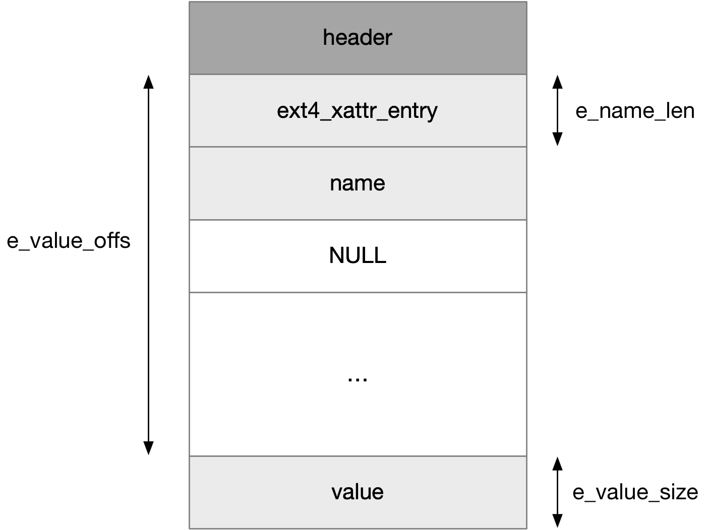

title:'Ext4 - xattr'
## Ext4 - xattr

ext4 中文件的属性主要分为两部分，除了内嵌在 inode 结构中的部分属性之外的其他属性，就称为 xattr (extended attribute)，xattr 提供了一种给 inode 添加额外属性的机制


xattr 实际上是一个 "name:value" pair

- 其中 name 是字符串，其具有 "<namespace>.<attribute>" 格式，例如 "user.mime_type"，目前实现有以下 namespace 
    - security，用于实现 SEL (Security Enhanced Linux) 与 capabilities
    - system，用于实现 ACL (Access Control List)
    - trusted
    - user
- value 的类型是使用者自定义的，因而通常用 void * 来表示，一个 xattr 的 value 可以为空


### xattr disk layout




#### xattr location

虽然 xattr 都是存储在 inode 结构体之外的，但是也存在两个地方用于存储 xattr

xattr 会优先存储在 inode 内嵌的 xattr table 中，如果 inode 中内嵌的 xattr table 已经满了，那么额外分配一个 block 用于存储 xattr table，但是一个 inode 最多只能有一个额外的 meta block 来存储 xattr table


##### stored in single data block

通常会为 inode 分配一个单独的 data block 以专门用于存储 xattr，但是每一个 inode 最多只能分配一个 data block 存储 xattr

```c
struct ext4_inode_info {
	ext4_fsblk_t	i_file_acl;
	...
}
```

memory inode 的 @i_file_acl 字段就描述这个 single data block 的编号


同时这个 block 的编号也会存储在 disk inode 中

```c
struct ext4_inode {
	__le32	i_file_acl_lo;	/* File ACL */
	__le16	l_i_file_acl_high;
	...
}
```

##### stored after inode

除了分配一个单独的 data block 存储 xattr 之外，xattr 实际上还可以紧接着存储在对应的 disk inode 之后，虽然 xattr 没办法存储在 disk inode 内部，但是 ext4 支持在每个 disk inode 之后预留一部分的存储空间，这部分预留的存储空间就可以用于存储 xattr

在 ext2/ext3 年代，每个 disk inode 的大小都是固定的 128 字节，而 ext4 在 mkfs.ext4 格式化文件系统的时候，允许用户自行设置 inode 的大小，但是大小必须为 power of 2，此时 disk superblock 的 @s_inode_size 字段即描述每个 disk inode 实际占用的空间大小

例如 mkfs 时 disk inode 的大小默认设置为 256 字节，此时 disk superblock 的 @s_inode_size 字段的值即为 256，同时 inode table 中每个 inode 实际都占用 256 字节（虽然 ext4_inode 结构体实际占用的空间小于这个数值）

随着新特性的不断加入，ext4_inode 中也不断增加新的字段以支持这些新特性，这就导致 ext4_inode 结构体的实际大小已经超过了 ext2/ext3 年代固定的128 字节，那么这个时候将 ext4_inode 结构体的实际大小减去 128，得出的差值保存在 disk superblock 的 @s_want_extra_isize 字段，此时 disk inode 实际占用的空间大小是 (128 + @s_want_extra_isize)

```c
struct ext4_super_block {
	__le16	s_want_extra_isize;  /* New inodes should reserve # bytes */
	...
}
```

当 inode 从磁盘读取到内存中时，memory inode 的 @i_extra_isize 字段即来自 superblock 的 @s_want_extra_isize 字段

```c
struct ext4_inode_info {
	/* on-disk additional length */
	__u16 i_extra_isize;
	...
}
```


因而从以上 disk inode 的布局可以得出

- 每个 disk inode 实际占用的空间大小为 @superblock->s_inode_size
- disk inode 结构体的大小为 (128 + @superblock->s_want_extra_isize)
- 因而剩余的 (@superblock->s_inode_size - 128 - @superblock->s_want_extra_isize) 大小的空间就可以用于存储 xattr


```

<------- disk inode structure usage --><--- store xattr --->
<     128       >< s_want_extra_isize >   
+----------------+--------------------+--------------------+
|                |                    |                    |
+----------------+--------------------+--------------------+
<--------------------- s_inode_size ----------------------->
```


#### xattr table layout

xattr table 在磁盘上的布局如下所示，由 header 和其后的多个 xattr entry 构成

每个 entry 的 name 和 value 分开存储，其中 entry (包括 entry 描述符即 struct ext4_xattr_entry 和 name 描述的字符串) 从前往后存储，value 从后往前存储

entry 数组最后紧跟着的 u32 即 4 字节为 0 表示 entry 数组的边界

```c
 *   +------------------+
 *   | header           |
 *   | entry 3          | |
 *   | entry 2          | | growing downwards
 *   | entry 1          | v
 *   | four null bytes  |
 *   | . . .            |
 *   | value 3          | ^
 *   | value 2          | | growing upwards
 *   | value 1          | |
 *   +------------------+
```

其中 entry 1 先于 entry 2 插入


##### header of inlined inode

inode 中内嵌的 xattr table 的 header 布局为

```c
struct ext4_xattr_ibody_header {
	__le32	h_magic;	/* magic number for identification */
};
```

@h_magic 是 EXT4_XATTR_MAGIC 即 0xEA020000


##### header of single block

single data block 中的 xattr table 的 header 布局为

```c
struct ext4_xattr_header {
	__le32	h_magic;	/* magic number for identification */
	__le32	h_refcount;	/* reference count */
	__le32	h_blocks;	/* number of disk blocks used */
	__le32	h_hash;		/* hash value of all attributes */
	__le32	h_checksum;	/* crc32c(uuid+id+xattrblock) */
				/* id = inum if refcount=1, blknum otherwise */
	__u32	h_reserved[3];	/* zero right now */
};
```

@h_magic 是 EXT4_XATTR_MAGIC 即 0xEA020000
@h_blocks 描述使用的 block 的数量，通常为 1


##### xattr entry




xattr 在磁盘上的布局如 struct ext4_xattr_entry 描述

```c
struct ext4_xattr_entry {
	__u8	e_name_len;	/* length of name */
	__u8	e_name_index;	/* attribute name index */
	__le16	e_value_offs;	/* offset in disk block of value */
	__le32	e_value_block;	/* disk block attribute is stored on (n/i) */
	__le32	e_value_size;	/* size of attribute value */
	__le32	e_hash;		/* hash value of name and value */
	char	e_name[0];	/* attribute name */
};
```


每个 xattr entry 分成两部分分开存储

- struct ext4_xattr_entry 结构和 name 描述的字符串存储在一起，从前往后存储
- value 从后往前存储

```c
+------------------+
| header           |
+------------------+    +
| entry            |    |
|------------------|    +--> entry 描述符和 name 字符串
| @e_name[]        |    |
+------------------+    + 
| four null bytes  |
+------------------+
| . . .            |
+------------------+    
| value            |    --> entry 的 value
+------------------+
```


###### name

xattr entry 中描述 (name.value) pair 中 name 这部分的字段有 

```c
struct ext4_xattr_entry {
	__u8	e_name_len;	/* length of name */
	__u8	e_name_index;	/* attribute name index */
	...
	char	e_name[0];	/* attribute name */
};
```

> prefix index

首先在存储 name 时，为了在磁盘上节省存储空间，会将 name prefix 转化为对应的 prefix index，此时在磁盘上存储对应的 prefix index

例如在存储 "user.myattr" xattr 时，磁盘上存储的实际是对应的 prefix index 即 EXT4_XATTR_INDEX_USER 即 1，以及该 xattr 名称的剩余部分 "myattr"

```c
/* Name indexes */
#define EXT4_XATTR_INDEX_USER 1  /* "user." */
#define EXT4_XATTR_INDEX_POSIX_ACL_ACCESS 2 /* "system.posix_acl_access" */
#define EXT4_XATTR_INDEX_POSIX_ACL_DEFAULT 3 /* "system.posix_acl_default" */
#define EXT4_XATTR_INDEX_TRUSTED 4 /* "trusted." */
#define EXT4_XATTR_INDEX_SECURITY 6 /* "security." */
#define EXT4_XATTR_INDEX_SYSTEM 7 /* "system." */
```

@e_name_index 描述 namespace，例如存储 "user.myattr" xattr 时，该字段的值为 EXT4_XATTR_INDEX_USER 即 1


> name

每个 xattr entry 最后的字符数组即 @e_name[] 存储该 xattr 的名称，因而每个 xattr entry 实际都是不定长的，此时 @e_name_len 字段就描述 @e_name[] 字符数组的长度

@e_name[] 实际存储 xattr 的名称中移除 namespace prefix 之后剩余的部分，例如存储 "user.myattr" xattr 时，该字段即为 "myattr" 字符串


###### value

xattr entry 中描述 (name.value) pair 中 value 这部分的字段有 

```c
struct ext4_xattr_entry {
	__le16	e_value_offs;	/* offset in disk block of value */
	__le32	e_value_inum;	/* inode in which the value is stored */
	__le32	e_value_size;	/* size of attribute value */
	...
};
```

@e_value_offs 描述从第一个 entry 的地址开始，到 value 的起始地址之间的偏移
@e_value_size 描述 value 的长度，字节为单位


ext4 xattr 支持不同 inode 共用同一个地址处存储的 value，因而 value 有可能存储在其他 block 中

若value存储在当前的 block 中，那么@e_value_inum 字段就为 0；否则 value 就存储在 @e_value_inum 编号描述的其他 block 中


