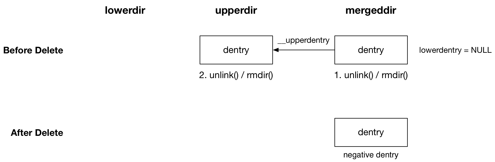
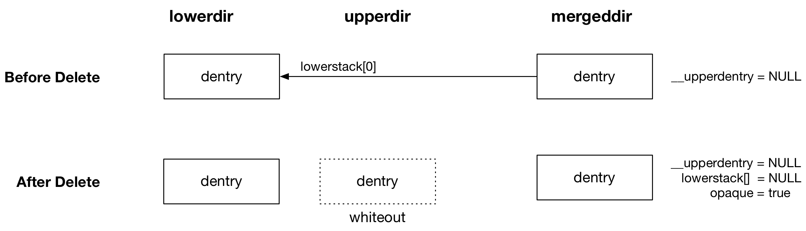
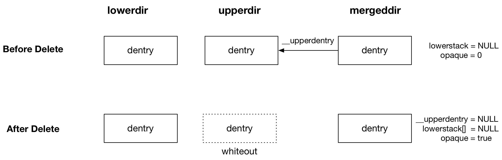

## overlayfs - Feature - whiteout

### Background

whiteout 特性与文件/目录的删除 (delete) 操作有关

在 mergedir 下删除一个文件或目录，若该文件只存在于 lowerdir，由于 lowerdir 是 read-only 的，我们不能删除 lowerdir 下对应的文件，因而必须使用某种方法将 lowerdir 下的特定文件标记为“已删除”

同理若 lowerdir 与 upperdir 中同时存在与删除的文件同名的文件（即此时 upperdir 下的文件覆盖 lowerdir 下的同名文件），此时在删除 upperdir 下的文件后，同时也需要将 lowerdir 下的同名文件标记为“已删除”

overlayfs 使用 whiteout 文件实现这种标记，对于以上两种情况，都需要在 upperdir 对应的路径下创建同名的 whiteout 文件，在 lowerdir 与 upperdir 合并的过程中，upperdir 中的 whiteout 文件会覆盖 lowerdir 中的同名文件或目录，同时 whiteout 文件并不会在 mergedir 下显示，从而在用户看来 mergedir 就没有该文件

whiteout 文件其实就是一个字符设备文件，通过调用 upperdir 的 underlying filesystem 的 inode ops 的 mknod() 回调函数实现 whiteout 文件的创建

### delete file/directory

> 删除文件时，其实是对删除的文件执行 unlinkat() syscall，实际调用删除文件所在父目录的 inode ops 的 unlink() 回调函数
> 删除目录时，其实是对删除的目录执行 AT_REMOVEDIR unlinkat() syscall，实际调用删除文件所在父目录的 inode ops 的 rmdir() 回调函数

#### 删除的文件/目录来自 upperdir，且 lowerdir 没有同名文件/目录

overlayfs 中 directory inode ops 的 unlink()回调函数为 ovl_unlink()，其中实际对 upperdir 中对应的文件执行 vfs_unlink()，其中会调用 upperdir 的 underlying filesystem 的 inode ops 的 unlink() 回调函数，以删除 upperdir 中对应的文件

overlayfs 中 directory inode ops 的 rmdir()回调函数为 ovl_rmdir()，其中实际对 upperdir 中对应的目录执行 vfs_rmdir()，其中会调用 upperdir 的 underlying filesystem 的 inode ops 的 rmdir() 回调函数，以删除 upperdir 中对应的目录

#### 删除的文件/目录来自 lowerdir，且 upperdir 没有同名覆盖的文件/目录

overlayfs 中 directory inode ops 的 unlink()回调函数为 ovl_unlink()，其中实际在 upperdir 对应的路径创建一个同名的 whiteout 文件，该 whiteout 文件会屏蔽 lowerdir 中的同名文件

overlayfs 中 directory inode ops 的 rmdir()回调函数为 ovl_rmdir()，其中
实际在 upperdir 对应的路径创建一个同名的 whiteout 文件，该 whiteout 文件会屏蔽 lowerdir 中的同名目录

当删除一个 lowerdir 中的文件，同时 upperdir 中不存在同名的文件时，需要在 upperdir 对应的路径下创建同名的 whiteout 文件

whiteout 文件的创建过程需要是原子的，即 upperdir 对应的路径下要么存在创建完成的 whiteout 文件，要么不存在 whiteout 文件，然而 whiteout 文件依赖 mknod()回调函数实现，其实现不是原子的，因而其首先在 workdir 下创建对应的 whiteout 文件，之后调用 underlying filesystem 的 inode ops 的 rename() 或 rename2() 回调函数将 workdir 下的 whiteout 文件移动到 upperdir 下

#### 删除的文件是 upperdir 覆盖 lowerdir 的文件，删除的目录是 lowerdir 与 upperdir 合并的目录

overlayfs 中 directory inode ops 的 unlink()回调函数为 ovl_unlink()，其中实际在 upperdir 对应的路径创建一个同名的 whiteout 文件，同时删除 upperdir 中的同名文件

overlayfs 中 directory inode ops 的 rmdir()回调函数为 ovl_rmdir()，其中
实际在 upperdir 对应的路径创建一个同名的 whiteout 文件，同时删除 upperdir 中的同名目录

当删除的文件是 upperdir 覆盖 lowerdir 的文件，删除的目录是 lowerdir 与 upperdir 合并的目录时，需要在 upperdir 对应的路径创建一个同名的 whiteout 文件，同时删除 upperdir 中的同名文件或目录，这需要 1)whiteout 文件的创建与 2) upperdir 中的同名文件或目录的删除，这两个步骤必须是原子的

其实现过程中首先在 workdir 下创建对应的 whiteout 文件，之后调用 underlying filesystem 的 inode ops 的 rename()或 rename2() 回调函数将 workdir 下的 whiteout 文件与 upperdir 下的同名文件相交换，此时 whiteout 文件会移动到 upperdir 下，同时原先 upperdir 下的同名文件会移动到 workdir 下，之后调用 underlying filesystem 的 inode ops 的 unlink()或 rmdir() 回调函数将移动到 workdir 下的同名文件或目录删除

