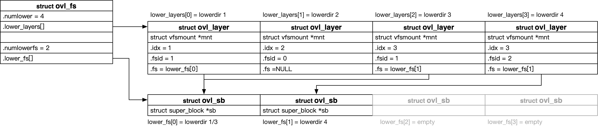

title:'overlayfs - 1 Base'
## overlayfs - 1 Base

### superblock

struct ovl_fs 抽象 overlayfs specific superblock，保存在 VFS superblock 的 s_fs_info 字段

#### upperdir

```c
/* private information held for overlayfs's superblock */
struct ovl_fs {
	struct vfsmount *upper_mnt;
	...
};
```

@upper_mnt 描述该 overlayfs 的 upperdir

初始化阶段会 clone 一份 upperdir 所在的文件系统的 mount 结构，只是会把 mount 中的 vfsmount 的 mnt_root 字段修改为 upperdir 路径，即把 root dentry 修改为 upperdir 对应的 dentry


#### workdir

```c
/* private information held for overlayfs's superblock */
struct ovl_fs {
	/* workbasedir is the path at workdir= mount option */
	struct dentry *workbasedir;
	
	/* workdir is the 'work' directory under workbasedir */
	struct dentry *workdir;
	...
};
```

@workbasedir 描述 workdir 对应的 dentry
@workdir 描述 <workdir>/work 目录对应的 dentry


#### lowerdir

struct ovl_fs 中维护了两个数组来描述所有的 lowerdir 的相关信息



##### ovl_sb array

首先 lower_fs[] 数组存储了所有 lowerdir 所在文件系统的 sb，但是要满足以下两点

- 如果一个 lowerdir 与 upperdir 在同一个文件系统，那么这个 lowerdir 对应的 sb 并不会存储在该数组中
- 如果两个 lowerdir 在同一个文件系统，那么这两个 lowerdir 只会占用该数组中的一个位置，也就是说不会重复存储

源码注释就清晰地解释了 @lower_fs[] 数组的作用
> unique lower sb that differ from upper sb


@numlowerfs 描述 lower_fs[] 数组中保存的有效 struct ovl_sb 的数量，实际上就是与 upperdir 不在同一个文件系统的 lowerdir 的数量

```c
/* private information held for overlayfs's superblock */
struct ovl_fs {
	/* Number of unique lower sb that differ from upper sb */
	unsigned int numlowerfs;
	struct ovl_sb *lower_fs;
	...
};
```


struct ovl_sb 实际上就用于封装 lowerdir 所在文件系统的 super block，@sb 是该 lowerdir 所在文件系统的 superblock

```c
struct ovl_sb {
	struct super_block *sb;
	...
};
```


> example

假设某个 overlayfs mount 有四个 lowerdir 分别为 lowerdir 1/2/3/4，只有lowerdir 2 与 upperdir 在同一个文件系统 (sb A)，其中 lowerdir 1/3 位于同一个文件系统 (sb B)，lowerdir 4 位于另一个文件系统 (sb C)，那么此时 @lower_fs[] 数组的布局如上图所示

此时所有 lowerdir 对应的 sb 中，与 upperdir sb 相异的只有两个，因而虽然 @lower_fs[] 数组会分配 4 个位置，但实际上只有两个位置会被占用

- 一个是 lowerdir 1/3 所在的文件系统 (sb B)
- 另一个是 lowerdir 4 所在的文件系统 (sb C)


##### ovl_layer array

此外 struct ovl_fs 中还维护有一个 @lower_layers[] 数组来描述所有的 lowerdir，每个 lowerdir 就对应一个 struct ovl_layer 结构

@numlower 描述 @lower_layers[] 数组的大小，即 lowerdir 的数量

```c
/* private information held for overlayfs's superblock */
struct ovl_fs {
	unsigned int numlower;
	struct ovl_layer *lower_layers;
	...
};
```


接下来详细描述 struct ovl_layer 各个字段的含义

```c
struct ovl_layer {
	struct vfsmount *mnt;

	/* Index of this layer in fs root (upper idx == 0) */
	int idx;

	/* One fsid per unique underlying sb (upper fsid == 0) */
	int fsid;
	struct ovl_sb *fs;
};
```

首先 @idx 字段描述该 lowerdir 在所有 lowerdir 中的编号，从 1 开始编号（idx 0 预留给 upperdir）


其次 @fsid/@fs 两个字段就描述了该 lowerdir 对应 @lower_fs[] 数组的哪一个 struct ovl_sb 结构

- 如果当前 lowerdir 与 upperdir 在同一个文件系统，那么该 lowerdir 的 @fsid 为 0，@fs 为 NULL
- 否则 @fsid 从 1 开始递增，其对应的 struct ovl_sb 实际上就是 @lower_fs[@fsid-1]，并保存在 @fs 字段；需要注意的是，如果两个 lowerdir 位于同一个文件系统，那么它们是共用同一个 fsid 的


@mnt 描述该 lowerdir 所在文件系统的 mount instance

初始化阶段会 clone 一份该 lowerdir 所在的文件系统的 mount 结构，只是会把 mount 中的 vfsmount 的 mnt_root 字段即 root dentry 修改为该 lowerdir 路径对应的dentry，@mnt 即为复制的 mount 结构中的 vfsmount


> example

还是以之前的例子为例，此时 @lower_layers[] 数组的布局如上图所示

- @idx 描述该 lowerdir 在所有 lowerdir 中的编号，从 1 开始编号

- lowerdir 1 与 upperdir 不在同一个文件系统
    - 因而为其分配一个 fsid，从 1 开始编号，其 @fsid 就是 1
    - @fs 即指向 @lower_fs[@fsid-1] 即 @lower_fs[0]
- lowerdir 2 与 upperdir 在同一个文件系统
    - 因而其 @fsid 就是 0，@fs 即为 NULL
- lowerdir 3 与 upperdir 不在同一个文件系统，但是与 lowerdir 1 在同一个文件系统
    - 因而其共享 lowerdir 1 的 fsid，因而其 @fsid 也是 1
    - @fs 即指向 @lower_fs[@fsid-1] 即 @lower_fs[0]
- lowerdir 4 与 upperdir 不在同一个文件系统
    - 因而为其分配一个 fsid，其 @fsid 就是 2
    - @fs 即指向 @lower_fs[@fsid-1] 即 @lower_fs[1]


#### atomic

overlayfs 中很多操作往往涉及多个步骤，然而这些操作又通常要求是原子的，例如当删除的文件是 upperdir 覆盖 lowerdir 的文件，删除的目录是 lowerdir 与 upperdir 合并的目录时，需要在 upperdir 对应的路径创建一个同名的 whiteout 文件，同时删除 upperdir 中的同名文件或目录，这需要 1) whiteout 文件的创建与 2) upperdir 中的同名文件或目录的删除，这两个步骤必须是原子的

overlayfs 使用 underlying filesystem 的 rename 特性实现这种原子操作，这一过程中还会使用到 workdir。

1. 删除的文件是 upperdir 覆盖 lowerdir 的文件，删除的目录是 lowerdir 与 upperdir 合并的目录

其实现过程中首先在 workdir 下创建对应的 whiteout 文件，之后调用 underlying filesystem 的 inode ops 的 rename() 或 rename2() 回调函数将 workdir 下的 whiteout 文件与 upperdir 下的同名文件相交换，此时 whiteout 文件会移动到 upperdir 下，同时原先 upperdir 下的同名文件会移动到 workdir 下，之后调用 underlying filesystem 的 inode ops 的 unlink() 或 rmdir() 回调函数将移动到 workdir 下的同名文件或目录删除


2. 删除一个 lowerdir 中的文件或目录，同时 upperdir 中不存在同名的文件或目录

此时需要在 upperdir 对应的路径下创建同名的 whiteout 文件

其实现过程首先在 workdir 下创建对应的 whiteout 文件，之后调用 underlying filesystem 的 inode ops 的 rename() 或 rename2() 回调函数将 workdir 下的 whiteout 文件移动到 upperdir 下


3. 创建新目录，此时 lowerdir 下存在同名目录，同时 upperdir 下存在同名 whiteout 文件

此时需要删除 upperdir 下的 whiteout 文件，同时在 upperdir 下创建同名目录，并对该目录设置 opaque 属性

其实现过程中先在 workdir 下创建对应的目录，并将新创建的目录设置为 opaque 属性，之后调用 underlying filesystem 的 inode ops 的 rename() 或 rename2() 回调函数将 workdir 下新创建的目录与 upperdir 下的 whiteout 目录相交换，最后再删除 workdir 下的 whiteout 文件


4. copy-up

copy-up 过程中需要将 lowerdir 下的文件拷贝到 upperdir 下，为了保证原子性，首先在 workdir 下创建文件的拷贝，其中会将 lowerdir 下同名文件的数据以及属性都拷贝到 workdir 下新创建的文件中，之后通过 rename() 交换的方式将 workdir 下创建的文件交换到 upperdir 下


### misc

- workdir 与 upperdir 必须在同一个文件系统下
- workdir 不能是 upperdir 的子目录，upperdir 也不能是 workdir 的子目录
- 如果没有指定 workdir，那么挂载的 overlayfs 是 read only 的
- overlayfs 支持多个 lowerdir，但是目前最多支持 500 个 lowerdir
- 可以不指定 upper dir，此时相当于只是将所有的 lowerdir 相合并挂载到 mergedir，因而此时 lowerdir 的数量必须大于等于 2

