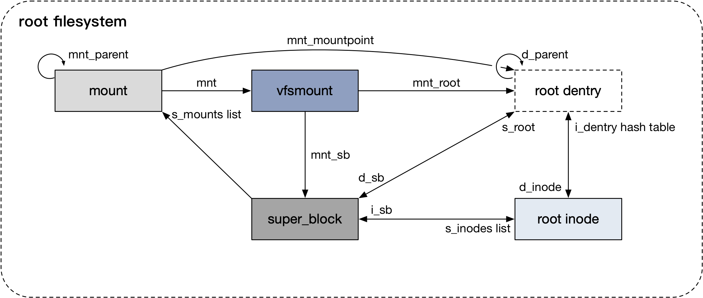
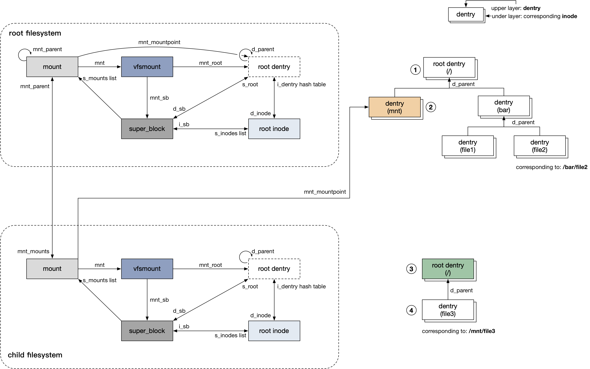
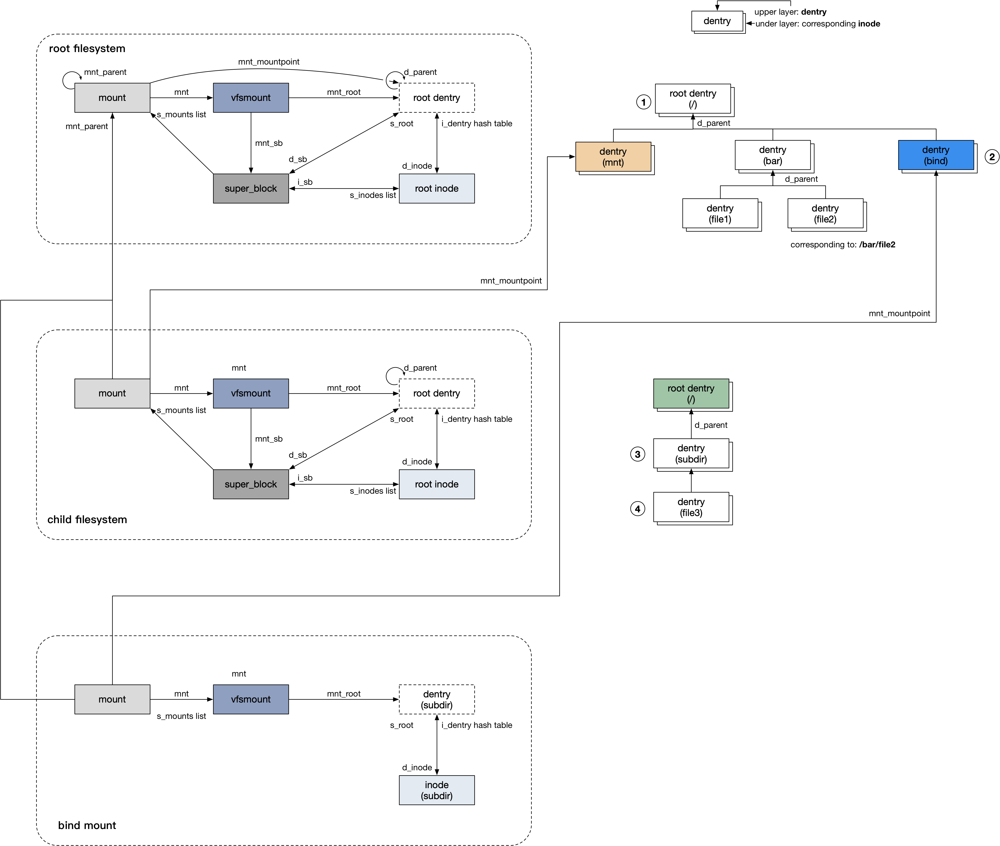

title:'Control - Mount'
## Control - Mount


### mount object

同一个文件系统可以有多个挂载的实例 (mount instance)，例如同一个设备可以同时挂载到多个挂载点 (mount point)，这个时候同一个设备就有多个 mount instance，每个 mount instance 对应一个 mount point

在旧版本的内核中使用 struct vfsmount 来抽象 mount instance，但是 struct vfsmount 中大部分的字段都只有 VFS core 访问，而 struct vfsmount 本身又经常作为接口传递给各个不同类型的 filesystem，因而为了提高数据结构的封装性，在 v3.3 的时候把原来 struct vfsmount 中只有 VFS core 访问的字段提取出来单独放到 struct mount 结构中，struct vfsmount 中只剩下 root dentry、superblock、mount flags 三个字段，此时 struct vfsmount 继续用于抽象 mount instance，同时作为各个 filesystem 的接口


在具体实现上，每个 struct mount 都通过内嵌的形式有一个对应的 struct vfsmount 结构

```c
struct mount {
	struct mount *mnt_parent;
	struct dentry *mnt_mountpoint;
	struct vfsmount mnt;
	...
};
```

```c
struct vfsmount {
	struct dentry *mnt_root; /* root of the mounted tree */
	struct super_block *mnt_sb; /* pointer to superblock */
	int mnt_flags;
};
```

@mnt_sb 即当前挂载的文件系统对应的 superblock


@mnt_root 即该文件系统的根目录对应的 dentry，无论该文件系统的挂载点是哪里，root dentry 对应的路径永远是 "/"

@mnt_root->d_inode 即描述当前挂载的文件系统的 root inode，即当前挂载的文件系统的根目录对应的 inode。每个文件系统其实都是一棵独立的 tree，这棵 tree 中有一个根节点，即这个文件系统中的根目录。从根目录开始往下是各个子目录与文件，从而形成一个树状结构


@mnt_mountpoint 即当前挂载实例的挂载点对应的 dentry，例如当前 mount instance 挂载到 /mnt 目录，那么 mountpoint dentry 对应的路径即为 /mnt

需要注意 root dentry 与 mountpoint dentry 这两个概念的区别，我们前面介绍过每个文件系统其实就是一棵树，mountpoint dentry 其实描述了当前挂载的实例在父文件系统的那棵树中的位置，其视角是从父文件系统的角度出发的，例如将子文件系统挂载到父文件系统的 /mnt 目录下，那么 mountpoint dentry 即为 "/mnt"；而 root dentry 是从子文件系统的角度出发的，其值永远是 "/"，描述了 root dentry 在子文件系统的那棵树中的位置


@mnt_parent 即当前挂载实例对应的父文件系统，例如挂载实例 A 描述将设备A挂载到 /mnt 目录，挂载实例 B 描述将设备B挂载到 /mnt/X 目录，那么挂载实例 B 的 mnt_parent 字段即指向挂载实例 A


文件系统挂载过程中，即 mount() syscall 执行过程中会创建并初始化该挂载实例的以上所有数据结构，各个数据结构之间的联系如下图所示



上图以根文件系统为例，描述 mount 相关的数据结构之间的联系，其中

- vfsmount 居于中心位置，描述了其对应的挂载实例的 superblock、mount、root dentry 等所有信息
- 因为根文件系统位于各个挂载实例中的最顶层，所以其 mount->mnt_parent 字段指向自身
- 根文件系统的挂载点与其根目录等价，因而 mount->mnt_mountpoint 指向其自身的 root dentry
- 因为 root dentry 描述的根目录在对应文件系统的树中处于最顶层，因而所有文件系统的 root dentry 的 d_parent 字段都指向自身

root dentry 的名称即对应的 qstr 结构的值即为 '/'


### mount hierarchy

一个文件系统可以挂载到另一个文件系统的树的某个节点上，此时 mount 的 @mnt_mounts 链表组织直接挂载在该文件系统下的所有子文件系统

例如将 /dev/sdb 挂载到根文件系统的 "/mnt" 目录下



此时父文件系统（即根文件系统）与子文件系统（/dev/sdb 设备上的文件系统）的 mount 相关数据结构之间的联系如上图所示，此时

- 子文件系统的 mount->mnt_parent 字段指向父文件系统的 mount 结构
- 子文件系统的 mount 通过 @mnt_child 字段添加到父文件系统的 mount->mnt_mounts 链表中
- 子文件系统挂载到父文件系统的 /mnt 路径，即子文件系统的挂载点为 "/mnt"，此时子文件系统的 mount->mnt_mountpoint 指向父文件系统的 dentry 树中 "/mnt" 对应的 dentry


此外尽管子文件系统是挂载到父文件系统树的某个节点上，但是可以看到子文件系统的 dentry 树还是从子文件系统的 root dentry 开始，子文件系统的 root dentry 与父文件系统的 dentry tree 没有任何交联，也就是我们前面说过的，每个文件系统都会维护一个独立的 dentry tree

接下来介绍这种情况下子文件系统下的一个文件是怎么执行 pathname lookup 操作的，例如需要索引 "/mnt/file3" 路径。其过程与之前介绍的单个文件系统中执行 pathname lookup 的过程是一致的，也是从根文件系统的 root dentry 开始，依次寻找路径中各个 compoennt 对应的 dentry，只是在该过程中当索引到挂载点对应的 dentry（即 "/mnt" 对应的 dentry）时，如何从父文件系统中的 mountpoint dentry 转到子文件系统中的 root dentry ？

虽然我们之前介绍到各个文件系统中的 dentry tree 都是相互独立的，即子文件系统的 root dentry 与父文件系统中的 mountpoint dentry 没有直接的交联关系，但是子文件系统的 mount->mnt_mountpoint 实际上描述了这种关系


例如上述将子文件系统挂载到根文件系统的 "/mnt" 目录下时，会在 "/mnt" 对应的 dentry 的 d_flags 字段中设置 DCACHE_MOUNTED 标志，以描述该 dentry 实际上作为一个 mountpoint 挂载有子文件系统

之后当对 "/mnt/file3" 路径进行索引时，我们从根文件系统的 root dentry 出发，最终找到 "/mnt" 对应的 dentry，此时我们发现该 dentry 的 d_flags 字段设置有 DCACHE_MOUNTED 标志，说明该 dentry 实际上作为一个 mountpoint 挂载有子文件系统，此时会在全局的 mount_hashtable hash table，即在所有的 mount instance 中寻找当前 mountpoint 路径对应的挂载实例，即 struct mount 结构，从而找到该挂载实例的 root dentry

之后就从子文件系统的 root dentry 出发，继续依次寻找路径中各个 component 对应的 dentry，最终找到 file3 文件对应的 dentry，图中描述了对 "/mnt/file3" 路径进行索引时的四步操作


此外由于各个文件系统中的 dentry tree 都是相互独立的，而 dentry tree 中的任何一个 dentry 都只是描述其对应的文件在当前文件系统下的路径（相当于是相对于当前文件系统的相对路径），因而任何一个文件系统的 dentry tree 中单独的一个 dentry，都不能描述对应的文件在根文件系统下的绝对路径

只有 (mount, dentry) 这个二元组才能描述对应文件的绝对路径，其中前者描述了所在的文件系统在根文件系统中的位置，而后者描述了对应的文件在所在的文件系统中的相对路径，两相结合就描述了对应的文件在根文件系统中的绝对路径

而这也正是 struct path 的作用所在，struct path 正是在 pathname lookup 过程中用于描述任一个文件的路径信息的

```c
struct path {
	struct vfsmount *mnt;
	struct dentry *dentry;
};
```


### bind mount

bind mount 是值将一个目录挂载到另一个目录

```c
int mount(const char *source, const char *target,
                 const char *filesystemtype, unsigned long mountflags,
                 const void *data);
```

```
mount("dir1", "dir2", ..., MS_MGC_VAL|MS_BIND, NULL) = 0
```

例如以上就是将 dir1 目录（位于 vda1 设备上）挂载到 dir2 目录，此时传入的 @mountflags 参数含有 MS_BIND 标志

此时 /proc/mounts 会输出

```
/dev/vda1 dir2 ext4 rw,relatime 0 0
```


例如在以下的例子中

- 将子文件系统挂载到根文件系统的 "/mnt" 目录下
- 再将 "/mnt/subdir" 目录 bind mount 到 "/bind" 目录下




此时会为 bind mount 创建一份新的 mount instance，实际上是 "/mnt/subdir" 目录所在的 mount 的拷贝，同时该 mount instance 的

- root dentry 实际是 "/mnt/subdir" 目录对应的 dentry
- mountpoint 实际是 "/bind" 目录对应的 dentry


之后当对 "/bind/file3" 路径进行索引时，我们从根文件系统的 root dentry 出发，最终找到 "/bind" 对应的 dentry，此时我们发现该 dentry 的 d_flags 字段设置有 DCACHE_MOUNTED 标志，说明该 dentry 实际上作为一个 mountpoint 挂载有子文件系统，此时会在全局的 mount_hashtable hash table，即在所有的 mount instance 中寻找当前 mountpoint 路径对应的挂载实例，即当前的 bind mount 对应的 struct mount 结构，从而找到该挂载实例的 root dentry，即 "subdir" 目录对应的 dentry

之后就从子文件系统的 root dentry 出发，继续依次寻找路径中各个 component 对应的 dentry，最终找到 file3 文件对应的 dentry，图中描述了对 "/bind/file3" 路径进行索引时的四步操作

