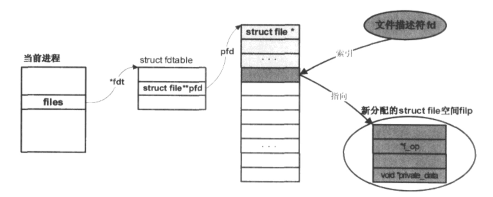

title:'fd table'
## fd table


### process fd table

每个进程都维护了一个 fd table (struct fdtable) 来描述该进程的所有 open file，这个 fd table 保存在进程描述符的 current->files->fdt 字段

```c
struct fdtable {
	unsigned int max_fds;
	struct file __rcu **fd;      /* current fd array */
	unsigned long *open_fds;
	...
};
```

@fd[] 指针数组即为 fd table，其中保存该进程的所有 open file 对应的 struct file * 指针

@max_fds 即描述了 @fd[] 数组的大小

@open_fds bitmap 描述了 @fd[] 数组的使用情况，若该 bitmap 中某个 bit 为 1，则说明 @fd[] 数组中对应的 slot 已经被占用，即存储有 struct file * 指针，否则说明 @fd[] 数组中对应 slot 仍未被占用


@fd[] 数组实际上就描述了 fd 与对应的 struct file 结构的映射关系，即 fd 对应的 struct file 结构即保存在 @fd[fd]

@fd[] 数组描述的 fd table 实际上是动态增长的，open() syscall 执行过程中，首先扫描 @open_fds 位图，以分配一个空闲的fd，若当前 @fd[] 空间已经耗尽则将扩大 @fd[] 数组的大小，最后新创建的 struct file 会保存在 @fd[] 数组的对应位置处

```c
current->files->fdt->pfd[fd] = filp;
```




### /proc/<pid>/fd/

`/proc/<pid>/fd/` 目录实际上就描述了进程的 fd table，其下的每个 symbolink 文件都描述进程打开的一个 fd

```sh
# ls /proc/1/fd -l
total 0
lrwx------ 1 root root 64 May 29 00:50 0 -> /dev/null
lrwx------ 1 root root 64 May 29 00:50 1 -> /dev/null
lrwx------ 1 root root 64 May 29 00:50 2 -> /dev/null
```


### /proc/<pid>/fdinfo/

`/proc/<pid>/fdinfo/` 目录下的每个文件对应进程 fd table 中一个打开的 fd

```sh
# ls /proc/1/fdinfo/ -l
total 0
-r-------- 1 root root 0 May 29 15:44 0
-r-------- 1 root root 0 May 29 15:44 1
-r-------- 1 root root 0 May 29 15:44 2
```


这些文件可以返回对应的 fd 的相关信息

```sh
# cat /proc/12015/fdinfo/4
pos:    1000
flags:  01002002
mnt_id: 21
```


### lsof

lsof 文件实际上就是读取进程的 fd/ 目录，获取进程的 fd table

```
openat(AT_FDCWD, "/proc/<pid>/fd", O_RDONLY|O_NONBLOCK|O_DIRECTORY|O_CLOEXEC) = 4
getdents(4, /* 2 entries */, 32768)     = 48
```
