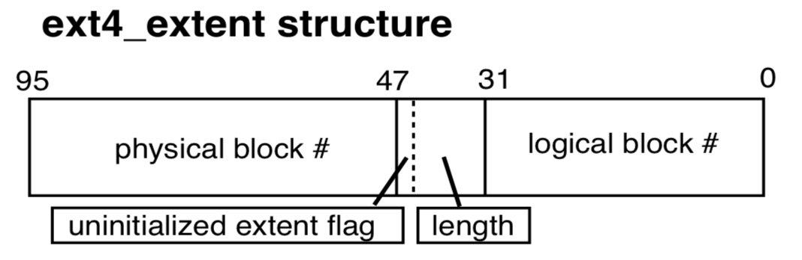
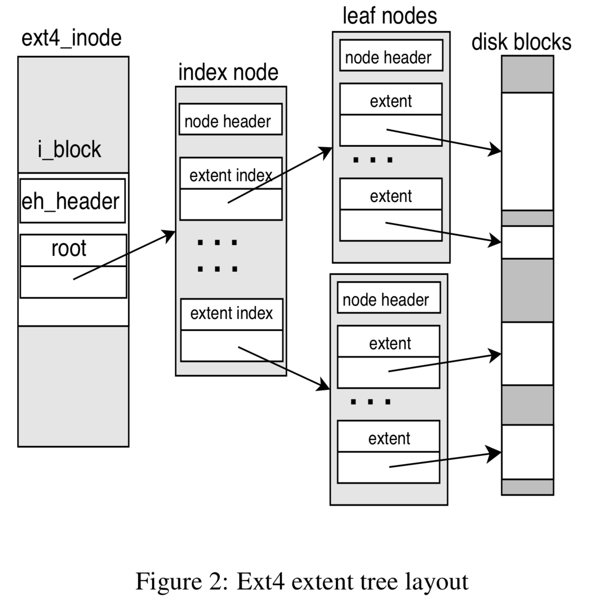
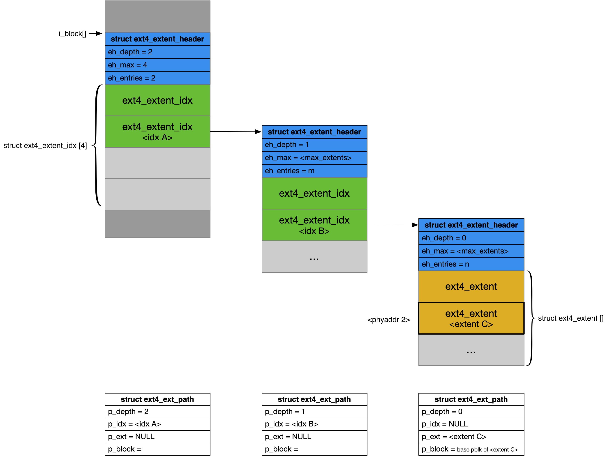
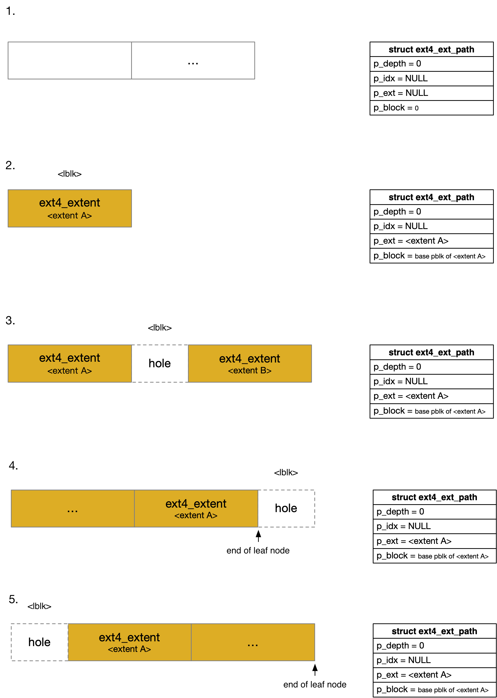
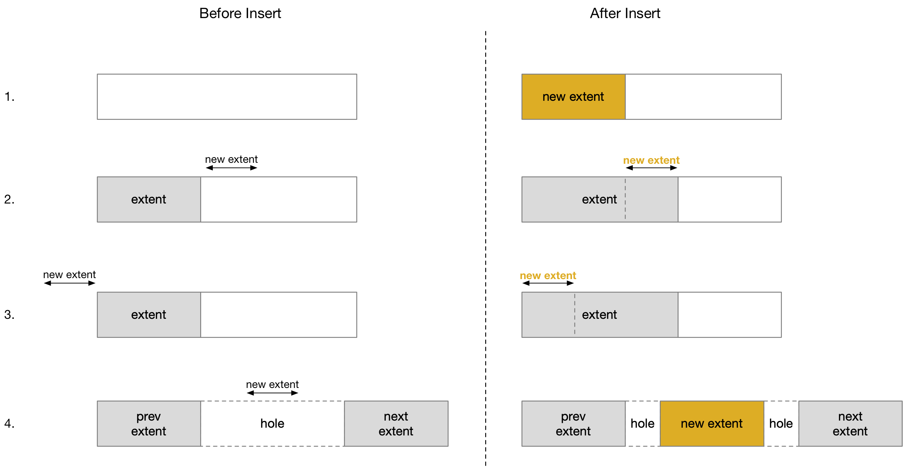
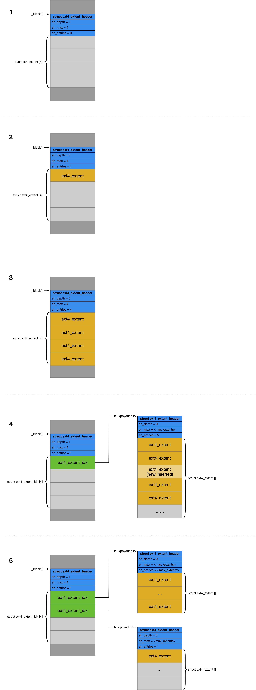
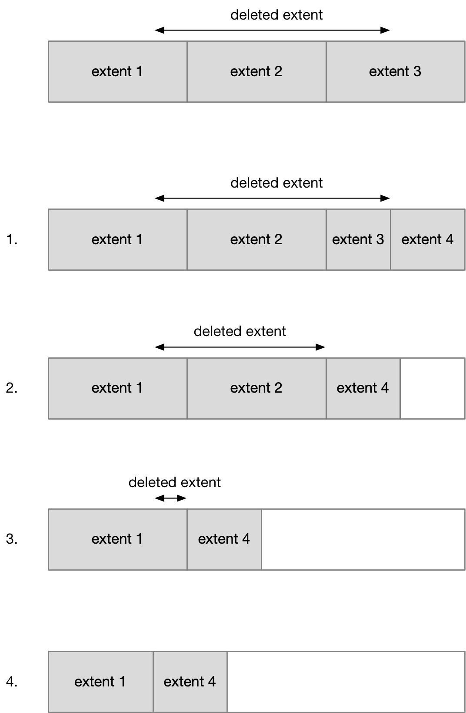

title:'Ext4 - extent'
## Ext4 - extent


### Concept

#### block number mapping

VFS 在对文件进行操作时使用的都是 logical block number，而文件系统在访问磁盘时使用的肯定是 physical block number，因而文件系统就必须实现某种机制实现 logical/physical block number 之间的映射

ext2 使用 indirect block 机制来实现这种映射，但是 indirect block 机制可以实现的映射的数量是有限的；对于大文件来说，文件包含的 data block 数量会很大，此时 indirect block 机制就存在缺陷

因而 ext4 中使用 extent 机制来实现 logical/physical block number 之间的映射


extent 实际上描述了磁盘上一组物理地址连续的 block 的集合，由于一个 extent 使用一个 16 bit 描述其包含的 block 的数量，因而当 block size 为 4KB 时，一个 extent 最大为 128 MB

之前 ext2 中实现映射的单位都是 block，因而对于大文件来说，需要实现的映射项的数量就会很大，从而影响性能；而现在 ext4 中映射的单位是 extent，一个 extent 最大可以为 128 MB，因而对于block地址连续的大文件来说，需要映射的 extent 数量大为减少，从而提升映射的性能


#### extent

struct ext4_extent 就描述一个 extent

```c
/*
 * This is the extent on-disk structure.
 * It's used at the bottom of the tree.
 */
struct ext4_extent {
	__le32	ee_block;	/* first logical block extent covers */
	__le16	ee_len;		/* number of blocks covered by extent */
	__le16	ee_start_hi;	/* high 16 bits of physical block */
	__le32	ee_start_lo;	/* low 32 bits of physical block */
};
```

以下为 ext4_extent 的布局



extent 就用于实现 (ee_block, <ee_start_hi, ee_start_lo>) 这一对 logical/physical block number 之间的映射，其中

- ee_block 字段描述 logical block number
- ee_start_hi/ee_start_lo 字段则共同描述 48 bit 的 physical block number
- ee_len 字段描述映射的这一段 block number 地址空间的长度，以 block 为单位

- 此外 ee_len 字段的 MSB bit 用于 uninitialized extent 标志位，该标志位用于 preallocation 特性


##### inlined extents

```c
struct ext4_inode {
	...
	__le32	i_block[EXT4_N_BLOCKS];/* Pointers to blocks */
	...
};
``` 

i_block[] 数组在 ext2 中用于实现 indirect block 机制，为了兼容 ext2，ext4_inode 结构的前半部分定义与 ext2_inode 完全一致，因而 ext4_inode 结构也继承了 i_block[] 字段，此时在 ext4 中该字段则用于实现 extent 机制

i_block[] 数组的大小为 60 字节，其中后 48 字节存储 4 个 ext4_extent，因而如果文件比较小，inode 中内嵌的四个 ext4_extent 就足够用了


##### extent tree

如果文件比较大，或者是 sparse 文件，需要的 ext4_extent 数量超过四个时，就需要分配更多的 extent，此时 ext4 中使用 B+ tree 来维护所有的 extent

- 每个 inode 都会维护一棵 tree 来组织该文件的所有 extent
- 这棵 extent tree 是一棵平衡树，同时只有在叶子节点存储 ext4_extent，中间节点则存储 ext4_extent_idx，实际描述了下一层节点的 physical block number


这棵 extent tree 中由多个节点构成

除根结点之外的每个节点实际上都是一个 block，同时每个节点（包括根结点）的起始处都会存储一个 ext4_extent_header，在 ext4_extent_header 之后就是一个个 entry，这里的 entry 的类型由当前节点的类型决定

- 对于叶子节点，ext4_extent_header 之后是一个个的 ext4_extent，其中每一个 ext4_extent 就描述一个 extent，同时一个节点中的所有 extent 是按照 ee_block 也就是 logical block number 进行排序的
- 对于中间节点，ext4_extent_header 之后是一个个的 ext4_extent_idx，其中的每一个 ext4_extent_idx 实际上描述了下一层节点的 physical block number，同时同一个节点中的 ext4_extent_idx 是按照 ei_block 也就是 logical block number 进行排序的


对于根节点来说，其实际内嵌在 inode 的 i_block[] 数组中，此时

- i_block[] 数组的前 12 字节存储根节点的 ext4_extent_header
- 之后的 48 字节存储根节点的四个 entry


而对于根结点之外的节点来说，每个节点实际上都是一个 block

- 这个 block 的起始处存储一个 ext4_extent_header
- 这个 block 中剩余的空间则用于存储一个个的 entry


根节点、非根节点，以及中间节点、叶子节点是两套独立的分类体系，当这个树只有一层时，根节点就是叶子节点，而当这棵树达到或超过两层时，根节点就成了中间节点





```c
/*
 * Each block (leaves and indexes), even inode-stored has header.
 */
struct ext4_extent_header {
	__le16	eh_magic;	/* probably will support different formats */
	__le16	eh_entries;	/* number of valid entries */
	__le16	eh_max;		/* capacity of store in entries */
	__le16	eh_depth;	/* has tree real underlying blocks? */
	__le32	eh_generation;	/* generation of the tree */
};
```

- eh_magic，通常为 EXT4_EXT_MAGIC 即 0xF30A
- eh_max 描述该节点中可以容纳的 entry 的最大数量
- eh_entries 描述当前节点中实际已经使用了的 entry 的数量
- eh_depth 描述当前节点在整棵树中的深度，其中叶子节点的深度为 0，根节点的深度最大


```c
/*
 * This is index on-disk structure.
 * It's used at all the levels except the bottom.
 */
struct ext4_extent_idx {
	__le32	ei_block;	/* index covers logical blocks from 'block' */
	__le32	ei_leaf_lo;	/* pointer to the physical block of the next *
				 * level. leaf or next index could be there */
	__le16	ei_leaf_hi;	/* high 16 bits of physical block */
	__u16	ei_unused;
};
```


### Routine

#### lookup 

##### mapping lookup

ext4 中实现 logical block number 到 physical block number 映射的入口为 ext4_ext_map_blocks()

```c
int ext4_ext_map_blocks(handle_t *handle, struct inode *inode,
			struct ext4_map_blocks *map, int flags)
```

传入的 @map 参数实际上描述了，对于 @m_lblk logical block number 起始的、@m_len 大小的 block 区间，寻找该区间映射的起始 physical block number，查找的结果保存在 @m_pblk 字段返回给上层调用者，同时会更新 @m_len 字段

```c
struct ext4_map_blocks {
	ext4_fsblk_t m_pblk;
	ext4_lblk_t m_lblk;
	unsigned int m_len;
	unsigned int m_flags;
};
```


##### extent lookup

extent lookup 的入口为 ext4_find_extent()，ext4_ext_map_blocks() 中会调用该函数在 extent tree 中寻找映射 @block 地址的 extent

```c
struct ext4_ext_path *
ext4_find_extent(struct inode *inode, ext4_lblk_t block,
		 struct ext4_ext_path **orig_path, int flags)
```

函数会寻找 @block 描述的 logical block number 所在的 extent 的路径信息

函数返回一个 struct ext4_ext_path 数组，如果该文件的 extent tree 的 depth 为 N，那么返回的 struct ext4_ext_path 数组的长度就为 N



如上图所示描述了 ext4_find_extent() 返回的 struct ext4_ext_path 数组的含义

因而返回的 struct ext4_ext_path 数组的最后一个元素即 path[depth] 实际就是描述 @block 映射关系的 extent


此外需要注意的是，在不同的情况下 path[depth] 的含义也不尽相同



- case 1 中，如果最后找到的 leaf node 为空，即其中不包含任何的 extent，那么 path[depth].p_ext 为 NULL
- case 2 中，path[depth] 实际就描述包含当前需要查找的 @block 的 extent
- case 3/4 中，如果文件中存在 hole，而当前需要查找的 @block 刚好位于 hole 之中，那么 path[depth].p_ext 实际就是描述位于该 hole 左边的一个 extent
- case 5 中，当前需要查找的 @block 同样位于 hole 之中，但是这个 hole 位于第一个 extent 的左边，那么 path[depth].p_ext 只能是该 leaf node 中的第一个 extent，此时 path[depth].p_ext 实际上描述的是位于该 hole 右边的一个 extent


#### create 

##### create mapping

通常情况下 ext4_ext_map_blocks() 只是执行 lookup 操作，但是如果 @flags 参数设置有 EXT4_GET_BLOCKS_CREATE 标志，那么在 lookup 查找失败的情况下，还会向 mballoc 申请分配 @m_lblk/@m_len 描述的 block 区间，同时初始化对应的 extent 并添加到 extent tree 中

```c
int ext4_ext_map_blocks(handle_t *handle, struct inode *inode,
			struct ext4_map_blocks *map, int flags)
```

类似地，传入的 @map 参数的 @m_lblk/@m_len 字段分别描述了需要分配的 block 区间的起始 logical block number 与大小


##### insert extent

ext4_ext_map_blocks() 中从 mballoc 分配到 physical block 区间后，就会将对应的 extent 插入到 extent tree 中

```c
int ext4_ext_insert_extent(handle_t *handle, struct inode *inode,
				struct ext4_ext_path **ppath,
				struct ext4_extent *newext, int gb_flags)
```

@newext 参数描述了当前需要插入的 extent 描述的 logical block number、physical block number、大小等信息


ext4_ext_map_blocks() 中无论 @flags 参数是否设置有 EXT4_GET_BLOCKS_CREATE 标志，都会先执行一遍 lookup 操作，此时 ext4_ext_insert_extent() 的 @ppath 参数就是这次 lookup 操作返回的 path[] 数组，因而此时

- 如果当前是第一次执行 insert 操作，那么之前执行 lookup 操作的时候，找到的 leaf node 为空，此时 path[depth].p_ext 会是 NULL
- 否则 path[depth] 存储的应该是离当前需要插入的 extent 最近的一个 extent




- case 1，当找到的 leaf node 为空时，直接使用该 leaf node 中的第一个 extent
- case 2/3，如果当前需要插入的 block 区间与前面一个或后面一个 extent 在 logical/physical block number 上都相邻，那么直接复用这个相邻的 extent
- case 3，如果当前需要插入的 block 区间与前后的 extent 都不相邻，那么只能当前的 leaf node 中分配一个新的 extent 来描述当前需要插入的 block 区间


##### example



> 1. init extent tree

首先 inode 创建的时候会调用 ext4_ext_tree_init() 初始化该 inode 的 extent tree

此时实际上只会初始化根节点，根节点中可以使用的 entry 只有四个


> 2. add first extent

inode 申请分配 data block 的时候会调用 ext4_ext_map_blocks()

向 extent tree 添加第一个 extent 的时候，实际上就使用 ext4_extent_header 之后的第一个 ext4_extent


> 3. root node is full

之后再次添加 extent 时，就会按照 extent 映射的 logical block number ，使用二分查找法，将该 extent 添加到合适的位置，此时会保证所有 extent 按照 logical block number 是有序排序的

最后当 extent tree 中有四个 extent 时，ext4_inode 中内嵌的四个 ext4_extent 就会被全部占用


> 4. create new node

ext4_inode 中内嵌的四个 ext4_extent 全部用完之后，如果此时再次加入一个 extent，就会触发树的扩容操作

此时会向 block allocator 申请分配一个 block 作为一个新的节点，此时新的节点变为叶子节点，而原来的根节点变成了中间节点。由于只有叶子节点才能存储 extent，因而会将根节点中原来的四个 extent 转移到新节点中，之后再将当前需要新插入的 extent 插入到合适的位置

此时由于根节点变成了中间节点，因而根节点中存储的 entry 变成了 ext4_extent_idx，此时根节点中实际只存储一个 ext4_extent_idx，这个 ext4_extent_idx 的 <ei_leaf_lo, ei_leaf_hi> 字段就指向新节点的 physical block number


> 5. create another node

之后如果第一个叶子节点中的 ext4_extent 用完时，此时如果再次加入一个 extent，就会触发树的扩容操作

此时会新分配一个 block 作为新的节点，根节点中的第二个 ext4_extent_idx 则指向这个新节点，此时按照 logical block number 定位，

- 如果当前需要加入的 extent 的 logical block number 比第一个节点中的所有 extent 都大，那么当前这个 extent 就可以直接添加到新节点中
- 如果当前需要加入的 extent 需要插入到第一个节点，那么将当前这个 extent 插入到第一个节点的合适位置之后，在这个 extent 之后的所有 extent 就需要往后顺移一个位置，这样原来第一个节点中的最后一个 extent 就会顺移到新节点也就是第二个节点中


#### delete

##### delete mapping

ext4 中移除 logical/physical block mapping 的入口为 ext4_ext_remove_space()

```c
int ext4_ext_remove_space(struct inode *inode, ext4_lblk_t start,
			  ext4_lblk_t end)
```




block 区间的删除都是从尾部开始的，例如对于以上需要删除的 block 区间

- 当前需要删除的 block 区间覆盖了 extent 3 的前半部，因而将 extent 3 拆分为两个 extent，拆分的界限就是当前需要删除的 block 区间的最后一个 block number
- 原先的 extent 3 被拆分为 extent 3 与 extent 4 两部分，此时直接删除 extent 3
- 接下来当前需要删除的 block 区间覆盖了整个 extent 2，因而直接删除 extent 2
- 接下来当前需要删除的 block 区间覆盖了 extent 1 的后半部，因而此时直接修改 extent 1 的 @ee_len 字段，将 extent 1 的范围缩小


##### delete mapping when cluster enabled

当 bigalloc 特性开启时，block 区间的删除还需要特殊处理，因为在删除 block 区间的时候，当前删除的 block 区间可能不是 cluster size 对齐的，这就导致该 block 区间首尾部分的 cluster，部分 block 被删除，但是部分 block 仍然存在映射，只有当一个 cluster 中的所有 block 都被释放时，这个 cluster 整体才能被释放，即将 block bitmap 中对应的 bit 置为 0


ext4_ext_remove_space() 中会调用 ext4_remove_blocks()

```c
static int ext4_remove_blocks(handle_t *handle, struct inode *inode,
			      struct ext4_extent *ex,
			      struct partial_cluster *partial,
			      ext4_lblk_t from, ext4_lblk_t to)
```

用于释放 [from, to] block 区间，@partial 参数描述了该 block 区间后面一个 extent 的起始 block 的相关信息

```c
struct partial_cluster {
	ext4_fsblk_t pclu; /* physical cluster number */
	ext4_lblk_t lblk;/* logical block number within logical cluster */
	enum {initial, tofree, nofree} state;
};
```


> 1.

例如如果当前需要删除的 block 区间覆盖了一个 extent 的其中一部分，此时需要将该 extent 以 to 为界限拆分为两部分，此时调用 ext4_remove_blocks() 的时候，@partial 参数的值为

```
partial->state = nofree
partial->lblk = to + 1
partial->pclu = corresponding cluster number of (to+1)
```

这里假设 cluster size 为 4 个 block，同时当前需要删除的 block 区间即 [from, to] 的首尾都不是 cluster size 对齐的

此时由于 partial->state 为 nofree，因而此时将区间 [from, to] 的首尾都对 cluster size 进行对齐，得到 [start, end]，此时 ext4_remove_blocks() 只是释放 [start, end] 区间对应的所有 cluster，而不会释放收尾的两个 cluster


> 2.

之后如果需要释放 extent 3

第一次调用 ext4_remove_blocks() 的时候，@partial 参数的值为

```
partial->state = initial
partial->lblk = 
partial->pclu = 
```

此时会释放 block 2 起始往后的 block 区间（block 2 是 extent 3 首部对 cluster size 对齐后的 block）

同时@partial 参数的值更新为

```
partial->state = tofree
partial->lblk = to + 1
partial->pclu = corresponding cluster number of (to+1)
```

@partial->lblk 的值更新为 extent 3 中第一个 block 的 logical block number


之后 ext4_remove_blocks() 调用返回到 ext4_ext_rm_leaf() 中，此时检查到 @partial->state 为 tofree，此时检查前面一个 extent 是否与当前的 partial 描述的 cluster 存在交集，在这个例子中前一个 extent 即为 extent 1，extent 1 与当前的 partial 描述的 cluster 不存在交集，说明当前的 partial 描述的 cluster 可以释放，此时就会再次调用 ext4_remove_blocks() 释放当前的 partial 描述的 cluster 即 cluster B


> 3.

之后如果需要释放 extent 1

调用 ext4_remove_blocks() 的时候，需要初始化传入的 @partial 参数的值，其中会在 extent tree 中查找当前需要删除的 block 区间后面的 extent，假设当前需要删除的 block 区间为 [from, to]，那么会在 extent tree 中查找是否存在包含 (to+1) 的 extent，如果存在那么 partial->state 初始化为 nofree，否则为 initial

这个例子中，因为 (to+1) 对应的 extent 已经被删除，因而 partial->state 初始化为 initial

```
partial->state = initial
partial->lblk = 
partial->pclu = 
```

因而在 ext4_remove_blocks() 中会将当前需要释放的 block 区间尾部对应的一个 cluster 即 cluster B 释放，之后再释放剩余的 block 区间
