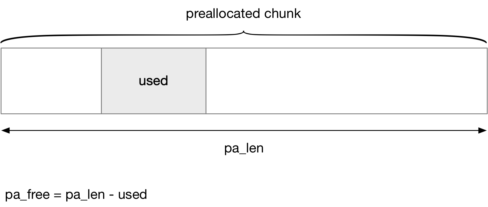

## Ext4 - 2 Block Allocator


### Concept

#### buddy system

ext2 中的 block allocator 实际是 single block allocator，即每次都只能分配一个 block，这样当为文件分配一块连续的 block 区间时，就需要多次重复调用 single block allocator，此外 single block allocator 不知道文件需要分配的连续 block 区间的大小，因而无法对 block allocation policy 进行优化，从而导致碎片化问题

ext4 中 block allocator 采用了 mballoc，即一次性分配的 block 区间可以包含多个 block，其实现类似于内存的 buddy 系统

```sh
# cat /proc/fs/ext4/<dev>/mb_groups
#group: free  frags first [ 2^0   2^1   2^2   2^3   2^4   2^5   2^6   2^7   2^8   2^9   2^10  2^11  2^12  2^13  ]
#0    : 5179  7     13988 [ 3     4     2     3     1     2     3     2     2     0     0     0     1     0     ]
#1    : 66    1     28234 [ 0     1     2     1     1     1     0     0     0     0     0     0     0     0     ]
```

每个 block group 都维护一组 buddy，index 从 0~13，一共包含 14 个 index


```c
struct ext4_group_info {
	...
	ext4_grpblk_t	bb_counters[]; /* Nr of free power-of-two-block
					 * regions, index is order.
					 * bb_counters[3] = 5 means
					 * 5 free 8-block regions. */
};
```

@bb_counters[] 数组就描述了各个 index 对应的 block 区间的数量


#### buddy bitmap

ext4 在内存中维护了一个 buddy cache，其中为每个 block group 都维护各自的 block bitmap 与 buddy bitmap，其中 buddy bitmap 就描述了该 block group 中的各个 buddy 的使用情况


buddy cache 中每个 block group 都占用两个 block

- block bitmap 占用一个 block
- buddy bitmap 占用一个 block

```c
struct ext4_buddy {
	struct page *bd_buddy_page;
	void *bd_buddy;
	
	struct page *bd_bitmap_page;
	void *bd_bitmap;
	...
};
```

@bd_bitmap/bd_buddy 就分别描述了 block bitmap 与 buddy bitmap


ext4 挂载的时候会通过 ext4_mb_generate_buddy() 初始化 buddy cache，其中初始化每个 block group 的 block bitmap 与 buddy bitmap

这里的 block bitmap 实际上就来自 disk version bitmap，而 buddy bitmap 则是在初始化的时候根据 block bitmap 进行计算得到的


这里假设 block size 为 4KB，那么此时 block bitmap 与 buddy bitmap 均各占用一个 page，此时 buddy bitmap 具有 (8 * 4K) bit 即 32768 bit，此时 buddy bitmap 的

- 前 16384 bit，其中每个 bit 描述每 2 个 block 是否已经被使用
- 之后的 8192 bit，其中每个 bit 描述每 4 个 block 是否已经被使用
- 以此类推......
- 最后的 4 bit，其中每个 bit 描述每 (2^13) 个 block 是否已经被使用


> example 1

假设文件系统刚刚完成 mkfs 的时候，block group 中所有的 block 都是 free 的，由于一个 block group 中的 block bitmap 只能占用一个 block，因而 block size 为 4KB 时，一个 block group 最多容纳 (8 * 4K) 即 (2^15) 个 block

buddy system 中最大的一个 index 能够容纳 (2^13) 个 block，此时会将整个 block group 划分为 4 个 index 13，此时 buddy bitmap 中只有最后面描述 index 13 的四个 bit 为 0


这里需要注意的是，对于某一段空闲 block 区间来说，在 buddy bitmap 中只有最大的 index 对应的 bit 才为 0，例如这里只有 index 13 的四个 bit 为 0，而前面的 index 1,...,12 中的所有 bit 均为 1


> example 2

假设在 block bitmap 中找到一段 block 0~6 的空闲区间，此时这一段长度为 7 的 block 区间会划分为 4-block、2-block、1-block 三段，此时 buddy bitmap 被初始化为

- for every 4-blocks 的这部分 bitmap 中，bit 0 为 0，以描述起始的第一个 4-blocks 空闲
- for every 2-blocks 的这部分 bitmap 中，bit 2 为 0，以描述起始的第三个 2-blocks 空闲

（这里剩下的 free 1-block 由原来的 block bitmap 描述）


> example 3

假设在 block bitmap 中找到一段 block 1~7 的空闲区间，此时这一段长度为 7 的 block 区间会划分为 1-block、2-block、4-block 三段，此时 buddy bitmap 被初始化为

- for every 4-blocks 的这部分 bitmap 中，bit 1 为 0，以描述起始的第二个 4-blocks 空闲
- for every 2-blocks 的这部分 bitmap 中，bit 1 为 0，以描述起始的第二个 2-blocks 空闲

（这里剩下的 free 1-block 由原来的 block bitmap 描述）


### Routine

mballoc 的入口为 ext4_mb_new_blocks()

- 首先走 preallocation 路径分配 block
- 如果上一步分配失败，则走 buddy system 路径分配 block

```c
ext4_fsblk_t ext4_mb_new_blocks(handle_t *handle,
				struct ext4_allocation_request *ar, int *errp)
```


传入的参数即 struct ext4_allocation_request 描述为 @inode 文件 [@logical, @logical+@len) 的 logical block 区间申请分配对应的 physical block 区间，来映射这个 logical block 区间

```c
struct ext4_allocation_request {
	/* target inode for block we're allocating */
	struct inode *inode;

	/* how many blocks we want to allocate */
	unsigned int len;

	/* logical block in target inode */
	ext4_lblk_t logical;
	
	/* phys. target (a hint) */
	ext4_fsblk_t goal;
	...
};
```

当前申请分配的 physical block 区间，“最好”分配在 @goal physical block number 附近，这里 @goal 只是一个 hint，其目的是为了确保一个文件的所有 block 的物理地址连续性以及 locality 特性，例如新创建的 inode 第一次分配 block 时，@goal 通常为该 inode 所在的 block group 第一个可用的 physical block


此外为了提高 malloc 的效率，allocation request 中还包含其他一些辅助信息，malloc 会使用这些信息选择一个最佳方案

```c
struct ext4_allocation_request {
	/* the closest logical allocated block to the left */
	ext4_lblk_t lleft;
	/* the closest logical allocated block to the right */
	ext4_lblk_t lright;

	/* phys. block for the closest logical allocated block to the left */
	ext4_fsblk_t pleft;
	/* phys. block for the closest logical allocated block to the right */
	ext4_fsblk_t pright;
	...
};
```

- @lleft/@lright 在 @inode 文件的 logical block 地址空间内，如果当前申请分配的 logical block 区间两边已经有映射的 block，那么这两个字段就分别描述了两边最近的 logical block number；如果没有，则对应字段的值为 0
- @pleft/@pright 类似地这两个字段实际上就是 @lleft/@lright 的 physical block number 版本


#### buddy system

buddy system 分配 block 的入口为 ext4_mb_regular_allocator()，请求分配 @goal 起始的 @len 长度的 physical block 区间

```c
static int
ext4_mb_regular_allocator(struct ext4_allocation_context *ac)
```

在这一过程中会扫描

- 首先根据 @goal 定位到所在的 block group，从而找到对应的 buddy bitmap
- 之后就在 buddy bitmap 中寻找 @goal 起始的 @len 长度的 physical block 区间
- 最终查找的结果保存在一个 struct ext4_free_extent 结构体中


```c
struct ext4_free_extent {
	ext4_grpblk_t fe_start; /* In cluster units */
	ext4_grpblk_t fe_len;	/* In cluster units */
	...
};
```

@fe_start 描述实际分配的 physical block 区间的起始 block
@fe_len 描述实际分配的 physical block 区间的长度


##### example

例如 block 1~7 处于空闲状态，此时如果 @goal=3, @len=3 即申请分配 [3, 5] physical block 区间时，其分配的过程为

<iframe width=100% height=600 src="media/15889290004454/ext4_mballoc_alloc.m4v"></iframe>

> 1. 首先找到覆盖 [3, 5] physical block 区间的一组 free block

- 首先 @block 局部变量赋值为 @goal 的值即 3
- 之后从 index=1, 2, 3, ... 开始，根据 buddy bitmap 依次查找包含 @block 同时处于空闲状态的最小 segment，即
    - index=1，查看 @block 所在的 2-block 即 block [2, 3] 是否属于空闲状态
    - index=2，若block [2, 3] 已经被占用，则查看 @block 所在的 4-block 即 block [0, 3] 是否属于空闲状态
    - ...

因为这里根据 buddy bitmap 看到 @block 所在的 2-block 即 block [2, 3] 处于空闲状态，因而将该 2-block 占用下来


- 此时我们只是分配了 block 3，因而我们还需要继续分配后面的 physical block 区间
- 如果上一轮我们是在 2-block 中找到了空闲的 block 区间，这一轮我们就从紧接在后面的一个 2-block 开始查找空闲的 block 区间
- (如果上一轮是在 4-block 中找到了空闲的 block 区间，这一轮我们就从紧接在后面的一个 4-block 开始查找空闲的 block 区间)
- (...)

这里上一轮我们是在 2-block 中找到了空闲的 block 区间，这一轮我们就从紧接在后面的一个 2-block 即 block [4, 5] 开始查找空闲的 block 区间，因而这里我们依次查找 block 4 开始的 2-block、4-block ... 是否是空闲状态

这里根据 buddy bitmap 看到 block 4 所在的 2-block 即 block [4, 5] 对应的 bit 为 1，而所在 4-block 即 block [4, 7] 对应的 bit 为 0，因而将该 4-block 占用下来

（这里 block 4 所在的 2-block 即 block [4, 5] 对应的 bit 为 1，有可能是 block [4, 5] 当前已经被占用，也有可能是 block [4, 5] 连同后面的 block 组成了一个更大的 free block 区间，例如这里 block [4, 7] 就是组成了一个 free 4-block）


此时我们已经占用了两个 block 区间

- 一个 2-block 即 block [2, 3]
- 一个 4-block 即 block [4, 7]

这两个 block 区间已经覆盖了我们当前申请分配的 block [3, 5] 区间，因而此时分配 free buddy 这一步已经结束


> 2. 分拆 free buddy

在上一步操作中我们找到的 free block 区间是 block [2, 7]，但是我们实际需要分配的只是 block [3, 5]，因而接下来我们还需要将上一步操作中找到的 free block 区间进行拆分，刨除我们实际需要分配的，剩下的返还给 buddy system

- 首先将 2-block 即 block [2, 3] 拆分为两个 1-block，这里我们只占用 block 3，block 2 返还给 buddy system，即
    - buddy bitmap 中，2-block 即 block [2, 3] 对应的 bit 被置为 1
    - block bitmap 中，block 3 对应的 bit 被置为 1（但是 block 2 对应的 bit 仍为 0）
- 接下来将 4-block 即 block [4, 7] 拆分为两个 2-block，这里我们只占用前一个 2-block 即 block [4, 5]，剩下的一个 2-block 返还给 buddy system，即
    - buddy bitmap 中，2-block 即 block [4, 5] 对应的 bit 被置为 1
    - 同时 buddy bitmap 中，2-block 即 block [6, 7] 对应的 bit 被置为 0
    - block bitmap 中，block [4, 5] 对应的 bit 置为 1


#### normalization

前文介绍过，mballoc 的入口为 ext4_mb_new_blocks()，其参数即 struct ext4_allocation_request 描述申请分配一块从 @goal 开始的 @len 大小的连续 block 区间

为了减小分配造成的碎片化问题，mballoc 在进入 buddy system 路径执行分配之前会对 allocation request 的相关参数执行 normalization 操作，例如将 @len 参数向上取整为 (2^x)，这样就会导致 buddy system 分配了更多的 block 区间，多余的 block 就被添加到 preallocation space 以用于下次分配，这样下次 mballoc 再分配 block 的时候就会优先去 preallocation space 查找是否有预分配的 block，如果 preallocation space 路径失败了才会回退到 buddy system 路径

在详细介绍 normalization 的算法之前，有必要再简单介绍一下 preallocation space，preallocation space 可以分为 per-CPU locality group 与 per-inode preallocation space 两部分，其区别主要在文件的大小，文件较小就使用前者，文件较大就使用后者，后面会详细介绍两者的区别

这里之所以介绍 preallocation space 的类型，是因为在对 allocation request 执行 normalization 操作时，针对文件的大小，也会执行不同的 normalization 算法

normalization 操作的入口为 ext4_mb_normalize_request()


> per-inode preallocation space

对于使用 per-inode preallocation space 也就是文件 size 较大的文件来说，其 normalization 算法可以描述为以下规则

为便于叙述，将当前 block allocation request 执行后文件的大小标记为 @size，将 allocation request 申请分配的 logical block 区间记为 (@logical, @len)


如果 @size 在 (0, 16K] 范围内，则申请分配的 logical block 区间更新为 (0, 16K)，例如 ext4_mb_new_blocks() 传入的 allocation request 中，如果 @logical 为 4K，@len 为 8K，说明当前需要为 [4K, 12K) logical block 区间分配对应的 block，这个时候对 allocation request 执行 normalization 处理后，变成为 (0, 16K) logical block 区间分配对应的 block，也就是直接为前 16 K 分配 block 空间

当然还需要考虑以下因素

1. 当前申请分配的 logical block 区间不能与文件中已经映射的 logical block 区间相重叠

ext4_mb_new_blocks() 传入的 allocation request 中，如果当前申请分配的 logical block 区间两边已经有映射的 block，那么 @lleft/@lright 这两个字段就分别描述了两边最近的 logical block number

上述例子中执行 normalization 处理后，变成为 (0, 16K) logical block 区间分配对应的 block，但是如果传入的 allocation request 的 @lleft 参数为 2K，@lright 参数为 15K，那么更新为，为 (2, 15K) logical block 区间分配对应的 block


2. 当前申请分配的 logical block 区间不能与 per-inode preallocation space 中预分配的 block 区间相重叠

per-inode preallocation space 中预分配的 block 区间是与文件中的

**TODO**


- @size 在 (0, 16K] 范围内，则申请分配的 logical block 区间更新为 (0, 16K)
- @size 在 (16K, 32K] 范围内，则申请分配的 logical block 区间更新为 (0, 32K)
- @size 在 (32K, 64K] 范围内，则申请分配的 logical block 区间更新为 (0, 64K)
- @size 在 (64, 128K] 范围内，则申请分配的 logical block 区间更新为 (0, 128K)
- @size 在 (128K, 256K] 范围内，则申请分配的 logical block 区间更新为 (0, 16K)
- @size 在 (256, 512K] 范围内，则申请分配的 logical block 区间更新为 (0, 16K)
- @size 在 (512K, 1M] 范围内，则申请分配的 logical block 区间更新为 (0, 16K)
- @size 在 (1M, 4M] 范围内，则申请分配的 logical block 区间更新为 (0, 16K)
- @size 在 (4M, 8M] 范围内，则申请分配的 logical block 区间更新为 (0, 16K)
- @size 大于 8M 同时当前申请分配的 block 区间大小小于 8M 时，则申请分配的 logical block 区间更新为 (0, 16K)
- @size 大于 8M 同时当前申请分配的 block 区间大小大于 8M 时，则申请分配的 logical block 区间更新为 (0, 16K)


> per-CPU locality group

@len 直接更新为 s_mb_group_prealloc 参数的值，该参数的默认值为 512，可以通过 `/sys/fs/ext4/<partition>/mb_group_prealloc` 配置该参数的值


#### preallocation

执行完 normalization 操作之后，@len 参数的值通常会比原来的 @len 值大，也就是说 buddy system 实际上会一次性分配更大的 physical block 区间，这样刨除用户实际申请的 block 区间之后，剩余的 block 区间会被添加到 preallocation space 中，下次用户再申请分配 block 区间时，就会优先到 preallocation space 中查找合适的 block 区间，如果 preallocation space 中没有，再向 buddy system 申请分配

preallocation 的入口是 ext4_mb_use_preallocated()


实际上有两个 preallocation space

- per-CPU locality group，又称为 group allocation
- per-inode preallocation space，又称为 stream allocation

其中前者是 per-CPU 的，对于文件 size 较小的文件，会优先从这里分配，这样同一个 CPU 上打开的多个小文件会尽可能地聚合在一块 physical block 区间里

后者是 per-inode 的，也就是每个 inode 都维护这么一个 preallocation space，对于文件 size 较大的文件，会优先从这里分配，从而保证同一个文件的 physical block 都尽可能地聚合在一起


这里 file size 的分界线默认为 MB_DEFAULT_STREAM_THRESHOLD 即 16 个 block，例如 block size 为 4KB 时该分界线即为 64 KB，即文件大小小于 64 KB 时使用 per-CPU locality group，否则使用 per-inode preallocation space，用户可以通过 `/proc/fs/ext4/<parition>/stream_req` 配置该参数，stream_req 的单位也是 block


##### ext4_prealloc_space

struct ext4_prealloc_space 描述 preallocation space，buddy system 分配完成后，就会将多分配出来的 block 区间封装为一个 struct ext4_prealloc_space，每个多分配的连续的 block 区间都对应一个 struct ext4_prealloc_space 结构

```c
struct ext4_prealloc_space {
	ext4_fsblk_t		pa_pstart; /* phys. block */
	ext4_lblk_t		pa_lstart; /* log. block */
	ext4_grpblk_t		pa_len; /* len of preallocated chunk */
	ext4_grpblk_t		pa_free; /* how many blocks are free */
	unsigned short		pa_type; /* pa type. inode or group */
	struct inode		*pa_inode; /* hack, for history only */
};
```

@pa_lstart 描述这段 preallocated chunk 在 @pa_inode 的 logical block 地址空间中的起始 logical block number
@pa_pstart 描述这段 preallocated chunk 的起始 physical block number
@pa_len 描述这段 preallocated chunk 的总大小，以 block 为单位
@pa_free 描述这段 preallocated chunk 中刨除已经被占用的 block 之后，剩余处于空闲状态的 block 的数量




##### per-inode preallocation space

```c
struct ext4_inode_info {
	struct list_head i_prealloc_list;
	...
}
```

每个 inode 维护一个 preallocation space，ext4 inode 的 @i_prealloc_list 字段就描述这个 preallocation space，这里实际上就使用了一个链表组织这个 per-inode preallocation space 中的所有 struct ext4_prealloc_space 结构


##### per-CPU locality group

每个 ext4 superblock 会维护一个 per-CPU locality group

```c
struct ext4_sb_info {
	/* locality groups */
	struct ext4_locality_group __percpu *s_locality_groups;
	...
}
```

```c
#define PREALLOC_TB_SIZE 10
struct ext4_locality_group {
	/* list of preallocations */
	struct list_head	lg_prealloc_list[PREALLOC_TB_SIZE];
	...
};
```

每个 per-CPU locality group 实际上就维护了一个 hash table 来组织当前 locality group 中的所有 struct ext4_prealloc_space 结构，其中根据 @pa_free 计算 hash 值
