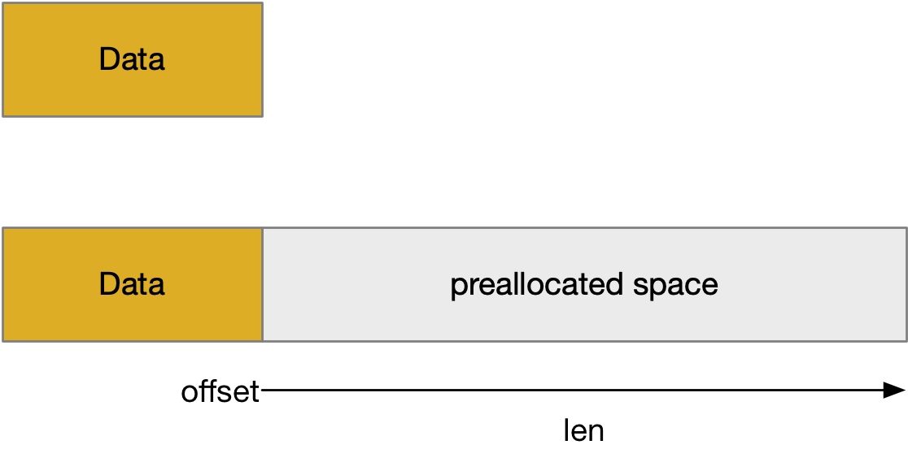
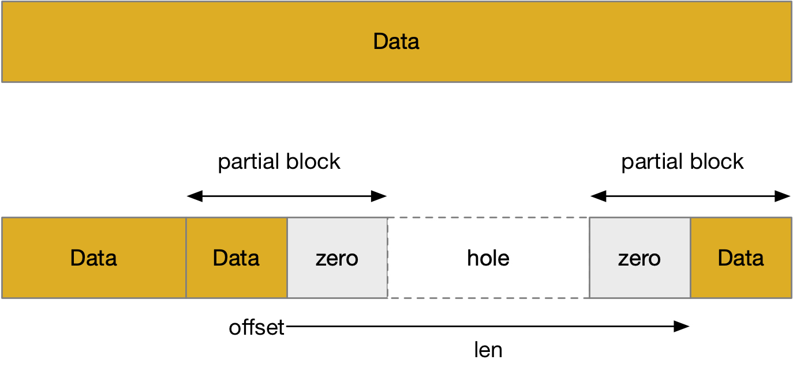
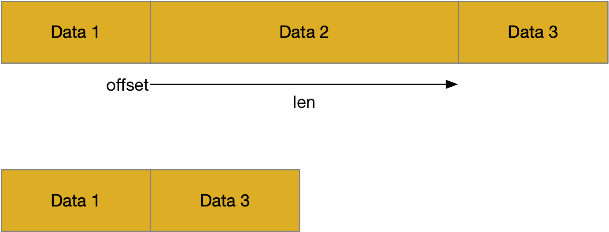
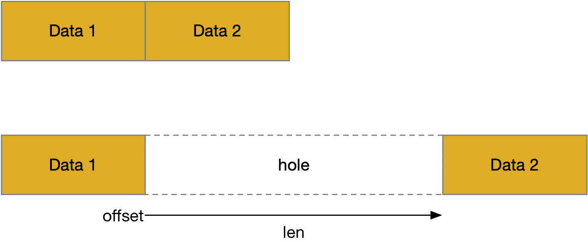

title:'Control - Range'
## Control - Range


#### preallocate disk space

fallocate() 系统调用对文件 @offset 起始的，@len 大小的 logical block range 进行操作

```c
int fallocate(int fd, int mode, off_t offset, off_t len);
```

@mode 参数会影响 fallocate() 的不同行为


默认情况下，即 @mode 为 0 时，fallocate() 执行 preallocate disk space 操作，相当于为文件预分配磁盘空间，预分配的磁盘空间应该初始化为 0



这一过程中文件系统会

- 预分配 physical block 区间
- 同时将对应的 extent 添加到文件的 extent tree 中

文件系统一般不会对预分配的磁盘空间写 0，而是将对应的新分配的 extent 标记为 unwritten，这样在 read() 操作中遇到 unwritten 标记的 extent 时，直接返回 0


preallocate 操作过程中，如果 (offset+len) 超过了文件当前的大小，那么文件的大小即 @i_size 字段会更新为 (offset_len)

但是如果 @mode 参数设置有 FALLOC_FL_KEEP_SIZE 标志，那么 preallocate 操作过程中还是会为文件预分配磁盘空间，只是此时不会更新文件的 @i_size 字段


#### punch hole

```c
int fallocate(int fd, int mode, off_t offset, off_t len);
```

@mode 参数设置有 FALLOC_FL_PUNCH_HOLE 标志时，fallocate() 实际执行 punch hole 操作




这一过程中文件系统会

- 对于这个 logical block 区间对应的 physical block 区间
    - 对于其中完整的 physical block，直接释放
    - 对于 partial physical block，将需要释放的部分置为 0
- 同时对应的 extent 也会从文件的 extent tree 中移除


#### collapse file space

```c
int fallocate(int fd, int mode, off_t offset, off_t len);
```

@mode 参数设置有 FALLOC_FL_COLLAPSE_RANGE 标志时，fallocate() 实际执行 collapse file space 操作



此时对应 block 区间的内容会被移除，同时该区间之后的 block 区间会移上来，也就是说该操作不会生成 hole


#### insert file space

```c
int fallocate(int fd, int mode, off_t offset, off_t len);
```

@mode 参数设置有 FALLOC_FL_INSERT_RANGE 标志时，fallocate() 实际执行 insert file space 操作

该操作是在 logical address space 中插入一个 hole，而原本 hole 所在位置的 block 区间则向右移动，紧接在 hole 下面




#### zero file space

```c
int fallocate(int fd, int mode, off_t offset, off_t len);
```

@mode 参数设置有 FALLOC_FL_ZERO_RANGE 标志时，fallocate() 实际执行 zero file space 操作

对于该 block 区间

- 对于已经存在的 extent，将其 block 的内容置为 0，有些文件系统也可以直接通过将 extent 标记为 unwritten 来实现
- 对于 hole，则为对应的 block 区间预分配磁盘空间，同时将该 block 的内容置为 0，或者直接将 extent 标记为 unwritten


#### read hole

对 hole 执行 read 操作会返回 0

```sh
# FIEMAP based
f_op->read_iter(kiocb, iov_iter)
    generic_file_read_iter
        generic_file_buffered_read
            find_get_page
                pagecache_get_page  // find buffer page in page cache,
                                    // create new buffer page if not exist
            a_ops->readpage(file, page), e.g., ext4_readpage()
                ext4_mpage_readpages
                    ext4_map_blocks // block mapping translation
                    (hole found) zero_user_segment(page, ...) // zero user page
```

```sh
# IOMAP based
f_op->read_iter(kiocb, iov_iter)
    iomap_dio_rw
        iomap_apply(..., IOMAP_WRITE, ..., iomap_dio_actor)
            (case IOMAP_HOLE) iomap_dio_hole_actor
                iov_iter_zero // zero user page
```


#### copy range

copy range 通过 copy_file_range() 系统调用实现

```c
ssize_t copy_file_range(int fd_in, loff_t *off_in,
                   int fd_out, loff_t *off_out,
                   size_t len, unsigned int flags);
```

对于支持 reflink 的文件系统，会优先调用 clone_file_range() 回调函数，即共享一个 physical block range；如果文件系统不支持该特性，会回退为 copy_file_range() 回调函数，即进行数据的拷贝


#### clone range

clone range 通过 FICLONERANGE ioctl 实现

```c
int ioctl(int dest_fd, FICLONERANGE, struct file_clone_range *arg);

struct file_clone_range {
   __s64 src_fd;
   __u64 src_offset;
   __u64 src_length;
   __u64 dest_offset;
};
```

clone range 是指两个文件共享一个 physical block range，也就是文件系统的 reflink 特性

其实际上调用 clone_file_range() 回调函数


#### dedupe range

dedupe range 通过 FIDEDUPERANGE ioctl 实现

```c
int ioctl(int src_fd, FIDEDUPERANGE, struct file_dedupe_range *arg);

struct file_dedupe_range {
   __u64 src_offset;
   __u64 src_length;
   __u16 dest_count;
   __u16 reserved1;
   __u32 reserved2;
   struct file_dedupe_range_info info[0];
};
```

dedupe range 操作是指，如果两个文件中各自一段 physical block range 的内容是完全一样的，此时两个文件一共占用了两段 physical block range，此时使用文件系统的 reflink 特性，让这两个文件共用一段 physical block range


#### truncate

truncate 操作通过 truncate()/ftruncate() 系统调用实现

```c
int truncate(const char *path, off_t length);
int ftruncate(int fd, off_t length);
```

truncate() 操作是将文件扩大或减小为 @length 大小

- 如果文件原来的大小超过 @length，那么 @length 之后部分的数据会被释放
- 否则文件会生成一个一直到 @length 的 hole


inode 的 @i_size 字段描述了文件的大小

```c
struct inode {
	loff_t			i_size;
	...
}
```

此外 ext4 inode 中还维护了一个 @i_disksize 字段描述该文件实际占用的磁盘空间的大小

```c
struct ext4_inode_info {
	loff_t	i_disksize;
	...
}
```


#### fstrim

```sh
fstrim <mountpoint>
```

fstrim 命令会释放文件系统中的所有 free block，实际上是通知该文件系统底层的块设备，当前哪些 block 是未被占用的，该命令实际调用 FITRIM ioctl 实现


```c
int ioctl(int src_fd, FITRIM, struct fstrim_range *arg);

struct fstrim_range {
	__u64 start;
	__u64 len;
	__u64 minlen;
};
```

ext4 中是对于每个 block group，根据 block bitmap 找到所有处于 free 状态的 block range，对于其中的每个 block range 都封装成一个 discard bio，将这些 discard bio 发送给该文件系统底层的 block device 处理
