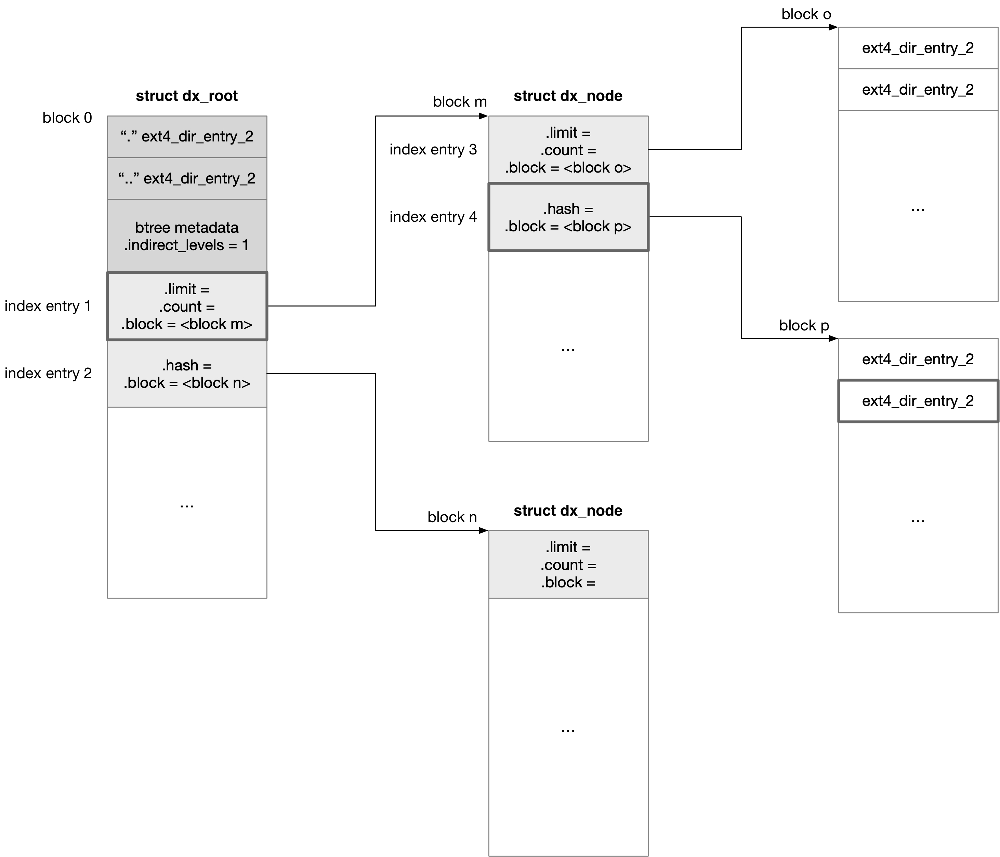

## Ext4 -  directory


### Max directory size

默认情况下 ext4 directory inode 使用 32 bit 来描述 inode size，因而一个目录的大小受到 32 bit 限制

当开启 large_dir 特性时，directory inode 使用 64 bit 来描述 inode size

```c
struct ext4_inode {
	__le32	i_size_lo;	/* Size in bytes */
	__le32	i_size_high;
	...
}
```


### Max subdirectory

一个目录下能够容纳的子目录的最大数量受到 hardlink 数量限制

ext4 下 inode 的 hardlink count 上限为 65000，因而默认一个目录下能够容纳的子目录的最大数量为 64998，这是因为 inode 初始化时 hardlink count 的初始值即为 1，当前目录下的 "." dir_entry 会增加一个 hardlink count，而每个子目录下的 ".." dir_entry 也都会增加一个 hardlink count

当开启 dir_nlink 特性时，一个目录下能够容纳的子目录的最大数量会放宽为 unlimited


### dir_index

ext4 中目录的 dir_entry 是按照数组的形式存储的，当一个目录下的子文件和子目录的数量很多时，再按照线性的方式查找，效率会很低

dir_index 特性使用 hashed B+ tree 即 htree 来组织一个目录下的所有 dir_entry


在开启 dir_index 特性的时候，如果目录只占用一个 block 的时候，还是用原来数组的方式来存储 dir_entry 的，只有当目录占用的 block 数量超过 1 时，才会使用 b-tree 来组织 dir_entry




在使用 b-tree 组织 dir_entry 的时候，原来的 block 0 会存储 struct dx_root

- 为了兼容 ext2，起始部分会存储原来的 "." 与 ".." dir_entry
- 之后存储 btree 的元数据，其中 @indirect_levels 描述 btree 中位于 root node 与 leaf node 中间的 interior indirect node 的层数
- 之后就存储了一个 struct dx_entry 数组


这个 btree 中只有 leaf node 可以存储 dir_entry，此时 root node 和 interior indirect node 中存储的是 index entry，由 struct dx_entry 描述

```c
struct dx_entry
{
	__le32 hash;
	__le32 block;
};
```

ext4 中使用 hashed btree 来组织目录下的所有 dir_entry，通过 dir_entry 的 name 描述的字符串计算出一个 hash 值

所有 leaf node 中存储的 dir_entry 是按照 hash 值排序的，index entry 的 @hash 字段就描述了该 index entry 引申出的分支的起始 hash 值，@block 字段描述了该 index entry 的下一层的 block number

但是对于每个 root node 和 interior indirect node 中的第一个 index entry，其起始 hash 值其实可以通过计算得到，例如

- 对于 root node 中的第一个 index entry，其起始 hash 值可以认为是 0
- 对于 interior indirect node 中的第一个 index entry，其起始 hash 值可以从其上一层 index entry 的 @hash 值得到

因而第一个 index entry 的 @hash 字段可以复用于存储 struct dx_countlimit

```c
struct dx_countlimit
{
	__le16 limit;
	__le16 count;
};
```

此时 @hash 字段的 32 bit 拆分为两个 16 bit

@limit 描述当前 node 中 index entry 数组的大小，即可以容纳的 index entry 的数量
@count 描述当前 node 中 index entry 数组中，当前已经使用了的 index entry 的数量


例如上图中在查找 dir_entry 时

- 首先根据当前查找的 dir_entry 的 name 描述的字符串计算出一个 hash 值
- 在 root node 中寻找该 hash 对应的 index entry，这里假设计算出来的 hash 值小于 index entry 2 的 @hash 字段，说明当前查找的 dir_entry 位于 index entry 1 覆盖的分支中，此时通过 index entry 1 的 @block 字段找到下一层的 node
- 由于 @indirect_levels 字段的值为 1，说明此时 index entry 1 的 @block 字段指向的实际是一个 interior indirect node，而非 leaf node；此时按照之前描述的那样，根据 hash 值找到对应的 index entry，假设这里对应的是 index entry 4
- 此时通过 index entry 4 的 @block 字段找到下一层的 node，此时这一层已经是 leaf node，那么按照线性查找的方式在这个 leaf node 中找到与 name 字符串匹配的 dir_entry


未开启 dir_index 特性的时候，一个目录下 dir_entry 的数量不会存在上限，但是在开启 dir_indx 特性之后，一个目录下 dir_entry 的数量会受限于 btree 的层数限制

btree 默认只用 2 层高度（这里的高度指 root node 和 interior indirect node 加起来的层数，不包括 leaf node），当 block size 为 4k 时，一个目录的 btree 理论上最多只有 4K 个 block 用于 leaf node，此时如果每个 dir_entry 的平均大小为 16 字节，那么 block size 为 4K 的条件下，一个目录下 dir_entry 的数量上限为 (2^20)


而在开启 large_dir 特性的时候，btree 的高度限制会放开为 3 层，此时在之前描述的条件下，一个目录下 dir_entry 的数量上限为 (2^26)
