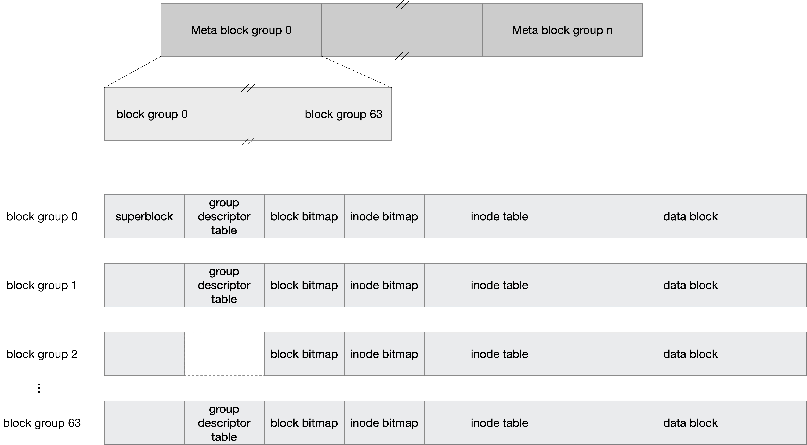
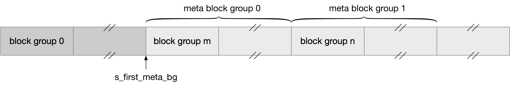

## Ext4 - resize


### group descriptor table


#### group descriptor size

在 32bit 模式下，group descriptor 的大小为 32 字节，而在 64bit 模式下，group descriptor 的大小为 64 字节

此外当开启 64bit 特性时，还可以通过 "mkfs -E desc-size=<val>" 指定 block group descriptor 的大小


#### group descriptor size

group descriptor table 中包含的 group descriptor 的数量，即整个文件系统中 group descriptor 的数量，由 block group 的大小决定

整个文件系统的大小，除以每个 block group 的大小，就得到整个文件系统中 block group 的数量，也就是 group descriptor 的数量


由于一个 block group 能够包含的 block 数量是固定的，因为一个 block group 的 block bitmap 只能占用一个 block，因而一个 block group 能够包含的 block 数量最大为 (blocksize * 8)


一个 block group 包含的 block 数量在 mkfs 时指定

- 默认情况下，一个 block group 包含的 block 数量就是 (blocksize * 8)
- 用户也可以通过 "-g blocks-per-group" 参数指定一个 block group 包含的 block 数量


#### group descriptor table size

在确定了单个 group descriptor 的大小，以及 group descriptor 的数量之后，就可以确定整个 group descriptor table 的大小，此时将整个 group descriptor table 的大小除以 blocksize，就可以得到整个 group descriptor table 占用的 block 数量，此时这个除法是向上取整的，也就是说 group descriptor table 占用的最后一个 block 可能会留有空余的空间


### reserved GDB

为了支持 online-resize，在分配 group descriptor table 时，在以上计算出来的 group descriptor table 大小的基础上，通常需要为 group descriptor table 多分配一些 block，这样在 online-resize 的时候，就可以用这些预留出来的 block 存储新增的 group descriptor

这些预留的 block 就称为是 reserved gdb


默认情况下，mkfs 时不会为 group descriptor table 预留 block


而当 resize_inode 特性开启时，mkfs 会为 group descriptor table 预留一定数量的 block。在默认情况下，mkfs 会假设最终 resize 之后文件系统的大小为现在文件系统大小的 1024 倍（但是不能超过 2^32，即 32 bit 能够描述的 block number 的上限），此时 mkfs 会根据这一参数计算最终需要的 group descriptor 的数量，从而得到最终 group descriptor table 的大小

用户也可以通过 "mkfs -E resize=max-online-resize" 参数指定需要预留的 block 数量，max-online-resize 参数描述最终 resize 之后文件系统的大小，单位为 block，此时 mkfs 会根据这一参数计算最终 group descriptor table 的大小

至于该特性的名称为什么是 "resize_inode"，是因为文件系统内部使用一个 internal inode 来管理所有这些预留出来的 reserved BGT blocks


### online-resize

online-resize 通过 EXT4_IOC_RESIZE_FS ioctl 实现

- 首先将当前的最后一个 block group 填满
- 之后依次初始化多出来的 block group
    - 将对应的 group descriptor 填充到 reserved GDB 中
    - 将 block bitmap、inode bitmap、inode table 填零处理


### meta_bg

mkfs 中预留的 reserved BGT block 数量是有限的，online-resize 过程中文件系统最大只能扩大为一开始的 1024 倍，同时最大也只能扩大到 2^32 个 block，block size 为 4KB 时最大只能扩大到 16 TB

当预留的 reserved BGT block 用完时，ext4 会自动开启 meta_bg 特性来组织新增的 group descriptor


默认情况下 group descriptor table 需要存储系统中所有 block group 的 group descriptor，这就需要 mkfs 过程中为 group descriptor table 预留足够大的空间，以备将来的 online-resize 使用



而 meta_bg 特性则是将多个 block group 组合为一个 meta block group，此时 group descriptor table 中存储各自 meta block group 的所有 group descriptor，而非所有 bock group 的 group descriptor

meta block group 中使用一个 block 存储各自 meta block group 的所有 group descriptor，group descriptor 的大小为 64 字节，因而 block size 为 4K 时，一个 block 可以存储 64 个 group descriptor，因而 block size 为 4K 时，一个 meta block group 包含 64 个 block；此时该 meta block group 的 group descriptor table 中存储的就是该 meta block group 中的 64 个 group descriptor


对于 meta block group 中的每个 block group

- 是否冗余存储 superblock 还是由原先的 默认/sparse_super/sparse_super_2 策略决定
- 而对于 group descriptor table，只有 meta block group 中的第一个、第二个、最后一个 block group 会冗余存储 group descriptor table


在同一个文件系统中，传统的 block group 与 meta block group 可以共存，此时 ext4 superblock 的 s_first_meta_bg 字段描述文件系统中的第一个使用 meta block group 编组的 block group



实际上 online-resize 过程中，当 reserved BGT block 用完时，对于接下来的 block group 就会使用 meta block group 方式进行编组，此时传统的 block group 与 meta block group 就是混合存在的


### superblock backup 策略

在默认情况下，在所有的 block group 中冗余存储 superblock 和 group descriptor table

#### sparse_super

当开启 sparse_super 特性时

- 在 block group 0/1 冗余存储
- 除了 block group 0 之外，所有偶数的 block group 不存储
- 当 block group 为 3 或 5 或 7 的冥次时，在该 block group 中冗余存储，即在 3^x, 5^x, 7^x 的 block group 中冗余存储

```

group       block
index       number
#1          32768       =  （32876）* 3^0
#3          98304       =   (32768) * 3^1
#5          163840      =   (32768) * 5^1
#7          229376      =   (32768) * 7^1
#9          294912      =   (32768) * 3^2
#25  
...
```

上例中 "32768" 表示一个 block group 包含 32768 个 block


#### sparse_super2

当开启 sparse_super2 特性时，整个文件系统中只有两个 block group 存储有 superblock 和 group descriptor table，即 block group 0 和最后一个 block group
