## Ext2 Spec

ext2 (Second version of Extended filesystem)


### Concept

#### block

ext2 中将文件系统的载体（即设备分区或文件）划分为一个个的 block，block 是 ext2 中数据传输的单位

ext2 中 block 可以为 1/2/4/8 KiB 大小，其具体大小在文件系统初始化时设置，例如在磁盘格式化的时候由 mkfs 工具设置


ext2 superblock 的 s_log_block_size 字段描述 block size，即 block size 的大小为 (2 ^ sb.s_log_block_size) KiB

通常 block size 不能超过对应架构下的 memory page size


#### block group

ext2 中将相邻的多个 block 视为一个 block group，这样可以将整个设备分区或文件划分为多个 block group，并以 block group 为单位进行相关 metadata 的管理，从而减小磁头空转的时间，加快数据读写的速度

由于每个 block group 中使用一个 single block 存储 data block bitmap，一个 block 包含 (8 * block_size_in_bytes) 个 bit，每个 bit 表示一个 data block，因而一个 block group 中最多包含 (8 * block_size_in_bytes) 个 data block，即

一个 block group 的大小为，最多包含 (8 * block_size) 个 block


### Disk Layout

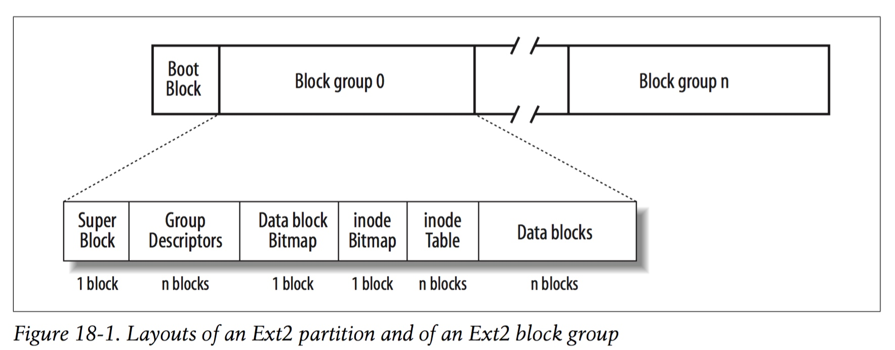

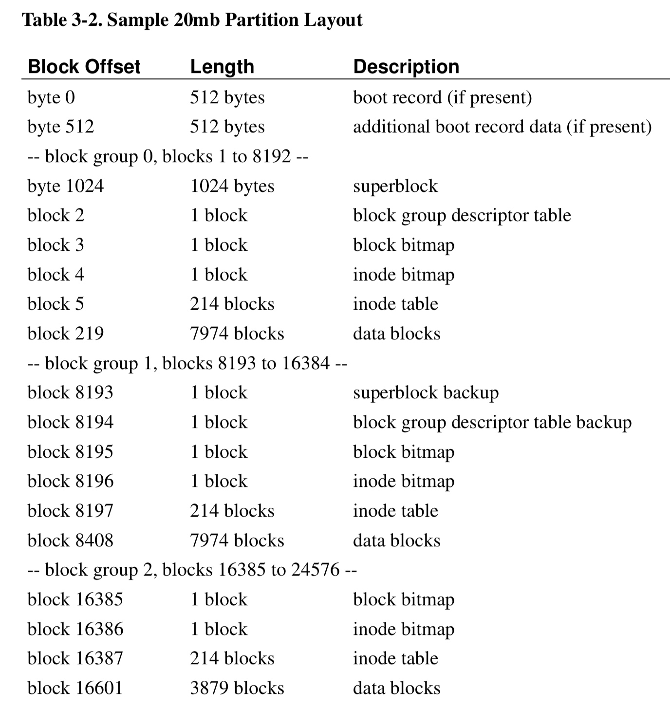


一个 ext2 文件系统的 disk partition 开始的 1024 字节为 boot section，用于存储系统启动需要的相关信息

除去 boot section 占用的 1024 字节，剩余的所有 block 划分为多个 block group，每个block group由以下部分构成

- superblock
- group descriptor table
- data block bitmap
- inode bitmap
- inode table
- data block

其中 superblock 与 group descriptor table 是整个 ext2 文件系统唯一的，而为了提高文件系统的可靠性，各个 block group 通常冗余存储 superblock 与 group descriptor table

但是冗余存储的 superblock 与 group descriptor table 又会消耗大量的存储空间，因而 ext2 也支持只在第 0、1、3、5、7 及其次方 的 block group 处冗余存储 superblock 与 group descriptor table


#### superblock

ext2 superblock 描述 ext2 文件系统的配置信息

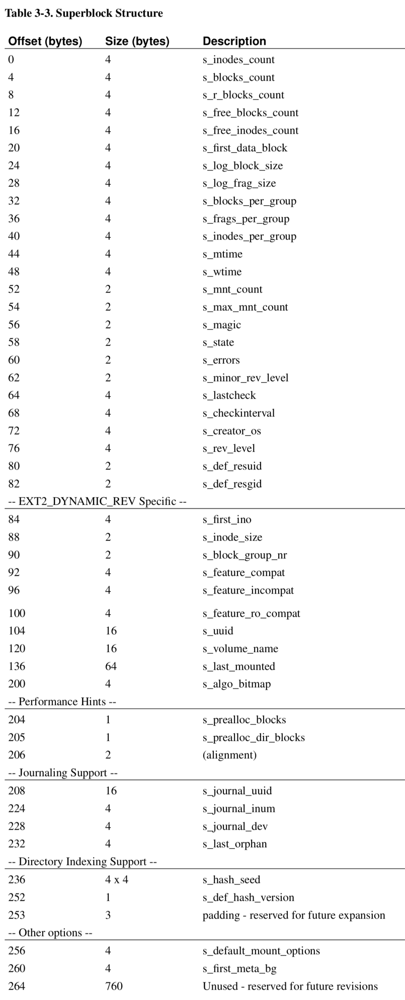


```c
/*
 * Structure of the super block
 */
struct ext2_super_block {
	__le32	s_inodes_count;	/* Inodes count */
	__le32	s_blocks_count;	/* Blocks count */
	__le32	s_r_blocks_count; /* Reserved blocks count */
	__le32	s_free_blocks_count;/* Free blocks count */
	__le32	s_free_inodes_count;/* Free inodes count */
	__le32	s_first_data_block;/* First Data Block */
	__le32	s_log_block_size; /* Block size */
	__le32	s_log_frag_size; /* Fragment size */
	__le32	s_blocks_per_group;/* # Blocks per group */
	__le32	s_frags_per_group;/* # Fragments per group */
	__le32	s_inodes_per_group;/* # Inodes per group */
	__le32	s_mtime;		/* Mount time */
	__le32	s_wtime;		/* Write time */
	__le16	s_mnt_count;		/* Mount count */
	__le16	s_max_mnt_count; /* Maximal mount count */
	__le16	s_magic;		/* Magic signature */
	__le16	s_state;		/* File system state */
	__le16	s_errors;		/* Behaviour when detecting errors */
	__le16	s_minor_rev_level; /* minor revision level */
	__le32	s_lastcheck;		/* time of last check */
	__le32	s_checkinterval; /* max. time between checks */
	__le32	s_creator_os;	 /* OS */
	__le32	s_rev_level;		/* Revision level */
	__le16	s_def_resuid;	/* Default uid for reserved blocks */
	__le16	s_def_resgid;		/* Default gid for reserved blocks */
	/*
	 * These fields are for EXT2_DYNAMIC_REV superblocks only.
	 *
	 * Note: the difference between the compatible feature set and
	 * the incompatible feature set is that if there is a bit set
	 * in the incompatible feature set that the kernel doesn't
	 * know about, it should refuse to mount the filesystem.
	 * 
	 * e2fsck's requirements are more strict; if it doesn't know
	 * about a feature in either the compatible or incompatible
	 * feature set, it must abort and not try to meddle with
	 * things it doesn't understand...
	 */
	__le32	s_first_ino; 	 /* First non-reserved inode */
	__le16   s_inode_size; 	 /* size of inode structure */
	__le16	s_block_group_nr; /* block group # of this superblock */
	__le32	s_feature_compat; /* compatible feature set */
	__le32	s_feature_incompat; /* incompatible feature set */
	__le32	s_feature_ro_compat; /* readonly-compatible feature set */
	__u8	s_uuid[16];		/* 128-bit uuid for volume */
	char	s_volume_name[16];  /* volume name */
	char	s_last_mounted[64];  /* directory where last mounted */
	__le32	s_algorithm_usage_bitmap; /* For compression */
	/*
	 * Performance hints.  Directory preallocation should only
	 * happen if the EXT2_COMPAT_PREALLOC flag is on.
	 */
	__u8	s_prealloc_blocks;	/* Nr of blocks to try to preallocate*/
	__u8	s_prealloc_dir_blocks;/* Nr to preallocate for dirs */
	__u16	s_padding1;
	/*
	 * Journaling support valid if EXT3_FEATURE_COMPAT_HAS_JOURNAL set.
	 */
	__u8	s_journal_uuid[16];	/* uuid of journal superblock */
	__u32	s_journal_inum;		/* inode number of journal file */
	__u32	s_journal_dev;		/* device number of journal file */
	__u32	s_last_orphan;		/* start of list of inodes to delete */
	__u32	s_hash_seed[4];		/* HTREE hash seed */
	__u8	s_def_hash_version; /* Default hash version to use */
	__u8	s_reserved_char_pad;
	__u16	s_reserved_word_pad;
	__le32	s_default_mount_opts;
 	__le32	s_first_meta_bg; /* First metablock block group */
	__u32	s_reserved[190];	/* Padding to the end of the block */
};
```

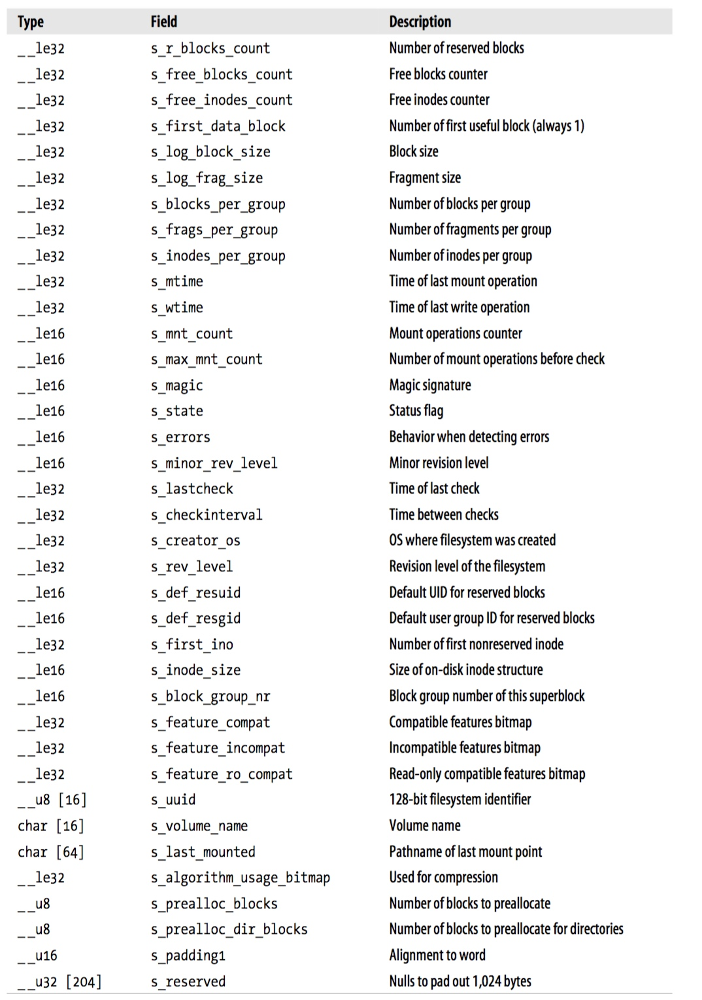

> s_inodes_count

描述文件系统中inode的数量，包括 used inodes 与 free inodes


> s_blocks_count     

描述文件系统中data block的数量，包括 used, free, reserved blocks


> s_r_blocks_count

描述文件系统中 reserved block 的数量


> s_free_blocks_count

描述文件系统中 free block 的数量，包括 free, reserved blocks


> s_free_inodes_count

描述文件系统中 free inode 的数量


> s_first_data_block

block group 0 的superblock 存储在 disk partition 起始的 1024 字节之后，即紧接在 boot section 之后，一共占用 1024 字节

由于 block group 0 从 superblock 开始，而 superblock 从 disk partition 的起始 1024 字节处开始，因而 block group 0 可能从 block 0 开始，也可能从 block 1 开始，这取决于 block size

- 若 block size 为 1KiB，则 superblock 占用整个 block 0，则 block group 0 即从 block 1 处开始
- 若 block size 为 4KiB，则 superblock 占用 block 0 中起始 1024 字节之后的 1024 字节，此时 block group 0 即从 block 0 处开始

superblock 的 s_first_data_block 字段即描述 block group 0 从哪一个 block 开始

- 若 block size 为 1KiB，则 block group 0 即从 block 1 处开始，此时 s_first_data_block 字段即为 1
- 若 block size 为 4KiB，则 block group 0 即从 block 0 处开始，此时 s_first_data_block 字段即为 0


> s_log_block_size   

以 power of 2 的形式表示block size，以 KiB 为单位，即 block size 的大小为 (2 ^ sb.s_log_block_size) KiB，例如s_log_block_size为0，则block size为 1 KB


> s_blocks_per_group 

描述一个block group包含的block的数量，包括 used, free, reserved blocks


> s_inodes_per_group 

描述一个block group包含的inode的数量


> s_magic

用于标识 ext2 文件系统的 magic number，为 EXT2_SUPER_MAGIC 即 0xEF53


> s_first_ino

inode table 的起始位置会存储 inode descriptor，s_first_ino 字段即描述 inode table 中第一个 free inode descriptor 的编号


> s_inode_size

描述 inode descriptor 的大小


#### group descriptor table

block group descriptor table 存储该文件系统中的所有 block group descriptor，每个 block group 都有一个对应的 block group descriptor

block group descriptor table 存储在 superblock 之后的第一个 block，因而

- 若 block size 为 1 KiB，则 block group 0 的 block group descriptor table 从 block 2 开始存储
- 若 block size 为 2 KiB 或更大，则 block group 0 的 block group descriptor table 从 block 1 开始存储


block group descriptor 描述对应的 block group 的相关信息，例如 inode bitmap、inode table、block bitmap 的位置等

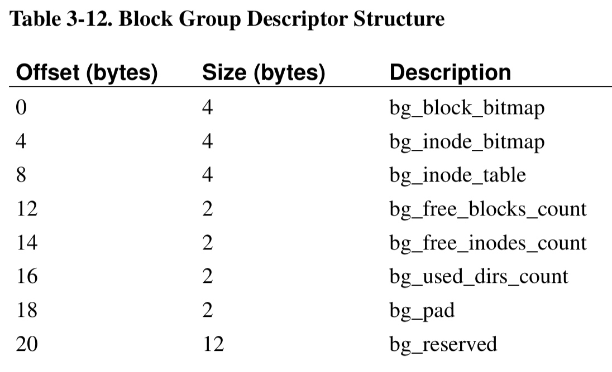

```c
/*
 * Structure of a blocks group descriptor
 */
struct ext2_group_desc
{
	__le32	bg_block_bitmap;	/* Blocks bitmap block */
	__le32	bg_inode_bitmap;	/* Inodes bitmap block */
	__le32	bg_inode_table;	/* Inodes table block */
	__le16	bg_free_blocks_count;/* Free blocks count */
	__le16	bg_free_inodes_count;/* Free inodes count */
	__le16	bg_used_dirs_count;/* Directories count */
	__le16	bg_pad;
	__le32	bg_reserved[3];
};
```

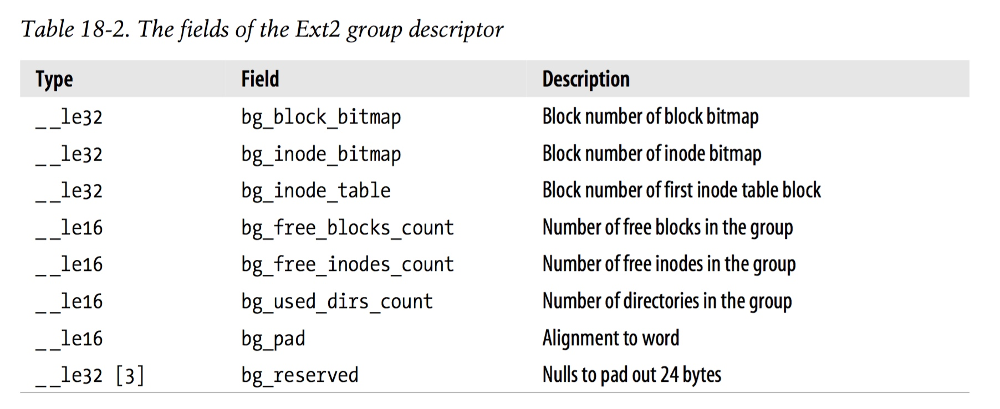

> bg_block_bitmap

描述该 block group 中 block bitmap 所在的 block ID (absolute block ID)


> bg_inode_bitmap

描述该 block group 中 inode bitmap 所在的 block ID


> bg_inode_table

描述该 block group 中存储 inode table 的起始 block ID


> bg_free_blocks_count

描述该 block group 中 free block 的数量


> bg_free_inodes_count

描述该 block group 中 free inode 的数量


> bg_used_dirs_count

描述该 block group 中用于 directory 的 used inode 的数量


#### data block bitmap

data block bitmap 在 block group 中的位置由对应的 block group descriptor 的 bg_block_bitmap 字段描述

data block bitmap 描述该 block group 中 data block 的使用情况，例如

- byte 0 的 bit 0 (least significant bit) 描述该 block group 中第一个 block 的使用情况
- byte 0 的 bit 7 (most significant bit) 描述该 block group 中第八个 block 的使用情况

data block bitmap 中的每个 bit 描述对应的 block 的使用情况，其中

- 1 表示对应的 data block 已经被占用
- 0 表示对应的 data block 空闲


一个 block group 的大小受到 data block bitmap 的限制，由于一个 block group 只能使用一个 block 大小存储 data block bitmap，因而一个 block group 最多只能管理 (8 * block_size) 个block


#### inode bitmap

inode bitmap 在 block group 中的位置由对应的 block group descriptor 的 bg_inode_bitmap 字段描述

inode bitmap 描述该 block group 的 inode table 中各个 inode 的使用情况，其中

- 1 表示 inode table 中对应的inode已经被占用
- 0 表示 inode table 中对应的inode空闲


一个 block group 只能使用一个 block 大小存储 inode bitmap，因而一个 block group 最多只能存储 (8 * block_size) 个inode


#### inode table

inode table 用于存储该 block group 中的所有 inode descriptor

inode table 在 block group 中的位置由对应的 block group descriptor 的 bg_inode_table 字段描述

inode table 中存储的 inode descriptor 的数量由对应的 superblock 的 s_inodes_per_group 字段描述


ext2 文件系统中每个文件（包括 regular file、directory、symbolic file、special file）都有一个对应的 inode descriptor，inode descriptor 描述文件的位置、大小等相关信息，ext2 inode descriptor 占用 128 字节

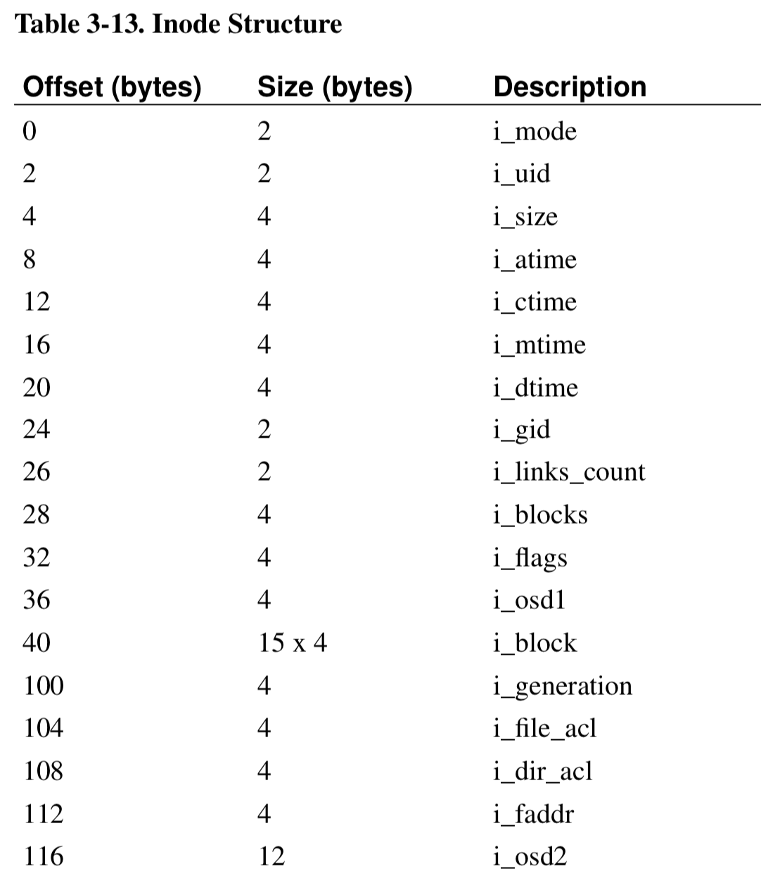


```c
/*
 * Structure of an inode on the disk
 */
struct ext2_inode {
	__le16	i_mode;		/* File mode */
	__le16	i_uid;		/* Low 16 bits of Owner Uid */
	__le32	i_size;		/* Size in bytes */
	__le32	i_atime;	/* Access time */
	__le32	i_ctime;	/* Creation time */
	__le32	i_mtime;	/* Modification time */
	__le32	i_dtime;	/* Deletion Time */
	__le16	i_gid;		/* Low 16 bits of Group Id */
	__le16	i_links_count;	/* Links count */
	__le32	i_blocks;	/* Blocks count */
	__le32	i_flags;	/* File flags */
	union {
		struct {
			__le32  l_i_reserved1;
		} linux1;
		struct {
			__le32  h_i_translator;
		} hurd1;
		struct {
			__le32  m_i_reserved1;
		} masix1;
	} osd1;				/* OS dependent 1 */
	__le32	i_block[EXT2_N_BLOCKS];/* Pointers to blocks */
	__le32	i_generation;	/* File version (for NFS) */
	__le32	i_file_acl;	/* File ACL */
	__le32	i_dir_acl;	/* Directory ACL */
	__le32	i_faddr;	/* Fragment address */
	union {
		struct {
			__u8	l_i_frag;	/* Fragment number */
			__u8	l_i_fsize;	/* Fragment size */
			__u16	i_pad1;
			__le16	l_i_uid_high;/* these 2 fields    */
			__le16	l_i_gid_high;/* were reserved2[0] */
			__u32	l_i_reserved2;
		} linux2;
		struct {
			__u8	h_i_frag;	/* Fragment number */
			__u8	h_i_fsize;	/* Fragment size */
			__le16	h_i_mode_high;
			__le16	h_i_uid_high;
			__le16	h_i_gid_high;
			__le32	h_i_author;
		} hurd2;
		struct {
			__u8	m_i_frag;	/* Fragment number */
			__u8	m_i_fsize;	/* Fragment size */
			__u16	m_pad1;
			__u32	m_i_reserved2[2];
		} masix2;
	} osd2;				/* OS dependent 2 */
};
```

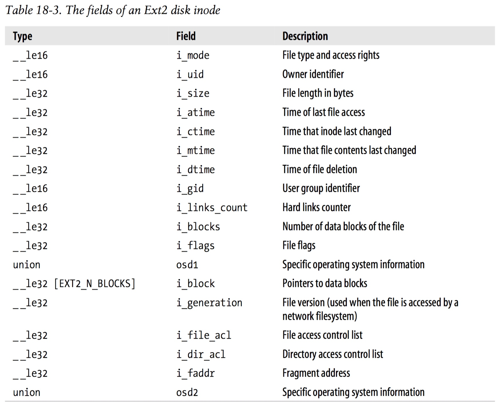

> i_mode

描述文件的类型以及访问权限等信息

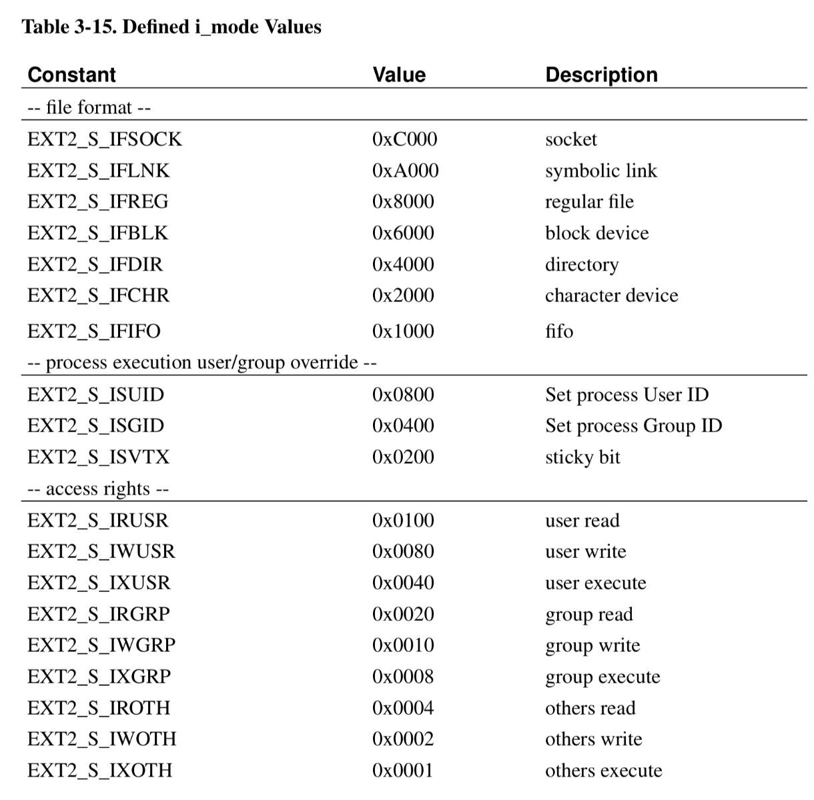


> i_size

描述文件的大小，以字节为单位

> i_links_count

描述该 inode 的 link count，regular file 对应的 inode 的 link count 通常为 1，hard link 会增加对应 inode 的 link count，symbolic link 则不会


> i_blocks   

描述该文件占用的data block的数量，这里以512 byte大小的data block为单位


> i_block[]

该数组存储 EXT2_N_BLOCKS 即 15 个元素，其中的每个元素保存该文件占用的data block的地址


数组的前 12 个元素存储 direct block ID，其中的每个元素指向的 data block 即用于存储该文件的数据


数组的第 13 个元素存储 indirect block ID，其指向的 block 实际存储一个 direct block ID 数组，其中的每个 direct block ID 指向一个存储文件数据的 data block

由于 block ID 为 32 bit 即占用 4 字节，因而 i_block[12] 最多可以指向 (block_size / 4) 个 data block


数组的第 14 个元素存储 doubly-indirect block ID，其指向的 block 实际存储一个 indirect block ID 数组

i_block[13] 最多可以指向 (block_size / 4) 个 indirect block，即 ((block_size / 4) ^ 2) 个 data block


数组的第 15 个元素存储 triply-indirect block ID，其指向的 block 实际存储一个 doubly-indirect block ID 数组

i_block[14] 最多可以指向 (block_size / 4) 个 doubly-indirect block，即 ((block_size / 4) ^ 2) 个 indirect block，即 ((block_size / 4) ^ 3) 个 data block


i_block[] 数组中以 0 值作为结尾


#### directory

ext2 中目录实际也实现为一个文件，其data block实际存储一个或多个 directory entry，每个directory entry 描述该目录下的一个子目录或 文件

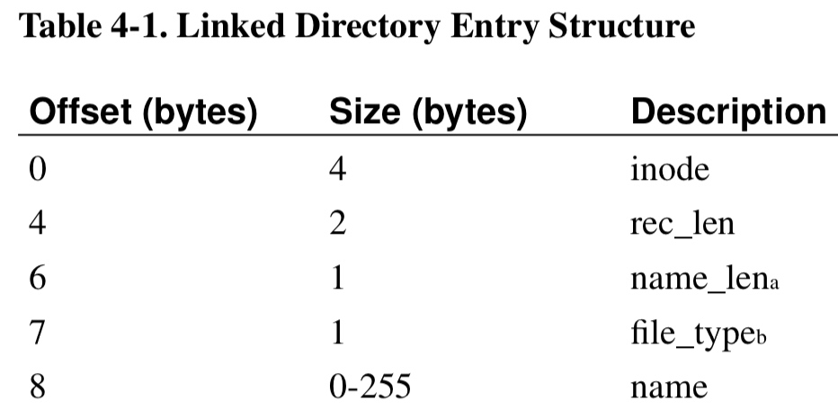


```c
/*
 * The new version of the directory entry.  Since EXT2 structures are
 * stored in intel byte order, and the name_len field could never be
 * bigger than 255 chars, it's safe to reclaim the extra byte for the
 * file_type field.
 */
struct ext2_dir_entry_2 {
	__le32	inode;			/* Inode number */
	__le16	rec_len;		/* Directory entry length */
	__u8	name_len;		/* Name length */
	__u8	file_type;
	char	name[];			/* File name, up to EXT2_NAME_LEN */
};
```

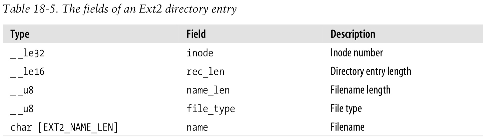


> inode

描述该 directory entry 对应文件对应的 inode number

若该字段为 0，则表示该 directory entry 为 unused


> rec_len

描述该 directory entry 的长度，以字节为单位


> file_type

描述该 directory entry 对应的文件的类型

```c
/*
 * Ext2 directory file types.  Only the low 3 bits are used.  The
 * other bits are reserved for now.
 */
enum {
	EXT2_FT_UNKNOWN		= 0,
	EXT2_FT_REG_FILE	= 1,
	EXT2_FT_DIR		= 2,
	EXT2_FT_CHRDEV		= 3,
	EXT2_FT_BLKDEV		= 4,
	EXT2_FT_FIFO		= 5,
	EXT2_FT_SOCK		= 6,
	EXT2_FT_SYMLINK		= 7,
	EXT2_FT_MAX
};
```


> name[]

该字符数组描述对应的文件的名称

> name_len

描述 name[] 数组的长度


例如一个目录的 data block 的内容可以为

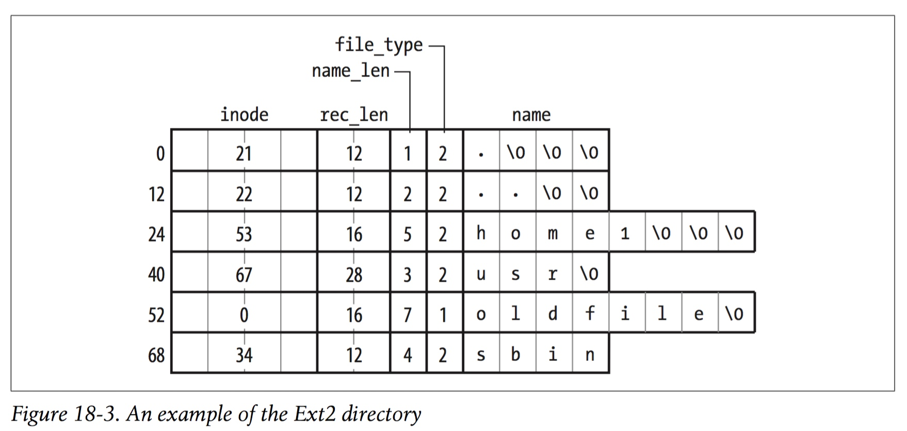
