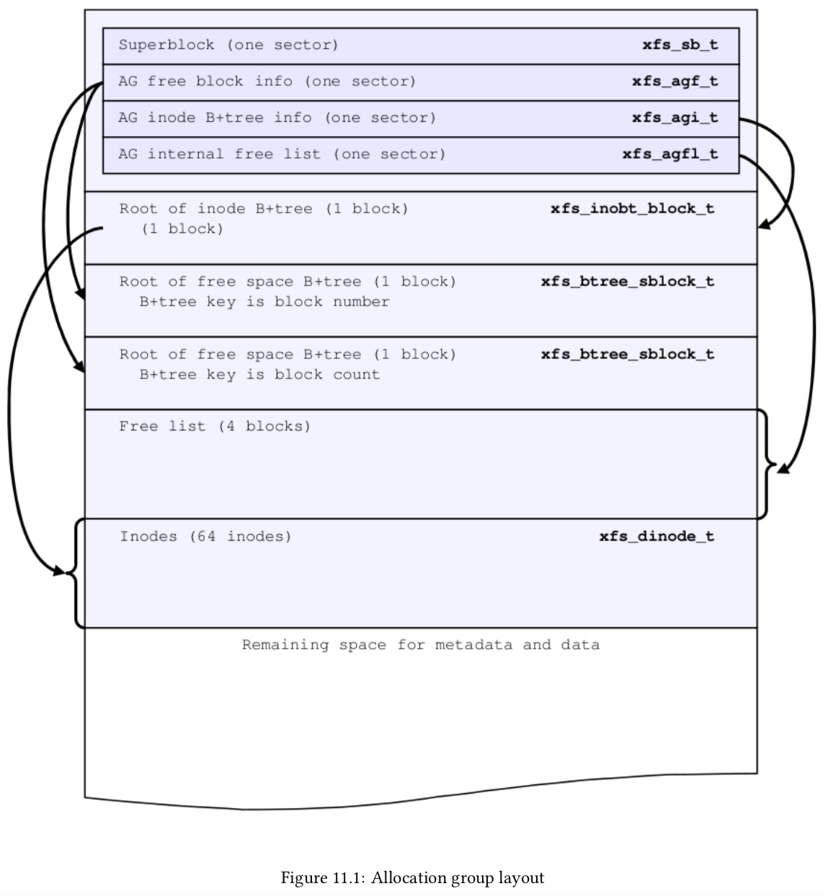
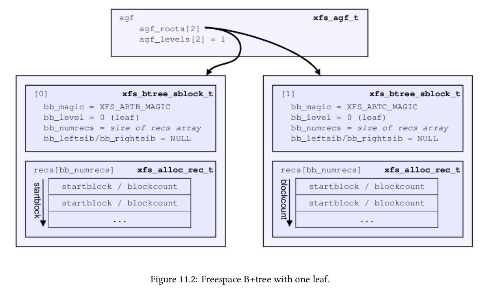
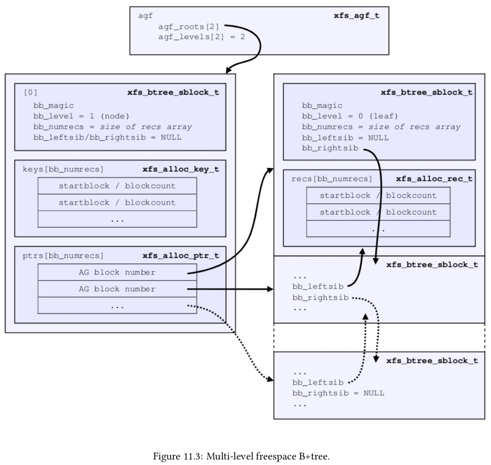
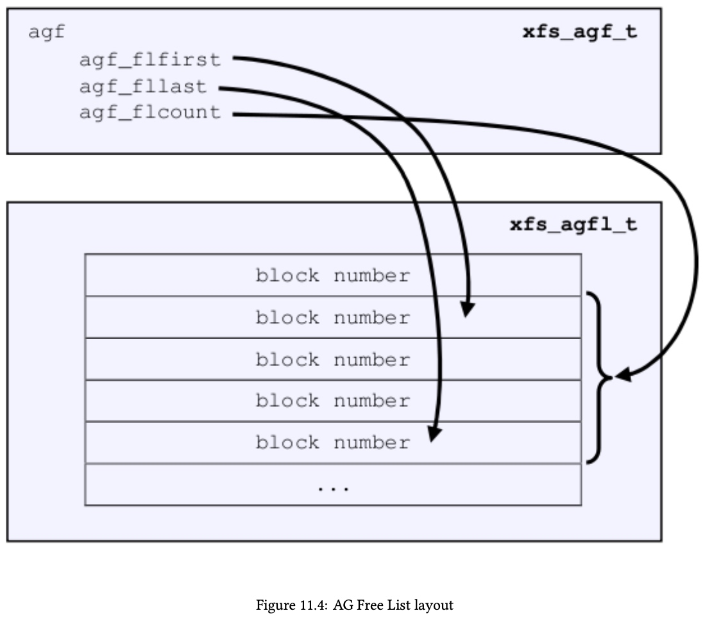
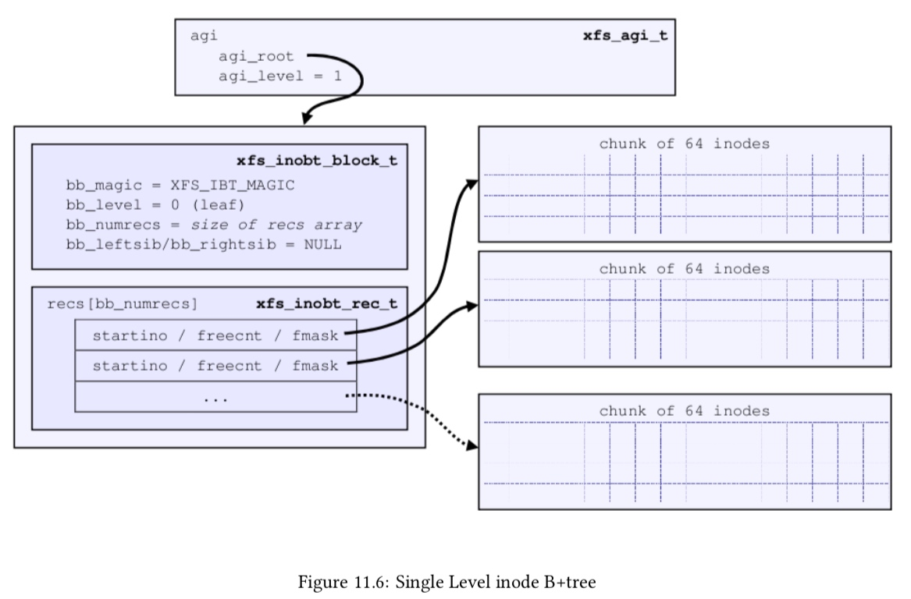
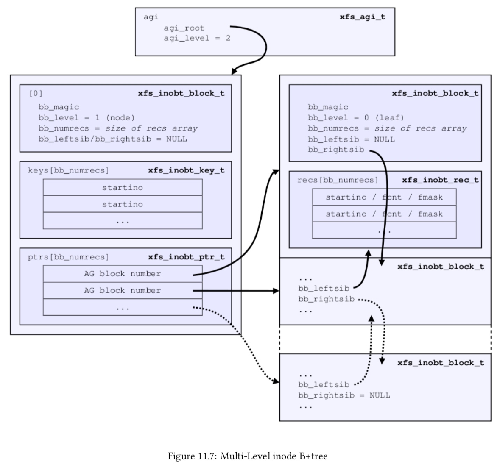
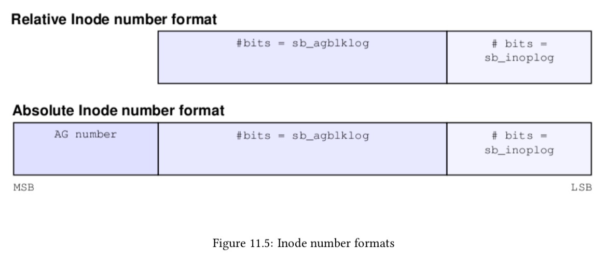

## XFS Spec

> XFS Filesystem Disk Structures

XFS 把块设备的存储空间分为多个 AG (Allocation Group)，每个 AG 都相当于是一个独立的文件系统，这样设计是为了提升文件系统的并行性能；一个 AG 最大为 1T (2^31 sector)



### superblock

AG 的第一个 sector 用于 superblock

```c
typedef struct xfs_dsb {
	__be32		sb_magicnum;	/* magic number == XFS_SB_MAGIC */
	__be32		sb_blocksize;/* logical block size, bytes */
	__be64		sb_dblocks;	/* number of data blocks */
	__be64		sb_rblocks;	/* number of realtime blocks */
	__be64		sb_rextents;	/* number of realtime extents */
	uuid_t		sb_uuid;	/* user-visible file system unique id */
	__be64		sb_logstart;	/* starting block of log if internal */
	__be64		sb_rootino;	/* root inode number */
	__be64		sb_rbmino;	/* bitmap inode for realtime extents */
	__be64		sb_rsumino;	/* summary inode for rt bitmap */
	__be32		sb_rextsize;	/* realtime extent size, blocks */
	__be32		sb_agblocks;	/* size of an allocation group */
	__be32		sb_agcount;	/* number of allocation groups */
	__be32		sb_rbmblocks;/* number of rt bitmap blocks */
	__be32		sb_logblocks;/* number of log blocks */
	__be16		sb_versionnum;/* header version == XFS_SB_VERSION */
	__be16		sb_sectsize;	/* volume sector size, bytes */
	__be16		sb_inodesize;/* inode size, bytes */
	__be16		sb_inopblock;/* inodes per block */
	char		sb_fname[XFSLABEL_MAX]; /* file system name */
	__u8		sb_blocklog;	/* log2 of sb_blocksize */
	__u8		sb_sectlog;	/* log2 of sb_sectsize */
	__u8		sb_inodelog;	/* log2 of sb_inodesize */
	__u8		sb_inopblog;	/* log2 of sb_inopblock */
	__u8		sb_agblklog;	/* log2 of sb_agblocks (rounded up) */
	__u8		sb_rextslog;	/* log2 of sb_rextents */
	__u8		sb_inprogress;	/* mkfs is in progress, don't mount */
	__u8		sb_imax_pct;	/* max % of fs for inode space */
					/* statistics */
	/*
	 * These fields must remain contiguous.  If you really
	 * want to change their layout, make sure you fix the
	 * code in xfs_trans_apply_sb_deltas().
	 */
	__be64		sb_icount;	/* allocated inodes */
	__be64		sb_ifree;	/* free inodes */
	__be64		sb_fdblocks;	/* free data blocks */
	__be64		sb_frextents;/* free realtime extents */
	/*
	 * End contiguous fields.
	 */
	__be64		sb_uquotino;	/* user quota inode */
	__be64		sb_gquotino;	/* group quota inode */
	__be16		sb_qflags;	/* quota flags */
	__u8		sb_flags;	/* misc. flags */
	__u8		sb_shared_vn;	/* shared version number */
	__be32		sb_inoalignmt;/* inode chunk alignment, fsblocks */
	__be32		sb_unit;	/* stripe or raid unit */
	__be32		sb_width;	/* stripe or raid width */
	__u8		sb_dirblklog;	/* log2 of dir block size (fsbs) */
	__u8		sb_logsectlog;	/* log2 of the log sector size */
	__be16		sb_logsectsize;/* sector size for the log, bytes */
	__be32		sb_logsunit;	/* stripe unit size for the log */
	__be32		sb_features2;/* additional feature bits */
	/*
	 * bad features2 field as a result of failing to pad the sb
	 * structure to 64 bits. Some machines will be using this field
	 * for features2 bits. Easiest just to mark it bad and not use
	 * it for anything else.
	 */
	__be32		sb_bad_features2;

	/* version 5 superblock fields start here */

	/* feature masks */
	__be32		sb_features_compat;
	__be32		sb_features_ro_compat;
	__be32		sb_features_incompat;
	__be32		sb_features_log_incompat;

	__le32		sb_crc;		/* superblock crc */
	__be32		sb_spino_align;/* sparse inode chunk alignment */

	__be64		sb_pquotino;	/* project quota inode */
	__be64		sb_lsn;		/* last write sequence */
	uuid_t		sb_meta_uuid;/* metadata file system unique id */

	/* must be padded to 64 bit alignment */
} xfs_dsb_t;
```

@sb_blocksize 描述 block 的大小，以字节为单位，sb_blocksize = 2^sb_blocklog
@sb_agblocks 描述每个 AG 的大小，以 block 为单位，sb_agblocks = 2^sb_agblklog
@sb_agcount 描述文件系统中 AG 的数量
@sb_inodesize 描述 on-disk inode 数据结构的大小，sb_inodesize = 2^sb_inodelog

@sb_icount 描述文件系统中当前已经分配的 inode 数量
@sb_ifree 描述文件系统中当前剩余可用的 inode 数量

@sb_dblocks 描述文件系统可用于 data block 的数量，@sb_fdblocks 描述当前剩余可用的 data block 的数量


### AG Free Space Management 

每个 AG 使用两个 B+ tree 管理 free space，分别使用 startblock、blockcount 作为 key；维护两个 B+ tree 来管理 free space，可以灵活满足不同的分配策略

- 当需要考虑 locality 策略时可以使用 key 为 startblock 的 B+ tree，以分配特定 block number 起始的 free space range
- 当需要考虑 best fit 策略时可以使用 key 为 blockcount 的 B+ tree，以分配特定大小的 free space range


AG 的第二个 sector 存储 xfs_agf_t 数据结构，其中 @agf_roots[] 数组就保存了管理 free space 的两个 B+ tree 的地址

```c
typedef struct xfs_agf {
	/*
	 * Common allocation group header information
	 */
	__be32		agf_magicnum;/* magic number == XFS_AGF_MAGIC */
	__be32		agf_versionnum;/* header version == XFS_AGF_VERSION */
	__be32		agf_seqno;	/* sequence # starting from 0 */
	__be32		agf_length;	/* size in blocks of a.g. */
	/*
	 * Freespace and rmap information
	 */
	__be32		agf_roots[XFS_BTNUM_AGF];/* root blocks */
	__be32		agf_levels[XFS_BTNUM_AGF];/* btree levels */

	__be32		agf_flfirst;	/* first freelist block's index */
	__be32		agf_fllast;	/* last freelist block's index */
	__be32		agf_flcount;	/* count of blocks in freelist */
	__be32		agf_freeblks;/* total free blocks */

	__be32		agf_longest;	/* longest free space */
	__be32		agf_btreeblks;/* # of blocks held in AGF btrees */
	uuid_t		agf_uuid;	/* uuid of filesystem */

	__be32		agf_rmap_blocks;/* rmapbt blocks used */
	__be32		agf_refcount_blocks;/* refcountbt blocks used */

	__be32		agf_refcount_root;/* refcount tree root block */
	__be32		agf_refcount_level;/* refcount btree levels */

	/*
	 * reserve some contiguous space for future logged fields before we add
	 * the unlogged fields. This makes the range logging via flags and
	 * structure offsets much simpler.
	 */
	__be64		agf_spare64[14];

	/* unlogged fields, written during buffer writeback. */
	__be64		agf_lsn;	/* last write sequence */
	__be32		agf_crc;	/* crc of agf sector */
	__be32		agf_spare2;

	/* structure must be padded to 64 bit alignment */
} xfs_agf_t;
```

@agf_freeblks 描述当前 AG 中 free block 的数量
@agf_longest 描述当前 AG 中最大的连续 free block 的大小


#### AG Free Space B+ trees

之前介绍了 free space B+ tree 的 key 是 startblock/blockcount，value 则是 xfs_alloc_rec_t

<startblock, blockcount> pair 就描述了一个 free space range

```c
typedef struct xfs_alloc_rec {
	__be32		ar_startblock; /* starting block number */
	__be32		ar_blockcount; /* count of free blocks */
} xfs_alloc_rec_t, xfs_alloc_key_t;
```


如图所示，B+ tree 的中间节点（包括叶子节点）都有一个 xfs_btree_sblock_t 作为 header




如图所示，中间节点使用一个数组维护所有指向叶子结点的指针




#### AG Free List

此外每个 AG 必须预留一些 free block 用于 Free Space B+ trees，一开始文件系统刚完成格式化的时候，会在 AG 的起始处预留 4 个 block ("Free List" 区域)；之后随着 Free Space B+ trees 的增长，这 4 个 block 用尽时，会分配新的 free block 用作预留

所有这些 reserved free block 通过一个数组进行管理，其中的每个元素就是一个 block offset (u32)，描述一个 reserved free block，这个数组就称为 free list，AG 的第四个 sector 就用于存储这个数组即 free list

因为 free list 数组的大小上限是一个 sector，因而该数组最多包含 128 个 reserved block，但是实际包含的 reserved block 数量由 XFS_A GFL_SIZE 描述




free list 数组只是描述了当前 AG 中所有用于 Free Space B+ trees 的 reserved block，但是其中有些 block 已经被用于 Free Space B+ trees，剩余则是空闲可用的

因而实际上通过循环缓冲区的方式，描述 free list 中哪些 block 已经被使用了，哪些是空闲可用的，xfs_agf_t 中的相关字段描述了该循环缓冲区的元数据

```c
typedef struct xfs_agf {
	__be32		agf_flfirst;	/* first freelist block's index */
	__be32		agf_fllast;	/* last freelist block's index */
	__be32		agf_flcount;	/* count of blocks in freelist */
	__be32		agf_freeblks;/* total free blocks */
	...
} xfs_agf_t;
```

@agf_flcount 描述 free list 数组的总大小，即包含的 reserved block 的数量
@agf_freeblks 描述 free list 中 free block 的数量

@agf_flfirst 描述第一个 free block 在 free list 数组中的偏移
@agf_fllast 描述最后一个 free block 在 free list 数组中的偏移


### AG Inode Management

#### inode chunk

XFS 会在运行的时候动态分配 inode，分配的粒度是包含 64 个 inode 的 inode chunk，xfs_inobt_rec_t 就用于描述一个 inode chunk

```c
typedef struct xfs_inobt_rec {
	__be32		ir_startino;	/* starting inode number */
	__be32	   ir_freecount; /* count of free inodes */
	__be64		ir_free;	/* free inode mask */
} xfs_inobt_rec_t;
```

@ir_startino 描述该 chunk 中的 lowest-numbered inode
@ir_freecount 描述该 chunk 中 free inode 的数量
@ir_free bitmap 描述该 chunk 中 inode 的使用状态


#### inode B+ trees

每个 AG 维护有一个 B+ tree 管理所有的 inode chunk，key 为 starting inode number，value 为 xfs_inobt_rec_t

AG 的第三个 sector 存储 xfs_agi_t 结构，其中 @agi_root 字段就描述该 B+ tree 的地址

```c
typedef struct xfs_agi {
	/*
	 * Common allocation group header information
	 */
	__be32		agi_magicnum; /* magic number == XFS_AGI_MAGIC */
	__be32		agi_versionnum; /* header version == XFS_AGI_VERSION */
	__be32		agi_seqno;	/* sequence # starting from 0 */
	__be32		agi_length;	/* size in blocks of a.g. */
	/*
	 * Inode information
	 * Inodes are mapped by interpreting the inode number, so no
	 * mapping data is needed here.
	 */
	__be32		agi_count;	/* count of allocated inodes */
	__be32		agi_root;	/* root of inode btree */
	__be32		agi_level;	/* levels in inode btree */
	__be32		agi_freecount;/* number of free inodes */

	__be32		agi_newino;	/* new inode just allocated */
	__be32		agi_dirino;	/* last directory inode chunk */
	/*
	 * Hash table of inodes which have been unlinked but are
	 * still being referenced.
	 */
	__be32		agi_unlinked[XFS_AGI_UNLINKED_BUCKETS];
	/*
	 * This marks the end of logging region 1 and start of logging region 2.
	 */
	uuid_t		agi_uuid;	/* uuid of filesystem */
	__be32		agi_crc;	/* crc of agi sector */
	__be32		agi_pad32;
	__be64		agi_lsn;	/* last write sequence */

	__be32		agi_free_root; /* root of the free inode btree */
	__be32		agi_free_level;/* levels in free inode btree */

	/* structure must be padded to 64 bit alignment */
} xfs_agi_t;
```

@agi_count 描述当前 AG 中已经分配的 inode (包括 used/free) 数量
@agi_freecount 描述当前 AG 中 free inode 数量


如图所示，inode B+ tree 的中间节点（包括叶子节点）都有一个 xfs_btree_sblock_t 作为 header；叶子节点包含一组 xfs_inobt_rec_t






#### inode number



inode number 由三部分构成

- 低 @sb_inopblog bits 描述该 inode 在所在的 inode chunk 中的偏移
- 往上的 @sb_agblklog bits 描述该 inode 所在的 inode chunk 占用的 block，在该 AG 中的偏移
- 再往上的部分描述该 inode 所在的 AG 的编号

因而 inode number 实际上就对 inode 的位置进行了编码，通过 inode number 就能定位到该 inode 在磁盘上的物理位置

> sb_inopblog is log2 of sb_inopblock, while sb_inopblock is 'inodes per block'
> sb_agblklog is log2 of sb_agblocks, while sb_agblocks is 'size of an allocation group'


