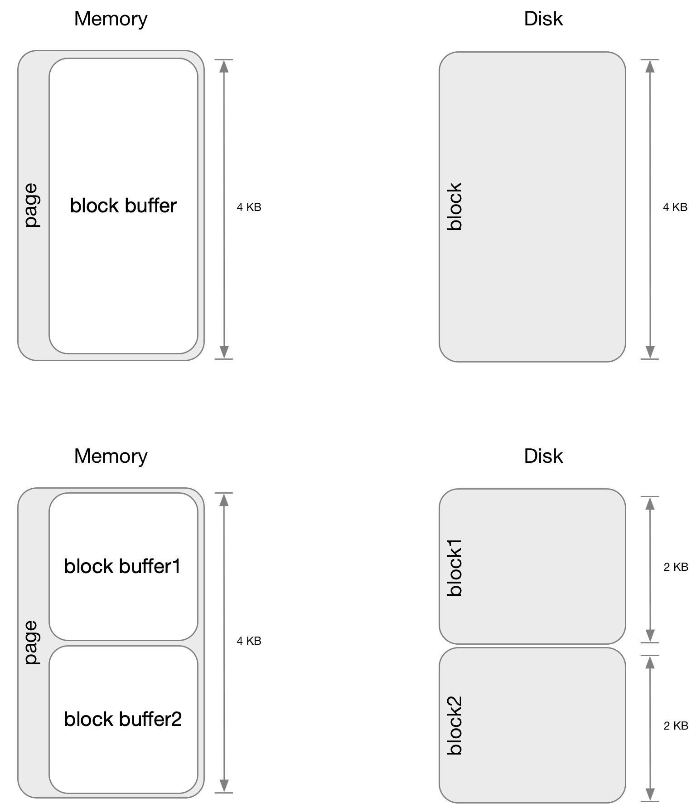
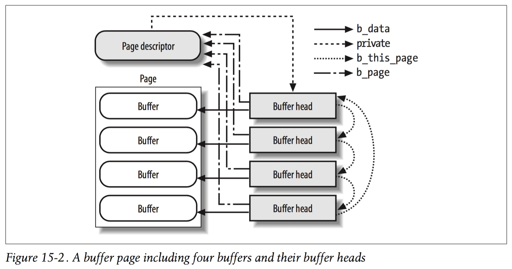

title:'Address Space - Concept'
## Address Space - Concept


### address_space

VFS 使用内存 (page frame) 对文件的内容进行缓存，这些用于缓存的 page frame 就称为 page cache

每个 inode 就维护了一个 radix tree 管理该文件下的所有 page cache

```c
struct inode {
	struct address_space	*i_mapping;
	struct address_space	i_data;
	...
}	
```

通常 inode->i_mapping = &inode->i_data

```c
struct address_space {
	struct radix_tree_root	i_pages;/* radix tree of all pages */	...
};
```

后面可以看到，在支持 fs DAX 特性时，address space 中管理的还有值为 PFN (page frame number) 的条目，称为 exceptional entry；因而 radix tree 中管理的数据类型包括了 page cache 与 exceptional entry


### page based

之前介绍过，VFS 使用内存对文件的内容进行缓存，这些用于缓存文件内容的内存就称为 page cache，page cache 描述符实际内嵌在 page 描述符中

```c
struct page {
	struct address_space *mapping;
	
	struct {
		union {
			pgoff_t index;		/* Our offset within mapping. */
			...
		};
	};
}
```

@mapping 描述对应的映射的 inode 的 address space
@index 描述该 page frame 在该 address space 中的偏移，即该 page frame 缓存的数据在对应文件中的 file offset，以 page size 为单位


不考虑 fs DAX 特性，address space 中维护的都是 page cache，@i_pages radix tree 就管理了该文件的所有 page cache，其中 value 为 page 描述符，key 即为该 page cache 在该 address space 中的偏移即 @page->index

@nrpages 描述该 address space 中维护的 page cache 的数量

```c
struct address_space {
	struct radix_tree_root	i_pages;/* radix tree of all pages */
	unsigned long		nrpages;	...
};
```


#### FIEMAP

FIEMAP 框架下使用 block buffer 来描述内存到对应的 block number 之间的映射关系

##### buffer head

我们将对磁盘上的某一个 block 进行缓存的内存区域称为 block buffer，block buffer 描述了内存 (page cache) 到对应的 block number 之间的映射关系，struct buffer_head 就描述一个 block buffer

```c
struct buffer_head {
	struct block_device *b_bdev;
	sector_t b_blocknr;		/* start block number */

	struct page *b_page;		/* the page this bh is mapped to */
	char *b_data;			/* pointer to data within the page */

	size_t b_size;			/* size of mapping */
	...
};
```

@b_bdev/@b_blocknr 用于描述缓存的 block 在磁盘中的位置，其中 @b_blocknr 描述缓存的 block 的 block number

每个 block buffer 都用于缓存 blkdev 的一个 block，其大小都是固定的 block size，即文件系统中的 block size 的概念，@b_size 字段的值就是该 block size

@b_page/@b_data 描述对应的 block buffer 在内存中的位置；因为 block size 可能小于 page size，因而 block buffer 很可能是一个 page 的其中一部分，因而这里 block buffer 实际上是指 @b_page 描述的 page 中，@b_data 虚拟地址起始的，@b_size 大小的一块内存区间

```

struct page *b_page                         struct block_device *b_bdev
+-----------+                                       |           |
|           |                                       |           |
|@@@@@@@@@@@| <- b_data                b_blocknr -> |###########|
|@@@@@@@@@@@|       +--------------------+          |###########|
|@@@@@@@@@@@|       | struct buffer_head |          |###########|
|@@@@@@@@@@@|       +--------------------+          |###########|
|@@@@@@@@@@@| <- b_data + b_size                    |###########|                       
|           |                                       |           |
+-----------+                                       |           |
```


##### block buffer list

之前介绍到，block buffer 用于描述内存 (page cache) 到对应的 block number 之间的映射关系

一个 block buffer 就用于缓存磁盘上的一个 block，由于 block 是文件系统的概念，而 block size 是文件系统格式化 (例如 mkfs.ext4) 的时候由用户指定的，因而这里 block buffer 的大小实际上就是文件系统的 block size；例如当 ext4 文件系统格式化的时候，block size 被设置为 2KB 时，那么该文件系统底层的 blkdev 对应的 block buffer 的大小就是 2KB

因而一个 page 可以包含一个或多个 block buffer

- 若 page frame 的大小为 4KB，而 block size 为 4KB，则 block buffer 的大小也为 4KB，因而一个 page 包含 1 个 block buffer
- 若 page frame 的大小为 4KB，而 block size 为 1KB，则 block buffer 的大小也为 1KB，因而一个 page 包含 4 个 block buffer




也就是说，一个 page cache 可以包含一个或多个 block buffer，此时一个 page cache 包含的所有 block buffer 构成一个链表，保存在 page cache 的 @private 字段，buffer head 的 @b_this_page 字段即指向该链表中的下一个 block buffer

```c
struct page {
	...
	union {
		unsigned long private;		/* Mapping-private opaque data:
					 	 * usually used for buffer_heads
						 * if PagePrivate set; used for
						 * swp_entry_t if PageSwapCache;
						 * indicates order in the buddy
						 * system if PG_buddy is set.
						 */
    ...
	};
	...
}
```

```c
struct buffer_head {
	struct buffer_head *b_this_page;/* circular list of page's buffers */
	...
};
```

此时 page cache 会设置上 Private 标记，其 @private 字段就存储 block buffer list




> page cache VS block buffer

历史上 page cache 和 block buffer 是相分离的，page cache 指代对文件内容进行缓存的内存，而 block buffer 指代对块设备上的一个 block 进行缓存的内存

而随着内核的发展，如今 page cache 和 block buffer 相互统一为 page based 的接口，对于 page cache 来说，将 page cache 中的内容下发到 block 层的过程中，需要 block buffer 描述 page cache 到对应的 block number 之间的映射关系

而对于直接缓存 raw blkdev 的 block buffer 来说，这些 block buffer 实际上也有对应的 struct page 描述符，这些 page 描述符由该块设备的 master inode (@bdev->bd_inode，即该 blkdev 在 bdev filesystem 中的 inode) 的 address_space 进行管理；也就是说，直接对 raw blkdev 缓存的 block buffer，实际上统一到了 page cache 的框架，只不过此时这些 page cache 是对块设备文件本身进行缓存的


> FIEMAP: file-based

```sh
# fiemap based buffered IO
f_op->write_iter(kiocb, iov_iter)
    __generic_file_write_iter
        generic_perform_write
            a_ops->write_begin(), e.g., ext4_write_begin()
                page = grab_cache_page_write_begin()
                    (no found) page = alloc_pages() // allocate page
                
                __block_write_begin
                    __block_write_begin_int
                        head = create_page_buffers(page, ...)
                            head = alloc_page_buffers // allocate all buffer heads of this page
                        
                        (for each buffer head) ll_rw_block(..., bh)                            
```


> FIEMAP: blkdev-based

```sh
ext4_fill_super
    bh = sb_bread_unmovable(sb, logical_sb_block)
        __bread_gfp
            bh = __getblk_gfp(bdev, block, ...)
                bh = __getblk_slow() // allocate buffer head
                    grow_buffers
                        grow_dev_page(bdev, block, ...)
                            page = find_or_create_page(bdev->bd_inode->i_mapping, ...)
                                (no found) page = alloc_pages() // allocate page
                                alloc_page_buffers(page, ...) // allocate all buffer heads of this page
                    bh = __find_get_block(bdev, block, ...) // find buffer head at @block

            (for this buffer head) __bread_slow(bh)
```


##### lifetime of buffer head

@b_count 维护 block buffer 的引用计数

```c
struct buffer_head {
	atomic_t b_count;		/* users using this buffer_head */
	...
};
```

get_bh() 增加引用计数，put_bh() 减小引用计数


> search

通过 __find_get_block()/sb_find_get_block()、__getblk()/sb_getblk() 寻找 block buffer 时，返回的 block buffer 都是已经调用过一次 get_bh() 的，也就是说返回的 block buffer 都是引用计数已经为 1


put_bh() 与 brelse() 在功能上相似，都是减小引用计数，但是两者的语义存在细微差别，前者通常与 get_bh() 配对使用，而后者则表示当前路径要停止访问该 block buffer 了


> submit IO / IO completion

对 buffer head 执行 IO 操作时，会增加 buffer head 的引用计数

```sh
ll_rw_block
    get_bh(bh)
        submit_bh(..., bh)
            bh->b_end_io = end_buffer_write_sync/end_buffer_read_sync
            submit_bh_wbc
                # allocate bio
                bio->bi_end_io = end_bio_bh_io_sync
                get_bh(bh) // inc @bh->b_count
                submit_bio(bio)
```


IO 完成时，相应地减小 buffer head 的引用计数

```sh
# bio completion
bio->bi_end_io, i.e., end_bio_bh_io_sync()
    bh->b_end_io(bh, ...), i.e., end_buffer_write_sync/end_buffer_read_sync
        put_bh(bh) // dec @bh->b_count
```


> cleanup

当 block buffer 的引用计数变为 0 的时候，并不会主动释放 struct buffer_head 结构，或者是释放 block buffer，实际上当系统内存紧张或者用户通过 "/proc/sys/vm/drop_caches" 接口手动 drop cache 时，系统才会释放那些引用计数为 0 的 block buffer，同时释放这些 block buffer 对应的 buffer_head 结构

如下所示为 "echo 1 > /proc/sys/vm/drop_caches" 时的调用链，其中会扫描所有文件系统中所有 inode 的 page cache，释放其中的 clean page

```sh
iterate_supers
    drop_pagecache_sb
        (iterate inodes) invalidate_mapping_pages
            (iterate pages) invalidate_inode_page
                invalidate_complete_page
                    try_to_release_page
                        a_ops->releasepage()
                            try_to_free_buffers(page)
                                drop_buffers        
                                # if all buffer heads are not busy, i.e., refcount of buffer head is 0
                                (for each buffer head) free_buffer_head // free buffer head
```

其中 1) 对于 clean page，2) 同时这个 page 包含的所有 block buffer 引用计数都为 0 的时候，才会释放这个 page 包含的所有 block buffer 对应的 buffer_head 结构


##### lifetime of buffer page

在创建 page cache 的时候，同时会创建该 page 能够包含的所有 block buffer 对应的 buffer head，此时增加该 page 描述符的引用计数；需要注意的是，无论一个 page 能够包含多少 block buffer，page 描述符的引用计数都只会增加 1

> (file) init buffer head

```sh
# fiemap based buffered IO
f_op->write_iter(kiocb, iov_iter)
    __generic_file_write_iter
        generic_perform_write
            a_ops->write_begin(), e.g., ext4_write_begin()
                page = grab_cache_page_write_begin()
                    (no page) page = alloc_pages() // allocate page
                
                __block_write_begin
                    __block_write_begin_int
                        head = create_page_buffers(page, ...)
                            create_empty_buffers
                                alloc_page_buffers // allocate all buffer heads of this page
                                    # init @b_this_page/@b_page/@b_data
                                attach_page_buffers
                                    get_page(page) // inc @page->_refcount
                                    # init @page->private = head
```


> (blkdev) init buffer head

```sh
ext4_fill_super
    bh = sb_bread_unmovable(sb, logical_sb_block)
        __bread_gfp
            bh = __getblk_gfp(bdev, block, ...)
                bh = __getblk_slow() // allocate buffer head
                    grow_buffers
                        grow_dev_page(bdev, block, ...)
                            page = find_or_create_page(bdev->bd_inode->i_mapping, ...)
                                (no page) page = alloc_pages() // allocate page
                                bh = alloc_page_buffers(page, ...) // allocate all buffer heads of this page
                                    # init @b_this_page/@b_page/@b_data
                        
                            link_dev_buffers(page, bh)
                                attach_page_buffers
                                    get_page(page) // inc @page->_refcount
                                    # init @page->private = head
```


后面由于 drop cache 或 truncate 操作而需要释放 page cache 的时候，只有当该 page 包含的所有 block buffer 的引用计数都为 0 时，才能释放这个 page cache

此时会相应地将该 page 描述符的引用计数减 1，之后释放该 page 包含的所有 block buffer 对应的 buffer head，同时释放该 page

```sh
iterate_supers
    drop_pagecache_sb
        (iterate inodes) invalidate_mapping_pages
            (iterate pages) invalidate_inode_page
                invalidate_complete_page
                    try_to_release_page
                        a_ops->releasepage()
                            try_to_free_buffers(page)
                                drop_buffers        
                                    # if all buffer heads are not busy, i.e., refcount of buffer head is 0
                                        __clear_page_buffers(page)
                                            put_page(page) // dec @page->_refcount
                                (for each buffer head) free_buffer_head // free buffer head
                    
                    remove_mapping(mapping, page)
                        page_ref_unfreeze(page, 1) // set @page->_refcount to 1
            
            pagevec_release(&pvec)
                release_pages
                    (for each page in pagevec) put_page_testzero(page) // dec @page->_refcount, and if it drops to 0, add the page into @pages_to_free list
                    free_unref_page_list(&pages_to_free)
                        free_unref_page_commit // free this page to zoned page frame allocator
```


#### IOMAP

在 FIEMAP 框架下，block buffer 的一个重要作用就是描述 page cache 对应磁盘上的 block number；而在 IOMAP 框架中，struct iomap 数据结构已经承载了这一信息，因而该框架下一般不再使用 buffer head

```sh
# iomap based buffered IO
f_op->write_iter(kiocb, iov_iter)
    iomap_file_buffered_write()
        iomap_apply(..., IOMAP_WRITE, ..., iomap_write_actor)
            iomap_ops->iomap_begin() // get block mapping, info stored in @iomap
            
            iomap_write_actor(..., iomap)
                iomap_write_begin
                    page = grab_cache_page_write_begin
                         (no found) page = alloc_pages() // allocate page

                    (no IOMAP_F_BUFFER_HEAD) __iomap_write_begin(..., page, iomap)
                        (for this iomap) iomap_read_page_sync(..., page, iomap)
```

在 FIEMAP 框架下，page cache 回写时可以通过 block buffer 直接获取其映射的 block number；而对于 IOMAP 框架来说，此时 page cache 不再使用 block buffer，同时也没有缓存这些映射信息，因而在 page cache 回写的时候，通过 page->index 必须重新计算映射的 block number


此外如果 block 的大小小于 PAGE_SIZE，那么此时还是需要相应的数据结构来描述对应的 block buffer 的状态信息

之前的 buffer head 通过 @b_state 字段来描述对应的 block buffer 的状态信息，此时在 iomap 框架下一个 page 分配有一个 struct iomap_page 结构，其中的 @uptodate 字段来描述该 page 包含的所有 block buffer 的状态信息

此时 page cache 也会设置上 Private 标记，其 @private 字段就存储 struct iomap_page 结构

```sh
# iomap based buffered IO
f_op->write_iter(kiocb, iov_iter)
    iomap_file_buffered_write()
        iomap_apply(..., IOMAP_WRITE, ..., iomap_write_actor)
            iomap_ops->iomap_begin() // get block mapping, info stored in @iomap
            
            iomap_write_actor(..., iomap)
                iomap_write_begin
                    page = grab_cache_page_write_begin
                         (no found) page = alloc_pages() // allocate page

                    (no IOMAP_F_BUFFER_HEAD) __iomap_write_begin(..., page, iomap)
                        iomap_page_create
                            iomap_page = kmalloc()
                            page->private = iomap_page
                        (for this iomap) iomap_read_page_sync(..., page, iomap)

```


### fs DAX

普通模式下存在 writeback 的概念，即将 page cache 中的 dirty page 回写到块设备

DAX 模式下实际上也存在 writeback 的概念，虽然 NVDIMM 本身就有可持久化的特性，但是处理器是按照访问内存的方式来访问 NVDIMM 的，而由于多级缓存的特性，处理器写入的数据有可能保留在处理器缓存中，尚未下刷到 NVDIMM，此时用户必须显式调用 fsync() 才能确保之前写入的数据下刷到 NVDIMM

此时仍然需要在 address space 中维护该文件对应的所有 page，只是此时 radix tree 中保存的不再是 page 描述符，而是该 page 对应的 PFN (page frame number，即在 NVDIMM 中的 pfn offset)，同时仍然通过 radix tree 的 tag 特性来标识 dirty page

```sh
dax_iomap_pte_fault
    ...
    # insert mapping entry into address space
    dax_insert_mapping_entry(mapping, ..., entry, pfn)
        new_entry = dax_radix_locked_entry(pfn, flags);
        __radix_tree_replace(mapping, new_entry, ...);
        radix_tree_tag_set(mapping, index, PAGECACHE_TAG_DIRTY); // 'dirty' tag 
```


此时 radix tree 中存储的是 exceptional entry，其格式为

```
+-----------------------+-------+-----------+-----+------+--------+
|           PFN         | EMPTY | ZERO_PAGE | PMD | LOCK | 2 bits |
+-----------------------+-------+-----------+-----+------+--------+
```

- 低 2 bits 为 10，以描述该 entry 是一个 exceptional entry
- 中间 4 bits 用于标志位
    - ZERO_PAGE 描述该 entry 描述一个 hole 或 unwritten extent，否则该 entry 描述一个 normal extent
    - EMPTY，通常往 radix tree 添加 entry 的时候，先往 radix tree 中添加一个 empty entry (PFN 字段为 0)，相当于是一个占位符；之后再更新 PFN 字段的值，并移除 EMPTY 标志
    - LOCK 用于将同一个 entry 的并发操作串行化
- 高 bits 存储对应的 PFN


此时 @nrexceptional 描述 address space 中描述 DAX 的条目的数量

```c
struct address_space {
	...
	/* number of shadow or DAX exceptional entries */
	unsigned long		nrexceptional;
};
```


