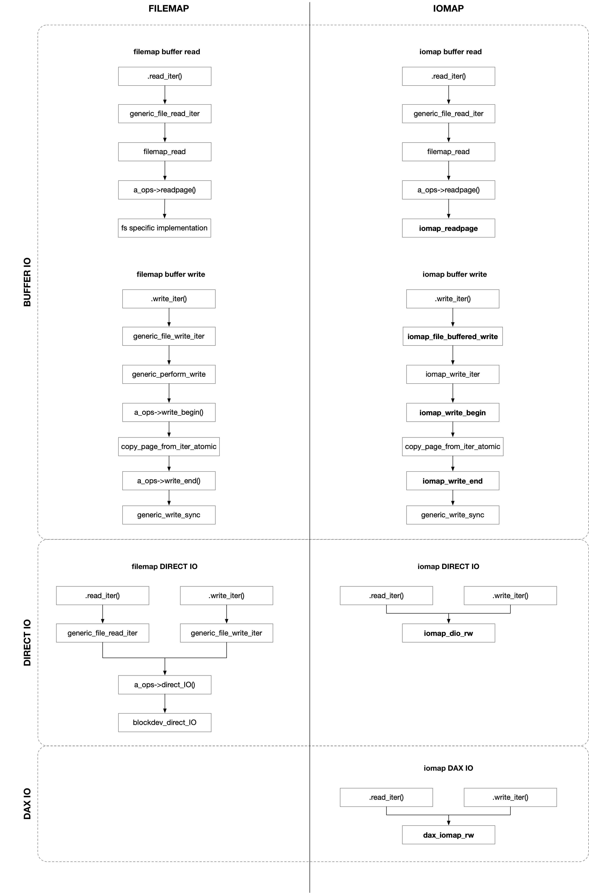

title:'IO - 0 Base'
## IO - 0 Base


read/write 过程主要实现文件数据到用户态缓存之间的传输，VFS 使用 kiocb 来描述文件的位置，iov_iter 来描述用户态缓存的位置

### kiocb

struct kiocb (IO control block) 用于封装一次文件系统的 IO 操作，描述了需要执行 IO 操作的数据在文件中的位置，即往 @ki_filp 文件的 @ki_pos 偏移处开始，执行相应的 IO 操作

```c
struct kiocb {
	struct file		*ki_filp;
	loff_t			ki_pos;
	
	void (*ki_complete)(struct kiocb *iocb, long ret, long ret2);
	void			*private;
	int			ki_flags;
	u16			ki_hint;
	u16			ki_ioprio; /* See linux/ioprio.h */
};
```


> ki_flags

@ki_flags 描述本次 IO 操作的类型

```c
#define IOCB_EVENTFD		(1 << 0)
#define IOCB_APPEND		(1 << 1)
#define IOCB_DIRECT		(1 << 2)
#define IOCB_HIPRI		(1 << 3)
#define IOCB_DSYNC		(1 << 4)
#define IOCB_SYNC		(1 << 5)
#define IOCB_WRITE		(1 << 6)
#define IOCB_NOWAIT		(1 << 7)
```

@ki_flags 通常来自 iocb_flags(filp)

- 若 filp->f_flags 包含 O_APPEND 标志，则 @ki_flags 设置有 IOCB_APPEND
- 若 filp->f_flags 包含 O_DIRECT 标志，则 @ki_flags 设置有 IOCB_DIRECT
- 若 filp->f_flags 包含 O_DSYNC  标志，则 @ki_flags 设置有 IOCB_DSYNC
- 若 filp->f_flags 包含 __O_SYNC 标志，则 @ki_flags 设置有 IOCB_SYNC


> ki_complete

@ki_complete() 回调函数通常用于描述当前的 IO 操作是同步还是异步的

同步 IO 其 @ki_complete() 字段为 NULL，异步 IO 则必须设置该字段，当 kiocb 完成时就会调用 @ki_complete() 回调函数

```c
void (*ki_complete)(struct kiocb *iocb, long ret, long ret2);
```

@ret 参数描述这个 kiocb 成功执行的数据量，@ret2 通常是 reserved 的，通常为 0


### iov_iter

read/write syscall 会将用户传入的一个 user buffer 封装为一个 struct iovec

```c
struct iovec
{
	void __user *iov_base;	/* BSD uses caddr_t (1003.1g requires void *) */
	__kernel_size_t iov_len; /* Must be size_t (1003.1g) */
};
```


struct iov_iter 用于描述一组 iovec，实际描述了用户态地址空间的一组缓存

```c
struct iov_iter {
	int type;
	size_t iov_offset;
	size_t count;
	
	union {
		const struct iovec *iov;
		const struct kvec *kvec;
		const struct bio_vec *bvec;
	};
	
	unsigned long nr_segs;
};
```

@type 描述当前操作的类型，即 READ / WRITE

@iov 字段指向一个 iovec 数组，@nr_segs 描述该数组的大小即数组中 iovec 的数量，@count 描述该 iovec 数组中所有 iovec 描述的需要执行的数据量之和

需要注意的是 @iov 实际指向剩余需要处理的 iovec，以上这三个字段都会随着数据的处理而更新（但是每个 iovec 的 @iov_len 字段不会随着数据的处理而更新）

@iov_offset 描述当前剩余需要处理的数据在 @iov 指向的这个 iovec 中的偏移

需要注意的是单个 iovec 是 multi-page 的，即大小可以超过 PAGE_SIZE

```
+-------+   +-------+               +-------+   +-------+
|       |   |       |               |#######|   |#######|
|       |   |#######| < @iov_offset |#######|   |#######|    
|       |   |#######|               |#######|   |#######|
|       |   |#######|               |#######|   |#######|
+-------+   +-------+               +-------+   +-------+   ...
               @iov
            <------------- @nr_segs/@count ------------->
```


#### iterate_iovec

```c
iterate_iovec(struct iov_iter *i, int n, 
              struct iovec __v, struct iovec *__p, 
              int skip, STEP)
```

iterate_iovec() 用于遍历 @iter->iov 头部开始，忽略起始的 @skip 字节之后，往后 @n 字节范围内的所有 iovec

```
<----------- @iov_len ------------>
<- @iov_offset ->
+---------------------------------+  +--------------------------------+
|                #################|  |################################|
+---------------------------------+  +--------------------------------+
@iter->iov[0]                        @iter->iov[1]

<- @skip -><------------------------ @n ------------------------------>
```

这里需要注意的是，@iter->iov_offset 描述了当前剩余需要处理的数据在 @iter->iov 即当前 iovec 中的偏移，但是 iterate_iovec() 中的 @skip 是从 @iter->iov 头部开始计算的，并不会考虑 @iter->iov_offset


在遍历该范围内的 iovec 的过程中，@__v 用于描述当前一轮遍历的 iovec

```
+---------------------------------+  +--------------------------------+
|                #################|  |################################|
+---------------------------------+  +--------------------------------+
@iter->iov[0]                        @iter->iov[1]

                 @__v of 1st round   @__v of 2nd round
                 <--- @iov_len --->  <------------ @iov_len ---------->
```


对于该范围内的每个 iovec 调用 STEP 处理当前 @__v 描述的 iovec 的数据，STEP 返回该 @__v iovec 中剩余未处理的数据量

```
+---------------------------------+
|                #################|
+---------------------------------+
@iter->iov[0]

                 @__v
                 <--- @iov_len --->

                             left returned by STEP
                 <----------><---->
                 used in STEP
```


最终 @__p 会返回最后一个遍历的 iovec


> routine

首先从 @iter->iov 字段获取一个 iovec，(@iov_len - @skip) 是当前这个 iovec 包含的数据量


1. 如果 @n 刚好等于 (@iov_len - @skip)

此时 @__v 如下图所示，同时 iterate_iovec 返回后 @__p 就指向当前的这个 iovec

```
<----------- @iov_len ------------>
<- @iov_offset ->
+---------------------------------+
|                                 |
+---------------------------------+
@iter->iov[0]

<- @skip -><-------- @n ---------->

           @__v.iov_len = @iov_len - @skip
           <---------------------->
           ^
           @__v.iov_base

```


2. 如果 @n 小于 (@iov_len - @skip)

此时 @__v 如下图所示，同时 iterate_iovec 返回后 @__p 就指向当前的这个 iovec

```
<----------- @iov_len ------------>
<- @iov_offset ->
+---------------------------------+
|                                 |
+---------------------------------+
@iter->iov[0]

<- @skip -><---- @n ---->

           @__v.iov_len = @n
           <------------>
           ^
           @__v.iov_base

```


3. 如果 @n 大于 (@iov_len - @skip)

此时 @__v 如下图所示，同时 iterate_iovec 返回后 @__p 指向最后一个处理的 iovec


```
<----------- @iov_len ------------>
<- @iov_offset ->
+---------------------------------+  +--------------------------------+
|                                 |  |                                |
+---------------------------------+  +--------------------------------+
@iter->iov[0]                        @iter->iov[1]

<- @skip -><------------------ @n ------------------->

           @__v of 1st round         @__v of 2nd round
           <---------------------->  <--------------->
    @__v.iov_len = @iov_len - @skip  @__v.iov_len = remained in @n
```


#### iterate_all_kinds

以上描述的 iterate_iovec() 只用于遍历 iovec，此外类似的接口还有 iterate_bvec()/iterate_kvec()

同时还提供一个通用的接口 iterate_all_kinds()，传入的 @I/B/K 依次对应于 iovec/kvec/bvec 使用的 STEP

```c
iterate_all_kinds(struct iov_iter *i, int n, struct iovec v, I, B, K)
```

iterate_all_kinds() 中会根据 @iter->type 判断当前处理的 iovec 的类型，再调用该类型对应的接口进行遍历操作

```sh
iterate_all_kinds
    size_t skip = i->iov_offset
    iterate_iovec(i, n, v, iov, skip, (I))
```


#### iterate_and_advance

以上描述的 iterate_iovec()/iterate_all_kinds() 只是会遍历该范围内的 iovec，对于其中的每个 iovec 调用 STEP，但是这一过程中并不会改变传入的 iov_iter，即传入的 iov_iter 的值不会有任何变化

而 iterate_and_advance() 则是遍历 iovec 的同时，随着遍历的进行，传入的 iov_iter 的位置会跟着往后移动

```c
iterate_and_advance(struct iov_iter *i, int n, struct iovec v, I, B, K)
```

iterate_and_advance() 实际就依赖于 iterate_iovec() 实现

```sh
iterate_and_advance
    size_t skip = i->iov_offset
    iterate_iovec(i, n, v, iov, skip, (I))
```


### Routine

read()/write() 系统调用过程中，VFS 在将传入的参数封装为 kiocb、iov_iter 结构之后，就调用对应的 f_op->write_iter()/read_iter() 完成具体的 IO 操作

- read

```sh
sys_read
    ksys_read
        vfs_read
            new_sync_read
                // init kiocb and iov_iter
                f_op->read_iter(kiocb, iov_iter), e.g., ext4_file_read_iter()
```

- write

```sh
sys_write
    ksys_write
        vfs_write
            new_sync_write
                // init kiocb and iov_iter
                f_op->write_iter(kiocb, iov_iter), e.g., ext4_file_write_iter()
```


值得一提的是，在旧版本的内核中通常是调用 f_op 的 read()/write() 回调函数完成具体的 IO 操作

在引入 iov_iter 接口之后，内核在 v3.16 的 commit 293bc9822fa9 ("new methods: ->read_iter() and ->write_iter()") 引入了 read_iter()/write_iter() 回调函数


