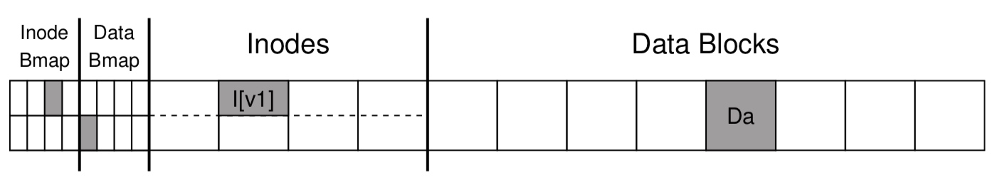
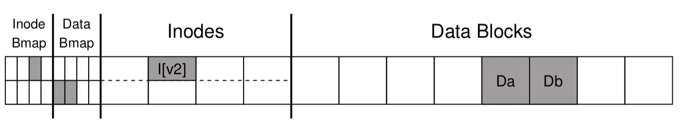
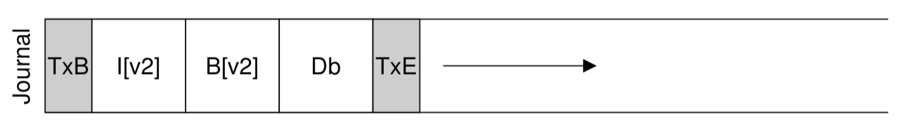
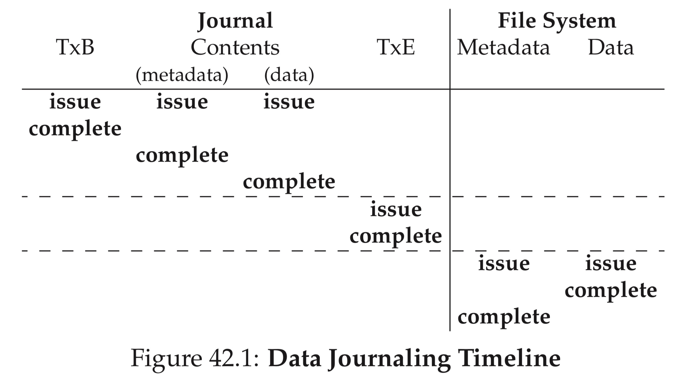
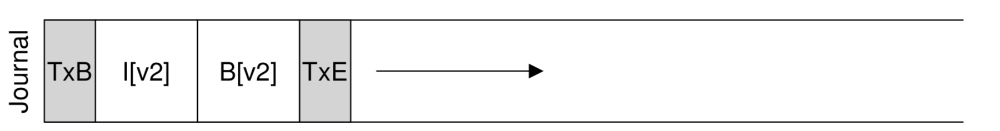
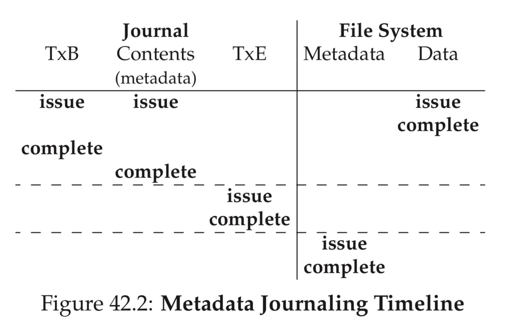

## Journaling

### Introduction

文件系统的一个操作往往会涉及对多个 block 的修改，以 append write 为例，假设文件在 append write 之前只占用一个 data block

append write 新写入一个 data block

此时这个 append write 需要修改以下 block

- data block
- inode 所在的 inode table block
- inode 对应的 data bitmap block

假设在其中的一个 block 修改完成之后，在所有 block 修改完成之前，系统发生断电或 crash，那么此时文件系统就会处于一种不一致的状态

- 假设 data block 修改完成之后系统即发生 crash，此时虽然文件系统的元数据保持一致，但是修改的数据会丢失
- 假设 inode table block 或 data bitmap block 修改完成之后系统即发生 crash，此时文件系统的元数据就会处于不一致的状态

通常有两种办法解决这种因为系统突然断电或 crash 可能造成的文件系统不一致的状态

一种就是使用 fsck 工具，如果系统发生突然断电或 crash，在文件系统重新挂载之前需要使用 fsck 工具扫描整个文件系统的元数据，以找出其中不一致的地方。但是由于 fsck 需要全量扫描整个文件系统，fsck 检查需要耗费的时间与文件系统当容量呈线性关系，在磁盘容量迅速增长的当下，fsck 的时间可以达到几个小时，甚至是数日

仔细分析这种场景我们会发现，当系统发生断电或者 crash 的时候，文件系统中没有完成会写的 block 的数量往往是有限的，而 fsck 却使用全量扫描整个文件系统的方式来找出这几个 block，未免有些“杀鸡用牛刀”的感觉

借鉴于数据库的日志系统，后来文件系统使用一种称为 "Journaling" 的技术来保证这种场景下文件系统的一致性，其原理是在文件系统操作中，在回写 block 之前，将这些需要回写的 block  先回写到一块专门的磁盘区域（journal）中，这一步操作称为 "commit"。在这些 block 成功写入 journal 之后，再将这些 block 回写到文件系统中，这样 journal 相当于维护了一份这些 block 的备份。在这些 block 成功写入文件系统之后，再将这些 block 的备份从 journal 中移除，这一步操作称为 "checkpoint"。

文件系统重新挂载的时候会扫描 journal 区域，此时 journal 中记录的所有备份，就是那些因为系统突然断电或 crash 而中断的 block，此时在系统挂载之前会根据这些备份，重新将这些 block 回写到文件系统，这一步操作称为 "restore"

### Data Journaling

在开启 journal 时，一个文件系统操作需要向 journal 写入一个 log record，其中包含了该文件系统操作涉及的多个 block 的备份

值得注意的是，log record 中除了 data/metadata block 的备份，首尾各有两个 block 以标识一个 log record 的首尾

为了保证 log record 本身的一致性，一个 log record 的起始 TxB block 以及 data/metadata block 成功写入 journal 之后，才能将末尾的 TxE block 写入 journal。这样末尾的 TxE block 可以确保其所在的 log record 的一致性，如果将一个 log record 回写到 journal 的过程中，在末尾的 TxE block 还没有写入 journal 的时候系统发生断电或 crash，那么在系统重启之后文件系统重新挂载的时候，检查到这个 log record 没有尾部的 TxE block，说明这个 log record 本身的一致性无法保证，那么此时就不会对这个 log record 执行 restore 操作

以之前的 append write 为例，其 log record 中就包含了一个 data block 与两个 metadata block 的备份

此时 log record 中包含了 data block 的备份，这种模式称为 data journaling，在该模式下，在整个 log record 成功写入 journal 之后，才能将 data/metadata block 回写到文件系统中

ext4 中 data=journal 相当于是 data journaling 模式，这种模式下可以保证文件系统元数据的一致性，以及 data block 的有效性

### Metdata Journaling

data journaling 模式下存在写放大的现象，即每次 write 操作都会产生两倍的写 IO 量，这是因为同一个 data block 需要先后写入 journal 与文件系统

为了解决这一问题，文件系统可以工作在 metadata journaling 模式下，此时 log record 中只包含 medata block，而不包含 data block

但是此时需要注意的是，data block 回写到文件系统的顺序会影响文件系统的一致性，这也导致了 metadata journaling 也可以拆分为多个子模式

#### mode 1

由于 log record 成功回写到 journal 之后，才能将 metadata block 回写到文件系统，那么假设当 metadata block 成功回写到文件系统的时候，对应的 data block 还没有成功写入文件系统，那么此时对该文件执行 read 操作，读取的实际是 garbage data

ext4 中 data=writeback 相当于这种模式，这种模式下仅仅是保证文件系统元数据的一致性，而不能保证 data block 的有效性

#### mode 2

而为了确保 data block 的有效性，必须对 log record 与 data block 回写的时序进行限制，即等待 data block 成功写入文件系统之后，才能将 log record 写入 journal

#### mode 3

mode 2 中等待 data block 成功写入文件系统的操作会对文件系统的性能产生很大影响，因而可以放松这一时序限制，在 data block 开始写入文件系统的时候，log record 可以同时开始写入 journal

ext4 中 data=ordered 相当于这种模式
