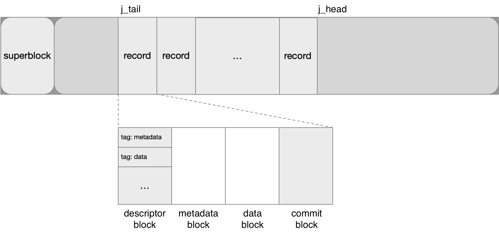
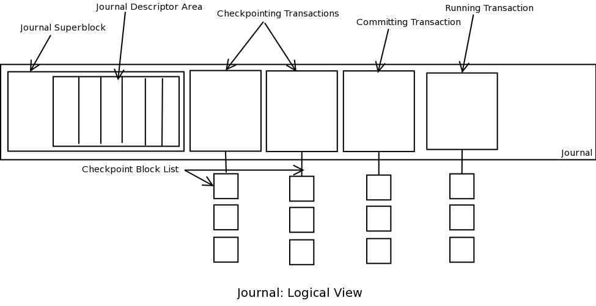
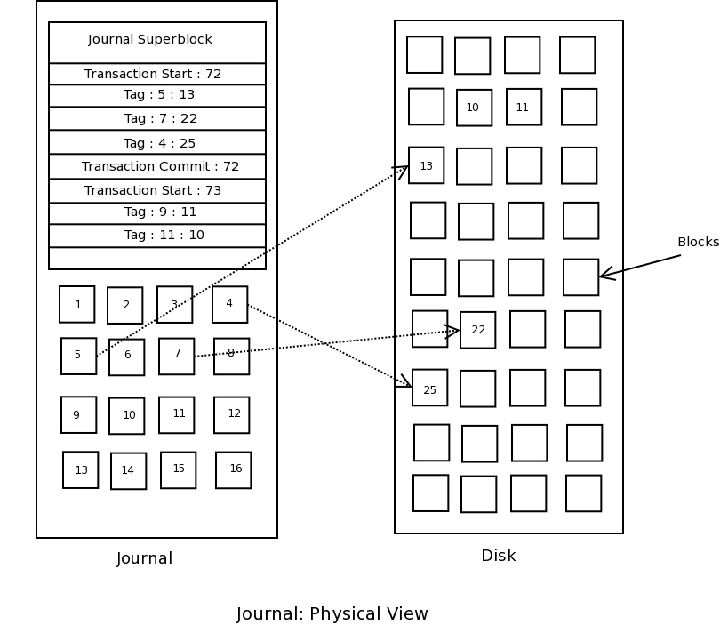
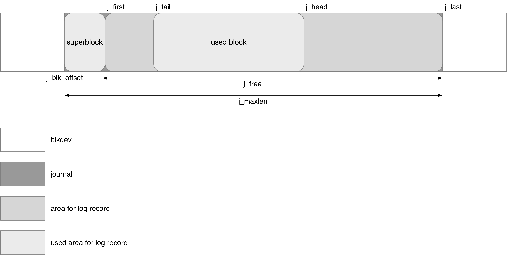
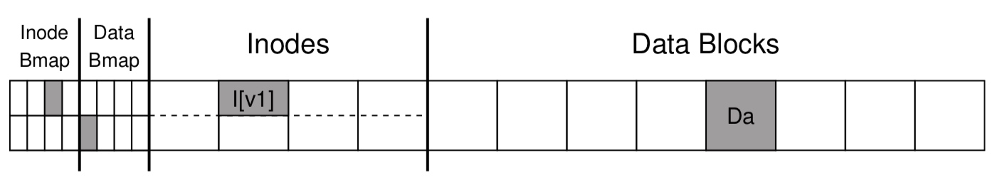
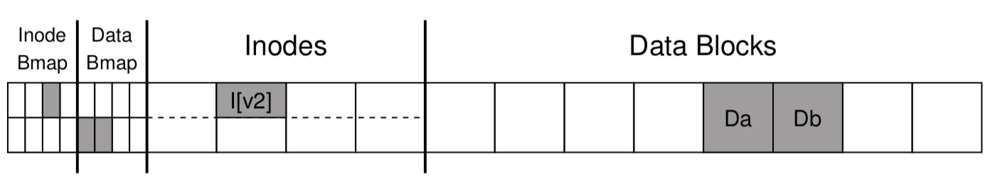
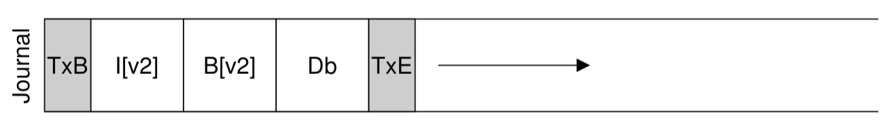

## JBD2 - Spec

### Disk Layout

journal 的第一个 block 用于存储 superblock，其余的所有 block 组成一个循环缓冲区用于存储一条条的 log record


log record 通常包含以下几个部分

- data block、metadata block，即当前操作修改的 data block、metadata block 的备份
- descriptor block，其实际作为一个 tag 数组，其中的每个 tag 都描述 journal 中备份的 data/metadata block 与实际文件系统 blkdev 中 data/metadata block 的映射关系
- commit block 用于标记一个 record 的结尾






#### block header

在 journal 中实际存储有两类 block

- data/metadata block 这类存储有文件系统数据的 block
- superblock、descriptor block、commit block 这类存储 journal 元数据的 block

对于后者这类 block，在 block 的开头存储一个 struct journal_header_s 结构，以标识当前 block 的类别，即标识当前 block 用于存储 journal 的元数据

```c
/*
 * Standard header for all descriptor blocks:
 */
typedef struct journal_header_s
{
	__be32		h_magic;
	__be32		h_blocktype;
	__be32		h_sequence;
} journal_header_t;
```

@h_magic 存储 journal 的 magic number，即 JBD2_MAGIC_NUMBER 即 0xc03b3998U

@h_blocktype 标识当前 block 用于存储哪种元数据

```c
#define JBD2_DESCRIPTOR_BLOCK 1
#define JBD2_COMMIT_BLOCK	2
#define JBD2_SUPERBLOCK_V1 3
#define JBD2_SUPERBLOCK_V2 4
#define JBD2_REVOKE_BLOCK	5
```

例如 descriptor block 的 @h_blocktype 字段的值即为 JBD2_DESCRIPTOR_BLOCK


#### superblock

journal 起始的第一个 block 用于存储 superblock

```c
/*
 * The journal superblock.  All fields are in big-endian byte order.
 */
typedef struct journal_superblock_s
{
/* 0x0000 */
	journal_header_t s_header;

/* 0x000C */
	/* Static information describing the journal */
	__be32	s_blocksize;		/* journal device blocksize */
	__be32	s_maxlen;		/* total blocks in journal file */
	__be32	s_first;		/* first block of log information */

/* 0x0018 */
	/* Dynamic information describing the current state of the log */
	__be32	s_sequence;		/* first commit ID expected in log */
	__be32	s_start;		/* blocknr of start of log */

/* 0x0020 */
	/* Error value, as set by jbd2_journal_abort(). */
	__be32	s_errno;

/* 0x0024 */
	/* Remaining fields are only valid in a version-2 superblock */
	__be32	s_feature_compat;	/* compatible feature set */
	__be32	s_feature_incompat;	/* incompatible feature set */
	__be32	s_feature_ro_compat;	/* readonly-compatible feature set */
/* 0x0030 */
	__u8	s_uuid[16];		/* 128-bit uuid for journal */

/* 0x0040 */
	__be32	s_nr_users;		/* Nr of filesystems sharing log */

	__be32	s_dynsuper;		/* Blocknr of dynamic superblock copy*/

/* 0x0048 */
	__be32	s_max_transaction;	/* Limit of journal blocks per trans.*/
	__be32	s_max_trans_data;	/* Limit of data blocks per trans. */

/* 0x0050 */
	__u8	s_checksum_type;	/* checksum type */
	__u8	s_padding2[3];
	__u32	s_padding[42];
	__be32	s_checksum;		/* crc32c(superblock) */

/* 0x0100 */
	__u8	s_users[16*48];		/* ids of all fs'es sharing the log */
/* 0x0400 */
} journal_superblock_t;
```

@s_maxlen 描述该 journal 的大小，以 block 为单位

@s_first 描述 journal 中第一个可用的 block 的 logical block number，由于 journal 中的第一个 block 即 block 0 被 superblock 占用，因而该字段的初始值为 1 即 block 1


#### descriptor block

每个 record 的起始都有且只有一个 block 用于 descriptor block

descriptor block 实际用于存储 tag 数组，其中的每个 tag 都描述 journal 中备份的 data/metadata block 与实际 disk 中 data/metadata block 的映射关系

```c
typedef struct journal_block_tag_s
{
	__be32		t_blocknr;	/* The on-disk block number */
	__be16		t_checksum;	/* truncated crc32c(uuid+seq+block) */
	__be16		t_flags;	/* See below */
	__be32		t_blocknr_high; /* most-significant high 32bits. */
} journal_block_tag_t;
```

例如对于 descriptor block 中的第 n 个 tag，其描述了当前的 record 中，在该 descriptor block 之后的第 n 个 metadata block 或 data block，对应的在 disk 中的 block number 为 @t_blocknr/t_blocknr_high




#### commit block

每个 record 的最后都有一个 commit block 以标记 record 的结尾，commit block 实际上就只存储了一个 struct journal_header_s 结构


### Concept

#### journal size

mkfs 过程中，当 has_journal 特性开启时，需要为文件系统分配 journal

journal 可以是在外部的另一个 blkdev 上，也可以与当前的文件系统处于同一个 blkdev 上

当使用 "mkfs -J device=<external-journal-blkdev>" 参数时，journal 位于外部的 blkdev，否则 journal 与文件系统处于同一个 blkdev 上


当 journal 与文件系统处于同一个 blkdev 上时，会根据文件系统的大小，按照比例计算 journal 的大小

file system size | journal size
---- | ----
(0, 128MB) | 4MB
[128 MB, 1 GB) | 16 MB
[1 GB, 2 GB) | 32 MB
[2 GB, 16 GB) | 64 MB
[16 GB, 32 GB) | 128 MB
[32 GB, 64 GB) | 256 MB
[64 GB, 128 GB) | 512 MB
[128 GB, ) | 1 GB

mkfs 的时候也可以通过 "-J size=<journal-size>" 参数指定 journal 的大小，单位为 MB


ext4 中使用一个 inode 来管理 journal 占用的所有 block，这个 inode 也称为 journal inode，其 inode number 通常为 EXT2_JOURNAL_INO 即 8

ext4 superblock 的 @s_journal_inum 字段保存 journal inode 的 inode number

```c
struct ext4_super_block {
	__le32	s_journal_inum; /* inode number of journal file */
	...
}
```


#### journal_s

struct journal_s 实际为 memory superblock

##### journal location

```c
struct journal_s
{
	/**
	 * @j_dev: Device where we store the journal.
	 */
	struct block_device	*j_dev;

	/**
	 * @j_fs_dev:
	 *
	 * Device which holds the client fs.  For internal journal this will be
	 * equal to j_dev.
	 */
	struct block_device	*j_fs_dev;

	/**
	 * @j_blk_offset:
	 *
	 * Starting block offset into the device where we store the journal.
	 */
	unsigned long long	j_blk_offset;

	/**
	 * @j_maxlen: Total maximum capacity of the journal region on disk.
	 */
	unsigned int		j_maxlen;

	/**
	 * @j_blocksize: Block size for the location where we store the journal.
	 */
	int			j_blocksize;
	...
}
```

@j_fs_dev 描述该 journal 服务的文件系统对应的 blkdev

@j_dev 描述该 journal 对应的 blkdev，对于 external journal blkdev 形式的 journal，该字段就指向 external journal blkdev；而对于 journal inode 形式的 journal，该字段实际上就是 @j_fs_dev 的值


@j_blk_offset 描述该 journal 在 @j_dev blkdev 中的起始 block number
@j_maxlen 描述该 journal 的大小，以 block 为单位
@j_blocksize 描述该 journal 所在的 blkdev 的 block size


##### log record ring buffer

journal 的第一个 block 用于存储 superblock，其余的所有 block 组成一个循环缓冲区用于存储一条条的 log record



```c
struct journal_s
{

	/**
	 * Journal head: identifies the first unused block in the journal.
	 */
	unsigned long		j_head;

	/**
	 * Journal tail: identifies the oldest still-used block in the journal.
	 */
	unsigned long		j_tail;

	/**
	 * @j_free:
	 *
	 * Journal free: how many free blocks are there in the journal?
	 * [j_state_lock]
	 */
	unsigned long		j_free;

	/**
	 * @j_first:
	 *
	 * The block number of the first usable block in the journal
	 * [j_state_lock].
	 */
	unsigned long		j_first;

	/**
	 * @j_last:
	 *
	 * The block number one beyond the last usable block in the journal
	 * [j_state_lock].
	 */
	unsigned long		j_last;
	...
}
```

@j_first 描述 journal 中第一个可用的 block number，其值来源于 disk superblock 的 @s_first 字段，通常为 1

@j_last 描述 journal 中最后一个 block number 再加 1，其值来源于 disk superblock 的 @s_maxlen 字段

@j_first/@j_last 这两个字段描述了 journal 中的 log record 循环缓冲区的位置，文件系统初始化完成后这两个字段的值就会固定下来


@j_head 就是该循环缓冲区的 head 指针，指向第一个可用（即 free 状态）的 block
@j_tail 就是该循环缓冲区的 tail 指针，指向最后一个被占用的 block

@j_head = @j_tail 时表示缓冲区空，在初始化时 @j_head/@j_tail 都被初始化为 @j_first

@j_free 描述缓冲区中剩余可用（即 free 状态）的 block 的数量

@j_head/@j_tail/@j_free 这三个字段描述了 log record 循环缓冲区的状态，这些字段的值是动态变化的

```c
/**
 * typedef journal_t - The journal_t maintains all of the journaling state information for a single filesystem.
 *
 * journal_t is linked to from the fs superblock structure.
 *
 * We use the journal_t to keep track of all outstanding transaction
 * activity on the filesystem, and to manage the state of the log
 * writing process.
 *
 * This is an opaque datatype.
 **/
typedef struct journal_s	journal_t /* Journal control structure */
```


#### handle

文件系统层面的一个操作可能会引起多个 block 的修改，而为了保证文件系统的一致性，同一个操作引起的对多个 block 的修改必须是 atomic 的，将文件系统层面的一个操作引起的多个 block 的修改称为是 atomic operation handle

以 append write 为例，假设文件在 append write 之前只占用一个 data block



append write 新写入一个 data block



此时这个 append write 需要修改以下 block

- data block
- inode 所在的 inode table block
- inode 对应的 data bitmap block


此时 journal 中需要备份两个 metadata block 和一个 data block



这里的两个 metadata block 和一个 data block 合起来就是一个 handle


#### transaction

为了提升 blk IO 的效率，jbd 会将多个 handle 组成一个 transaction，这样同一个 transaction 中 handle 修改的所有 block 会连续地存储在 journal 上

由于 jbd2 线程会周期性地将当前积累的所有 handle 修改的 block 下刷到 journal 中，因而在一个周期内提交的所有 handle 就会构成一个 transaction


#### log record

一个 transaction 中的所有 data block、metadata block 加上 descriptor block、commit block 构成了一个 log record，一个 log record 包含以下几个部分

- descriptor block
- 当前操作修改的 data block、metadata block 的备份，上例 append write 中就是两个 metadata block 和一个 data block
- commit block 标识一个 record 的结尾
