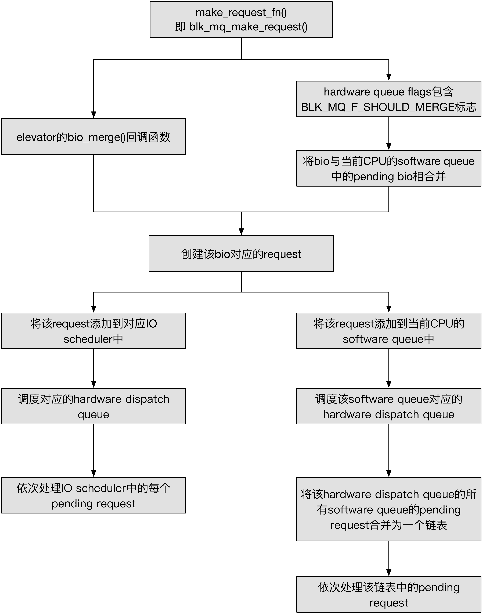

## Block - 9 MQ Routine


### Concept

#### introduction

multiqueue 框架下也可以维护 IO scheduler request queue，但不是必需的，因为 IO scheduler 的其中一个重要的作用是对 IO request 进行排序，这种特性对于提升磁盘的性能至关重要，但是维护有多个 hardware queue 的设备例如 nvme 设备，其存储介质通常是 flash，，这些设备的乱序 IO 性能并不会有太大的衰减，因而抛弃 IO scheduler 反而可以省却 IO scheduler 本身带来的开销


#### queue hierarchy

在 multiqueue 机制下，不考虑 IO scheduler 的情况下，整个 queue hierarchy 从上到下依次有

- per-CPU software queue
- hardware dispatch queue

> software queue

```c
struct blk_mq_ctx {
	struct list_head	rq_list;
	...
};
```

> hardware dispatch queue

```c
struct blk_mq_hw_ctx {
	struct list_head	dispatch;
	...
}
```


### Routine



multiqueue 框架下，当不实现 IO scheduler 时，generic block layer 下发的 IO request 首先被添加到 software queue，之后唤醒当前 CPU 对应的 hardware dispatch queue 的 run_work work thread，此时 run_work work thread 会将该 hardware dispatch queue 对应的所有 software queue 的 pending request 链表合并为一个链表，之后调用 multiqueue ops 的 queue_rq() 回调函数，依次将合并后链表中的 request 传递给对应的 blkdev driver 处理

run_work work thread 在将该 hardware dispatch queue 对应的所有 software queue 的 pending request 链表合并为一个链表的过程中，并不会对 request 进行排序，而只是简单地将各个 CPU 对应的 software queue 的 request 链表进行拼接，因而合并后的链表中的 request 实际上是乱序的，即没有按照 sector number 进行排序，这是因为不使用 IO scheduler 的情况主要适用于 SSD device，这些设备的乱序访问与顺序访问具有相似的性能，因而不需要对 IO request 进行排序


#### init

multiqueue 框架下，blkdev driver 中通常执行以下逻辑以初始化 request queue

```c
/* tagset init */
tagset.nr_hw_queues = 
tagset.queue_depth =
blk_mq_alloc_tag_set(tagset)
    
/* request queue init */
queue = blk_mq_init_queue(tagset);
blk_queue_logical_block_size(queue, ...);
   	
/* gendisk init */
disk = alloc_disk_node(0, node);
disk->queue = queue;
device_add_disk(device, disk);
...
```


#### enqueue

##### entry point

multiqueue routine 的 entry point 为 blk_mq_make_request()

generic block layer 将 VFS 的 IO 请求封装为一个 bio 之后，会调用 request queue 的 make_request_fn() 回调函数将该 bio 添加到对应的 request queue 中

multiqueue 框架下的 make_request_fn()回调函数即为 blk_mq_make_request()


##### bio split

一个 bio 可能包含多个 segment，如果底层的 blkdev driver 不支持 SG (scatter-gather) 特性，那么需要将这个 bio 拆分为多个 bio，使得每个 bio 只包含一个 segment

blk_queue_split() 中完成该操作


##### bio merge

bio enqueue 时，会首先尝试将该 bio 与当前 CPU 对应的 software queue 中的 pending request 合并，其中会从 @rq_list 链表尾部的 pending request 开始，同时最多只检查 8 个 pending request

若 bio 能够与 software queue 中的一个 pending request 相合并，则合并之后直接返回到 generic block layer


##### alloc request

若 bio 不能够与 software queue 中的 pending request 相合并，则需要为该 bio 分配一个新的 request，其中会从当前 CPU 的 software queue 对应的 hardware dispatch queue 的 tag map 中为需要分配的 request 分配一个 tag，之后根据分配的 tag 在 tag map 的 static request array 中获取事先分配好的 struct request 结构

blk_mq_get_request() 中完成该操作


##### process sync request directly

若当前处理的是 sync IO request（即 read 或 sync write），同时设备的 hardware queue 的数量大于 1，则可以在当前 process context 下直接调用 multiqueue ops 的 queue_rq() 回调函数，将该 request 传递给对应的 blkdev driver 处理

若 queue_rq() 回调函数返回直接处理失败，则将该 request 直接添加到当前 CPU 对应的 hardware dispatch queue 中，等待之后的 worker thread 处理


##### request enqueue

否则将该 request 添加到当前 CPU 的 software queue 的尾部，同时在该 CPU 对应的 hardware dispatch queue 的 ctx_map bitmap 中，将该 CPU 对应的 bit 置为 1，以表示该 CPU 上的 software queue 存在 pending request 需要处理

之后会调用 blk_mq_run_hw_queue() 调度 worker thread 处理 hardware dispatch queue 以及 software queue 中的 pending request


#### dequeue

multiqueue 框架依赖于 workqueue 机制，由 worker thread 将 hardware dispatch queue 以及 software queue 中的 pending request 异步地下发给 blkdev driver

```c
int __init blk_dev_init(void)
{
	/* used for unplugging and affects IO latency/throughput - HIGHPRI */
	kblockd_workqueue = alloc_workqueue("kblockd",
					    WQ_MEM_RECLAIM | WQ_HIGHPRI, 0);
	...
}
```

block subsystem 初始化时会初始化 "kblockd" workqueue


request enqueue 的时候，会将该 request 添加到当前 CPU 的 software queue 中，同时向 kblockd workqueue 添加一个 work，其中调度 worker thread 处理该 CPU 对应的 hardware dispatch queue 的所有 pending request


worker thread 的 work function 为 blk_mq_run_work_fn()，其中若 hardware dispatch queue 的 @dispatch 链表非空，即上一轮 dispatch 的 request 还没有处理完，则优先处理这些 request；否则将 hardware dispatch queue 的 @ctx_map bitmap 中标记的存在 pending request 需要处理的所有 software queue 中的所有 pending request 合并为一个链表，之后处理该链表中的 request

在处理这些 request 的过程中，worker thread 实际调用 multiqueue ops 的 queue_rq() 回调函数，将 request 传递给对应的 block device 处理

若最后 blkdev driver 的处理能力达到上限而导致仍有残余 pending request 不能下发，则将残余的 pending request 保存回到 hardware dispatch queue 的 dispatch 链表中，并再次向 kblockd workqueue 添加一个 work，以期待之后再一次调度 worker thread 处理剩余的 pending request


#### completion

当 blkdev driver 完成 request 的数据传输任务时，会调用 blk_mq_end_request() 以通知 generic block layer 当前已经完成该 request 的数据传输任务


对于 blk_mq_ops 中定义有 complete() 回调函数的 blkdev driver 来说，

```
blk_mq_complete_request
    queue->softirq_done_fn, that is, mq_ops->complete()
        blk_mq_end_request
```

```
blk_mq_end_request   
    
    blk_update_request
        blk_account_io_completion
        req->__data_len = 0

    __blk_mq_end_request
        blk_account_io_done
```

与 single-queue 中的 blk_end_request() 接口不同，调用 blk_end_request() 的时候 request 可能处于 partial complete 的状态，因而对于同一个 request 可能多次调用 blk_update_request()

而调用 blk_mq_end_request() 的时候，request 不存在 partial complete 的情况，因而每个 request 都只会调用一次 blk_update_request()


每次调用 blk_update_request() 的时候，都会对完成的 bio 调用 bio_endio()，其中调用 @bio->bi_end_io() 回调函数以通知上层当前已经完成该 bio 的数据传输

而在最后调用 blk_account_io_done() 的时候，会调用 request->end_io() 回调函数


