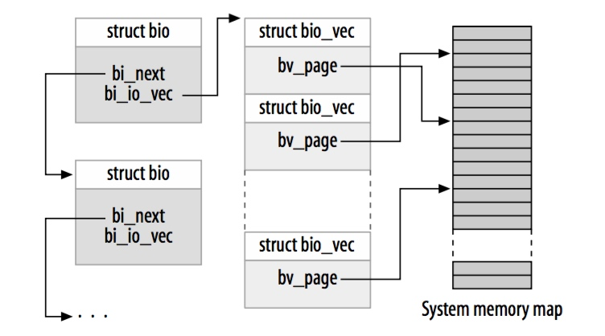

title:'Block - 5 Request'
## Block - 5 Request

### introduction

bio 用于描述上层的一次 IO 操作，而在 HDD 年代，如果上层下发一个 bio 请求，块设备驱动就立即执行这个 bio 的话，其代价是巨大的。这是因为由于磁盘自身的机械结构的限制，在完成 IO 的过程中，磁头的寻道时间占据了大部分的耗时；因而如果将多个小的 IO 聚合成一个大的 IO，这样就可以大大减小磁头寻道时间的占比，从而提升设备的 IO 性能

block layer 就使用 struct request 来抽象这一概念，physical sector number 相连续的多个 bio 可以合并为一个 request


虽然 request 的概念最初来自 HDD 年代，但是来到 SDD 年代，request 的概念仍然保留了下来，虽然 SSD 不再像 HDD 那样需要磁头的寻道时间，其随机访问的 IOPS 也与顺序访问时的 IOPS 相差无几，但是如果将多个 sector range 相邻的 bio 合并为一个 request，对 SSD 设备的 IO 性能仍然是有益的，毕竟这一过程中只需要检查新下发的 bio 是否能与当前的 pending request 相合并，其付出的只是一些 CPU 开销


### struct request

#### sector range

```c
struct request {
	sector_t __sector;		/* sector cursor */
	unsigned int __data_len; /* total data len */
	...
};
```

之前所述，sector range 相邻的多个 bio 可以合并为一个 request

@__sector 就描述了该 request 处理的 sector range 的起始 sector number，最初来自 bio->bi_iter.bi_sector
@__data_len 描述该 request 处理的 sector range 的大小，最初来自 bio->bi_iter.bi_size


#### bio list

```c
struct request {
	struct bio *bio;
	struct bio *biotail;
	...
};
```

@bio/@biotail 分别描述该 request 包含的 bio 链表中的起始、以及最后一个 bio，bio 通过 @bi_next 字段组成一个链表




#### relation with disk

```c
struct request {
	struct gendisk *rq_disk;
	struct hd_struct *part;
	...
};
```

@rq_disk 描述该 request 对应的 gendisk
@part 描述该 request 对应的 partition


#### flags

```c
struct request {
	unsigned int cmd_flags;	 /* op and common flags */
	req_flags_t rq_flags;
	...
};
```

@cmd_flags 描述该 request 的类型及相关标志位
@rq_flags 则用于描述 request 处理过程中当前的状态，如 RQF_QUEUED 等


### IO type & flags

@bio->bi_opf 与 @rq->cmd_flags 都描述了 IO 的类型以及相关标志位，下文为方便叙述，将这两个标志位统一称为 cmd flags

```c
struct bio {
	unsigned int		bi_opf;
	...
}
```

```c
struct request {
	unsigned int cmd_flags;	 /* op and common flags */
	...
};
```

实际上 @rq->cmd_flags 字段就来自 @bio->bi_opf 字段

```
blk_mq_make_request
    blk_mq_get_request
        blk_mq_rq_ctx_init
            rq->cmd_flags = bio->bi_opf
```


> 3.10

在 3.10 版本，cmd flags 实际存储在 @bio->bi_rw / @rq->cmd_flags 字段中，此时用于描述 IO 类型的 bits，与描述标志位的 bits 实际上是混在一起的，两者并没有明显地划分开来

```c
enum rq_flag_bits {
	/* common flags */
	__REQ_WRITE,		/* not set, read. set, write */
	__REQ_SYNC,		/* request is sync (sync write or read) */
	__REQ_DISCARD,		/* request to discard sectors */
	__REQ_WRITE_SAME,	/* write same block many times */
	__REQ_FUA,		/* forced unit access */
	__REQ_FLUSH,		/* request for cache flush */
	...

	/* bio only flags */
	...

	/* request only flags */
	...
};
```

值得注意的是，此时 READ/WRITE 只占用最低的一个 bit，若 bit 0 被设置，那么为 WRITE，否则为 READ


> 4.9

到了 4.9 版本，cmd flags 就开始存储在 @bio->bi_opf / @rq->cmd_flags 字段中，此时 cmd flags 的高 REQ_OP_BITS 即 3 bits 描述 IO 的类型

```c
enum req_op {
        REQ_OP_READ,
        REQ_OP_WRITE,
        REQ_OP_DISCARD,         /* request to discard sectors */
        REQ_OP_SECURE_ERASE,    /* request to securely erase sectors */
        REQ_OP_WRITE_SAME,      /* write same block many times */
        REQ_OP_FLUSH,           /* request for cache flush */
};
```


cmd flags 的剩余 bits 描述相关标志位

```c
REQ_SYNC
REQ_RAHEAD
REQ_FUA
REQ_SWAP
...
```


> 4.19

到了 4.19 版本，cmd flags 的低 REQ_OP_BITS 即 8 bits 描述 IO 的类型

```c
enum req_opf {
	/* read sectors from the device */
	REQ_OP_READ		= 0,
	/* write sectors to the device */
	REQ_OP_WRITE		= 1,
	/* flush the volatile write cache */
	REQ_OP_FLUSH		= 2,
	/* discard sectors */
	REQ_OP_DISCARD		= 3,
	...
	/* write the same sector many times */
	REQ_OP_WRITE_SAME	= 7,
	/* write the zero filled sector many times */
	REQ_OP_WRITE_ZEROES	= 9,
	...
};
```

cmd flags 的剩余 bits 描述相关标志位

```c
REQ_SYNC
REQ_RAHEAD
REQ_FUA
REQ_SWAP
...
```


