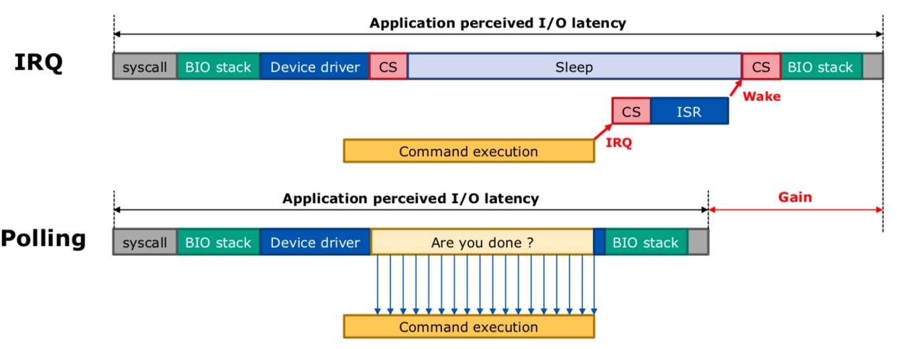
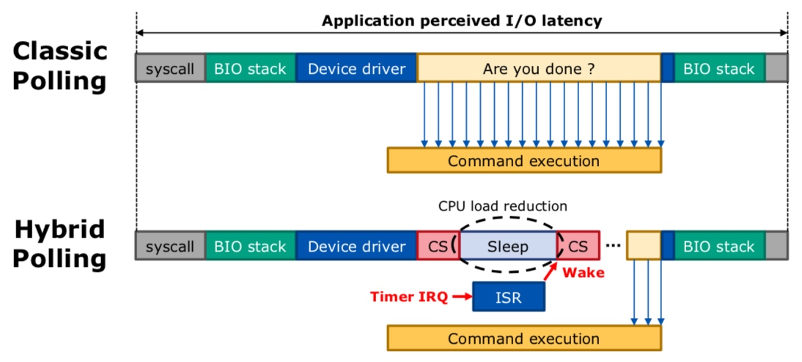

title:'Feature - polling'
## Feature - polling

内核在 v4.4 版本引入 IO polling 特性

### IRQ 

```c
cookie = submit_bio(bio);

for (;;) {
	if (/* check whether bio completed */)
		break;
		
	if (!(iocb->ki_flags & IOCB_HIPRI) || !blk_poll(queue, cookie))
		io_schedule();
}
```

当 polling 未开启时，blk_poll() 会直接返回 false，此时进程调用 io_schedule() 立即进入睡眠状态；之后当 blkdev 设备完成该 bio 时，通过 IRQ 机制通知 blkdev driver，并最终唤醒此处睡眠的进程


### Classic Polling

#### cookie of a request

在调用 submit_bio() 向 generic block layer 提交 bio 的时候，该函数会返回一个 cookie

cookie 是一个 unsigned int，描述了该 bio 对应的 request 在所在的 request queue 中的位置

```
        queue_num                   tag
+-----------------------+-----------------------+
|                       |                       |
+-----------------------+-----------------------+
           16 bit                16 bit
```

cookie = tag | (queue_num << BLK_QC_T_SHIFT)

- 一个 request queue 对应的 blkdev 可能包含有多个 hardware dispatch queue，cookie 的高 16 bit 描述该 bio 对应的 request 所在的 hardware dispatch queue 的编号
- cookie 的低 16 bit 描述该 bio 对应的 request 在其所在的 hardware dispatch queue 中的 tag

#### polling

classic polling 是指，在调用 submit_bio() 向 generic block layer 提交 bio 之后，进入轮询状态一直等待该 bio 处理完成




调用 blk_poll() 实现 classic polling，classic polling 必须设置上 IOCB_HIPRI 标志

```c
cookie = submit_bio(bio);

for (;;) {
	if (/* check whether bio completed */)
		break;
		
	if (!(iocb->ki_flags & IOCB_HIPRI) || !blk_poll(queue, cookie))
		io_schedule();
}
```

```c
int blk_poll(struct request_queue *q, blk_qc_t cookie, bool spin)
```

classic polling 需要底层的 blkdev driver 支持，支持这一特性的 blkdev driver 必须实现 blk_mq_ops 的 poll() 回调函数；当底层的 blkdev driver 实现有 poll() 回调函数时，request queue 的 poll_fn() 回调函数会被设置为 blk_mq_poll()


blk_poll() 中实际调用 blk_mq_poll()，其中就调用 blk_mq_ops 的 poll() 回调函数，持续轮询传入的 cookie 描述的 request 是否已经完成


用户可以通过 `/sys/block/<dev>/queue/io_poll` 控制是否开启 classic polling 特性


需要注意的是，device driver 是以 request 为单位作 polling 操作的，而上层的调用者是以 bio 为单位进行 polling 的，因而就有可能对一个 bio 进行 polling 时，这个 bio 所在的 request 已经通过之前的 polling 操作或通过中断已经完成了，这个时候对这个 bio 进行 polling 操作时，blk_poll() 会立即返回，返回到调用者的大循环中，在这个大循环中在发起新一轮的 blk_poll() 调用之前，调用者需要检查这个 bio 是否已经完成

也就是说在调用 blk_poll() 对 bio 进行 polling 操作的时候，需要检查这个 bio 是否已经完成，这个检查是由 blk_poll() 的调用者执行的，而不是由 blk_poll() 本身执行


### Hybrid Polling

hybrid polling 是指，在调用 submit_bio() 向 generic block layer 提交 bio 之后，先睡眠一段时间，在睡眠结束后再进入轮询状态一直等待该 bio 处理完成




hybrid polling 依赖于 classic polling，即必须通过 /sys/block/<dev>/queue/io_poll 开启 polling 特性

用户可以通过 `/sys/block/<dev>/queue/io_poll_delay` 控制 hybrid polling 中持续 sleep 的时间，单位为 us


hybrid polling 的路径与 classic polling 相一致，也是调用 blk_poll()，其调用通常为

```c
cookie = submit_bio(bio);

for (;;) {
	if (/* check whether bio completed */)
		break;
		
	if (!(iocb->ki_flags & IOCB_HIPRI) || !blk_poll(queue, cookie))
		io_schedule();
}
```

在第一次调用 blk_poll() 的时候，进程会睡眠一段时间，在睡眠结束后 blk_poll() 即返回 True

blk_poll() 的返回值实际描述了 io poll 操作是否成功，如果其返回值为 false，说明当前系统没有开启 polling 特性，或者 io poll 操作失败，那么进程需要调用 io_schedule() 进入睡眠状态，此时相当于回退为 IRQ 模式

在 classic polling 模式下，blk_poll() 中会持续轮询等待一直到对应的 request 处理完成，此时 blk_poll() 就会返回 true，并在新一轮的 for 循环中检查到当前等待的 bio 已经完成，从而退出 for 循环


而在 hybrid polling 模式下

- 第一次调用 blk_poll() 的时候，在 blk_poll() 中会睡眠一段时间，在睡眠结束后 blk_poll() 即返回 true，此时直接开始新一轮的 for 循环，并再次调用 blk_poll()
- 第二次调用 blk_poll() 的时候，开始进入轮询状态，一直等待该 bio 处理完成，并最终返回 true，并在新一轮的 for 循环中检查到当前等待的 bio 已经完成，从而退出 for 循环


#### fallback to classic polling

io_poll_delay 的值为 -1 就相当于回退到 classic polling


#### fixed time hybrid polling

io_poll_delay 的值大于 0 时，此时处于 fixed time 模式，此时用户设置的 io_poll_delay 的值就是睡眠的时间

request queue 的 @poll_nsec 字段就存储了用户设置的 polling period 的时间，单位为 ns

```c
struct request_queue {
	int			poll_nsec;
	...
}
```


#### adaptive hybrid polling

io_poll_delay 的值为 0 相当于使用 adaptive hybrid polling 模式

此时系统会在开启 adaptive hybrid polling 模式之后的 100 ms 时间内，统计各个 block size 的 request 的完成时间，统计值保存在 request queue 的 @poll_stat 字段

```c
struct request_queue {
	struct blk_rq_stat poll_stat[BLK_MQ_POLL_STATS_BKTS];
	...
}
```

之后在 hybrid polling 中，睡眠的时间即为该 block size 之前统计的完成时间的 1/2


### FS support

为了在 FS 层支持 IO polling 特性，file_ops 增加一个 @iopoll() 回调函数

```c
struct file_operations {
	int (*iopoll)(struct kiocb *kiocb, bool spin);
	...
}
```

@iopoll() 回调函数的输入为 kiocb，因而 @iopoll() 回调函数通常简单地实现为对 blk_poll() 的调用

```c
int iopoll(struct kiocb *kiocb, bool spin)
    return blk_poll(q, READ_ONCE(kiocb->ki_cookie), spin);
```
