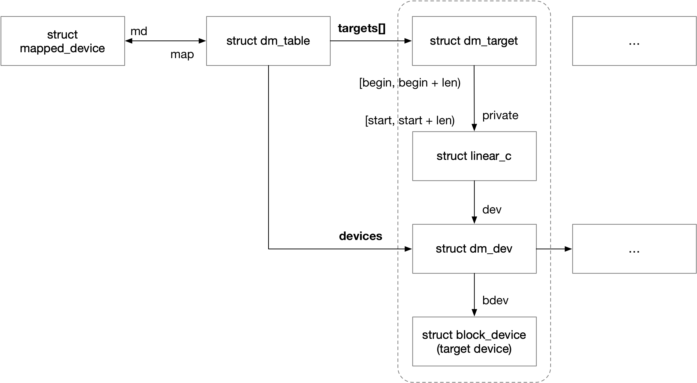
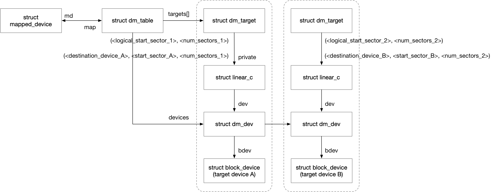

title:'dm - 0 Base'
## dm - 0 Base

### Concept

#### mapped_device

struct mapped_device 抽象 logical volume

```c
struct mapped_device;
```


#### dm_target

struct dm_target 实际上描述了 mapped device 的一段 logical sector range 是怎样映射到底层的 target device 的一段 physical sector range 的

```c
struct dm_target {
	struct dm_table *table;
	struct target_type *type;
	...
}
```

@type 描述该 target device 的类型，例如 linear、strip 等


> sector range mapping

如之前所述，dm_target 描述了 mapped device 的一段 logical sector range 与底层的 target device 的一段 physical sector range 之间的映射关系

```c
struct dm_target {
	/* target limits */
	sector_t begin;
	sector_t len;
	
	/* target specific data */
	void *private;
	...
}
```

@begin/len 就描述了 mapped device 的一段 logical sector range 为 [begin, begin + len)


@private 字段指向 target_type specific 的数据结构，这些数据结构就描述了以上的这段 logical sector range 映射的 target device、以及 target device 的哪一段 physical sector range

以最简单的 linear 为例，@private 字段指向的是一个 struct linear_c 数据结构

```c
struct linear_c {
	struct dm_dev *dev;
	sector_t start;
};
```

@dev 描述对应的 target device
@start 描述对应的 physical sector range 实际上是 [start, start + len)


也就是说

- mapped_device 的 [begin, begin + len) 的一段 logical sector range
- 线性映射为
- dm_dev 的 [start, start + len) 的一段 physical sector range


#### dm_table

struct dm_table 描述 mapped device 与其所有 target device 之间的映射关系，每个 mapped device 都有一个对应的 dm table

```c
struct mapped_device {
	void __rcu *map;
	...
}
```

@map 字段就保存该 mapped device 对应的 dm_table


```c
struct dm_table {
	struct mapped_device *md;
	...
}
```


##### dm_target table

如之前所述，dm_target 描述了 mapped device 的一段 logical sector range 与底层的 target device 的一段 physical sector range 之间的映射关系

同时 mapped device 与 target device 之间是一对多的关系，即一个 mapped device 可以映射到多个 target device，因而一个 mapped device 也对应多个 dm_target

dm table 中使用 @targets 数组来维护该 mapped device 对应的所有 dm_target 结构

```c
struct dm_table {
	struct dm_target *targets;
	unsigned int num_targets;
	...
}
```

@num_targets 描述 @targets[] 数组的大小


#### target device

##### dm_dev

struct dm_dev 同样抽象一个 target device 也就是 physical volume，但是与之前介绍的 dm_target 不同，struct dm_target 主要侧重于描述 sector range 的映射关系，即 mapped device 的 logical sector range 是怎样映射到 target device 的 physical sector range 的

而 struct dm_dev 则是描述对应的 target device 到底是哪一个，即 target device 对应的 block_device

这里 @bdev 字段就指向底层的 physical volume 对应的 block device

```c
struct dm_dev {
	struct block_device *bdev;
	struct dax_device *dax_dev;
	fmode_t mode;
	char name[16];
};
```


load table 过程中，.ctr() 回调函数中会调用 dm_get_device()，其中会创建对应的 dm_dev 结构

```sh
.ctr()
    dm_get_device
        /* allocate dm_dev_internal */
        
        dm_get_table_device
            /* allocate table_device */
            /* add to mapped_device->table_devices list */
        
        /* add to dm_table->devices list */
```


##### mapped device: target device list

mapped_device 的 @table_devices 链表用于组织该 mapped device 对应的所有 target device

需要注意的是，mapped_device 最多可以拥有两个 dm table，即 active table 和备选的 inactive table，这里 @table_devices 链表会组织这两个 table 中的所有 target device

```c
struct mapped_device {
	struct list_head table_devices;
	...
}
```


同时需要注意的是，@table_devices 链表组织的实际上是 struct table_device 结构

struct table_device 结构实际上就是 struct dm_dev 的封装，struct dm_dev 实际上就内嵌在 struct table_device 中，所以 load table 过程中为映射的 target deivce 创建 struct dm_dev 的过程，实际上就是创建一个对应的 struct table_device 结构

```c
struct table_device {
	struct list_head list;
	refcount_t count;
	struct dm_dev dm_dev;
};
```


##### dm table: target device list

此外 dm table 的 @devices 链表还组织了该 dm table 下的所有 target device

```c
struct dm_table {
	/* a list of devices used by this table */
	struct list_head devices;
	...
}
```

类似地，这里 @devices 链表组织的实际上是 struct dm_dev_internal 结构，struct dm_dev_internal 结构实际上也是上述介绍的 struct dm_dev 结构的封装

```c
struct dm_dev_internal {
	struct list_head list;
	refcount_t count;
	struct dm_dev *dm_dev;
};
```


##### target device list

同时需要注意的是，mapped_device 的 @table_devices 链表，以及 dm table 的 @devices 链表，描述的实际上都是 dm table 中使用到的所有 target device

dm table 中使用到的所有 target device 实际上可以分为两类，分别用于 metadata 和 data；因而以上这两个链表实际上包含了用于 metadata 的 target device，如果需要遍历所有用于 data 的 target device，就需要通过 dm_table 的 @targets[] 数组遍历所有的 target device，并对每个 target device 调用 ti->type->iterate_devices() 回调函数，以获取 target device 映射的底层设备的 block_device


#### summary



一个 mapped device 可以映射到多个 target device，每个 mapped device 都有一个对应的 dm_table

dm table 的 @targets[] 数组与 @devices 链表共同描述了该 mapped device 的 logical sector range 是怎样映射到底层的 target device 的

例如对于 linear type 来说，@devices 链表中的每个 dm_target，实际上就描述了 mapped_device 的 [begin, begin + len) 的一段 logical sector range，线性映射为 dm_dev 的 [start, start + len) 的一段 physical sector range


例如以下命令创建了一个 mapped device，名称为 <mapped_device>，其 mapping table 描述了该 mapped device 包含了两个 linear type 的 target device

```sh
dmsetup create <mapped_device> --table \
"<logical_start_sector_1> <num_sectors_1> linear <destination_device_A> <start_sector_A>
<logical_start_sector_2> <num_sectors_2> linear <destination_device_B> <start_sector_B>"
```




### Routine

device mapper 框架初始化的时候会创建一个字符设备 `/dev/mapper/control`，内核通过该设备的 ioctl() 向外提供接口

当调用 "dmsetup create --table <mapping-table>" 创建 mapped device 时，实际上拆解为以下三个 ioctl 命令


1. DM_DEV_CREATE ioctl 

调用 DM_DEV_CREATE ioctl() 创建一个 struct mapped_device 结构

```sh
ctl_ioctl (DM_DEV_CREATE)
    dev_create
        /* allocate struct mapped_device */
        md->queue = blk_alloc_queue_node();

        md->disk = alloc_disk_node();
        md->disk->queue = md->queue;
        add_disk_no_queue_reg(md->disk);
```


2. DM_TABLE_LOAD ioctl

调用 DM_TABLE_LOAD ioctl() 创建并初始化对应的 struct dm_table 结构，其中会解析传入的 mapping table，对于 mapping table 的每一行

- 创建一个对应的 struct dm_target 结构
- 根据其中的 <target_type> 参数，调用对应 target type 的 ctr() 回调函数

```sh
ctl_ioctl (DM_TABLE_LOAD)
    table_load
        /* allocate struct dm_table */
        dm_table_create
        populate_table
            /*iterate targets*/ dm_table_add_target
                tgt->type->ctr()
                    dm_get_device
            dm_table_complete
                dm_table_determine_type
                dm_table_alloc_md_mempools
        
        /* init request queue*/
        dm_setup_md_queue
            dm_calculate_queue_limits
            dm_table_set_restrictions
            blk_register_queue
```


3. DM_DEV_SUSPEND ioctl

最后调用 DM_DEV_SUSPEND ioctl()，将以上两个步骤中创建的 struct mapped_device 与 struct dm_table 相绑定

```sh
ctl_ioctl (DM_DEV_SUSPEND)
    dev_suspend
        do_resume
            dm_swap_table
                dm_calculate_queue_limits
                __bind(md, table, &limits)
                    rcu_assign_pointer(md->map, (void *)t);
                    dm_table_set_restrictions
                    /* free old dm_table */
            
            dm_resume
```


