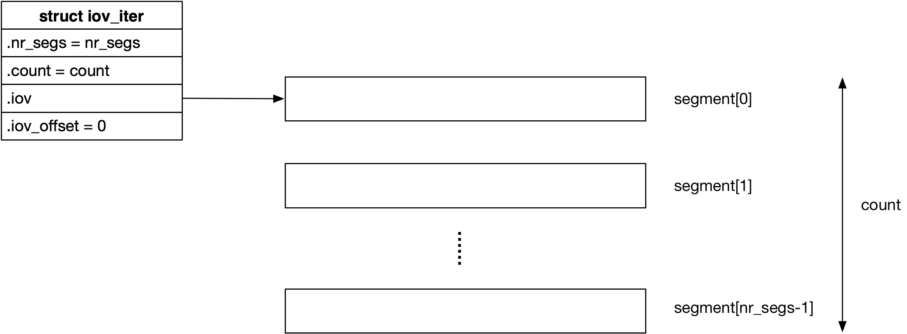
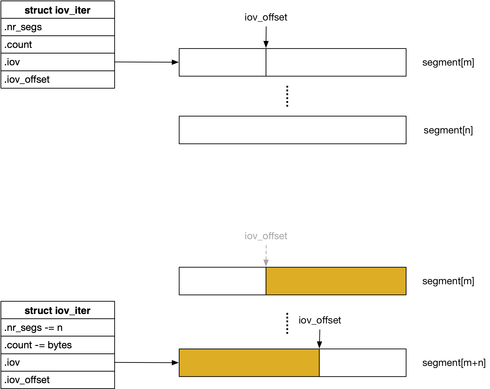

title:'iov_iter'
## iov_iter


### Concept

#### iovec

内核经常需要处理用户传入的用户态缓存，因而内核提供了一个 iovec 接口来专门处理这一需求

```c
struct iovec
{
	void __user *iov_base;	/* BSD uses caddr_t (1003.1g requires void *) */
	__kernel_size_t iov_len; /* Must be size_t (1003.1g) */
};
```

我们将内存中的一段连续的内存区间称为是一个 segment

那么 struct iovec 就用于封装用户态地址空间中的一个 segment，@iov_base 描述该 segment 的起始地址，这个地址是用户态地址空间中的一个地址；@iov_len 则描述这个 segment 的大小


#### iov_iter

一个 iovec 只是描述一个 segment，但是用户传入的可能是多个 segment，因而通常多个 iovec 会组成一个数组，以描述一组 segment，这从名称 "vec" 也可以看出来，例如 readv/writev 系统调用中传入的就是一个 iovec 数组

而为了更好地处理这些多个非连续的 segment，在 Linux 2.6.24 开始引入了 iov_iter 接口

```c
struct iov_iter {
	int type;
	
	size_t iov_offset;
	size_t count;
	
	const struct iovec *iov;
	unsigned long nr_segs;
};
```

> type

@type 字段的 bit 0 用于描述当前 iovec 数组需要执行的操作类型

```c
/* generic data direction definitions */
#define READ			0
#define WRITE			1
```

- @type[bit 0] 为 0 即 READ 表示当前执行 read 操作，即需要将数据写入 segment
- @type[bit 0] 为 1 即 WRITE 表示当前执行 write 操作，即需要从 segment 读取数据


> current cursor

iov_iter 实际可以看作是用于遍历 iovec 数组的一个指针

@iov 指针即指向当前遍历的 segment，@nr_segs 描述当前遍历过程中剩余需要遍历的 segment 的数量

@iov_offset 描述当前遍历过程中剩余需要处理的数据在 @iov 指向的 segment 中的偏移，而 @count 则描述当前遍历过程中剩余需要处理的数据的大小


@iov/nr_segs/iov_offset/count 这四个字段的值在遍历过程中都是变化


在 iov_iter 初始化的时候

- @iov 指向 iovec 数组的第一个 iovec，@nr_segs 实际上就描述 iovec 数组的大小，即数组中包含的 iovec 的数量
- @iov_offset 的值为 0，@count 的值实际上就是 iovec 数组中所有 iovec 包含的数据的大小


而在遍历的中间阶段

- @iov 指向当前遍历的 segment，即 iov_iter 并不维护 iovec 数组的基地址，需要调用者自身维护；@nr_segs 描述当前遍历过程中剩余需要遍历的 segment 的数量
- @iov_offset 描述当前遍历过程中剩余需要处理的数据在 @iov 指向的 segment 中的偏移，而 @count 则描述当前遍历过程中剩余需要处理的数据的大小


### Interface

#### iov_iter_init

iov_iter_init() 用于初始化 iovec 类型对应的 iov_iter

```c
void iov_iter_init(struct iov_iter *i, int direction,
			const struct iovec *iov, unsigned long nr_segs,
			size_t count)
```




#### iterate_and_advance

iterate_and_advance() 宏是 iov_iter 接口的核心，其对 iov_iter 描述的 iovec 数组进行遍历，具体是将 @i 描述的 iov_iter 往前移动 @n 字节

```c
iterate_and_advance(i, n, v, I, B, K)
```

在遍历过程中可以通过 @I/B/K 参数指定对当前遍历的 iovec 执行相应的操作，其中对于 iovec 类型来说之后 @I 参数有效

例如

```
iterate_and_advance(i, bytes, v, copyin(dest_addr, v.iov_base, v.iov_len), 0, 0);
```

遍历过程中将 @i 描述的 iov_iter 往前移动 @bytes 字节，而在这过程中 @bytes 字节可能会覆盖多个 iovec，此时每一轮循环中 @v 就描述当前正在遍历的 iovec，同时每次在更新 @v 之前，会调用 @I 描述的语句对 @v 指向的即当前正在遍历的 iovec 执行相应的操作

以上语句展开后相当于

```
move forward @bytes, and for each iovec {
    @v.iov_base = @i->iov_base + @i->iov_offset;
    @v.iov_len = @i->iov_len - @i->iov_offset;
    
    @I;
    
    @i->iov = iov++;
    @i->nr_segs --;
}
```


#### iov_iter_advance

iov_iter_advance() 是对 iterate_and_advance() 的封装，用于将 iov_iter 往前移动 @bytes 字节，此时 iov_iter 的 @iov/nr_segs/iov_offset/count 字段均会随着更新

在遍历过程中不执行任何其他操作，而只是移动 iov_iter

```c
void iov_iter_advance(struct iov_iter *i, size_t bytes);
```




#### iov_for_each

iov_for_each() 宏用于遍历一个 iovec 数组，其与 iov_iter_advance() 的差异是，iov_iter_advance() 可以通过 @bytes 参数控制 iov_iter 前进的步长，而 iov_for_each() 中的步长则是当前遍历的 iovec 的长度，即相当于每次遍历 iovec 数组中的一个 iovec

iov_for_each() 实际上就是基于 iov_iter_advance() 实现的

同时 iov_for_each() 只支持 iovec/kvec 类型的遍历，而不支持 bvec/pipe 类型


```c
iov_for_each(iov, iter, start)
```

@start 参数为指向一个 iovec 数组的 iov_iter，iov_for_each() 则用于遍历该 iovec 数组中的每个 iovec，@iov 参数用于返回当前遍历的 iovec，而 @iter 参数则只是用于遍历过程中的临时变量


例如

```c
struct iovec iov;
struct iov_iter *i;

iov_for_each(iov, iter, start) {
    unsigned long addr = iov.iov_base;
    size_t size = iov.iov_len;
}
```


#### copy_to_iter / copy_from_iter

copy_to_iter() / copy_from_iter() 用于实现数据拷贝，最终函数返回成功拷贝的数据量

```c
size_t copy_to_iter(const void *addr, size_t bytes, struct iov_iter *i)
size_t copy_from_iter(void *addr, size_t bytes, struct iov_iter *i)
```


### More

iov_iter 一开始只支持 iovec，但之后也陆续支持 kvec 与 bio_vec

```c
struct iov_iter {
	int type;
	...
};
```

此时 @type 字段的高位 bit 描述当前 iov_iter 遍历的 segment 的类型

```c
enum {
    ITER_IOVEC = 4,
    ITER_KVEC = 8,
    ITER_BVEC = 16,
    ITER_PIPE = 32,
};
```


同时 @iov/kvec/bvec 合并为 union 字段，描述当前遍历的 segment

```c
struct iov_iter {	
	union {
		const struct iovec *iov;
		const struct kvec *kvec;
		const struct bio_vec *bvec;
		struct pipe_inode_info *pipe;
	};
	...
};
```


#### kvec

kvec 与 iovec 一样用于描述用户态传入的一个 segment，只是 iovec 描述的 segment 还在用户态地址空间中，而 kvec 描述的 segment 已经由用户态地址空间拷贝到了内核态地址空间

```c
struct kvec {
	void *iov_base; /* and that should *never* hold a userland pointer */
	size_t iov_len;
};
```

之所以要区别 iovec 与 kvec 两种类型，是因为在遍历 kvec 过程中可以进行优化操作，以加快遍历的过程


#### bvec

bio_vec 是 block layer 用于描述 segment 的一个概念，其使用 (page, offset, length) 三元组来描述内存中的一个 segment，其中实际描述了 @bv_page 描述的 page 中 @bv_offset 偏移起始的 @bv_len 长度的内存区间

```c
struct bio_vec {
	struct page	*bv_page;
	unsigned int	bv_len;
	unsigned int	bv_offset;
};
```


由于 iov_iter 在支持 bio_vec 之前，block layer 已经实现有 bvec_iter 接口，因而 bvec 类型的 iov_iter 实际上就基于已有的 bvec_iter 接口实现


