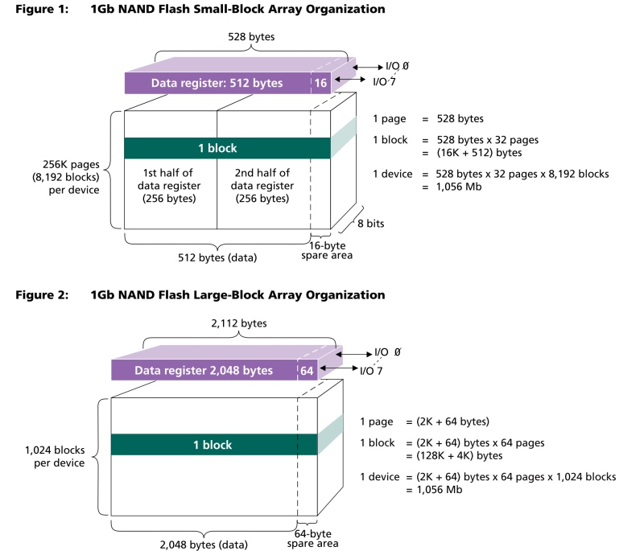
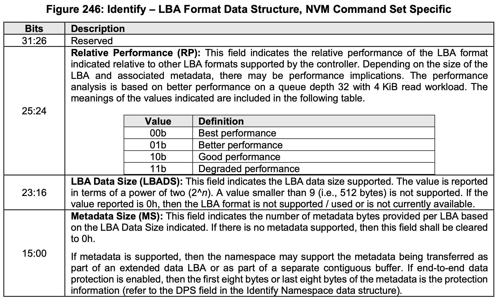
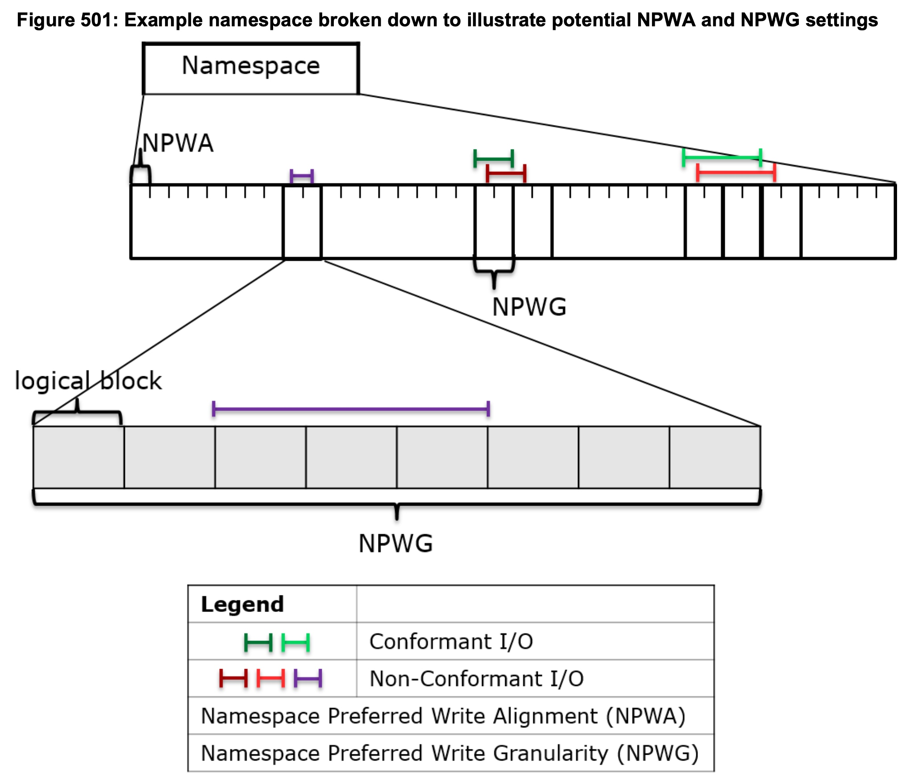
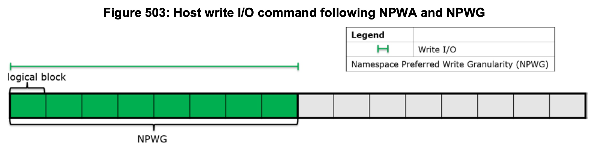
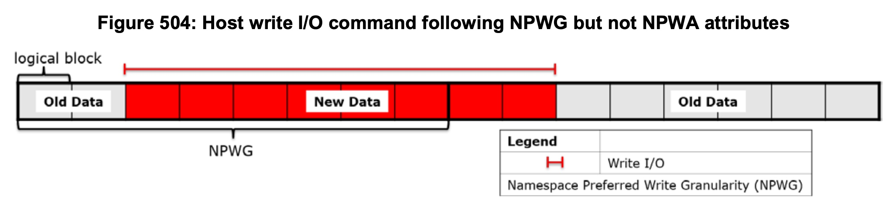
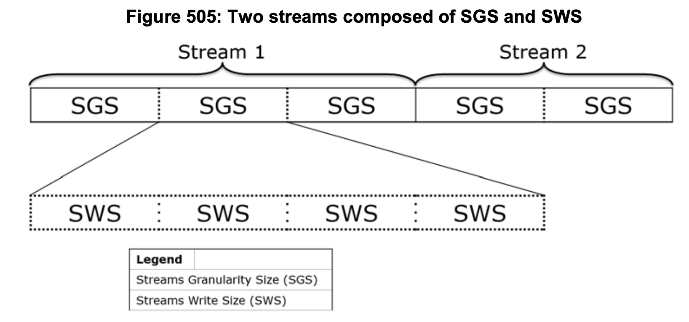
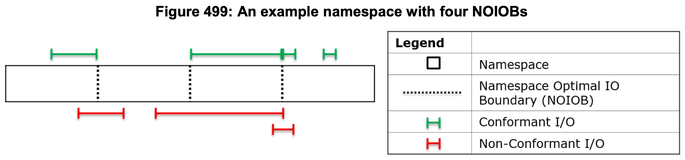

title:'Feature - Queue Limits'
## Feature - Queue Limits

每个 request queue 会维护一个 struct queue_limits 结构来描述对应的块设备的硬件参数，这些参数描述了硬件存储单元的组织方式，会影响 block layer 的很多行为，其中部分参数在 `/sys/block/<dev>/queue/` 下导出

```c
struct request_queue {
	struct queue_limits	limits;
	...
}
```

```c
struct queue_limits {
	unsigned long		bounce_pfn;
	unsigned long		seg_boundary_mask;
	unsigned long		virt_boundary_mask;

	unsigned int		max_hw_sectors;
	unsigned int		max_dev_sectors;
	unsigned int		chunk_sectors;
	unsigned int		max_sectors;
	unsigned int		max_segment_size;
	unsigned int		physical_block_size;
	unsigned int		alignment_offset;
	unsigned int		io_min;
	unsigned int		io_opt;
	unsigned int		max_discard_sectors;
	unsigned int		max_hw_discard_sectors;
	unsigned int		max_write_same_sectors;
	unsigned int		max_write_zeroes_sectors;
	unsigned int		discard_granularity;
	unsigned int		discard_alignment;

	unsigned short		logical_block_size;
	unsigned short		max_segments;
	unsigned short		max_integrity_segments;
	unsigned short		max_discard_segments;

	unsigned char		misaligned;
	unsigned char		discard_misaligned;
	unsigned char		cluster;
	unsigned char		raid_partial_stripes_expensive;
	enum blk_zoned_model	zoned;
};
```

### base

#### logical_block_size

> This is the smallest unit the storage device can address. It is typically 512 bytes.

logical_block_size 描述硬件进行地址寻址的最小单元，其默认值为 512 bytes，对应 `/sys/block/<dev>/queue/logical_block_size`

对于 HDD 设备来说，设备能够寻址的最小存储单元是扇区 (sector)，每个扇区的大小是 512 bytes，因而 HDD 设备的 logical_block_size 属性就是 512 bytes

为了使用 block buffer 特性，文件系统的 block size 必须为块设备的 logical_block_size 的整数倍

同时向 device controller 下发的 IO 也必须是按照 logical_block_size 对齐


#### physical_block_size

> This is the smallest unit a physical storage device can write atomically.  It is usually the same as the logical block size but may be bigger.

physical_block_size 描述硬件执行写操作的最小单元，其默认值为 512 bytes，对应 `/sys/block/<dev>/queue/physical_block_size`

physical_block_size 必须是 logical_block_size 的整数倍


#### io_min

> Storage devices may report a granularity or preferred minimum I/O size which is the smallest request the device can perform without incurring a performance penalty. For disk drives this is often the physical block size.  For RAID arrays it is often the stripe chunk size.  A properly aligned multiple of minimum_io_size is the preferred request size for workloads where a high number of I/O operations is desired.

描述执行 IO 操作的最小单位，默认值为 512 bytes，对应 `/sys/block/<dev>/queue/minimum_io_size`


#### io_opt

> Storage devices may report an optimal I/O size, which is the device's preferred unit for sustained I/O.  This is rarely reported for disk drives.  For RAID arrays it is usually the stripe width or the internal track size. A properly aligned multiple of optimal_io_size is the preferred request size for workloads where sustained throughput is desired. If no optimal I/O size is reported this file contains 0.

描述执行 IO 操作的最佳大小，默认值为 0，对应 `/sys/block/<dev>/queue/optimal_io_size`


#### summary

##### NAND flash unit



NAND flash 执行 read/write 操作的单位为 **page**，随着 NAND flash 规格的不同，page 的大小可以为 512, 2K, 4K, .. 字节

但是由于 NAND flash 存储介质的特性，只能对状态为 0 的存储单元执行 write 操作，对于状态为 1 的存储单元，必须先对其执行 erase 操作使其状态恢复为 0，之后再对其执行 write 操作；而 erase 操作的单位为 **block**，一个 block 通常包含多个 page


##### NVMe

###### logical_block_size

NVMe 协议其实并没有直接暴露 NAND flash 存储的 page、block 这些属性，NVMe 协议只暴露有 logical_block_size 属性，即最小寻址单元

由于 HDD 的 logical_block_size 是 512 字节，上层的软件栈大多是为 512 字节的 logical_block_size 设计的，因而为了兼容上层的软件栈设计，NVMe 协议也支持 512 字节的 logical_block_size，即使此时底层的 NAND flash 存储介质的 page 很可能是 4K 大小，此时由 SSD 内部的 FTL 负责 NAND flash 存储介质的 page/block 属性，到 NVMe 协议暴露的 logical_block_size 属性之间的模拟


1. supported LBA Format

NVMe 协议内部使用 LBA Format 描述 logical_block_size 参数，NVMe 协议会通过 namespace identity command 命令向用户通告，设备支持的所有 LBA Format

NVMe 设备初始化阶段，驱动会向设备发送 namespace identity 命令，在返回的 identity data 中，Number of LBA Formats (NLBAF) 字段描述了设备支持的所有 LBA Format 的数量

> Number of LBA Formats (NLBAF): This field defines the number of supported LBA data size and metadata size combinations supported by the namespace. LBA formats shall be allocated in order (starting with 0) and packed sequentially. This is a 0’s based value. The maximum number of LBA formats that may be indicated as supported is 16. 


同时返回的 identity data 的 LBA Format 0 Support (LBAF0) ~ LBA Format 16 Support (LBAF16) 字段就分别描述符了设备支持的所有 LBA Format，其中的每个字段都是 LBA Format Data Structure 数据类型，描述设备支持的一种 LBA Format 类型



其中 LBA Data Size (LBADS) 字段就描述了该 LBA Format 中，logical_block_size 的大小

例如对某个 NVMe 设备执行 namespace identity 命令，其返回的设备支持的所有 LBA Format 格式为

```
LBA Format  0 : Metadata Size: 0   bytes - Data Size: 512 bytes - Relative Performance: 0x2 Good (in use)
LBA Format  1 : Metadata Size: 8   bytes - Data Size: 512 bytes - Relative Performance: 0x2 Good
LBA Format  2 : Metadata Size: 16  bytes - Data Size: 512 bytes - Relative Performance: 0x2 Good
LBA Format  3 : Metadata Size: 0   bytes - Data Size: 4096 bytes - Relative Performance: 0 Best
LBA Format  4 : Metadata Size: 8   bytes - Data Size: 4096 bytes - Relative Performance: 0 Best
LBA Format  5 : Metadata Size: 64  bytes - Data Size: 4096 bytes - Relative Performance: 0 Best
LBA Format  6 : Metadata Size: 128 bytes - Data Size: 4096 bytes - Relative Performance: 0 Best
```


2. format LBA Format

设备通过 namespace identity 命令向用户通告设备支持的所有 LBA Format，在设备格式化阶段，用户就可以通过 Format NVM 命令的 LBA Format (LBAF) 字段指定设备使用哪一种 LBA Format 格式，这个字段的值实际上是使用的 LBA Format 在以上介绍的 namespace identity 命令返回的 all supported LBA Format table 中的 index

> LBA Format (LBAF): This field specifies the LBA format to apply to the NVM media. This 03:00 corresponds to the LBA formats indicated in the Identify command. Only supported LBA formats shall be selected.


- show selected LBA Format

namespace identity 命令返回的 identity data 中，Formatted LBA Size (FLBAS) 字段就显示了设备当前使用的 LBA Format 格式，该字段的值实际上也是当前使用的 LBA Format 在 all supported LBA Format table 中的 index

> Formatted LBA Size (FLBAS):Bits 3:0 indicates one of the 16 supported LBA Formats indicated in this data structure


3. logical_block_size

对于 NVMe 设备来说，namespace identity 命令返回的 identity data 中，Formatted LBA Size (FLBAS) 字段就显示了设备当前使用的 LBA Format 格式，该 LBA Format 格式对应的 LBA Format Data Structure 结构体中，LBA Data Size (LBADS) 字段就描述了该 LBA Format 中 logical_block_size 的大小


###### NVMe features

NVMe 协议只向外暴露 logical_block_size 参数，此时 logical_block_size 参数一般都小于内部的 NAND flash 存储介质实际的 page/block 参数，此时 FTL 就负责这中间的模拟和转换，但是此时设备的 read/write 性能往往不是最优的

理论上，当上层 read 操作的单位是 NAND flash 存储介质的 page 参数，write 操作的单位是 NAND flash 存储介质的 block 参数时，设备的 read/write 性能才能达到最优

因而 NVMe 协议在之后引入了多个特性，这些特性虽然没有直接暴露底层 NAND flash 存储介质的 page/block 参数，但是都与这些参数相关


1. Namespace Preferred Write

NVMe 协议在 1.4 版本引入 Namespace Preferred Write  特性，来暴露内部 NAND flash 存储介质 block 参数的更多信息

在 namespace identity 命令返回的 identity data 中，

- Namespace Preferred Write Alignment (NPWA) 字段描述 preffered write 操作的 LBA 地址必须按照 NPWA 对齐，可以理解为 NAND flash 存储介质的 block alignment
- Namespace Preferred Write Granularity (NPWG) 字段描述 preffered write 操作的单位，是 NPWA 的复数倍，可以理解为是以 NAND flash 存储介质下的 block 为单位执行 write 操作

> Namespace Preferred Write Granularity (NPWG): This field indicates the smallest recommended write granularity in logical blocks for this namespace. This is a 0’s based value.
The size indicated should be less than or equal to Maximum Data Transfer Size (MDTS) that is specified in units of minimum memory page size. The size should be a multiple of Namespace Preferred Write Alignment (NPWA).
>
> Namespace Preferred Write Alignment (NPWA): This field indicates the recommended write alignment in logical blocks for this namespace. This is a 0’s based value.








2. Namespace Optimal Write

NVMe 协议在 1.4 版本引入 Namespace Optimal Write 特性，其本质上也是暴露内部 NAND flash 存储介质的 block 参数

在 namespace identity 命令返回的 identity data 中，Namespace Optimal Write Size (NOWS) 字段描述 optimal write 操作的单位，与之前 Namespace Preferred Write 的差别是，NOWS 必须是 NPWG 的复数倍（NPWG 又必须是 NPWA 的复数倍）

> Namespace Optimal Write Size (NOWS): This field indicates the size in logical blocks for optimal write performance for this namespace. This is a 0’s based value.
The size indicated should be less than or equal to Maximum Data Transfer Size (MDTS) that is specified in units of minimum memory page size. The value of this field may change if the namespace is reformatted. The value of this field should be a multiple of Namespace Preferred Write Granularity (NPWG).


3. Atomic Write

identify controller 命令返回的数据中

- Atomic Write Unit Normal (AWUN) 描述了 atomic write 的最大单位，小于 AWUN 的 write 操作都是 atomic 的
- Atomic Write Unit Power Fail (AWUPF) 描述了 powerfail 情况下的 atomic write 的最大单位

> Atomic Write Unit Normal (AWUN): This field indicates the size of the write operation guaranteed to be written atomically to the NVM across all namespaces with any supported namespace format during normal operation. This field is specified in logical blocks and is a 0’s based value.
> If a specific namespace guarantees a larger size than is reported in this field, then this namespace specific size is reported in the NAWUN field in the Identify Namespace data structure. 
> If a write command is submitted with size less than or equal to the AWUN value, the host is guaranteed that the write command is atomic to the NVM with respect to other read or write commands. If a write command is submitted with size greater than the AWUN value, then there is no guarantee of command atomicity. 

> Atomic Write Unit Power Fail (AWUPF): This field indicates the size of the write operation guaranteed to be written atomically to the NVM across all namespaces with any supported namespace format during a power fail or error condition.
> If a specific namespace guarantees a larger size than is reported in this field, then this namespace specific size is reported in the NAWUPF field in the Identify Namespace data structure. 
This field is specified in logical blocks and is a 0’s based value. The AWUPF value shall be less than or equal to the AWUN value.
> If a write command is submitted with size less than or equal to the AWUPF value, the host is guaranteed that the write is atomic to the NVM with respect to other read or write commands. If a write command is submitted that is greater than this size, there is no guarantee of command atomicity. If the write size is less than or equal to the AWUPF value and the write command fails, then subsequent read commands for the associated logical blocks shall return data from the previous successful write command. If a write command is submitted with size greater than the AWUPF value, then there is no guarantee of data returned on subsequent reads of the associated logical blocks.


以上两个是整个 controller 范围的属性，适用于所有 namespace，而以下两个则是 per-namespace 的属性，在 identify namespace 命令返回的数据中

> Namespace Atomic Write Unit Normal (NAWUN): This field indicates the namespace specific size of the write operation guaranteed to be written atomically to the NVM during normal operation.

> Namespace Atomic Write Unit Power Fail (NAWUPF): This field indicates the namespace specific size of the write operation guaranteed to be written atomically to the NVM during a power fail or error condition.


4. Namespace Optimal IO Boundary

因而 NVMe 协议在 1.3 版本引入 Namespace Optimal IO Boundary 特性


5. Stream

NVMe 协议在 1.3 版本引入 Stream 特性，该特性用于将同一生命的数据存储在一起，不同生命周期的数据分开存储，以减小写放大，从而提升设备寿命以及运行时性能

NVMe 协议通过 directive 机制支持 Stream 特性，directive 机制用于实现设备与上层软件之间的信息沟通，Stream 只是 directive 的一个子集，其控制流程主要为

- identify controller 命令返回的 identify data 中，OACS (Optional Admin Command Support) 字段的 bit 5 描述该设备是否支持 directive 特性
- 向设备发送 Directive Receive (Return Parameters) 命令，返回的 Return Parameters data 的 NVM Subsystem Streams Available (NSSA) 字段就描述了设备支持的 stream 数量
- 向设备发送 Directive Receive (Allocate Resources) 命令，以申请独占使用某个 stream
- 之后在 Write 命令的 Directive Type 字段设置为 Streams (01h)，同时 Directive Specific 字段设置为对应的 stream id，即可以将该 Write 命令写入的数据与该 stream id 相绑定


在 Stream 特性中，Directive Receive (Return Parameters) 命令返回的数据中

- Stream Write Size (SWS) 字段描述 stream write 的最小单位

> Stream Write Size (SWS): This field indicates the alignment and size of the optimal stream write as a number of logical blocks for the specified namespace. The size indicated should be less than or equal to Maximum Data Transfer Size (MDTS) that is specified in units of minimum memory page size. 
> SWS should be a multiple of the Namespace Preferred Write Granularity (NPWG).

- Stream Granularity Size (SGS) 描述 stream 分配存储空间的单位，设备一开始会为每个 stream 预先分配 SGS 大小的存储块，之后该 stream 的数据都会存储到这一预分配的 SGS 大小的存储块中；当这一存储块的空间用尽时，设备则再次分配一个 SGS 大小的存储块；所有这些 SGS 大小的存储块就构成了一个 stream

> Stream Granularity Size (SGS): This field indicates the stream granularity size for the specified namespace in Stream Write Size (SWS) units.
> The Stream Granularity Size indicates the size of the media that is prepared as a unit for future allocation for write commands and is a multiple of the Stream Write Size. The controller may allocate and group together a stream in Stream Granularity Size (SGS) units.




###### physical_block_size

NVMe 设备的 physical_block_size 参数计算过程为

- 首先计算 @phys_bs 与 @atomic_bs 两个变量的值
    - @phys_bs
        - 当支持 Namespace Preferred Write 特性时，来源于 Namespace Preferred Write Granularity (NPWG)
        - 否则当支持 Stream 特性时，来源于 Stream Write Size (SWS)
        - 否则来源于 logical_block_size
    - @atomic_bs
        - 优先来源于 atomic write unit power fail，即 Atomic Write Unit Power Fail (AWUPF) 或 Namespace Atomic Write Unit Power Fail (NAWUPF)
        - 否则来源于 logical_block_size
- @phys_bs 与 @atomic_bs 取最小值，就是 physical_block_size


###### io_opt

NVMe 设备的 io_opt 参数计算过程为

- 当支持 Namespace Optimal Write 特性时，来源于 Namespace Optimal Write Size (NOWS)
- 否则当支持 Stream 特性时，来源于 Stream Granularity Size (SGS)
- 否则来源于 logical_block_size


##### io_min

NVMe 设备的 io_min 参数实际上就是之前计算的 @phys_bs 变量的值，即

- 当支持 Namespace Preferred Write 特性时，来源于 Namespace Preferred Write Granularity (NPWG)
- 否则当支持 Stream 特性时，来源于 Stream Write Size (SWS)
- 否则来源于 logical_block_size


### sector limit

#### max_dev_sectors

> Some devices report a maximum block count for READ/WRITE requests.

有一些 IO controller 能够处理的单个 READ/WRITE request 的大小存在上限，max_dev_sectors 就描述了这一上限值；对于不存在这一限制的设备，该参数的默认值为 0

当前只有 SCSI 设备存在这一上限


#### max_hw_sectors

> This is the maximum number of kilobytes supported in a single data transfer.

有一些 IO controller 能够执行的单次 DMA SG 操作的大小存在上限，max_hw_sectors 参数就描述了这一限制，默认值为 BLK_DEF_MAX_SECTORS 即 255 个 sector，对应 `/sys/block/<dev>/queue/max_hw_sectors_kb`


#### max_sectors

> This is the maximum number of kilobytes that the block layer will allow
for a filesystem request. Must be smaller than or equal to the maximum
size allowed by the hardware.

描述 block layer 下发的 request 的最大大小，默认值为 BLK_DEF_MAX_SECTORS 即 255 个 sector

max_sectors 与 max_hw_sectors 的区别是，后者是 DMA controller 硬件设备的属性，无法修改，而后者是软件设置的属性，用户可以通过 `/sys/block/<dev>/queue/max_sectors_kb` 修改该参数的值，但是不能超过 max_hw_sectors 的值


在 block routine 中，如果一个 bio 包含的数据量超过了 max_sectors，那么在 blk_queue_split() 中就需要对该 bio 执行 split 操作；同时 bio 与 request 的 merge 过程中，合并后的 request 包含的数据量也不能超过 max_sectors，否则该 bio 就不能与这个 request 合并


#### chunk_sectors

> chunk_sectors has different meaning depending on the type of the disk. For a RAID device (dm-raid), chunk_sectors indicates the size in 512B sectors of the RAID volume stripe segment. For a zoned block device, either host-aware or host-managed, chunk_sectors indicates the size of 512B sectors of the zones of the device, with the eventual exception of the last zone of the device which may be smaller.

chunk_sectors 参数描述任何一个下发的 IO，其描述的 sector range 不能 **cross**（跨越）该参数描述的界限，以 sector 为单位

例如如果 chunk_sectors 参数的值为 128*2 sector 即 128KB，那么任何一个下发的 IO 都不能横跨 128KB 这个界限

chunk_sectors 的来源各有不同，对于 dm-stripe 这类设备来说，chunk_sectors 参数实际上就来自 chunk size；而对于 NVMe 设备来说，由于 flash 自身存储颗粒的限制，单个 request 最好不要超过 NOIOB 界限，此时 IO 性能可以达到最佳，因而此时 chunk_sectors 的值就来源于 NOIOB 参数

> Namespace Optimal I/O Boundary (NOIOB): This field indicates the optimal I/O boundary for this namespace. This field is specified in logical blocks. The host should construct Read and Write commands that do not cross the I/O boundary to achieve optimal performance. A value of 0h indicates that no optimal I/O boundary is reported.



该参数的默认值为 0，即默认不存在 chunk size 的限制


chunk_sectors 参数要求按照 chunk size 对 bio 进行 split 处理

```
__blk_queue_split
    blk_bio_segment_split
        get_max_io_size
            blk_max_size_offset
```

同时 IO merge 过程中，合并后的 IO 也不能跨越 chunk size

```
blk_mq_sched_bio_merge
    __blk_mq_sched_bio_merge
        blk_mq_attempt_merge
            blk_mq_bio_list_merge
                bio_attempt_back_merge
                    ll_back_merge_fn
                        blk_rq_get_max_sectors
                            blk_max_size_offset
```


### segment limit

由于 DMA controller 的物理参数可能存在限制，physical segment 在一些参数上可能存在限制，例如一个 request 可以包含的 physical segment 的数量、单个 physical segment 的大小等，request queue 的 @limits 描述了这些限制

#### max_segments

> Maximum number of segments of the device.

由于 DMA controller 自身的限制，单个 request 可以包含的 physical segment 数量可能存在上限，@limits.max_segments 描述了这一限制，默认值为 128，对应 `/sys/block/<dev>/queue/max_segments`

```c
struct queue_limits {
	unsigned short		max_segments;
	...
}
```

在 bio 与 request 合并，或者两个 request 合并过程中，需要判断合并后的 request 包含的 physical segment 的数量不能超过这一上限


以 virtio-blk 为例，virtio block config 配置空间的 @seg_max 字段就描述了一个 request 请求可以包含的 physical segment 的数量上限

```c
struct virtio_blk_config {
	/* The maximum number of segments (if VIRTIO_BLK_F_SEG_MAX) */
	__u32 seg_max;
	...
}
```

virtio spec 中对 @seg_max 字段的解释为
> seg_max is the maximum number of segments that can be in a command.

virtio-blk 设备初始化过程中，就会从 virtio block config 配置空间读取 @seg_max 的值，并保存到 @limits.max_segments 中

```c
int virtblk_probe(struct virtio_device *vdev)
{
	/* We can handle whatever the host told us to handle. */
	blk_queue_max_segments(q, sg_elems);
	...
}
```


此外值得注意的是，virtio-blk 中每个 request 后面会有预分配好的 scatterlist 数组（驱动在向底层的物理设备下发 IO 的时候，每个 physical segment 需要初始化一个对应的 scatterlist），数组的大小就是 @limits.max_segments，也就是 physical segment 的数量上限

```
    struct request          struct virtblk_req      sg[]
+-----------------------+-----------------------+-----------+
|                       |                       |           |
+-----------------------+-----------------------+-----------+
```

```c
struct virtblk_req {
	...
	struct scatterlist sg[];
};
```


#### max_segment_size

> Maximum segment size of the device.

由于 IO controller 自身的限制，一个 physical segment 的大小可能存在上限，@limits.max_segment_size 描述了这一限制，以字节为单位，默认值为 BLK_MAX_SEGMENT_SIZE 即 65536 字节即 64 KB，对应 `/sys/block/<dev>/queue/max_segment_size`

```c
struct queue_limits {
	unsigned int		max_segment_size;
	...
}
```

在计算一个 bio 或 request 包含的 physical segment 数量的过程中，虽然两个 bio_vec 描述的内存区间在物理地址上连续，因而可以合并为一个 physical segment，但是前提是合并后的 physical segment 的大小不能超过 @max_segment_size 限制

#### seg_boundary_mask

由于 DMA controller 自身的限制，DMA controller 能够寻址的内存物理地址空间是有限的，例如一般的 DMA controller 只能寻址 32 bit 即 4GB 内的内存物理地址空间，如果某一段 physical segment 的物理地址超过 4GB，DMA controller 会通过某种地址映射的方式解决这一问题，此时唯一的限制是同一段 physical segment 不能跨越 4GB 这个界限，即整段 physical segment 的物理地址必须都在 4GB 之下，或者都在 4GB 之上

@limits.seg_boundary_mask 就描述了这一限制，其默认值为 BLK_SEG_BOUNDARY_MASK 即 0xFFFFFFFFUL，也就是默认 DMA controller 只能寻址 4GB 内存物理地址空间

```c
struct queue_limits {
	unsigned long		seg_boundary_mask;
	...
}
```


在判断两个 bio_vec 能否合并为一个 physical segment 的过程中，除了要求两个 bio_vec 描述的内存区间在物理地址上连续之外，还要求合并后的 physical segment 不能横跨 @seg_boundary_mask 界限，即

```
addr1 = start address of physical segment
addr2 = end address of physical segment
此时必须要求
((addr1) | (seg_boundary_mask)) == ((addr2) | (seg_boundary_mask))
```


#### virt_boundary_mask

virt_boundary_mask 的概念最初来源于 nvme，例如 nvme 中要求一个 request 包含的所有 physical segment 中

- 除了第一个 physical segment，其余 physical segment 的起始地址必须按照 PAGE_SIZE 对齐
- 同时除了最后一个 physical segment，其余 physical segment 的末地址也必须按照 PAGE_SIZE 对齐

> Another restriction inherited for NVMe - those devices don't support SG lists that have "gaps" in them. Gaps refers to cases where the previous SG entry doesn't end on a page boundary. For NVMe, all SG entries must start at offset 0 (except the first) and end on a page boundary (except the last).

@limits.virt_boundary_mask 就描述了这一限制，nvme 的 @virt_boundary_mask 参数即为 (PAGE_SIZE - 1)；该参数的默认值为 0，即默认不存在这一限制

```c
struct queue_limits {
	unsigned long		virt_boundary_mask;
	...
}
```

在 bio 与 request 合并、或者两个 request 合并过程中，必须符合 @virt_boundary_mask 限制，否则不能合并

在 bio 下发的过程中也要考虑该限制，否则 blk_queue_split() 中就需要对该 bio 执行 split 操作


### discard

#### discard_granularity

> This shows the size of internal allocation of the device in bytes, if
reported by the device. A value of '0' means device does not support
the discard functionality.

> Devices that support discard functionality may internally allocate space using units that are bigger than the logical block size. The discard_granularity parameter indicates the size of the internal allocation unit in bytes if reported by the device. Otherwise the discard_granularity will be set to match the device's physical block size. A discard_granularity of 0 means that the device does not support discard functionality.

该参数描述硬件设备内部分配存储单元的大小，同时也是 DISCARD 操作的单位，以字节为单位，若该参数为 0 说明设备不支持 DISCARD 操作，对应 `/sys/block/<dev>/queue/discard_granularity`

默认值为 0，nvme/virtio-blk 这类支持 DISCARD 操作的驱动会设置该参数的值为 512 即一个 sector

```c
struct queue_limits {
	unsigned int		discard_granularity;
	...
};
```


#### discard_alignment

> Devices that support discard functionality may internally allocate space in units that are bigger than the exported logical block size. The discard_alignment parameter indicates how many bytes the beginning of the device is offset from the internal allocation unit's natural alignment.

DISCARD request 必须按照 discard_alignment 对齐，对应 `/sys/block/<dev>/discard_alignment`

其默认值为 0，nvme/virtio-blk 这类支持 DISCARD 操作的驱动会设置该参数的值为 512 即一个 sector

```c
struct queue_limits {
	unsigned int		discard_alignment;
	...
};
```

#### max_hw_discard_sectors

> Devices that support discard functionality may have internal limits on
the number of bytes that can be trimmed or unmapped in a single operation. The discard_max_bytes parameter is set by the device driver to the maximum number of bytes that can be discarded in a single operation. Discard requests issued to the device must not exceed this limit. A discard_max_bytes value of 0 means that the device does not support discard functionality.

有些 IO controller 规定单个 DISCARD request 的大小存在上限，max_hw_discard_sectors 参数就描述了这一限制，以字节为单位，对应 `/sys/block/<dev>/queue/discard_max_hw_bytes`

其默认值为 0，nvme/virtio-blk 这类支持 DISCARD 操作的驱动会设置该参数的值

```c
struct queue_limits {
	unsigned int		max_hw_discard_sectors;
	...
};
```


#### max_discard_sectors

> While discard_max_hw_bytes is the hardware limit for the device, this
setting is the software limit. Some devices exhibit large latencies when
large discards are issued, setting this value lower will make Linux issue
smaller discards and potentially help reduce latencies induced by large
discard operations.

该参数描述了 block layer 下发的单个 DISCARD request 的大小上限，对应 `/sys/block/<dev>/queue/discard_max_bytes`

默认值为 0,nvme/virtio-blk 这类支持 DISCARD 操作的驱动会设置该参数的值

max_hw_discard_sectors 参数描述的是硬件设备的限制，但是 IO controller 实际在处理大的 discard request 时，其延时可能会很大，因而用户可以通过 max_discard_sectors 设置 block layer 层面的软件限制


#### max_discard_segments

> There are two cases when handle DISCARD merge.
> If max_discard_segments == 1, the bios/requests need to be contiguous
> to merge. If max_discard_segments > 1, it takes every bio as a range
> and different range needn't to be contiguous.

>  Two cases of handling DISCARD merge:
> If max_discard_segments > 1, the driver takes every bio
> as a range and send them to controller together. The ranges
> needn't to be contiguous.
> Otherwise, the bios/requests will be handled as same as
> others which should be contiguous.

有些 IO controller 支持在单个 DISCARD request 中同时对多个非连续的 sector range 执行 discard 操作，该参数就描述了这一限制，即单个 DISCARD request 可以包含的 sector range 数量的上限，默认值为 1，对应 `/sys/block/<dev>/queue/max_discard_segments`

