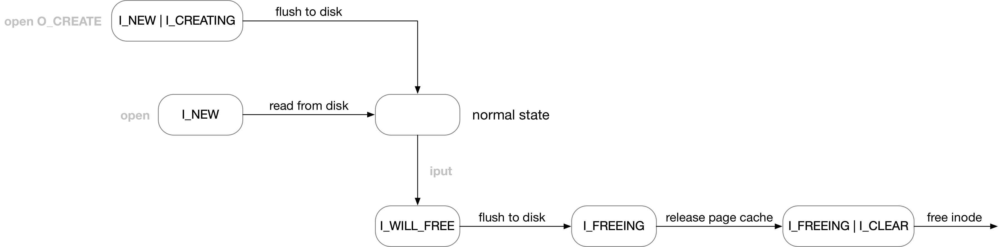

title:'Inode Lifecycle'
## Inode Lifecycle


inode 的 @i_state 字段描述了 inode 当前的状态

```c
struct inode {
	unsigned long		i_state;
	...
}
```

起始的 3 bits 以及后面追加的 2 bits 描述 inode 的 dirty 状态，其后的 4 bits 以及后面追加的 1 bit 描述 inode 的生命周期，即 inode 的生命周期存在以下五个状态

```c
#define I_NEW                   (1 << 3)
#define I_WILL_FREE             (1 << 4)
#define I_FREEING               (1 << 5)
#define I_CLEAR                 (1 << 6)

#define I_CREATING              (1 << 15)
```




#### I_NEW

I_NEW 状态描述 memory inode 刚刚被创建，但还没有初始化完成的状态

filepath lookup 过程中，会调用 parent directory inode 的 lookup() 回调函数寻找文件名对应的 inode 结构，如果对应的 inode 尚不存在，则会在内存中创建一个 inode，此时新创建的 inode 就处于 I_NEW 状态

之后会读取对应 disk inode 的值并初始化 memory inode 的各个字段，在初始化完成后再清除 I_NEW 状态

```sh
.lookup(), ext4_lookup
    iget_locked
        # alloc new inode, and set I_NEW, add to inode hash table
    # read from disk
    unlock_new_inode
        # clear I_NEW
```


#### I_CREATING

I_CREATING 描述创建新文件的过程中，对应的 disk inode 还没有回写到磁盘的状态

open() 系统调用过程中，如果执行 open 操作的文件当前尚未创建，则会调用 parent directory inode 的 create() 回调函数创建一个新的 inode 结构，此时新创建的 inode 处于 I_NEW | I_CREATING 状态

之后会将新创建的 memory inode 回写到磁盘中，回写完成后会清除 I_NEW | I_CREATING 状态

```sh
.create(), ext4_create
    # alloc new inode
    insert_inode_locked
        # set I_NEW | I_CREATING, add to inode hash table
    ext4_add_nondir
        ext4_mark_inode_dirty
            # flush inode to disk
        d_instantiate_new
            # clear I_NEW | I_CREATING
```


#### I_WILL_FREE/I_FREEING/I_CLEAR

VFS 中使用 "inode_cache" slab cache 负责 struct inode 的分配与回收，并使用 @i_count 引用计数来管理 inode 的生命周期

iget_*() 用于增加 inode 的引用计数，若对应的 struct inode 尚不存在，则会从 slab cache 分配并创建该 inode，新创建的 inode 的引用计数初始化为 1

iput() 用于减少 inode 的引用计数，当引用计数减小为 0 时，就会触发执行 inode 的释放操作

其中首先需要回写 inode 的 dirty page cache，I_WILL_FREE 状态就描述了这一过程，回写完成后 I_WILL_FREE 也就被清除

I_WILL_FREE 状态被清除后会立即设置上 I_FREEING 状态，表示已经执行 dirty page 的回写操作，但是 inode 本身仍然等待被释放

接下来会释放 inode 的所有 page cache，之后设置上 I_CLEAR 状态，表示当前 inode 处于 clean 状态，同时 inode 本身处于可以被释放的状态

最终在 destroy_inode() 中该 inode 结构体被释放回到 slab cache

```sh
iput
    # decrease @i_count reference count
    
    # when refcount decreased to zero
    iput_final 
        # set I_WILL_FREE
        # write_inode_now(), flush inode to disk
        # clear I_WILL_FREE
         
        # set I_FREEING
        # evict
            s_op->evict_inode()
                # release page cache
                clear_inode
                    # set I_FREEING | I_CLEAR
            remove_inode_hash
            wake_up_bit(&inode->i_state, __I_NEW)
            destroy_inode
                ext4_i_callback()
                    # free inode to slab cache
```


