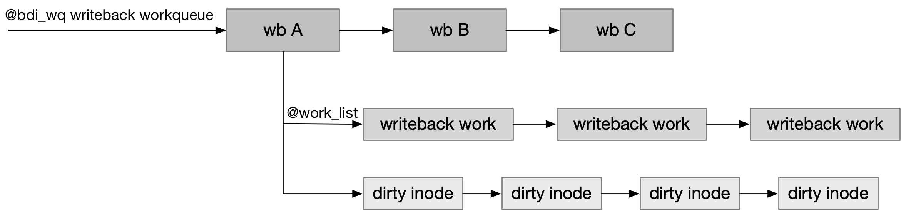
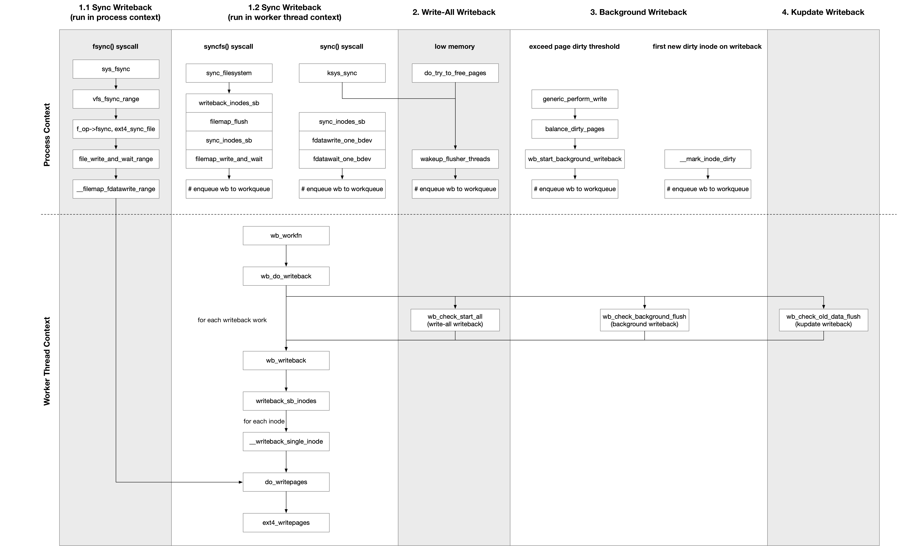

## Writeback - 2 Entry


### Writeback Framework Design

系统中有很多入口都会触发回写操作，例如

- 用户调用 sync 主动发起回写操作，对系统中的某个 gendisk、或某个文件系统、或某个文件执行回写操作
- 当系统内存紧张而发生内存回收时，会发起回写操作，以回收一定数量的 page frame
- write 系统调用中，系统范围内的 dirty page 数量超过一定阈值时，会发起回写操作
- periodic kupdate writeback，即同一个 dirty page 的回写操作不能延迟太久，因而需要定期对延迟达到一定时间的 dirty page 执行回写操作

这些入口中，只有 sync 调用是需要同步执行回写操作的，因而会在发起 sync 调用的进程上下文中调用相关函数执行回写操作；而其他入口都是可以异步执行回写操作的，因而 writeback 框架中使用 worker thread 来处理这一类可以异步执行的回写操作


对于这一类可以异步执行的回写操作，在 3.10 之后 writeback 框架使用 workqueue 代替之前的 per-BDI flush thread 机制，使用名为 "writeback" 的全局 workqueue 调度系统中所有 gendisk 的 dirty page writeback 操作，在 worker thread 上下文中处理这些回写任务

```c
/* bdi_wq serves all asynchronous writeback tasks */
struct workqueue_struct *bdi_wq;
```


对于这一类可以异步执行的回写操作，必须提供某种同步机制，使得下发回写任务的当前进程告诉 worker thread，当前需要回写的 wb 以及对应的 writeback work，实际上也就是 wb_writeback() 的两个参数

这里 writeback 框架实际上使用类似于两级链表的结构来组织需要回写的 wb 与对应的 writeback work




- 首先每个 wb 都维护有一个 work 以方便将该 wb 添加到 @bdi_wq workqueue 中

```c
struct bdi_writeback {
	struct delayed_work dwork; /* work item used for writeback */
	...
}
```

- 其次 wb 中维护一个 @work_list 链表以组织该 wb 下的所有 writeback work

```c
struct bdi_writeback {
	struct list_head work_list;
	...
}
```


对于这一类可以异步执行的回写操作，触发回写任务的入口可以

1. 在进程上下文中初始化一个 writeback work，并添加到对应 wb->work_list 链表中，之后将该 wb 添加到 workqueue 中，之后在 worker thread 上下文中处理这个 wb 的回写任务，实际上就是执行 wb->work_list 链表中的所有 writeback work
2. 或者是在进程上下文中直接将对应的 wb 添加到 workqueue 中，之后在 worker thread 上下文中初始化一个 writeback work，并执行该 writeback work 描述的回写任务


### Writeback Entry



上图总结了触发回写操作的所有入口

从纵轴来看，只有 sync 调用会在触发回写操作的当前进程的上下文中同步执行回写操作，其他入口都是在进程上下文中将需要回写的 wb 添加到 workqueue 中，之后在 worker thread 上下文中处理这个 wb 的回写任务

从横轴来看，触发回写操作的入口可以分为以下几类

#### Sync Writeback (process context)

目前只有 fsync 调用会在当前进程的上下文中同步执行回写操作

##### fsync

fsync 系统调用对特定文件执行回写操作，包括文件的数据与元数据

当用户调用 fsync 系统调用时，会调用 sync_inode_metadata()，其中会直接调用 writeback_single_inode() 对传入的特定文件执行 writeback 操作

```
sys_fsync
    vfs_fsync_range
        f_op->fsync, ext4_sync_file
            file_write_and_wait_range
                __filemap_fdatawrite_range
```

这里会发起一个回写任务，在当前进程的上下文中对文件的数据与元数据进行回写操作，由于此时是 WB_SYNC_ALL 模式的回写，因而会等待回写下发的 IO 完成

```c
writeback control
		.sync_mode            = WB_SYNC_ALL,
		.nr_to_write          = ALL,
```

#### Sync Writeback (worker thread context)

sync/syncfs 调用都是在当前进程上下文中初始化一个 writeback work，并添加到对应 wb->work_list 链表中，之后将该 wb 添加到 workqueue 中，之后在 worker thread 上下文中处理这个 wb 的回写任务，即 wb->work_list 链表中的 writeback work

此时 work thread 中是直接遍历处理 wb->work_list 链表中的所有 writeback work

##### sync

sync 系统调用对系统中所有的 gendisk 执行回写操作

当用户调用 sync syscall 时，会调用 wakeup_flusher_threads()，其中将当前系统中注册的所有 gendisk 添加到 workqueue，之后唤醒 worker thread 对所有的 gendisk 依次执行 single writeback 操作，以回写当前系统中所有 gendisk 的所有 dirty page

```
ksys_sync
    wakeup_flusher_threads(WB_REASON_SYNC)
    for each superblock
        sync_inodes_sb
        fdatawrite_one_bdev
        fdatawait_one_bdev
```

1. 唤醒 worker thread 处理之前积压的所有 writeback work

2. 对所有 superblock 下发回写数据的任务

首先调用 sync_inodes_sb() 中下发数据的回写操作，同时等待回写数据的 IO 完成，其中由于 @for_sync 参数被置位，因而实际上并没有下发并等待回写元数据的 IO 完成

```c
writeback work
		.sb                   = sb,
		.reason               = WB_REASON_SYNC,
		.sync_mode            = WB_SYNC_ALL,
		.for_sync             = 1
		.range_cyclic         = 0
		.nr_pages             = ALL,
```

这一步也是将当前的回写任务添加到 @bdi_wq workqueue 中，由 worker thread 执行回写任务，当前进程上下文中只是阻塞等待该回写任务完成

3. 对所有 superblock 下发回写元数据的任务，实际上是对该文件系统所在的 block device 对应的 bdev inode 的 address space 执行回写操作

- 调用 fdatawrite_one_bdev() 下发回写元数据的任务，并等待这些回写元数据的 IO 完成

```c
writeback control
		.sync_mode            = WB_SYNC_ALL,
		.nr_to_write          = ALL,
```

这个回写任务是在当前进程的上下文中执行的

- 最后调用 fdatawait_one_bdev() 确保回写元数据的 IO 完成，实际上是等待 bdev inode 的 address space 中的所有 buffer page 的 writeback 状态清除，这一步是在当前进程的上下文中执行的


##### syncfs

syncfs 系统调用对特定文件所在的文件系统发起回写任务

当用户调用 syncfs syscall 时，会调用 writeback_inodes_sb_nr()，其中会将当前传入的 gendisk 添加到 workqueue 中，之后唤醒 worker thread 对传入的 gendisk 执行 single writeback 操作

```
sys_syncfs
    sync_filesystem
        writeback_inodes_sb(sb, WB_REASON_SYNC)
        filemap_flush(bdev->bd_inode->i_mapping)
        sync_inodes_sb(sb)
        filemap_write_and_wait(bdev->bd_inode->i_mapping)  
```

1. 第一次对数据/元数据执行 WB_SYNC_NONE 模式的回写

- writeback_inodes_sb() 中对数据进行回写，但是并不等待回写数据的 IO 完成，其中由于是 WB_SYNC_NONE 模式的回写，因而实际上并没有下发回写元数据的 IO

```c
writeback work
		.sb                   = sb,
		.reason               = WB_REASON_SYNC,
		.sync_mode            = WB_SYNC_NONE,
		.tagged_writepages    = 1,
		.nr_pages             = ALL,
```

```c
int ext4_write_inode(struct inode *inode, struct writeback_control *wbc)
{
		/*
		 * sync(2) will flush the whole buffer cache. No need to do
		 * it here separately for each inode.
		 */
		if (wbc->sync_mode == WB_SYNC_ALL && !wbc->for_sync)
			sync_dirty_buffer(iloc.bh);
		...
}
```

这一步是将当前的回写任务添加到 @bdi_wq workqueue 中，由 worker thread 执行回写任务，当前进程上下文中只是阻塞等待该回写任务完成


- 对元数据的回写推迟到 filemap_flush() 中完成，由于所有 inode 的元数据即 inode table 所在的 buffer page 实际上都是维护在该文件系统所在的 block device 对应的 bdev inode 的 address space 中，因而这里对 bdev inode 的 address space 进行回写，实际上就是对该文件系统中所有 inode 的元数据进行回写

```c
writeback control
		.sync_mode            = WB_SYNC_NONE,
		.nr_to_write          = ALL,
```

这个回写任务是在当前进程的上下文中执行的


2. 第二次对数据/元数据执行 WB_SYNC_ALL 模式的回写

- sync_inodes_sb() 中等待回写数据的 IO 完成，其中由于 @for_sync 参数被置位，因而实际上并没有下发并等待回写元数据的 IO 完成

```c
writeback work
		.sb                   = sb,
		.reason               = WB_REASON_SYNC,
		.sync_mode            = WB_SYNC_ALL,
		.for_sync             = 1
		.range_cyclic         = 0
		.nr_pages             = ALL,
```

这一步也是将当前的回写任务添加到 @bdi_wq workqueue 中，由 worker thread 执行回写任务，当前进程上下文中只是阻塞等待该回写任务完成


- 最后是在 filemap_write_and_wait() 中等待回写元数据的 IO 完成，实际上是等待该文件系统所在的 block device 对应的 bdev inode 的 address space 中的 dirty page 下刷完成

这一步并没有调用 writeback 框架的函数，也就是没有下发 writeback work 或 writeback control，而是在当前进程的上下文中等待 bdev inode 的 address space 中的所有 buffer page 的 writeback 状态清除


#### Write-All Writeback

sync 系统调用以及 memory reclaim 过程中都会期待回写当前系统中所有 gendisk 的所有 dirty page，我们将这种回写任务称为 write-all 回写任务

此时在当前进程上下文中只是将 wb->state 标志位设置上 WB_start_all 标志，之后将该 wb 添加到 workqueue 中，之后在 worker thread 上下文中初始化一个 writeback work，并处理这个 writeback work 描述的回写任务


##### low memory

当由于内存紧张而导致 page 分配失败，进而进入 direct claiming 时，会调用 wakeup_flusher_threads() 发起回写任务，以回收一定数量的 page frame

```
do_try_to_free_pages
    shrink_zones
        shrink_node
            shrink_node_memcg
                shrink_list
                    shrink_inactive_list
                        wakeup_flusher_threads(WB_REASON_VMSCAN)
```

这里是对于系统中所有的 gendisk，唤醒 worker thread 处理之前积压的所有 writeback work


##### write-all writeback routine

sync 系统调用以及 memory reclaim 过程中会将 wb->state 标志位设置上 WB_start_all 标志，并将该 wb 添加到 @bdi_wq writeback workqueue 中

之后在 worker thread 上下文中，会首先处理 write-all 回写任务，其主要函数为 wb_check_start_all()，其中如果该 wb 设置有 WB_start_all 标志，那么就会下发一个 write-all 回写任务

```c
writeback work
		.reason               = WB_REASON_SYNC/WB_REASON_VMSCAN,
		.sync_mode            = WB_SYNC_NONE,
		.range_cyclic         = 1
		.nr_pages             = ALL,
```

这里如果时 sync 系统调用触发的回写任务，那么 @reason 字段的值为 WB_REASON_SYNC；而如果是内存回收触发的回写任务，那么 @reason 字段的值为 WB_REASON_VMSCAN

同时需要注意这里的 writeback work 是在 worker thread 上下文中下发的，而不是在执行 sync 系统调用或内存回收时的进程上下文中下发的，进程上下文中只是将 wb 设置上 WB_start_all 标志，同时将该 wb 添加到 @bdi_wq writeback workqueue 中

之后就是调用 wb_writeback() 处理这个 write-all 回写任务


#### Background Writeback

为了确保内存中 dirty page 的总量不能过多，当系统中 dirty page 的数量达到某个阈值时，就需要执行回写操作，以回收一定数量的 page frame，这称为 background writeback，其入口主要有

- 某个 wb 中首次出现新的 dirty inode，此时需要对该 wb 发起 background writeback
- 当前系统中 dirty page 数量过多，write routine 中在将数据写到 page cache 的时候，会检查当前系统中所有 dirty page 的数量是否超过阈值，若是则发起 background writeback

此时在触发回写操作的当前进程上下文中，只是将对应的 wb 添加到 workqueue 中，之后 worker thread 上下文中，会检查这个 wb 占有的 dirty page 数量是否超过阈值，如果超过了该 wb 占有的配额，那么会初始化一个 writeback work，并处理这个 writeback work 描述的回写任务

background writeback 的主要函数为 wb_check_background_flush()

background writeback 与 write-all writeback 的区别是，后者会回写系统中的所有 dirty page，而前者只要当前 dirty page 的数量下降到阈值以下，那么就认为该 background 回写任务已经完成


##### first new dirty inode on writeback

page cache write routine 中，若当前 inode 对应的 wb 由 clean 状态转变为 dirty 状态，即当前执行写操作的 inode 是该 wb 上再次出现的第一个 dirty inode（虽然 wb 之前可能出现过 dirty inode，但这些 dirty inode 在之前就已经全部回写完成，此时再次出现一个新的 dirty inode）时，会调用 wb_wakeup_delayed() 将该 wb 添加到 writeback workqueue 中

```
__mark_inode_dirty
    wb_wakeup_delayed
```

这种情况下是由 worker thread 执行回写任务


##### exceed page dirty threshold

进程在执行 page cache write routine 中，需要检查当前系统中所有 dirty page 的数量是否超过阈值，如果超过阈值就会调用 wb_wakeup() 将当前执行写操作的 inode 对应的 wb 添加到 writeback workqueue 中

当满足以下条件时即认为超过阈值

- 若系统中所有 dirty page 的数量大于 freerun threshold 即 ((background writeback threshold + dirty page threshold) / 2)，则对当前执行写操作的 gendisk 执行 background writeback 操作，同时令当前进程进入 TASK_KILLABLE 状态睡眠一段时间，直到系统中所有 dirty page 的数量降到 freerun threshold 以下
- 同时若系统中所有 dirty page 的数量大于 background writeback threshold，则对当前执行写操作的 gendisk 执行 background writeback 操作

```
generic_perform_write
    balance_dirty_pages_ratelimited
        balance_dirty_pages
            wb_start_background_writeback
                wb_wakeup
```

这种情况下是由 worker thread 执行回写任务


##### background writeback routine

worker thread 上下文中，会检查这个 wb 占有的 dirty page 数量是否超过阈值，如果超过了该 wb 占有的配额，那么会初始化一个 writeback work，并处理这个 writeback work 描述的回写任务

```c
writeback work
		.reason               = WB_REASON_BACKGROUND,
		.sync_mode            = WB_SYNC_NONE,
		.for_background       = 1,
		.range_cyclic         = 1,
		.nr_pages             = ALL,
```

同样是调用 wb_writeback() 处理这个 background 回写任务


> check background writeback throttle

```c
static long wb_check_background_flush(struct bdi_writeback *wb)
{
	if (wb_over_bg_thresh(wb)) {
		wb_writeback(wb, &work);
	}
	...
}
```

TODO

background 回写任务中会调用 wb_over_bg_thresh() 检查当前 dirty page 的水平，如果当前 dirty page 的数量超过了阈值，才会真正执行 background 回写任务


- vm.dirty_background_bytes 或 vm.dirty_background_ratio 参数描述整个系统的 background writeback threshold，只有当系统中 dirty page 总数超过该阈值时，系统才可以执行 background writeback，这个阈值有两种计算方法
    - 一种是 vm.dirty_background_bytes 直接描述该阈值
    - 另一种是 (vm.dirty_background_ratio * 系统内存总量) 也可以描述该阈值
- 若当前所有 gendisk 的 dirty page 总数超过该阈值，则需要对当前遍历的 writeback 执行回写操作


> execute background writeback work

通常情况下 wb_writeback() 中会一直执行回写操作直到 work->nr_pages 变为 0，即回写完成预设数量的 dirty page

但是在 background 回写任务中，work->nr_pages 的值为 LONG_MAX，因而不能依赖 work->nr_pages 变为 0 才停止回写，实际上连续回写 (HZ / 10) 即 100 ms 之后，就会调用 wb_over_bg_thresh() 检查一次当前 dirty page 水平，只要当前 dirty page 的数量下降到阈值以下，那么就认为该 background 回写任务已经完成

```c
static long wb_writeback(struct bdi_writeback *wb,
			 struct wb_writeback_work *work)
{
	for (;;) {
		/*
		 * Stop writeback when nr_pages has been consumed
		 */
		if (work->nr_pages <= 0)
			break;


		/*
		 * For background writeout, stop when we are below the
		 * background dirty threshold
		 */
		if (work->for_background && !wb_over_bg_thresh(wb))
			break;
	}
	...
}
```


#### Kupdate Writeback

##### kupdate writeback routine

writeback framework 需要解决的另一问题是，同一个 dirty page 的回写操作不能延迟太久，因而需要定期执行 kupdate 回写操作，即周期性地对延迟达到一定时间的 dirty page 执行回写操作，称为 periodic kupdate 回写任务，其主要函数在 wb_check_old_data_flush()

periodic kupdate 回写任务的周期为 (vm.dirty_writeback_interval * 10 ms)，dirty_writeback_interval 的默认值为 500，即 periodic kupdate 回写的默认周期为 5s


worker thread 中会定期下发一个 periodic kupdate 回写任务，并调用 wb_writeback() 处理这个回写任务

```c
writeback work
		.reason               = WB_REASON_PERIODIC,
		.sync_mode            = WB_SYNC_NONE,
		.for_kupdate          = 1,
		.range_cyclic         = 1,
		.nr_pages             = ALL,
```

值得注意的是，kupdate 回写任务中并不会对该 wb 下的所有 dirty inode 都执行回写操作，只有对那些数据或元数据被更新时刻 (@dirtied_when) 距离当前时刻已经超过 (dirty_expire_interval * 10) 也就是 30 秒，也就是已经超时的 inode 才会执行回写操作，当所有超时的 dirty inode 都回写完成时，kupdate 回写任务也就完成了

```c
static long wb_do_writeback(struct bdi_writeback *wb)
{
	...
	/* sync writeback (worker thread context) */
	while ((work = get_next_work_item(wb)) != NULL) {
		wb_writeback(wb, work);
	}
	
	/* write-all writeback */
	wrote += wb_check_start_all(wb);

	/* periodic kupdate writeback */
	wrote += wb_check_old_data_flush(wb);

	/* background writeback */
	wrote += wb_check_background_flush(wb);
	...
}
```
