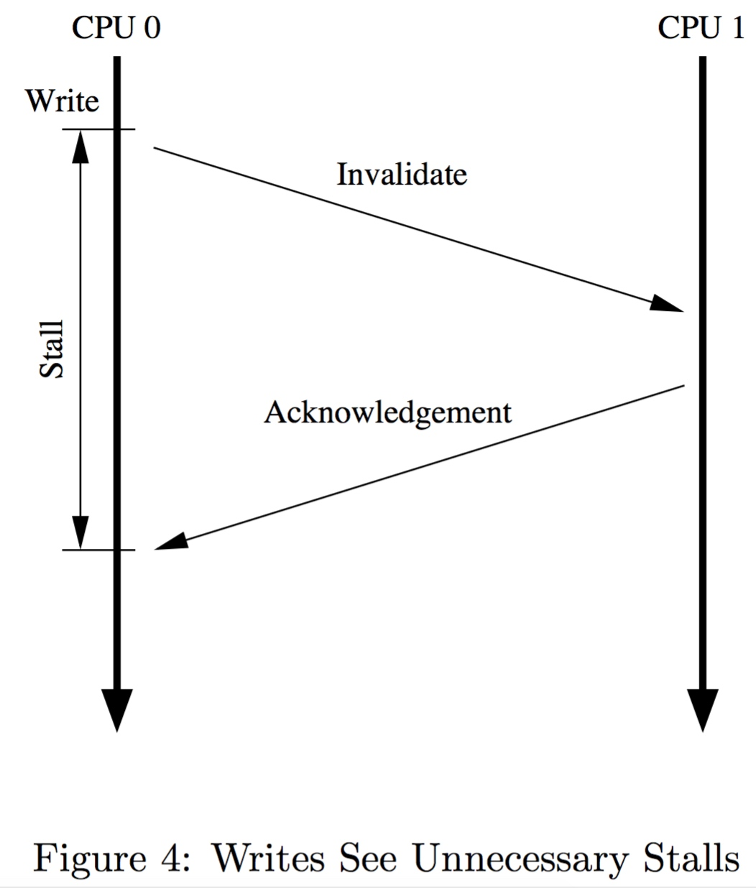
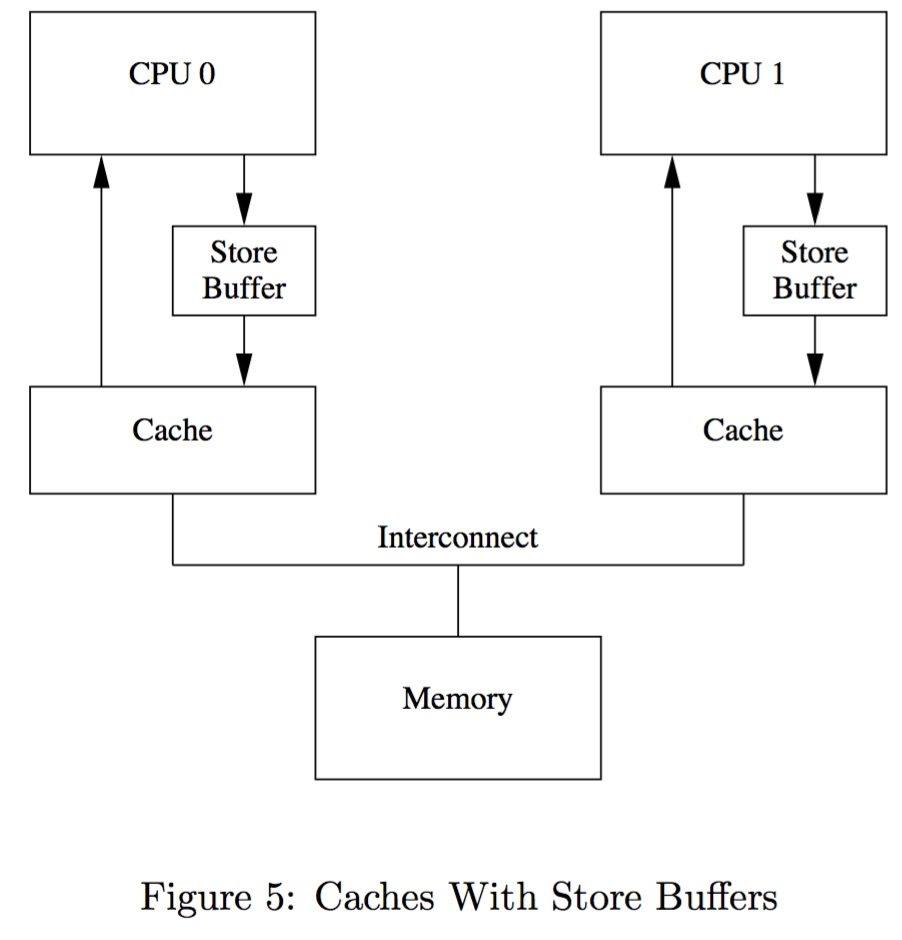
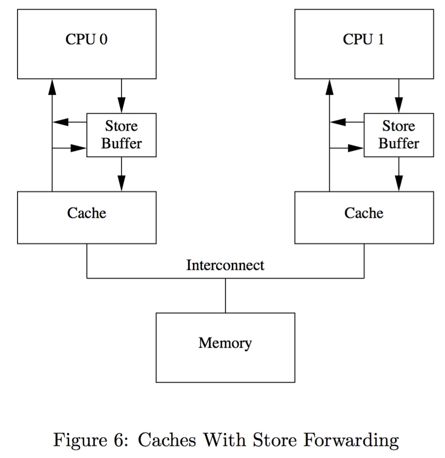
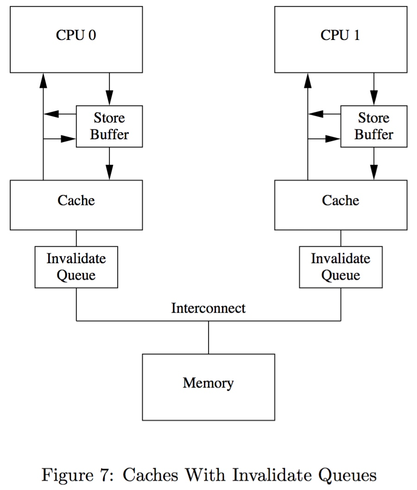

# Barrier - Memory Barrier
# Barrier - Memory Barrier

## Intro

### memory reordering

在介绍 memory barrier 之前，首先需要介绍 memory reordering

memory reordering 是指指令实际执行的顺序与代码编写时的顺序不一致，即指令发生重排，通常在以下两个步骤发生

1. compiler reordering (compile time)
2. CPU reordering (run time)


memory reordering 其实是一种优化，其目的是为了提高代码运行的速度，其基本原则是

> Memory reordering shall not modify the behavior of a single-threaded program.

因而 memory reordering 不会影响 single-threaded program

但是由于这种优化是在编译器 (compiler reordering) 与 CPU (CPU reordering) 层面进行的，编译器与 CPU 并不知道上层软件的设计是单线程的还是多线程的

如果是单线程的，那么 memory reordering 这种优化在提高代码运行速度的同时，并不会对程序的语义带来任何问题；然而如果是多线程的，那么这种优化有时就会对程序的语义带来问题，更准确地说

- compiler memory reordering 会影响 multi-thread program on single-core processor 以及 multi-thread program on multi-core processor
- CPU reordering 和 CPU cache 相关，因而 CPU reordering 只会影响 parallel thread/program on multi-core processor


### memory barrier

正是因为以上介绍的 memory reordering 会影响程序的正确执行，我们需要 memory barrier 来消除这种影响

我们日常编程中可能比较少关注 memory barrier，这是因为我们日常使用的 spinlock/mutex 等锁机制内部已经使用到 memory barrier，只有在无锁编程中才需要开发者显式地使用 memory barrier

正如以上介绍的 memory reordering 包含 compiler reordering 与 CPU reordering 两种，对应地 memory barrier 也包含 compiler barrier 和 CPU barrier 两种

以下将分别介绍这两种类型的 memory reordering 与 memory barrier


## Compiler Barrier

### compiler reordering

编译器在编译过程中可能会采取一系列的编译优化，例如使用寄存器 (register) 缓存内存中变量的值、指令重排等，这些优化的前提是在 single-thread 程序中这些优化并不能影响程序功能 (functionality) 的正常实现

但是在 multi-thread 程序中，这些优化有时就会带来问题，考虑以下程序

```c
int a = 1;

void foo(void) {
    while (a) ;
}

void bar(void) {a = 0;}
```

假设程序中有两个线程，一个线程执行 foo()函数，另一个线程执行 bar() 函数，两个线程会并行访问全局变量 a


在默认不开启任何优化选项时，编译器输出的 foo() 函数为

```s
foo:
.L2:
        movl    a(%rip), %eax   // %eax = a
        testl   %eax, %eax      // test if a == 0
        jne     .L2             // reenter the loop if a != 0
        popq    %rbp
        .cfi_def_cfa 7, 8
        ret                     // exit and return if a == 0
```

可以看到在未开启优化的时候，编译器的输出是符合程序的设计意图的


再来看看开启编译优化 (gcc -O2) 时，编译器输出的 foo() 函数

```s
foo:
.LFB0:
        movl    a(%rip), %eax   // %eax = a
        testl   %eax, %eax      // test if %eax == 0
        jne     .L4
        rep ret                 // exit and return if %eax == 0
.L4:
        jmp     .L4             // infinite loop
```

可以看到此时 foo()函数会陷入无限循环，此时 foo() 的 C 代码相当于是

```c
int a = 1;

void foo(void) {
        register int reg = a;
        while (reg) ;
}
```

这正是因为编译器使用寄存器对内存的值进行缓存的编译优化，在 single-thread 程序中这种优化自然无伤大雅，然而在 multi-thread 程序中，其中一个线程会陷入无限循环，即使其他线程已经修改了全局变量 a 的值


### compiler barrier

导致这种问题的根本原因是，编译器层面的优化不可能知道上层软件的具体设计，编译器不知道上层软件到底设计为 single-thread 还是 multi-thread，因而解决办法是由上层软件的设计者（通过 **compiler barrier**）显式地告诉编译器，在读取特定变量的时候，从内存读取该变量的值，而不是复用之前读取的缓存在寄存器中的值


需要注意的是，compiler barrier 只会约束 gcc 编译器，而不约束运行时的 CPU 行为；也就是说，compiler barrier 是在编译阶段生效的，它不会在生成的指令中插入专门的特殊指令（例如以下介绍的 CPU barrier 实际上就是对应特殊指令，例如 aarch64 架构下是对应dmb 指令），而只是会影响最终编译生成的内存 load/store 指令的排布

> Note that "barrier()" is purely a compiler barrier. It has zero impact on the CPU pipeline itself, and also has zero impact on anything that gcc knows isn't visible in memory (ie local variables that don't have their address taken), so barrier() really is pretty cheap.
> 
> *Linus.*


#### barrier()

linux 中实际上有好几种方式实现 compiler barrier

barrier() 就是其中一种常用的 compiler barrier，其具体实现是编译器相关的，gcc 版本的实现在 `include/linux/compiler-gcc.h` 中定义

```c
#define barrier()__asm__ __volatile__("": : :"memory")
```

gcc 中的 barrier() 实际上是一个空指令，其中只是用到了一个 "memory" clobber，其释义为

> The "memory" clobber tells the compiler that the assembly code performs memory reads or writes to items other than those listed in the input and output operands. To ensure memory contains correct values, GCC may need to flush specific register values to memory before executing the asm. Further, the compiler does not assume that any values read from memory before an asm remain unchanged after that asm; it reloads them as needed. Using the "memory" clobber effectively forms a read/write memory barrier for the compiler.

"memory" clobber 实际上是告诉编译器，这条指令可能会读取或写入任何内存地址，那么编译器会变得保守起来，使得该条指令之前的内存访问操作不会移到这条指令后面，该条指令之后的内存访问操作也不会移到这条指令前面，从而防止编译时编译器优化造成的指令顺序重排，从而确保 barrier() 前后的代码块的相对顺序

此外 "memory" clobber 还有一个副作用是，编译器会将所有寄存器中缓存的值下刷到内存，之后再重新读取内存中的值并缓存到寄存器中，从而达到抑制 compiler reordering 优化的目的


**effect of barrier()**

接下来我们看一下 barrier() 的效果

```c
#define barrier()__asm__ __volatile__("": : :"memory")
int a = 1;

void foo(void) {while (a) barrier();}
```

此时开启编译优化 (gcc -O2) 时，编译器输出的 foo() 函数为

```s
foo:
.LFB0:
        .cfi_startproc
        jmp     .L6
        .p2align 4,,10
        .p2align 3
.L5:
.L6:
        movl    a(%rip), %eax
        testl   %eax, %eax
        jne     .L5
        rep ret
        .cfi_endproc
```

可以看到加上 barrier() 之后，恢复为从内存读取变量的值


#### why volatile deprecated

另外一种实现 compiler barrier 的方法是，C 语言中的 volatile 关键词

volatile 关键词用于告知编译器，其修饰的变量的值很可能被程序之外的因素（如该变量存储于硬件寄存器 IO 映射的内存）改变，因而防止编译器对该变量进行缓存优化；对于 volatile 修饰的变量，编译器不能对该变量进行缓存，当每次使用该变量的值时，编译器必须从内存重新读取该变量的值


虽然 barrier() 和 volatile 都有抑制编译器优化的效果，但是两者还是存在着细微的差别

由于 volatile 是修饰一个变量的，那么 volatile 就会一直伴随着这个变量，也就是说这个变量再也不能使用寄存器对其进行缓存，今后访问这个变量时每次都需要从内存重新读取该变量的值

还是考虑以上的例子，此时将全局变量 a 修饰为 volatile，并且在循环中访问变量 a

```c
volatile int a = 1;

void foo(void) {while (a) {b = a;};
}
```

此时编译器 gcc -O2 的编译输出为

```s
foo:
.LFB0:
        movl    a(%rip), %eax   
        testl   %eax, %eax      
        je      .L1
.L6:
        movl    a(%rip), %edx   // 3) read a from memory again 
        movl    a(%rip), %eax   // 1) %eax = a
        testl   %eax, %eax      // 2) test if %eax == 0
        jne     .L6
        movl    %edx, b(%rip)
.L1:
        rep ret             // exit and return if a == 0
```

可以看到每次循环都执行了两次读内存的操作，显然是带来了不必要的开销


同样的例子，再来看一下使用 barrier() 的效果

```c
void foo(void) {while (a) {
                b = a;
                barrier()};}
```

此时编译器 gcc -O2 的编译输出为

```s
foo:
        jmp     .L9
.L7:
        movl    %eax, b(%rip)   // b=a if a != 0
.L9:
        movl    a(%rip), %eax   // %eax = a
        testl   %eax, %eax      // test if %eax == 0
        jne     .L7
        rep ret                 // exit and return if a == 0
```

可以看到每次循环执行一次读内存的操作，同时在执行 b=a 时复用寄存器中缓存的 a 值


从以上的例子中可以看出，相对于 volatile，barrier() 显然是一个更好的选择

实际上 volatile 关键词一开始就是用于修饰 IO mapped memory 中的变量，这些变量实际上映射为硬件处理器的寄存器空间，这些变量的值随时有可能被硬件逻辑修改，因而 CPU 在访问这些变量的时候，不能复用之前寄存器中缓存的值，而必须重复读取内存中的值

虽然如今 volatile 并不限于 IO mapped memory 这一用途，但是像之前介绍的那样，volatile 会完全限制编译器的编译优化，因而实际上 Linux 内核中越来越不推荐使用 volatile


#### ACCESS_ONCE()

但是 barrier() 就足够完美了吗？也不是。根据 "memory" clobber 的释义，barrier() 会在调用 barrier() 的时刻，将**所有** CPU 寄存器中缓存的值下刷，之后再重新读取内存中的值并缓存到寄存器中，这相当于是全量的 compiler barrier

如果现在只是需要消除对某一个特定变量的 compiler reordering 优化，使用 barrier() 相当于是抑制了所有变量的 compiler reordering 优化，本来只是需要手术刀式的精准打击，使用 barrier() 就相当于是全量的狂轰滥炸

本来上节介绍的 volatile 关键词是可以用于实现只对特定变量抑制 compiler reordering 优化的，但是正如之前介绍的，volatile 会伴随变量的一生，而大部分时候我们只是希望在特定的时刻消除特定变量的 compiler reordering 优化


[ACCESS_ONCE()](https://lwn.net/Articles/508991/) 正是为此而生，其定义为

```c
#define ACCESS_ONCE(x) (*(volatile typeof(x) *)&(x))
```

这里虽然还是使用 volatile 关键字来抑制编译器的优化，但是之前是直接将整个变量声明为 volatile，而这里 ACCESS_ONCE() 则是通过指针的方式，将变量**临时地**转换为 volatile 变量，相当于只有调用 ACCESS_ONCE() 的时候才会抑制编译器优化，而在其他地方访问变量的时候，编译器优化是正常开启的


#### READ_ONCE()/WRITE_ONCE()

READ_ONCE()/WRITE_ONCE() 是 ACCESS_ONCE() 的升级版本，由于 ACCESS_ONCE() 自身存在的缺陷（[ACCESS_ONCE() and compiler bugs](https://lwn.net/Articles/624126/)），内核代码逐渐使用 READ_ONCE() 替代 ACCESS_ONCE()，最终在 v4.15 移除 ACCESS_ONCE()

目前内核中 barrier() 和 READ_ONCE()/WRITE_ONCE() 都有使用，其中后者用于 compiler barrier 的同时，有时也用于显式地**标记**其访问的变量存在并行无锁访问


> fault since compiler bug

准确地说，并不是 ACCESS_ONCE() 本身存在缺陷，而是编译器的 bug 导致了 ACCESS_ONCE() 的实现存在缺陷

GCC 4.6/4.7 版本存在一个 bug，那就是当变量不是 scalar 类型的时候，会移除变量修饰的 volatile，从而导致 ACCESS_ONCE() 失效

例如对于以下 pte_t 类型的变量执行 ACCESS_ONCE() 访问就会失效

```c
typedef struct {
	unsigned long pte;
} pte_t;

pte_t p = ACCESS_ONCE(pte);
```


> READ_ONCE()

尽管这是编译器的 bug 导致了这一问题，而 ACCESS_ONCE() 本身的设计是符合 C 语言语义的，但是由于当时 GCC 4.6/4.7 版本使用非常广泛，因而内核社区还是决定对 ACCESS_ONCE() 进行改进以规避这一问题


```c
#define __READ_ONCE(x, check) \
({									\
	union { typeof(x) __val; char __c[1]; } __u; \
	if (check)						\
		__read_once_size(&(x), __u.__c, sizeof(x)); \
	else								\
		__read_once_size_nocheck(&(x), __u.__c, sizeof(x)); \
	smp_read_barrier_depends(); /* Enforce dependency ordering from x */ \
	__u.__val;						\
})
#define READ_ONCE(x) __READ_ONCE(x, 1)
```

READ_ONCE() 实际调用 __read_once_size()

```c
#define __READ_ONCE_SIZE	\
({									\
	switch (size) {			\
	case 1: *(__u8 *)res = *(volatile __u8 *)p; break;   \
	case 2: *(__u16 *)res = *(volatile __u16 *)p; break; \
	case 4: *(__u32 *)res = *(volatile __u32 *)p; break; \
	case 8: *(__u64 *)res = *(volatile __u64 *)p; break; \
	default:						\
		barrier();					\
		__builtin_memcpy((void *)res, (const void *)p, size); \
		barrier();					\
	}								\
})

static __always_inline
void __read_once_size(const volatile void *p, void *res, int size)
{
	__READ_ONCE_SIZE;
}
```

规避的原理非常简单，就是将 non-scalar 类型强制转换为 scalar 类型，之后再按照 ACCESS_ONCE() 中那样将转换后的 scalar 类型的变量临时转换为 volatile 的进行访问


> WRITE_ONCE()

对应的 write 版本为

```c
WRITE_ONCE(x, val)
```


## CPU Barrier

### CPU reordering

之前介绍过 memory reordering 有两个来源

一个是 compiler reordering，发生在编译器编译阶段，解决办法是在不需要编译优化的地方显式地插入 compiler barrier

memory reordering 的另一个来源则是 CPU reordering，发生在 CPU 运行阶段

我们这里讨论的 memory reorder 主要是指两条内存操作 (read/write) 指令之间发生 reorder，因而 memory reorder 实际分为以下四种情况

- read after write (RAW), StoreLoad
- between two writes (WAW), StoreStore
- write after read (WAR), LoadStore
- between two reads (RAR), LoadLoad

在处理器发展的早期阶段实际上并不存在 memory reorder，后来随着 local cache、invalidate queue、store buffer 这些硬件优化机制的引入，memory reorder 才逐渐显现，可以说正是这些硬件优化机制的引入，带来了 memory reorder，下文将一一介绍 memory reorder 的四种情况


*本节参考*
> 1. Is Parallel Programming Hard, And, If So, What Can You Do About It?
> 2. Memory Barriers: a Hardware View for Software Hackers


#### store buffer

memory reordering 的第一个例子与 CPU 使用的 store buffer 相关

CPU 执行 store 操作时，该 CPU 在发送 invalidate message 之后必须等待接收到所有其他 CPU 的 invalidate acknowledge message 之后才能将修改的数据写入 cache line，然而这种等待不是必需的，因为写操作本身就是异步的




此时 CPU 通常使用 store buffer 解决这个问题



在每个 CPU 与 cache 之间增加一个 store buffer，CPU 在执行 store 操作时，在发送 invalidate message 之后，可以直接将需要修改的数据写入 store buffer，之后 CPU 可以继续执行 store 操作之后的其他操作，而不必等待接收所有其他 CPU 的 invalidate acknowledge message，之后当该 store buffer 接收到所有其他 CPU 的 invalidate acknowledge message 后，store buffer 会将 CPU 之前保存在 store buffer 中的修改的数据自动写入 cache line

然而上例中只是经过简化的 store buffer，其实际存在一个问题，考虑以下代码段

```c
a=1;
b=a+1;
assert(b == 2);
```

其中全局变量 a、b 的初始值均为 0，同时初始时变量 a 只在 CPU 1 的 cache line 中缓存，变量 b 只在 CPU 0 的 cache line 中缓存

假设 CPU 0 运行以上代码段，其运行过程为

1. CPU 0 运行 `a=1;` 语句，由于此时变量 a 只在 CPU 1 的 cache line 中缓存，因而 CPU 0 在执行 store 操作时 cache miss，CPU 0 发送 read invalidate message 之后，将变量 a 的新值写入 store buffer
2. CPU 1 接收到 CPU 0 发送的 read invalidate message，并回复 read response message 与 invalidate acknowledge message，其中 read response message 描述变量 a 的值为 0
3. 之后 CPU 0 运行 `b=a+1;` 语句，此时 CPU 0 接收到 CPU 1 的 read response message，其中描述变量 a 的值为 0，因而 CPU 0 的 cache line 中更新变量 a 的值为 0
4. CPU 0 运行 `b=a+1;` 语句时，从 CPU 0 的 cache line 获取变量 a 的值为 0，因而将 cache line 中变量 b 的值更新为 1


以上代码执行的问题在于，CPU 0 在 store buffer 与 cache line 两个不同的地方对同一个变量进行缓存而没有进行同步，下图为改进的 store buffer



在上图所示的 store buffer 中，CPU 在执行 store 操作后同样将修改的值保存到 store buffer 中，之后便继续执行之后的指令，当 CPU 执行 store 之后的 load 操作时，在访问对应的 cache line 之前需要访问 store buffer，若 store buffer 缓存有当前执行 load 操作的数据，load 操作会使用 store buffer 中缓存的数据，而非 cache line 中的数据


#### StoreStore

本节介绍 memory reorder 中的第一种情况 StoreStore

上文介绍过，store buffer 可以提高一个 CPU 指令执行的速度，然而在 SMP 系统中当多个线程或进程在多个 CPU 上并行运行时，store buffer 特性就会造成 StoreStore reorder


**example**

考虑以下代码段

```c
void foo(void) {                    void bar(void) {
    a=1;                                while (b == 0) continue;
    b=1;                                assert(a == 1);
}                                   }

CPU0                                CPU1
                                    a = 0
b = 0
```

其中全局变量 a、b 的初始值均为 0，同时初始时变量 a 只在 CPU 1 的 cache line 中缓存，变量 b 只在 CPU 0 的 cache line 中缓存

假设 CPU 0 运行 foo()函数，CPU 1 运行 bar() 函数，其运行过程为

1. CPU 0 executes a=1. The cache line is not in CPU 0’s cache, so CPU 0 places the new value of “a” in its store buffer and transmits a “read invalidate” message.
2. CPU 1 executes while(b==0)continue, but the cache line containing “b” is not in its cache. It therefore transmits a “read” message.
3. CPU 0 executes b=1. It already owns this cache line (in other words, the cache line is already in either the “modified” or the “exclusive” state), so it stores the new value of “b” in its cache line.
4. CPU 0 receives the “read” message, and transmits the cache line containing the now-updated value of “b” to CPU 1, also marking the line as “shared” in its own cache.
5. CPU 1 receives the cache line containing “b” and installs it in its cache.
6. CPU 1 can now finish executing while(b==0) continue, and since it finds that the value of “b” is 1, it proceeds to the next statement.
7. CPU 1 executes the assert(a==1), and, since CPU 1 is working with the old value of “a”, this assertion fails.
8. CPU 1 receives the “read invalidate” message, and transmits the cache line containing “a” to CPU 0 and invalidates this cache line from its own cache. But it is too late.
9. CPU 0 receives the cache line containing “a” and applies the buffered store just in time to fall victim to CPU 1’s failed assertion.


因而上例中，在 CPU 1 首先接收到变量 b 的 read response message，其中描述变量 b 的值为 1，之后 CPU 1 接收到变量 a 的 invalidate message，因而在 CPU 1 看来，CPU 0 执行的指令顺序实际为

```c
b = 1;
a = 1;
```

即在 CPU 1 看来，CPU 0 存在 memory reordering 现象


然而 CPU 0 自己看来，自己确实是首先修改变量 a，后修改变量 b，及其指令的执行顺序为

```c
a = 1;
b = 1;
```

以上例子中是两条 Store 指令发生 reorder，因而称为 StoreStore


**memory barrier to solve this problem**

以上问题在于 CPU 0 在执行 `a=1;` 语句后将变量 a 的新值保存到 store buffer，之后没有等待接收到所有其他 CPU 的 invalidate acknowledge message 之后便开始执行 `b=1;` 语句，从而使 CPU 0 与 CPU 1 的 cache 之间的同步出现问题

出现这种问题的原因在于，在引进 store buffer 机制之后，在多个 CPU 上并行运行的线程或进程执行的逻辑之间存在某种联系，但是 compiler 以及 processor designer 实际都很难觉察到这种逻辑之间的联系，只有 software programmer 自身清楚这种逻辑关系，因而通常需要由 software programmer 自身显式地使用 memory barrier 解决这种同步问题

memory barrier 由 processor 硬件实现，不同架构的 CPU 都具有不同的 memory barrier instruction，programmer 需要在代码中显式调用 memory barrier 以解决上述问题


```c
void foo(void) {
    a=1;
    smp_mb();
    b=1;
}

void bar(void) {
    while (b == 0) continue;
    assert(a == 1);
}
```

例如上例可以使用 smp_mb() memory barrier 实现 store-store 同步，当调用 smp_mb() memory barrier 时，CPU 会首先对 store buffer 进行 flush 操作，flush 操作过程中会等待接收到所有其他 CPU 的 invalidation acknowledge message 时，将 store buffer 中缓存的修改的数据更新到 cache line，这样当 store buffer 中的所有数据全部更新到 cache line 之后，CPU 才能继续执行 smp_mb() memory barrier 之后的 store 操作（smp_mb() memory barrier 之后的 load 操作可以不必等待 store buffer flush 完成）

当调用 smp_mb() memory barrier 对 store buffer 进行 flush 操作时，CPU 可以一直等待 store buffer 中的数据清空，之后才能继续执行该 memory barrier 之后的 store 操作，或者在 store buffer flush 过程中，CPU 可以继续执行该 memory barrier 之后的 store 操作，但是之后的 store 操作修改的数据都必须保存到 store buffer 中

例如上例中未使用 smp_mb() memory barrier 时，当 CPU 0 执行 `b=1;` 语句时，由于变量 b 只缓存在 CPU 0 的 cache line 中，即 cache hit，因而 CPU 0 可以直接将变量 b 的新值写入 cache line

而在使用 smp_mb() memory barrier 时，当 CPU 0 执行 `b=1;` 语句时，即使此时仍旧 cache hit，但是由于此时正在执行 store buffer flush 操作，因而并不能将变量 b 的新值写入 cache lien，而是必须将变量 b 的新值写入 store buffer，之后 store buffer flush 过程中才将变量 b 的新值更新到 cache line


因而在使用 smp_mb() memory barrier 之后，以上代码的执行流程变为

1. CPU 0 executes a=1. The cache line is not in CPU 0’s cache, so CPU 0 places the new value of “a” in its store buffer and transmits a “read invalidate” message.
2. CPU 1 executes while(b==0)continue, but the cache line containing “b” is not in its cache. It therefore transmits a “read” message.
3. CPU 0 executes smp_mb(), and marks all current store-buffer entries (namely, the a=1).
4. CPU 0 executes b=1. It already owns this cache line (in other words, the cache line is already in either the “modified” or the “exclusive” state), but there is a marked entry in the store buffer. Therefore, rather than store the new value of “b” in the cache line, it instead places it in the store buffer (but in an unmarked entry).
5. CPU 0 receives the “read” message, and trans- mits the cache line containing the original value of “b” to CPU 1. It also marks its own copy of this cache line as “shared”.
6. CPU 1 receives the cache line containing “b” and installs it in its cache.
7. CPU 1 can now finish executing while(b==0) continue, but since it finds that the value of “b” is still 0, it repeats the while statement. The new value of “b” is safely hidden in CPU 0’s store buffer.
8. CPU 1 receives the “read invalidate” message, and transmits the cache line containing “a” to CPU 0 and invalidates this cache line from its own cache.
9. CPU 0 receives the cache line containing “a” and applies the buffered store, placing this line into the “modified” state.
10. Since the store to “a” was the only entry in the store buffer that was marked by the smp_mb(), CPU 0 can also store the new value of “b” — except for the fact that the cache line containing “b” is now in “shared” state.
11. CPU 0 therefore sends an “invalidate” message to CPU 1.
12. CPU 1 receives the “invalidate” message, in- validates the cache line containing “b” from its cache, and sends an “acknowledgement” message to CPU 0.
13. CPU 1 executes while(b==0)continue, but the cache line containing “b” is not in its cache. It therefore transmits a “read” message to CPU 0.
14. CPU 0 receives the “acknowledgement” message, and puts the cache line containing “b” into the “exclusive” state. CPU 0 now stores the new value of “b” into the cache line.
15. CPU 0 receives the “read” message, and trans- mits the cache line containing the new value of “b” to CPU 1. It also marks its own copy of this cache line as “shared”.
16. CPU 1 receives the cache line containing “b” and installs it in its cache.
17. CPU 1 can now finish executing while(b==0) continue, and since it finds that the value of “b” is 1, it proceeds to the next statement.
18. CPU 1 executes the assert(a==1), but the cache line containing “a” is no longer in its cache. Once it gets this cache from CPU 0, it will be working with the up-to-date value of “a”, and the assertion therefore passes.


#### StoreLoad

store buffer 同时还会引入 StoreLoad

考虑以下示例代码

```
CPU 0                    CPU 1
WRITE(A, 1)             WRITE(B, 1)
READ(B)                 READ(A)

                        A = 0
B = 0
```

内存 A 和 B 的初始值都是 0，CPU 0 执行 A=1，CPU 1 执行 B=1，而最终两个 CPU 读取出来的结果可能是 A=B=0

假设初始时变量 A 只在 CPU 1 的 cache line 中缓存，变量 B 只在 CPU 0 的 cache line 中缓存，考虑以下序列

1. CPU 0 执行 A=1 时，cache miss，因而将 A 的新值保存在 store buffer 中，并向 CPU 1 发送 invalidate message
2. 之后 CPU 0 继续执行 READ(B)，cache hit，读取到 B 的值为 0
3. CPU 1 执行 B=1 时，cache miss，因而将 B 的新值保存在 store buffer 中，并向 CPU 0 发送 invalidate message
4. 之后 CPU 1 继续执行 READ(A)，cache hit，读取到 A 的值为 0
5. 之后 CPU 1 才收到 CPU 0 对变量 A 的 invalidate message，将 cache line 中变量 A 的值更新为 1
6. 之后 CPU 0 才收到 CPU 1 对变量 B 的 invalidate message，将 cache line 中变量 B 的值更新为 1


以上 memory reorder 就是 StoreLoad reorder，应对办法就是在 Store 与 Load 之间插入 StoreLoad memory barrier，当执行 StoreLoad memory barrier 时，会对 store buffer 进行 flush 操作，此时 CPU 必须一直等待 store buffer 中的数据清空，之后才能继续执行该 memory barrier 之后的内存访问操作

```
CPU 0                    CPU 1
WRITE(A, 1)             WRITE(B, 1)
smp_mb()                smp_mb()
READ(B)                 READ(A)
```


#### invalidate queue

memory reordering 的第二个例子与 CPU 使用的 invalidate queue 相关

store buffer 的大小通常较小，因而在以下两种情况下 store buffer 会很快被填满

1. CPU 执行的 store 操作发生 cache miss 时必须将当前 store 操作修改的数据缓存到 store buffer 中，之后继续执行之后的指令，而当 CPU 执行的连续多个 store 操作均发生 cache miss 时，store buffer 就有可能被填满，此时 CPU 必须等待接收其他 CPU 的 invalidation acknowledge message 时，才能将 store buffer 中缓存的数据更新到 cache line，store buffer 才会再次出现可用空间
2. CPU 在调用 memory barrier 时，memory barrier 之后的 store 操作都必须缓存到 store buffer 中，而无论对应的 cache line 是否处于 ready 状态，这种状况下 store buffer 也有可能很快被填满，此时 CPU 也必须等待接收其他 CPU 的 invalidation acknowledge message


以上两种情况下，当 store buffer 被填满时，CPU 都必须等待接收其他 CPU 的 invalidation acknowledge message，而 invalidate queue 则可以减小该等待的时间

CPU 有时会延迟 invalidation acknowledge message 的发送，这是因为通常情况下在发送 invalidation acknowledge message 之前，CPU 必须首先对对应的 cache line 执行 invalidate 操作，然而当 CPU 的 load/store 操作的负载较重时，CPU 通常会暂时不处理接收到的 invalidate message，之后负载变轻时再处理该 invalidate message 并回复 invalidation acknowledge message

而在使用 invalidate queue 之后，CPU 可以将接收的 invalidate message 缓存到 invalidate queue 中，并立即发送 invalidation acknowledge message，之后 CPU 在发送 invalidate message 时必须首先检查 invalidate queue 中是否存在对应的 invalidate message




#### LoadLoad

然而 invalidate queue 机制的引入又会带来 LoadLoad reorder 问题

**example**

考虑以下代码段

```c
void foo(void) {
    a=1;
    smp_mb();
    b=1;
}

void bar(void) {
    while (b == 0) continue;
    assert(a == 1);
}
```

其中全局变量 a、b 的初始值均为 0，同时初始时变量 a 同时在 CPU 0 与 CPU 1 的 cache line 中缓存，即 CPU 0 与 CPU 1 中变量 a 均处于 shared state，变量 b 只在 CPU 0 的 cache line 中缓存

假设 CPU 0 运行 foo()函数，CPU 1 运行 bar() 函数，其运行过程为

1. CPU 0 executes a=1. The corresponding cache line is read-only in CPU 0’s cache, so CPU 0 places the new value of “a” in its store buffer and transmits an “invalidate” message in order to flush the corresponding cache line from CPU 1’s cache.
2. CPU 1 executes while(b==0)continue, but the cache line containing “b” is not in its cache. It therefore transmits a “read” message.
3. CPU 1 receives CPU 0’s “invalidate” message, queues it, and immediately responds to it.
4. CPU 0 receives the response from CPU 1, and is therefore free to proceed past the smp_mb() on line 4 above, moving the value of “a” from its store buffer to its cache line.
5. CPU 0 executes b=1. It already owns this cache line (in other words, the cache line is already in either the “modified” or the “exclusive” state), so it stores the new value of “b” in its cache line.
6. CPU 0 receives the “read” message, and transmits the cache line containing the now-updated value of “b” to CPU 1, also marking the line as “shared” in its own cache.
7. CPU 1 receives the cache line containing “b” and installs it in its cache.
8. CPU 1 can now finish executing while(b==0) continue, and since it finds that the value of “b” is 1, it proceeds to the next statement.
9. CPU 1 executes the assert(a==1), and, since the old value of “a” is still in CPU 1’s cache, this assertion fails.
10. Despite the assertion failure, CPU 1 processes the queued “invalidate” message, and (tardily) invalidates the cache line containing “a” from its own cache.


**memory barrier to solve this problem**

以上问题的关键在于 CPU 1 在执行 load 操作访问变量 a 的值之前，没有检查 invalidate queue 中是否存在待处理的变量 a 的 invalidate message


```c
void foo(void) {
    a=1;
    smp_mb();
    b=1;
}

void bar(void) {
    while (b == 0) continue;
    smp_mb();
    assert(a == 1);
}
```

因而在 CPU 1 的两次 load 操作之间调用 LoadLoad memory barrier，LoadLoad memory barrier 会对 invalidate queue 中的 pending invalidate message 对应的 cache line 进行标记，LoadLoad memory barrier 之后的 load 操作对应的 cache line 被标记时，该 load 操作就会一直等待对应的 pending invalidate message 处理完成

即 LoadLoad memory barrier 会等待 invalidate queue 中的所有 pending invalidate message 处理完成，再继续执行 memory barrier 之后的 load 操作


此时代码执行的流程为

1. CPU 0 executes a=1. The corresponding cache line is read-only in CPU 0’s cache, so CPU 0 places the new value of “a” in its store buffer and transmits an “invalidate” message in order to flush the corresponding cache line from CPU 1’s cache.
2. CPU 1 executes while(b==0)continue, but the cache line containing “b” is not in its cache. It therefore transmits a “read” message.
3. CPU 1 receives CPU 0’s “invalidate” message, queues it, and immediately responds to it.
4. CPU 0 receives the response from CPU 1, and is therefore free to proceed past the smp_mb() on line 4 above, moving the value of “a” from its store buffer to its cache line.
5. CPU 0 executes b=1. It already owns this cache line (in other words, the cache line is already in either the “modified” or the “exclusive” state), so it stores the new value of “b” in its cache line.
6. CPU 0 receives the “read” message, and transmits the cache line containing the now-updated value of “b” to CPU 1, also marking the line as “shared” in its own cache.
7. CPU 1 receives the cache line containing “b” and installs it in its cache.
8. CPU 1 can now finish executing while(b==0) continue, and since it finds that the value of “b” is 1, it proceeds to the next statement, which is now a memory barrier.
9. CPU 1 must now stall until it processes all pre-existing messages in its invalidation queue.
10. CPU 1 now processes the queued “invalidate” message, and invalidates the cache line containing “a” from its own cache.
11. CPU 1 executes the assert(a==1), and, since the cache line containing “a” is no longer in CPU 1’s cache, it transmits a “read” message.
12. CPU 0 responds to this “read” message with the cache line containing the new value of “a”.
13. CPU 1 receives this cache line, which contains a value of 1 for “a”, so that the assertion does not trigger.


#### LoadStore

TODO


### CPU barrier

正如上述介绍的那样，解决 CPU reordering 的方法是使用 CPU barrier

CPU reordering | CPU barrier
---- | ----
LoadLoad   | smp_rmb()
StoreStore | smp_wmb()
full       | smp_mb()

Linux kernel 中定义了多种类型的 CPU barrier，其具体实现是架构相关的，其中

- smp_rmb()	 为 read barrier，即保证 barrier 之前的 load 操作先于 barrier 之后的 load 操作完成
- smp_wmb()	 为 write barrier，即保证 barrier 之前的 store 操作先于 barrier 之后的 store 操作完成
- smp_mb()	 为 read/write barrier，即保证 barrier 之前的 load/store 操作先于 barrier 之后的 load/store 操作完成


CPU barrier 会编译为架构下特定的指令，例如 ARM 架构下这些 CPU barrier 实际都编译为 dmb 指令

```c
#define smp_mb()	dmb()
#define smp_rmb()	dmb()
#define smp_wmb()	dmb()

#define dmb() __asm__ __volatile__ ("dmb" : : : "memory")
```

> DMB (data memory barrier) causes the specified type of operations to appear to have completed before any subsequent operations of the same type. The “type” of operations can be all operations or can be restricted to only writes (similar to the Alpha wmb and the POWER eieio instructions). In addition, ARM allows cache coherence to have one of three scopes: single processor, a subset of the processors (“inner”) and global (“outer”).
