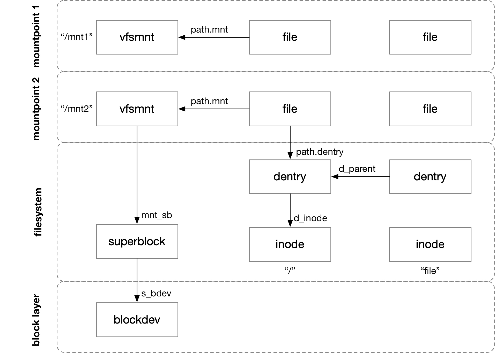

title:'VFS Lifecycle - 1 File'
## VFS Lifecycle - 1 File

VFS 中各个数据结构大部分都是通过 slab cache 动态分配的，因而 VFS 中大量使用引用计数来管理这些数据结构的生命周期

各个数据结构之间的引用关系，表现在数据结构上，实际就是一个数据结构的某个字段维护了一个指向另一个数据结构的指针，例如 dentry 的 @d_inode 字段指向对应的 inode，因而对于一个 inode 来说，这个 inode 每个对应的 dentry 都会增加该 inode 的引用计数




### Object Refcount

#### file

```c
struct file {
	atomic_long_t		f_count;
	...
}
```

@f_count 引用计数管理 file 的生命周期，通过 fget()/fput() 增加或减小其计数

> init

open() 系统调用过程中会创建一个 file 结构，此时 @f_count 的初始值为 1

```
sys_open
    do_sys_open
        do_filp_open
            path_openat
                alloc_empty_file
                    __alloc_file
                        atomic_long_set(&f->f_count, 1)
```

close() 系统调用过程中会减小 @f_count 计数

```
sys_close
    __close_fd
        __put_unused_fd
            filp_close
                fput
                    atomic_long_dec_and_test(&file->f_count)
```


> cleanup

close() 系统调用过程中会调用 fput() 减小 @f_count 计数，这一过程中如果 file 的计数变为 0，就会调用 f_op->release() 回调函数以执行之前 f_op->open() 回调函数的逆操作，最后调用 file_free() 释放这个 file 结构

```
sys_close
    __close_fd
        __put_unused_fd
            filp_close
                fput
                    ____fput
                        file->f_op->release()
                        dput(file->f_path.dentry)
                        mntput(file->f_path.mnt)
                        file_free
```


#### dentry

```c
struct dentry {
	struct lockref d_lockref; /* per-dentry lock and refcount */
	...
}
```

@d_lockref.count 计数维护 dentry 的生命周期，可以通过 dget()/dput() 增加或减小 dentry 的这一计数


> component parsing

pathname lookup 过程分为 final component 与 everything else 两部分，即先解析路径中除 final component 以外的部分，最后再解析 final component 部分。

无论是 final component 部分，还是 everything else 部分，每一轮都需要解析当前 component 对应的 dentry，这一过程分为 slowpath 与 fastpath

- init

pathname lookup 过程中，在解析当前一轮的 component 的时候，如果对应的 dentry 结构尚未创建，就会创建 dentry 结构，也就是所谓的 slowpath，此时 @d_lockref.count 计数的初始值为 1

```
filename_lookup
    path_lookupat
        link_path_walk
            walk_component
                lookup_slow
                    d_alloc_parallel
                        d_alloc
                            __d_alloc
                                dentry->d_lockref.count = 1
```

- fastpath

pathname lookup 过程中，在解析当前一轮的 component 的时候，会优先在 dcache 中查找对应的 dentry，并对找到的 dentry 增加其 @d_lockref.count 计数，也就是所谓的 fastpath

```
filename_lookup
    path_lookupat
        link_path_walk
            walk_component
                lookup_fast
                    __d_lookup
                        dentry->d_lockref.count++
```


> "everything else" part in pathname lookup

本小节介绍 pathname lookup 过程中，解析 everything else 的部分

在解析 everything else 部分时，nd->path.dentry 字段中保存当前一轮查找中 parent directory 对应的 dentry

那么在当前一轮的上一轮，即解析上一轮的 component (在当前一轮看起来就是在解析 parent dentry) 的时候，就会对其解析的 component 对应的 dentry 的引用计数加 1 (即对 parent dentry 的引用计数加 1)

```sh
filename_lookup
    path_lookupat
        link_path_walk
            walk_component
                lookup_fast/lookup_slow // inc parent dentry's refcount
```


之后当前一轮解析 component 的时候，类似地同样会对当前一轮解析的 component 对应的 dentry 的引用计数加 1；同时当前一轮结束后，就会减小这个 parent dentry 的引用计数

```
# previous run
filename_lookup
    path_lookupat
        link_path_walk
            walk_component
                lookup_fast/lookup_slow // inc parent dentry's refcount

# current run
filename_lookup
    path_lookupat
        link_path_walk
            walk_component
                lookup_fast/lookup_slow // inc current dentry's refcount
                step_into
                    path_to_nameidata
                        dput(nd->path.dentry) // dec parent dentry's refcount
```


> "final component" part in pathname lookup

本小节介绍 pathname lookup 过程中，解析 final component 的部分

在解析 final component 部分的时候，类似地会对 final component 对应的 dentry 的引用计数加 1

最终这个 final dentry 保存到 filename_lookup() 传入的 @path 参数中，此时 filename_lookup() 的调用者就负责维护 final dentry 的这个引用计数

后面 filename_lookup() 的调用者不再需要这个 final dentry 的时候，就需要对这个 final dentry 执行 dput 操作，也就是减去这个 final dentry 的引用计数

```
filename_lookup
    path_lookupat
        link_path_walk // "everything else"
        
        lookup_last // "final component"
            walk_component
                lookup_fast/lookup_slow // inc final dentry's refcount
                step_into
                    path_to_nameidata
                        dput(nd->path.dentry) // dec parent dentry's refcount
        
        # finally when filename_lookup() finishes,the final acquired dentry (stored in nd->path) is delivered to the input @path, and thus the increased refcount for the final dentry is delivered to caller of filename_lookup()
        *path = nd->path
```


> parent dentry's refcount

pathname lookup 过程中，还会对当前解析的 dentry 的 parent dentry 的引用计数进行更新

- increase refcount

pathname lookup 过程中，当对应的 dentry 结构尚未创建时，会创建 dentry 结构，此时会增加其 parent dentry 的 @d_lockref.count 计数

```
filename_lookup
    path_lookupat
        link_path_walk
            walk_component
                lookup_slow
                    d_alloc_parallel
                        d_alloc
                            __dget_dlock(parent) // inc parent dentry's refcount
```

- decrease refcount

parent dentry 引用计数的减小有两个地方

dput() 中当 dentry 的引用计数变为 0 时，通常对于普通的 dentry 来说，暂时还不会释放这个 dentry，此时这个 dentry 只是转变为一个 unused dentry；之后等到文件系统 umount 或发生内存回收的时候才会释放这些 unused dentry，此时就会减小这个 dentry 的 parent dentry 的计数

```
kill_sb(), that is, kill_block_super
    generic_shutdown_super
        shrink_dcache_for_umount
            do_one_tree
                shrink_dcache_parent
                    shrink_dentry_list
                        __dentry_kill(dentry)  // free this dentry
                        lockref_put_or_lock(&dentry->d_parent->d_lockref) // dec parent dentry's refcount
```


另外一种情况，dput() 中当 dentry 的引用计数变为 0 时，如果这个 dentry 标记有 DCACHE_DISCONNECTED，那么在 dput() 执行过程中就会释放这个 dentry，此时就会减小这个 dentry 的 parent dentry 的计数

```
dput
    dentry_kill
        __dentry_kill
            dentry_unlink_inode
                iput(dentry->d_inode)
    fast_dput(dentry->d_parent) (dentry_kill() return parent dentry in while loop)
        lockref_put_return(&dentry->d_lockref) // dec parent dentry's refcount
```


> open/close file

之前介绍到 pathname lookup 过程中，即执行 filename_lookup() 的时候，final dentry 增加的引用计数实际上传递给了 filename_lookup() 的调用者，后面 filename_lookup() 的调用者不再需要这个 final dentry 的时候，再对这个 final dentry 执行 dput 操作，也就是减去当初 pathname lookup 过程中 final component 部分增加的引用计数

```
filename_lookup
    path_lookupat
        link_path_walk // "everything else"
        
        lookup_last // "final component"
            walk_component
                lookup_fast/lookup_slow // inc final dentry's refcount
                ...
        
        # the increased refcount for final dentry is delivered to caller of filename_lookup()
        *path = nd->path
        
        nd->path.dentry = NULL
        terminate_walk
            path_put(&nd->path)
                dput(path->dentry)
```


而如果是在 open() 系统调用过程中执行的 pathname lookup，即执行 path_openat() 的时候，对 final dentry 的引用计数的处理则稍有差异

首先和之前介绍的一样，在解析 final component 部分的时候，同样地会增加 final dentry 的引用计数

之后由于 struct file 结构中 @f_path.dentry 字段有引用到 final dentry，因而会再次增加 final dentry 的引用计数

最后在 terminate_walk() 中会减小 final dentry 的引用计数，实际上是减去之前 lookup_fast/lookup_open 中增加的计数

```
sys_open
    do_sys_open
        do_filp_open
            path_openat
                do_last
                    lookup_fast/lookup_open // inc final dentry's refcount
                    
                    file->f_path = *path
                    vfs_open
                        do_dentry_open
                            path_get(&f->f_path)
                                dget(path->dentry) // inc final dentry's refcount
                            f_op->open()
                
                terminate_walk(nd)
                    path_put(&nd->path)
                        dput(path->dentry) // dec final dentry's refcount
```


而在 close() 系统调用过程中，当 file 结构的计数变为 0 时，会对 file->f_path.dentry 即该文件对应的 dentry 执行 dput() 操作，以减小该 dentry 的计数

```
sys_close
    __close_fd
        __put_unused_fd
            filp_close
                fput
                    ____fput
                        dput(file->f_path.dentry)
```


> cleanup

dput() 用于减小 dentry 的 @d_lockref.count 计数，当该计数降为 0 时，该 dentry 只是转变为 unused dentry，此时并不会释放这个 dentry object，这个 dentry 会保留在 dcache 中，同时会被添加到对应的 superblock 的 @s_dentry_lru 链表中

```sh
dput
    fast_dput
        lockref_put_return # decrease reference count to zero
        dentry->d_lockref.count = 1 # re-get reference count
    retain_dentry
        dentry->d_lockref.count-- # re-decrease to zero
        d_lru_add(dentry) # add into @s_dentry_lru list
```


dentry 的计数变为 0 时并不会释放这个 dentry，而只是转变为 unused dentry；实际上只有在卸载文件系统或者内存回收时才会释放这些计数为 0 的 dentry，例如在文件系统卸载时

```
kill_sb(), that is, kill_block_super
    generic_shutdown_super
        shrink_dcache_for_umount
            do_one_tree
                shrink_dcache_parent
                    shrink_dentry_list
                        __dentry_kill
                            __d_drop
                            dentry_unlist
                            dentry_unlink_inode
                            dentry_free
                                __d_free
```

- __d_drop() 将 dentry 从 dcache (hash table) 中移除
- dentry_unlist() 将 dentry 从 parent dentry 的 @d_subdirs 链表中移除
- dentry_unlink_inode() 减小该 dentry 对应的 inode 的计数
- 最后 __d_free() 释放 dentry 结构


#### inode

```c
struct inode {
	atomic_t		i_count;
	...
}
```

@i_count 计数维护 inode 的生命周期，通过 __iget()/iput() 增加、减小 inode 的 @i_count 计数


> init

pathname lookup 过程中，当对应的 dentry 结构尚未创建时，会创建 dentry 结构，同时调用对应的 lookup() 回调函数创建该 dentry 对应的 inode，此时 @i_count 计数的初始值为 1

```
.lookup(), that is ext4_lookup()
    ext4_iget
        iget_locked
            alloc_inode
                inode_init_always
                    atomic_set(&inode->i_count, 1);
```

当 dentry 的引用计数变为 0 时需要释放这个 dentry，此时会减小这个 dentry 对应的 inode 的计数

```
dput
    dentry_kill
        __dentry_kill
            dentry_unlink_inode
                iput(dentry->d_inode)
```


### Cleanup Routine

#### pathname lookup

例如在对 "/mnt/file" 路径执行 open() 系统调用时

- 首先对该路径执行 pathname lookup 操作
    - 在解析 "/" 时，从 dcache 中找到 "/" 对应的 dentry，并增加该 dentry 的计数，并将该 dentry 保存在 nameidata 中
    - 在解析 "mnt" 时，创建 "mnt" 对应的 dentry，此时该 dentry 的计数初始值为 1，并增加其 parent dentry 即 "/" 对应的 dentry 的计数；同时在将 "mnt" 对应的 dentry 保存到 nameidata 中的时候，会对原先保存在 nameidata 中的 dentry 即 "/" 对应的 dentry 执行 put 操作，即减小其计数
    - 同样地，在解析 "file" 时，创建 "file" 对应的 dentry，此时该 dentry 的计数初始值为 1，并增加其 parent dentry 即 "mnt" 对应的 dentry 的计数（假设此时 "mnt" 对应的 dentry 计数为 2）；同时在将 "file" 对应的 dentry 保存到 nameidata 中的时候，会对原先保存在 nameidata 中的 dentry 即 "mnt" 对应的 dentry 执行 put 操作，即减小其计数；此时 "mnt" 对应的 dentry 的计数变为 1（这个 "1" 实际上就是因为还有一个 sub-dentry 即 "file" 对应的 dentry 还在引用它）
- 接下来对 "file" 文件执行 open 操作，此时由于 file->f_path->dentry 中有引用 "file" 对应的 dentry，因而会对这个 dentry 执行 dget 操作，增加这个 dentry 的计数（此时 "file" 对应的 dentry 的计数为 2）
- 接下来在 pathname lookup 的尾声，对 final component 即 "file" 对应的 dentry 执行 put 操作，此时该 dentry 的计数更新为 1（这个 "1" 实际上就是因为有一个 struct file 在引用这个 dentry）

- 之后对 "file" 文件执行 close() 系统调用时，对 file->f_path->dentry 即 "file" 对应的 dentry 执行 dput 操作，此时该 dentry 的计数更新为 0，此时该 dentry 转变为 unused dentry
- 之后等到文件系统 umount 或发生内存回收需要释放 unused dentry 时，会释放 "file" 对应的 dentry，同时减小其 parent dentry 也就是 "mnt" 对应的 dentry 的计数，此时 "mnt" 对应的 dentry 的计数更新为 0，此时同样会释放 "mnt" 对应的 dentry；如此一直沿着 @d_parent 字段追踪过去


