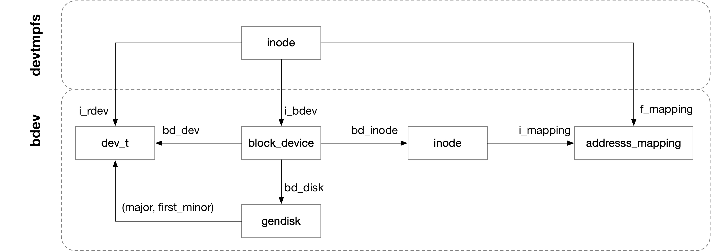

## Block - 3 bdev Filesystem


### bdev

bdev 文件系统实际是一个 pseudo filesystem，用户并不可见

```c
static struct file_system_type bd_type = {
	.name		= "bdev",
	...
};
```

bdev special filesystem 用于实现 dev_t 到 struct block_device 之间的映射，bdev 文件系统下每个 block dev_t 都与一个 struct block_device 对应

block device driver 在调用 add_disk() 注册 gendisk 过程中，就会在 bdev 文件系统下分配 partition 0（即 gendisk 本身）的 dev_t 对应的 inode

bdev 文件系统下的 filesystem specific inode 结构实际是

```c
struct bdev_inode {
	struct block_device bdev;
	struct inode vfs_inode;
};
```

因而在 bdev 文件系统下创建 inode 的过程中，实际就创建了该 dev_t (例如 partition0) 对应的 block_device 结构


实际上 struct block_device 中也有相关的字段

```c
struct block_device {
	dev_t			bd_dev;  /* not a kdev_t - it's a search key */
	struct inode *		bd_inode; /* will die */
	...
}
```

@bd_dev 实际上就是 block device 的 dev_t
@bd_inode 就是该 block device 在 bdev 文件系统下对应的 inode


> devt -> block_device mapping

正如之前介绍的，bdev filesystem 用于实现 dev_t 到 struct block_device 之间的映射，那么具体是怎么实现映射的呢？

bdev filesystem 中使用 bdget() 接口实现以上映射，其中实际上是通过 iget5_locked() 实现这一映射的

```c
struct block_device *bdget(dev_t dev)
struct inode *iget5_locked(..., unsigned long hashval, ...)
```

我们知道 VFS 中使用一个全局的 hash table 来管理内存中缓存的所有 VFS inode，iget5_locked() 接口就可以实现 inode number 到对应的 VFS inode 结构的映射，此时传入的 @hashval 参数就是 inode number

同时之前已经介绍过，bdev filesystem 中 VFS inode 和 block_device 是伴生关系的，此时 bdget() 中调用的 iget5_locked() 的 @hashval 参数实际上是 block device 的 devt，也就是实际上是用 devt 作为 inode number，找到 block_device 伴生的 VFS inode，由于 VFS inode 和 block_device 是一起作为 struct bdev_inode 分配的，因而通过 container_of() 也就找到了对应的 block_device


### devtmpfs

我们之前介绍 bdev 文件系统实际是一个 pseudo filesystem，用户并不可见，那么 bdev 文件系统与我们经常看到的 "/dev/" 又有什么联系呢？

"/dev/" 目录上挂载的文件系统实际叫做 devtmpfs，这是一个专门管理设备文件的文件系统，其中不仅包含 block 设备文件，还包含 char 设备文件

在阐述 devtmpfs 与 bdev 文件系统之间的联系之前，有必要描述一下 devtmpfs 的工作原理


#### devtmpfs introduction

devtmpfs 是一种 improved devfs，两者都是挂载在 /dev/ 目录下，用于管理设备文件

在 devtmpfs 出现之前，Linux 都是使用 devfs 管理设备文件，但是 devfs 在系统初始化阶段会创建所有硬件设备对应的设备文件，而无论该硬件设备当前是否使用，因而devfs的启动时间较长

为了解决这一问题，Linux 后来使用 devtmpfs 取代原先的 devtmpfs 来管理设备文件，devtmpfs 只会为那些当前正在使用的硬件设备创建对应的设备文件，因而devtmpfs的启动时间较短，同udev相配合devtmpfs可以有效管理所有的设备文件

/dev/ 目录下块设备文件的创建是在这些块设备的驱动程序调用 device_add_disk() 注册对应的 gendisk 的时候完成的 

```
device_add_disk
    register_disk
        device_add
            devtmpfs_create_node
```

device_add_disk() 过程中会调用 devtmpfs_create_node() 在 devtmpfs 下创建对应的设备节点

```c
struct gendisk {
	struct hd_struct {
		struct device {
			dev_t			devt;	/* dev_t, creates the sysfs "dev" */
		} __dev;
	} part0;
	...
};
```


#### devtmpfs & bdev

我们知道 gendisk->part0->__dev->devt 字段保存了 partition 0 也就是整个 gendisk 的 devt，而 devtmpfs_create_node() 中就是将这个 devt 传递给 devtmpfs 从而创建对应的设备节点

devtmpfs 中最终调用 mknod() 在 "/dev/" 目录下创建相应的设备节点

这里简单提一句，devtmpfs 自身并没有实现一整套的 inode ops，而是复用了 tmpfs 的那一套，因而 "/dev/vda" 对应的 inode_ops 就是 def_blk_fops，同时 inode->i_rdev 字段中保存了对应的 devt

```
vfs_mknod
    i_ops->mknod(), that is, shmem_mknod
        inode->i_op = &shmem_special_inode_operations;
        inode->i_fop = &def_blk_fops;
        inode->i_rdev = devt;
```


之后如果对 "/dev/vda" 执行 open 操作，那么这里返回的 inode 实际上是 devtmpfs 文件系统下的 inode，此时会通过 devt 找到对应的 block device，而 bdev 文件系统下的 inode 则是保存在 inode->i_bdev->bd_inode 字段

```
blkdev_open
    bd_acquire
        inode->i_bdev = bdget(inode->i_rdev);
        inode->i_mapping = inode->i_bdev->bd_inode->i_mapping;
```


