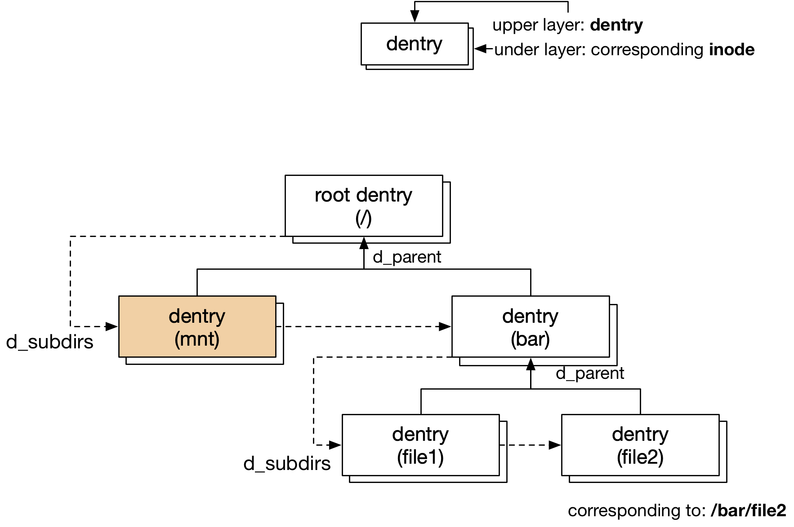

title:'dentry'
## dentry

### Concept

#### dentry

VFS 会非常频繁地执行路径查找操作，即根据输入的字符串描述的文件路径信息，输出该文件对应的 struct inode 结构。为了提升操作的效率，VFS 使用 struct dentry 对上一次的查找结果进行缓存，dentry 实际描述了一个文件的路径（由字符串描述）与对应的 struct inode 之间的映射关系

> inode

```c
struct dentry {
	struct inode *d_inode;	 /* Where the name belongs to - NULL is negative */
	...
};
```

@d_inode 就描述该 dentry 对应的 inode


> name

```c
struct dentry {	
	struct qstr d_name;
	unsigned char d_iname[DNAME_INLINE_LEN];/* small names */
	...
};
```

@d_name 描述该 dentry 的名称，例如对于路径 /root/foo/bar，可以存在四个 dentry，名称分别为 "/"、"root"、"foo"、"bar"

```c
struct qstr {
	u32 len
	const unsigned char *name;
};
```

该字段其实就指向了描述该 dentry 名称的字符数组

- 如果描述名称的字符串长度小于 DNAME_INLINE_LEN 即 32，那么这个字符串就存储在内嵌的 d_iname[] 字符数组中，此时 @qstr->name 其实就指向 d_iname[] 数组
- 否则会动态分配一块内存存储该字符串，此时 @qstr->name 其实就指向这块动态分配的内存


#### dentry hierarchy

每个文件系统都会维护一棵 dentry 树，dentry 树其实只是该文件系统下文件树的一个映射，文件树中的每个 inode 都会一一映射为 dentry 树中的一个 dentry

```c
struct dentry {
	struct dentry *d_parent; /* parent directory */
	...
}
```

@d_parent 描述该文件的父目录对应的 dentry，通过该字段将所有 dentry 组织为一个树状结构，根目录的 dentry->d_parent 字段指向该 dentry 自身

dentry 通过 @d_parent 字段描述 dentry 之间的层级关系，从而描述该 dentry 对应的文件在文件树中的层级关系


```c
struct dentry {
	struct list_head d_child; /* child of parent list */
	struct list_head d_subdirs; /* our children */
	...
}
```

同时 @d_subdirs 链表组织该 dentry 下的所有 sub-dentry，通过 @d_child 字段添加到其 parent-dentry 的 @d_subdirs 链表中


每个文件系统都有一个 root dentry，作为该文件系统的 dentry 树的根节点




#### dentry and inode

inode 与 dentry 是一对多的关系，例如一个文件可以有多个 symlink，此时这个文件对应一个 inode，每个 symlink 都对应一个 dentry

```c
struct dentry {
	struct inode *d_inode;	/* Where the name belongs to - NULL is
					 * negative */
	...
}
```

dentry 的 @d_inode 字段就描述了对应的 inode


```c
struct inode {
	union {
		struct hlist_head	i_dentry;
	};
	...
}
```

used dentry 除了维护在 dcache 中，还会组织在对应的 inode 的 @i_dentry 链表中，dentry 通过 @d_u.d_alias 字段添加到 inode 的 @i_dentry 链表


#### path

每个文件系统的 root dentry 的 @d_parent 字段都是指向自身，因而每个文件系统都会形成一个独立的 dentry tree，而 dentry tree 中的任何一个 dentry 都只是描述其对应的文件在当前文件系统下的路径（相当于是相对于当前文件系统的相对路径），因而任何一个文件系统的 dentry tree 中单独的一个 dentry，都不能描述对应的文件在根文件系统下的绝对路径

只有 (mount, dentry) 这个二元组才能描述文件的绝对路径，其中前者描述了所在的文件系统在根文件系统中的位置，而后者描述了对应的文件在所在的文件系统中的相对路径，两相结合就描述了对应的文件在根文件系统中的绝对路径

而这也正是 struct path 的作用所在，struct path 正是在 pathname lookup 过程中用于描述任一个文件的路径信息的

```c
struct path {
	struct vfsmount *mnt;
	struct dentry *dentry;
};
```


### dcache

VFS 全局维护一个 hash table，用于缓存所有的 dentry，这个 hash table 也就称为 dcache

```c
static struct hlist_bl_head *dentry_hashtable __read_mostly;

struct dentry {
	struct hlist_bl_node d_hash; /* lookup hash list */
	...
}
```

dentry 的 hash 值的计算比较复杂，算法逻辑在 hash_name()，其输入为 parent dentry 的内存地址，以及描述 dentry 名称的字符串这两个部分

例如对于路径 /root/foo/bar，对于描述 "foo" 这个目录的 dentry 来说，用于计算其 hash 值的输入有两个

- parent dentry 即 "root" 目录对应的 dentry 在内存中的地址
- 描述 dentry 名称的字符串，即 "foo"

这样计算出来的 hash 值就可以充分反映 dentry 的路径信息


### dentry state

dcache 中缓存的 dentry object 具有 used、unused、negative 三种状态

#### used dentry

used dentry 是指已经与一个 inode 相对应，即 @d_inode 字段不为 NULL，同时当前该 dentry 正在被使用，即其 @d_lockref.count 计数不为 0 的一类 dentry

这一类 dentry 是我们最为常见的 dentry object，可以大大加速 pathname lookup 过程


```c
struct inode {
	union {
		struct hlist_head	i_dentry;
	};
	...
}
```

used dentry 除了维护在 dcache 中，还会组织在对应的 inode 的 @i_dentry 链表中，dentry 通过 @d_u.d_alias 字段添加到 inode 的 @i_dentry 链表


#### unused dentry

unused dentry 与 used dentry 相类似，已经与一个 inode 相对应，即 @d_inode 字段不为 NULL，但是其 @d_lockref.count 计数为 0

我们知道引用计数就是用于管理 object 生命周期的，当一个 object 的引用计数变为 0 时，那么就应该释放这个 object，但是 dentry 的情况特殊一些

我们知道 dentry 就是用于加速 pathname lookup 过程的，dentry->d_inode 字段缓存了该路径对应的 inode，这在 pathname lookup 过程中可以省却一次文件系统操作。此时虽然 dentry 引用计数已经降为 0，但是这只是说明这个 dentry 当前没有被引用，这个 dentry 的 @d_inode 字段还是有效的，如果此时释放了这个 dentry，那么下次如果再对这个路径执行 pathname lookup 操作，那么分配 dentry、执行 lookup() 这些操作就必须重来一遍，这是非常低效的

因而内核的做法是，dentry 引用计数降为 0 时，先不释放这个 dentry，这个 dentry 仍然保留在 dcache 中；当下次再对这个路径执行 pathname lookup 操作时，就可以在 dcache 中快速地找回这个 dentry，这就是 unused dentry 的由来


```c
struct super_block {
	struct list_lru		s_dentry_lru;
	...
}
```

unused dentry 除了继续保留在 dcache 中，还会组织在对应的 superblock 的 @s_dentry_lru 链表中，dentry 通过 @d_lru 字段加入该链表

```sh
dput
    fast_dput
        lockref_put_return # decrease reference count to zero
        dentry->d_lockref.count = 1 # re-get reference count
    retain_dentry
        dentry->d_lockref.count-- # re-decrease to zero
        d_lru_add(dentry) # add into @s_dentry_lru list
```


#### negative dentry

前面介绍过，dentry 的 @d_inode 字段描述该 dentry 对应的 inode，同时 VFS 维护了一个全局的 hash table 即 dcache 来缓存所有的 dentry，实际上 dcache 中缓存的 dentry 可以分为两类

- 一类称为 positive dentry，即 d_inode 字段不为 NULL，之前介绍的 used/unused dentry 实际上都属于这一类
- 另一类称为 negative dentry，即 d_inode 字段为 NULL


positive dentry 非常好理解，大部分 dentry 都属于这一类，VFS 通过这类 dentry 对 pathname lookup 操作进行加速，通过 dentry 的 @d_inode 字段就可以找到该路径对应的 inode，从而省去了一次文件系统操作

实际上 negative dentry 也是为了加速 pathname lookup 过程而存在的，只是 negative dentry 的存在说明了该路径对应的 inode **并不存在**


```c
struct dentry {
	unsigned int d_flags;	/* protected by d_lock */
	...
}
```

@d_flags 字段用于标记当前 dentry 是否为 negative dentry，如果以下等式成立，那么就说明这是一个 negative dentry

```c
dentry->d_flags & DCACHE_ENTRY_TYPE == DCACHE_MISS_TYPE
```

```c
#define DCACHE_ENTRY_TYPE	 0x00700000
#define DCACHE_MISS_TYPE 0x00000000 /* Negative dentry (maybe fallthru to nowhere) */
#define DCACHE_DIRECTORY_TYPE 0x00200000 /* Normal directory */
#define DCACHE_REGULAR_TYPE 0x00400000 /* Regular file type (or fallthru to such) */
```


negative dentry 的来源有两个

1. pathname lookup

pathname lookup 过程中，会调用 inode ops 的 lookup() 回调函数，寻找该 dentry 对应的 inode，找到的 inode 会保存在 dentry->d_inode 字段

同时 lookup() 回调函数中会调用 d_splice_alias(inode, dentry) 将找到的 inode 与 dentry 关联起来，其中会在 dentry->d_flags 字段设置上相应的标志，例如 DCACHE_DIRECTORY_TYPE 或 DCACHE_REGULAR_TYPE 以描述该 dentry 对应的文件的类型

```
.lookup()
    d_splice_alias(inode, dentry)
        __d_add
            dentry->d_flags = d_flags_for_inode(inode)
```

这样 dentry 的 @d_inode、@d_flags 字段都设置好之后，该 dentry 就是一个 positive dentry


假设在解析 "/mnt/<dir>/file" 的过程中，"<dir>" 目录并不存在。在解析到 "<dir>" 的时候，在 lookup() 回调函数中，在其 parent directory 即 "mnt" 目录下寻找 "<dir>" 对应的 directory entry，并进而找到 "<dir>" 对应的 inode；由于 "<dir>" 目录并不存在，lookup() 中找到的对应的 inode 为 NULL，也就是此时 "<dir>" 对应的 dentry->d_inode 字段为 NULL

同时 __d_add() 中由于 inode 为 NULL，因而并不会设置 dentry->d_flags 字段，之后当 lookup() 回调函数返回时，该 dentry 被加入到 dcache 中，此时 dentry->d_flags 字段仍然保持为 dentry 刚创建时的初始值即 0，此时这个 dentry 实际上就是一个 negative dentry


2. delete file

假设存在一个文件 "/mnt/<file>"，同时 dcache 中存在该文件对应的 dentry，此时这个 dentry 实际上还是一个 positive dentry

之后当删除 "<file>" 这个文件时，会对 "<file>" 对应的 dentry 执行 d_delete() 操作，其中会清空 dentry 的 @d_inode、@d_flags 字段，但这个 dentry 仍然保留在 dcache 中，这样这个 dentry 就转变为了一个 negative dentry

```c
sys_unlinkat
    do_unlinkat
        vfs_unlink
            d_delete(dentry)
```


### API

#### d_lookup

```c
struct dentry *d_lookup(const struct dentry *parent, const struct qstr *name)
```

寻找 @parent 目录下名为 @name 的 dentry，其实际上是在 dcache 中查找对应的 dentry


#### d_add

```c
void d_add(struct dentry *entry, struct inode *inode)
```

设置 dentry 的 @d_inode/@d_flags 字段，将 dentry 添加到 inode 的 @i_dentry 链表，同时将 inode 添加到 dcache 中

dcache miss 的时候，一般就会创建新的 dentry，之后调用 d_add() 将新创建的 dentry 添加到 dcache 中


#### d_drop

```c
void d_drop(struct dentry *dentry)
```

将 dentry 从 dcache 中移除，之后 d_lookup() 操作不会再找到该 dentry；因而该函数一般用于需要删除该 dentry 的时候，之后当该 dentry 的引用计数变为 0 的时候，就会将该 dentry 释放回到 slab cache


#### d_delete

```c
/*
 * When a file is deleted, we have two options:
 * - turn this dentry into a negative dentry
 * - unhash this dentry and free it.
 *
 * Usually, we want to just turn this into
 * a negative dentry, but if anybody else is
 * currently using the dentry or the inode
 * we can't do that and we fall back on removing
 * it from the hash queues and waiting for
 * it to be deleted later when it has no users
 */
void d_delete(struct dentry * dentry)
```

文件被删除 (delete/unlink) 的时候会调用 d_delete()，此时对于 dentry 的操作，一般优先将其转变为 negative dentry，即此时 dentry 仍然保留在 dcache 中，之后的 d_lookup() 操作仍然能找到该 dentry，只是该 negative dentry 会表明相应路径的文件已经被删除

但是如果调用 d_delete() 的时候，该 dentry 还有其他引用计数，说明还有其他用户在引用该 dentry 及 inode，那么就不能再将其转化为 negative dentry，因为转化为 negative dentry 的过程中 dentry 的 @d_inode 字段会清空为 NULL，此时其他引用该 dentry 的用户就有可能触发 NULL crash；因而此时会将该 dentry 从 dcache 中移除，之后当该 dentry 的引用计数变为 0 的时候，就会将该 dentry 释放回到 slab cache

```sh
d_delete
    if dentry->d_lockref.count == 1: // we are the last refcount
        dentry_unlink_inode(dentry) // turn to negative dentry
    else:
        __d_drop(dentry) // delete dentry from dcache
```


### Routine

#### cache miss: create -> used dentry

pathname lookup 过程中当发生 cache miss 的时候，就会创建一个新的 dentry 并进行初始化，最终得到一个 used dentry

```sh
# pathname lookup
lookup_slow
    d_alloc_parallel
        d_alloc
            __d_alloc // allocate 'struct dentry'
            # add dentry to parent dentry's @d_subdirs list
    inode->i_op->lookup(inode, dentry, ...)
        d_splice_alias(inode, dentry)
            __d_add
                # add dentry to inode->i_dentry list
                __d_set_inode_and_type // set dentry's type and inode
                __d_rehash // add dentry to dcache
```


#### dput: used dentry -> unused dentry

寻常路径的 dput() 操作，当 dentry 的引用计数变为 0 的时候，会优先将其转变为 unused dentry，此时该 dentry 仍然保留在 dcache 中，可以通过 d_lookup() 搜索到，同时 dentry 的 @d_inode 字段仍然有效

```sh
dput
    fast_dput
        lockref_put_return # decrease reference count to zero
        dentry->d_lockref.count = 1 # re-get reference count
    retain_dentry
        dentry->d_lockref.count-- # re-decrease to zero
        d_lru_add(dentry) # add into superblock's @s_dentry_lru list
```


#### delete file: used dentry -> negative dentry

文件被删除 (delete/unlink) 的时候，如果该 dentry 的引用计数为 1，即没有其他用户在引用该 dentry 了，那么优先将其转变为 negative dentry，即此时 dentry 仍然保留在 dcache 中，之后的 d_lookup() 操作仍然能找到该 dentry，只是该 negative dentry 会表明相应路径的文件已经被删除

```sh
sys_unlinkat
    do_unlinkat
        vfs_unlink
            d_delete(dentry)
                if dentry->d_lockref.count == 1: // we are the last refcount
                    dentry_unlink_inode(dentry)
                        __d_clear_type_and_inode // clear dentry's type and inode
                        # delete dentry from inode's @i_dentry list
                        iput(inode) // put inode's refcount
                    
```


#### delete file: used dentry -> delete dentry

文件被删除 (delete/unlink) 的时候，如果该 dentry 还有其他引用计数，说明还有其他用户在引用该 dentry 及 inode，那么就不能再将其转化为 negative dentry，因为转化为 negative dentry 的过程中 dentry 的 @d_inode 字段会清空为 NULL，此时其他引用该 dentry 的用户就有可能触发 NULL crash

因而此时会将该 dentry 从 dcache 中移除，之后当该 dentry 的引用计数变为 0 的时候，就会自动将该 dentry 释放回到 slab cache

```sh
sys_unlinkat
    do_unlinkat
        vfs_unlink
            d_delete(dentry)
                if dentry->d_lockref.count > 1: // we are not the last refcount
                    __d_drop(dentry)
                        # delete dentry from dcache
```

```sh
dput
    fast_dput
        lockref_put_return # decrease reference count to zero
        dentry->d_lockref.count = 1 # re-get reference count
    retain_dentry
        if d_unhashed(dentry):
            return false
    dentry_kill(dentry)
        __dentry_kill
            __d_drop
            dentry_unlist // delete dentry from parent dentry's @d_subdirs list
            dentry_unlink_inode
                __d_clear_type_and_inode // clear dentry's type and inode
                # delete dentry from inode's @i_dentry list
                iput(inode) // put inode's refcount
            dentry_free
                __d_free // free 'struct dentry' to slab cache
```


