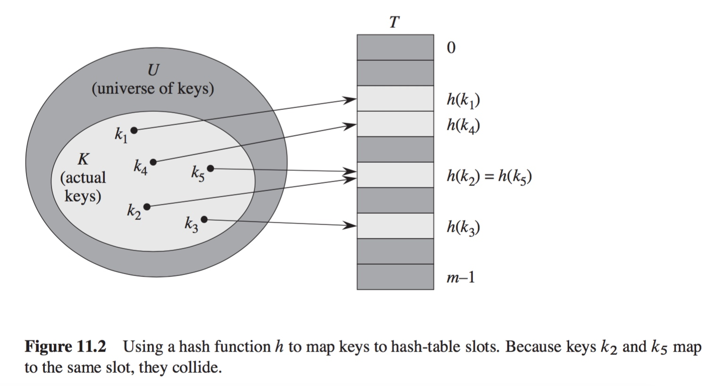
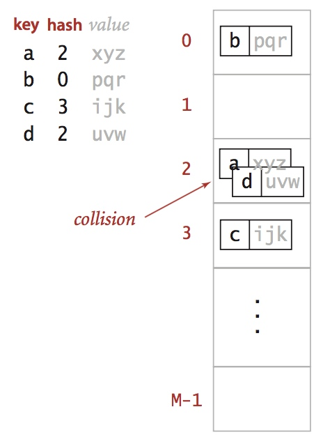
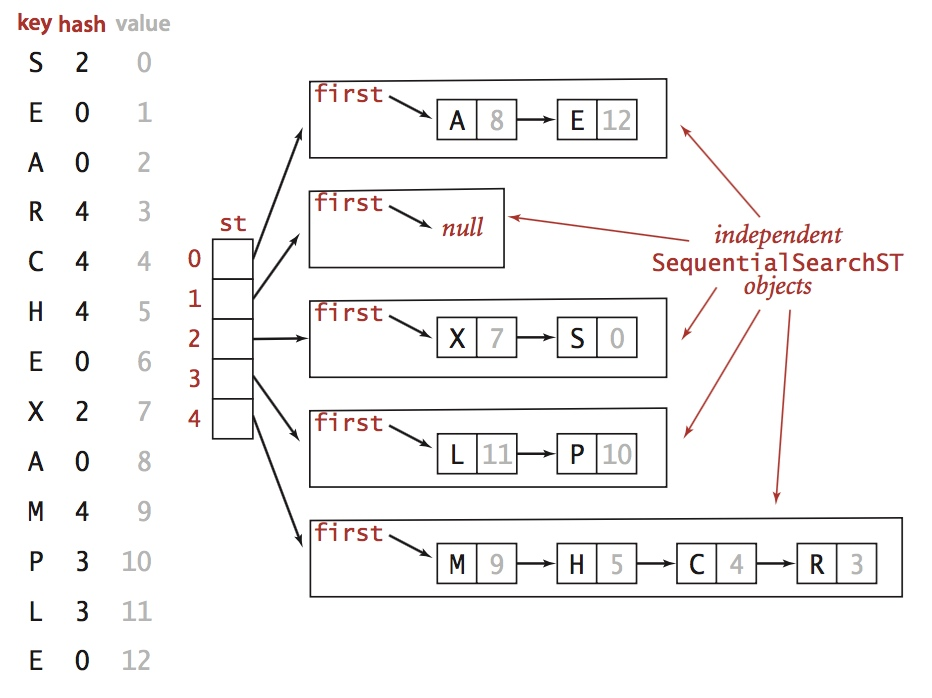
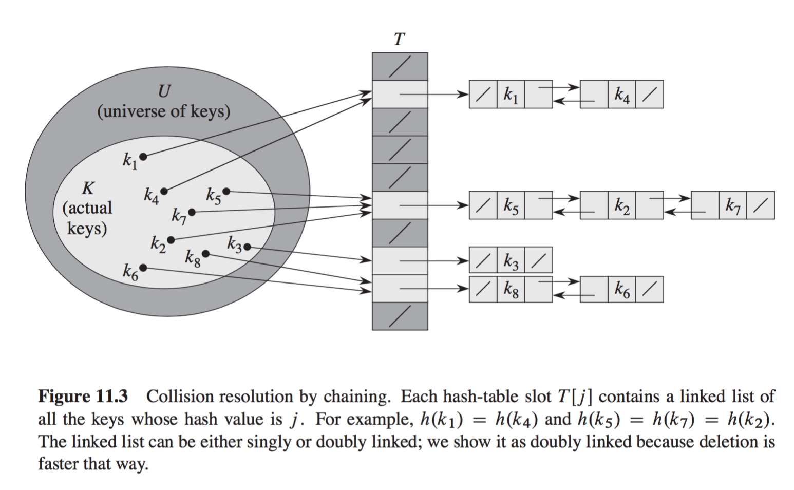
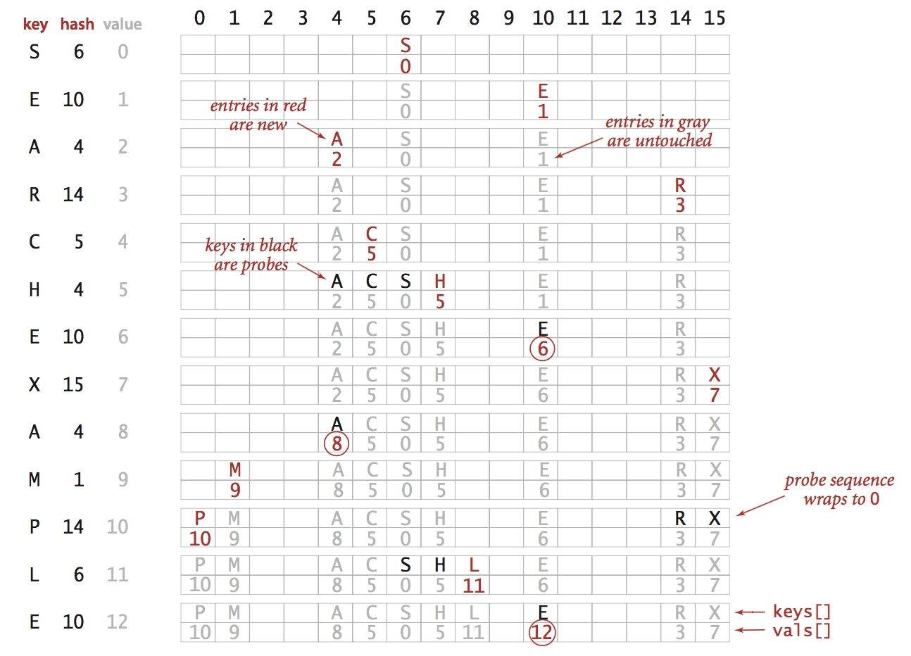
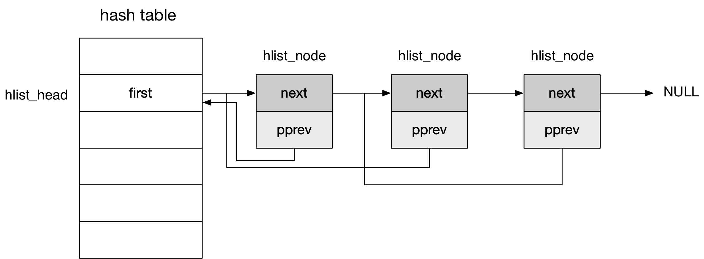

## Hash Table


### Concept

#### introduction to hash table

symbol table 是一种用于存储 key-value pairs 的表格，主要用于数据的查找（search）过程，通过 key 找到相应的 value 值

hash table 是一种 O(1) 查找时间的 symbol table，其通常实现为数组，hash function 将 key 映射为数组的 index，对应的 value 就保存在该 index 对应的 cell 中




hash function 需要将 key 映射为数组的 index，映射之后的 index 应在 hash table size 范围内均匀分布，由于存储空间有限，hash table size 通常有限，因而会出现两个不同的 key 映射为相同的 index 的情形，此时即发生 collision



通常有 open hashing 与 close hashing 两种方法来应对 hash collision


#### Open Hashing (Separate Chaining)

open hashing 方案中，为 hash table 中每一个发生 collision 的 index 创建一个链表，其中存储具有相同 index 的 key-value pair；此时 hash table 实际为指针数组，其中的每个指针指向其对应的链表



当需要在 hash table 中查找特定的 key-value pair 时，hash function 将 key 转化为 index，对应的数组元素指向一个链表，并在该链表中顺序查找特定的 key-value pair，此时查找时间为 O(1)+O(chaining list size)，即查找特定的 key-value pair 对应的链表具有 constant search time，而在链表中顺序查找特定的 key-value pair 的查找时间与链表的长度相关，因而 open hashing 实现的 hash table size 通常较大，从而确保链表的长度较小



当需要实现 chaining hash table 的节点的删除操作时，通常将链表实现为 doubly linked list，以方便实现节点的删除操作


#### Close Hashing (Open Addressing)

close hashing 方案是指在发生 collision 时，第 k 次需要尝试 index (hash(x) + f(k)) 处的 cell，其中 x 为 key，hash()为 hash function，同时 f(0) = 0

- k = 0 时，即尝试 index hash(x) 处的 cell，当该 cell 已经被占用时即发生 collision
- 之后尝试 index (hash(x) + f(1)) 处的 cell，依此类推


当需要实现节点的删除操作时，在将对应的节点删除后，如果只是简单地将该节点标记为 empty，那么该删除节点之后的节点有可能无法正常执行 search 操作，此时通常将删除节点标记为特殊值 DELETED，在这种机制下必须修改节点的 SEARCH、INSERT 操作

- 在 INSERT 操作中，除了可以使用 EMPTY 节点，还可以使用 DELETED 节点
- 在 SEARCH 操作中，可以跳过 DELETED 节点，继续查找之后的节点

当需要实现节点的删除操作时，SEARCH 操作的时间复杂度还和 DELETED 节点的数量相关，当 DELETED 节点的数量较多时会降低 SEARCH 操作的效率，因而当需要实现节点的删除操作时，通常使用 chaining based hash table 以处理 collision


close hashing 包含 linear probing、quadratic probing 与 double hashing 等多种机制，最简单的 linear probing 中 f(k) = k

对于 linear probing 实现的 hash table，当发生 collision 时，尝试将发生 collision 的 key-value pair 保存在下一个可用的 cell 中，即遍历 collision cell 之后的 cell，若该 cell 为空或其中保存的 key-value pair 具有与 collision key-value pair 相同的 key，则将 collision key-value pair 的 value 保存在该 cell 中，若探测一周之后仍没有空闲的 cell，则 hash 失败；在 lookup 时，从 hash 的当前 cell 开始向后查询，若查询一周之后仍没有找到对应的 key 则 lookup 失败




### hash list

#### Structure

Linux 中使用 hlist（即 hash list）抽象 hash table，其中使用 open hashing 机制来解决 collision 问题




每个 hash table entry 即对应一个 hlist，每个 hlist 由一个链表头 hlist_head 与多个链表节点 hlist_node 构成一个双向但不循环的链表

```c
struct hlist_head {
    struct hlist_node *first;
};
```

@first 抽象该链表的链表头，该字段指向链表的第一个链表节点


```c
struct hlist_node {
    struct hlist_node *next, **pprev;
};
```

@next       该链表节点的下一个链表节点
@pprev      该链表节点的上一节点的 next 指针的地址

hlist 的最后一个链表节点的 next 指针为 NULL
hlist 的第一个链表节点的 pprev 指针为链表头的 first 指针的地址


Linux hlist 机制实现 hlist_head、hlist_node 两种数据结构的原因是，hash table size 通常较大，因而在链表头中实现两个指针会造成内存空间的大量浪费（链表头中只需一个指针指向 hlist 中的第一个链表节点）

同时对于链表节点的 pprev 指针，若将链表节点简单地实现为 prev、next 指针，那么 hlist 中的第一个链表节点的 prev 指针为 hlist_head 指针类型，而之后的链表节点的 prev 指针为 hlist_node 指针类型，因而存在其数据类型不一致的问题，影响维护、执行的效率；而对于 hlist 中的第一个链表节点，pprev 指针指向链表头的 firt 指针，为 (hlist_node \*\*) 数据类型，而对于之后的链表节点，pprev 指针指向上一节点的 next 指针，同样为 (hlist_node **) 数据类型，从而解决了数据类型一致性的问题


#### API

> judge

```c
static inline int hlist_unhashed(const struct hlist_node *h)
```

通过判断链表节点 h 的 pprev 指针是否为空，来判断该节点是否已经在 hash table 中


```c
static inline int hlist_empty(const struct hlist_head *h)
```

通过判断链表头 h 的 first 指针是否为空，来判断该链表是否为空


> delete

```c
static inline void __hlist_del(struct hlist_node *n)
```

删除链表节点 n


```c
static inline void hlist_del(struct hlist_node *n)
```

删除链表节点 n，同时设置该节点的 next、pprev 指针的值分别为 LIST_POISON1、LIST_POISON2，以便于调试


```c
static inline void hlist_del_init(struct hlist_node *n)
```

若链表节点 n 在 hash table 中，则将该节点从 hash table 中删除，之后初始化该节点，此时该节点的 next、pprev 指针的值均为 NULL


> add

```c
static inline void hlist_add_head(struct hlist_node *n, struct hlist_head *h)
```

将链表节点 n 添加到链表 h 的头部


```c
static inline void hlist_add_before(struct hlist_node *n, struct hlist_node *next)
```

将链表节点 n 添加到链表节点 next 之前，其中节点 n 为新插入的节点，链表节点 next 不能为 NULL


```c
static inline void hlist_add_after(struct hlist_node *n, struct hlist_node *next)
```

将链表节点 n 添加到链表节点 next 之后，其中 next 节点为新插入的节点


```c
static inline void hlist_add_fake(struct hlist_node *n)
```

对链表节点 n 实现虚假添加操作，即将该节点的 pprev 指针指向该节点的 next 指针；执行该操作后该节点 appear to be on some list


> move

```c
static inline void hlist_move_list(struct hlist_head *old, struct hlist_head *new)
```

将 old 链表头之后的链表节点挂载到 new 链表头之后，同时 old 链表头的 first 指针初始化为 NULL


> get the entry

hlist_node 结构内嵌入 type 数据结构，约定该数据结构称为数据节点，该数据结构组成的链表称为数据链表

```c
#define hlist_entry(ptr, type, member)
```

hlist_node 结构内嵌入 type 结构，hlist_node 成员的名称为 member，同时已知 hlist_node 成员的地址 ptr，该宏返回包含该 hlist_node 的数据结构的地址


> iterate the list

```c
#define hlist_for_each(pos, head)
```

顺序遍历 head 链表，pos 用于存储当前的链表节点


```c
#define hlist_for_each_safe(pos, n, head)
```

顺序遍历 head 链表，pos 用于存储当前的链表节点，n 用于备份当前节点的下一节点，这样即使遍历过程中当前节点被修改也能正常完成遍历操作


> iterate the entry

```c
#define hlist_for_each_entry(pos, head, member)
```

由链表头开始顺序遍历数据节点，其中 head 为链表头，member 为 hlist_node 在该数据结构中的名称，pos 用来存储当前的数据节点


```c
#define hlist_for_each_entry_continue(pos, member)
```

由特定数据节点 pos 之后开始顺序遍历数据节点，即实际由 pos 数据节点的下一节点开始遍历，同时 pos 用来存储当前的数据节点，member 为 hlist_node 在该数据结构中的名称


```c
#define hlist_for_each_entry_from(pos, member)
```

由特定数据节点 pos 开始顺序遍历数据节点，同时 pos 用于存储当前的数据节点，member 为 hlist_node 在该数据结构中的名称，


```c
#define hlist_for_each_entry_safe(pos, n, head, member)
```

由链表头开始顺序遍历数据节点，其中 head 为链表头，member 为 hlist_node 在该数据结构中的名称，pos 用来存储当前的数据节点，同时 n 备份当前节点的下一节点


