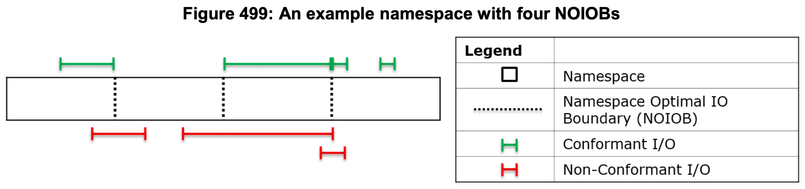
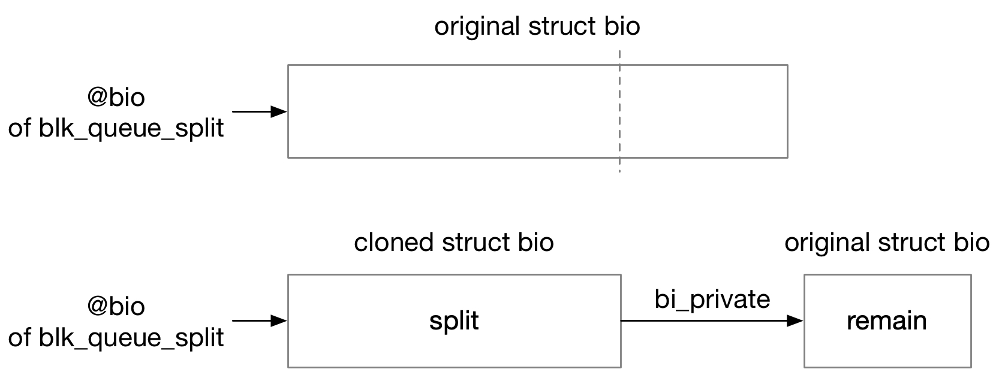

title:'Block - bio - 3 bio-split'
## Block - bio - 3 bio-split

### Concept

bio 下发路径中会执行 bio split 检查，其中主要是检查设备的 max_sectors、max_segments 参数的限制，如果 bio 的大小超过了这个限制，那么就需要将这一个 bio 拆分为多个 bio

bio split 路径的入口为 blk_queue_split()


以下介绍影响 bio split 路径的各个参数

#### max_sectors

该参数描述了设备能够处理的一个 request 的最大大小，以 sector 为单位

如果 bio 的大小即包含的 sector 数量超过了该参数限制，就需要执行 split 操作

```
        <------------------- max_sectors ------------------->
        <------------ max_io_size ------------->
                                               p1          p2
        +---------------------------------------+-----------+
        ^                                       ^
bio->bi_iter.bi_sector              *physical* block size aligned
```

(上图中 max_io_size 表示最终计算出来的“一个 request 的最大大小”)

需要注意的是，在计算一个 request 的最大大小 (max_io_size) 的时候，我们可以直接返回 max_sectors 参数的值，但是这里有一个优化点，就是 (bio->bi_iter.bi_sector + max_sectors) 的值，也就是上图中的 p2，往前找最近一个 physical block size 对齐的值，也就是上图中的 p1，此时返回的 max_io_size 的值实际上是 (p1 - bio->bi_iter.bi_sector)

这个优化的目的是，返回的 max_io_size 是用于 bio split 操作的，如果 bio 的大小超过了 max_io_size 限制，那么这个 bio 就会从 max_io_size 这个地方切一刀，执行 split 操作，这样就可以使得切分出来的 remain bio 的起始 sector 地址是按照 physical block size 对齐的

```
+-------+           +-----------------------+
| split |           |       remain          |
+-------+           +-----------------------+
                    ^
                physical block size aligned
```

```
        <------------------- max_sectors ------------------->
        <------------ max_io_size ------------->
                                               p1          p2
        +---------------------------------------+-----------+
        ^                                       ^
bio->bi_iter.bi_sector              *logical* block size aligned
```

当然如果 max_sectors 的值小于 physical block size（在以下介绍的 chunk_sectors 参数中，这种情况完全是有可能的），那么此时是从 p2 点往前寻找最近一个 **logical** block size 对齐的值，也就是上图中的 p1，此时返回的 max_io_size 的值实际上是 (p1 - bio->bi_iter.bi_sector)


#### chunk_sectors

chunk_sectors 参数描述任何一个下发的 IO，其描述的 sector range 不能 **cross**（跨越）该参数描述的界限，以 sector 为单位

chunk_sectors 的来源各有不同，对于 NVMe 设备来说，由于 flash 自身存储颗粒的限制，单个 request 最好不要超过 NOIOB 界限，此时 IO 性能可以达到最佳

> Namespace Optimal I/O Boundary (NOIOB): This field indicates the optimal I/O boundary for this namespace. This field is specified in logical blocks. The host should construct Read and Write commands that do not cross the I/O boundary to achieve optimal performance. A value of 0h indicates that no optimal I/O boundary is reported.




因而在计算一个 request 的最大大小 (max_io_size) 的时候，如果设备设置有 chunk_sectors 参数，那么此时 max_io_size 的值实际上是

```
chunk_sectors - (bio->bi_iter.bi_sector & (chunk_sectors - 1)))
```

如图

```
                        <-------- max_io_size ---------->

+-----------------------+-------------------------------+
^                       ^                               ^
chunk_sectors   bio->bi_iter.bi_sector           chunk_sectors
boundary                                         boundary
```


#### max_segments

> max_segments

该参数同样描述了设备能够处理的一个 request 的最大大小，只不过是以 physical segment 的数量为单位

如果 bio 包含的 physical segment 数量超过了该参数限制，就需要执行 split 操作


> max_segment_size

这里在计算 bio 包含的 physical segment 的数量时需要注意的是，虽然在引入 multi-page bvec 特性之后，bio 中包含的 bvec 的数量一定程度上就代表该 bio 包含的 physical segment，但是此时还需要考虑 max_segment_size 参数限制

max_segment_size 参数描述了一个 physical segment 的大小的上限，以字节为单位，因而在计算 bio 实际包含的 physical segment 数量，也就是在遍历这个 bio 包含的所有 bvec 的过程中

- 如果这个 bvec 实际描述的是一个 single page，那么这一个 bvec 就可以算作一个 physical segment（这是因为 max_segment_size 的值最小为 PAGE_SIZE，因而 single page 肯定不会超过 max_segment_size 参数限制）
- 如果这个 bvec 实际描述的是一个 multi page，那么就需要将这个 bvec 按照 max_segment_size 拆分为多个 physical segment，此时这一个 bvec 就会算作多个 physical segment


### Routine



如上图所示，bio split 路径中会按照 max_sectors、max_segments 参数，将 bio 拆分为多个 bio，例如当 bio 包含的 segment 数量超过了设备的 max_segments 参数时

- 从左边开始依次拆分出一个个 max_segments 大小的 bio，称为 split
- 剩余的为 remain


上图中 remain 对应的 bio 描述符是最开始传入的 bio 描述符，之前可能存在的多个 split 的 bio 描述符都是通过 bio_clone_fast() 克隆出来的，是原先传入的 bio 描述符的拷贝

同时同一个 bio 拆分出来的多个 bio 之间通过 @bi_private 字段组织在一起

