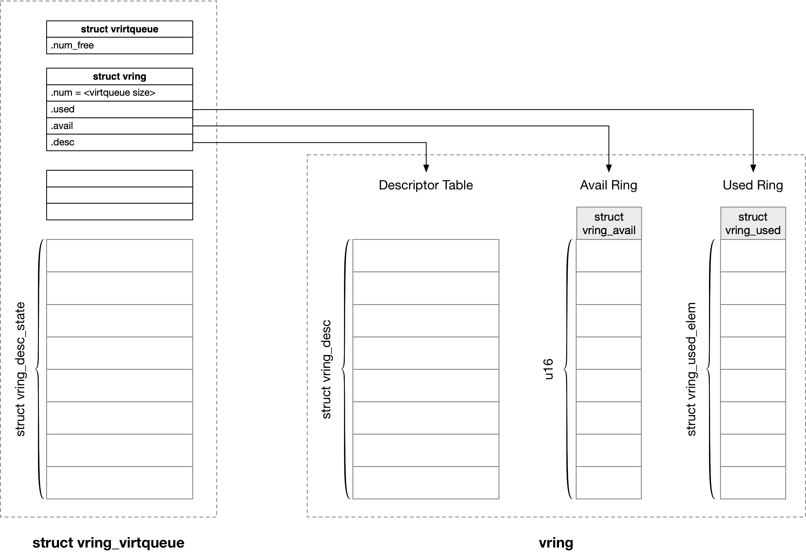
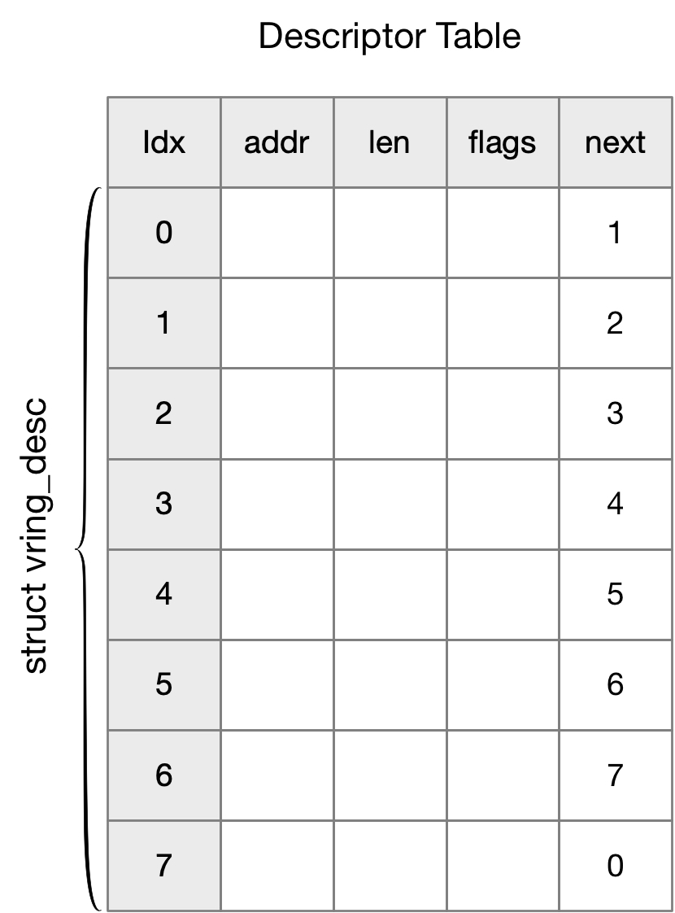
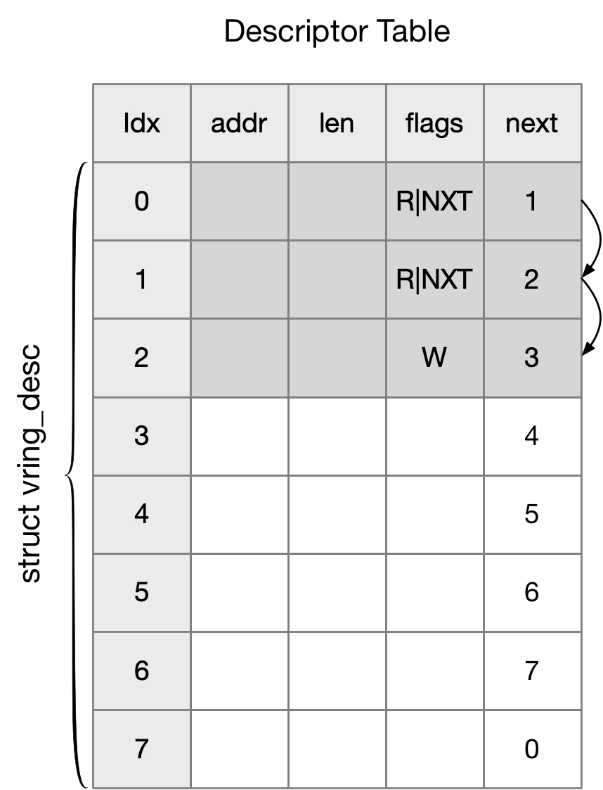
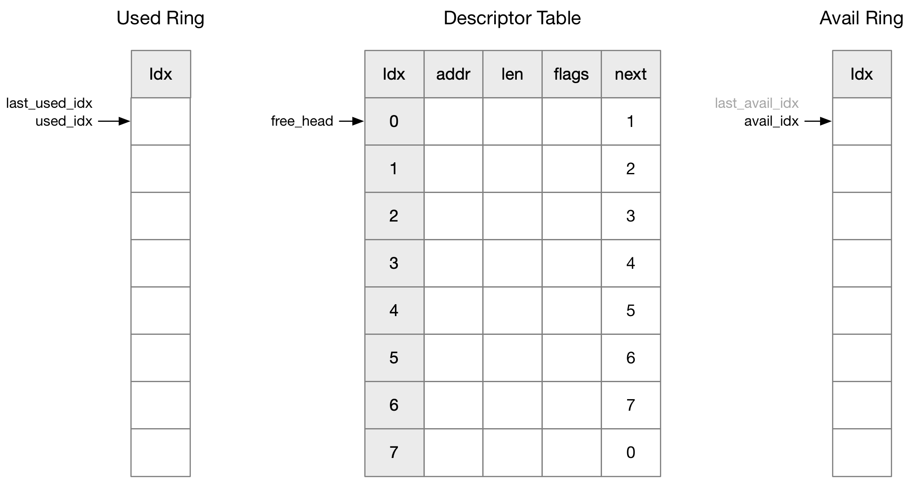
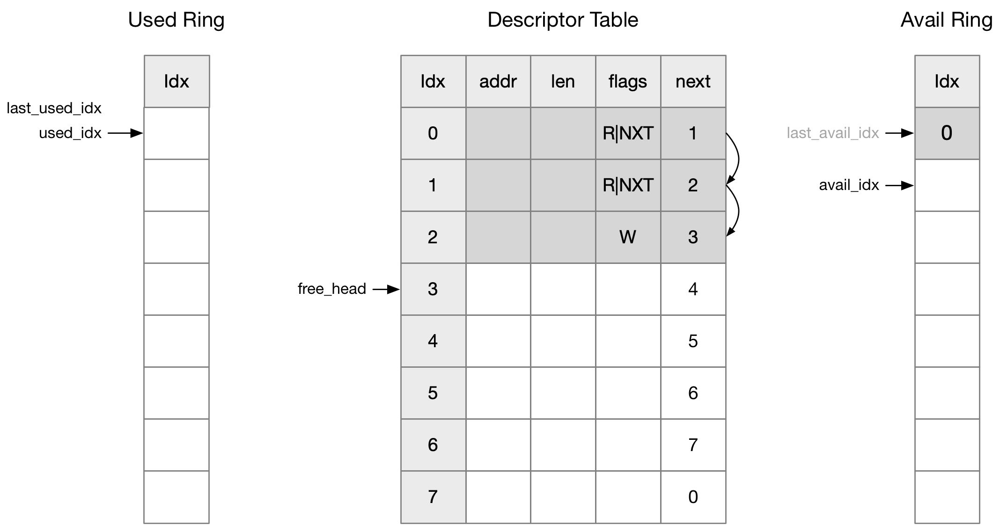
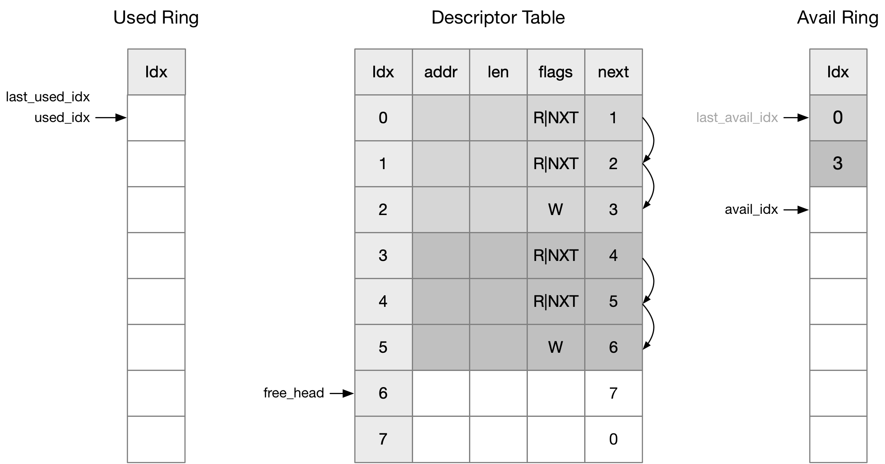
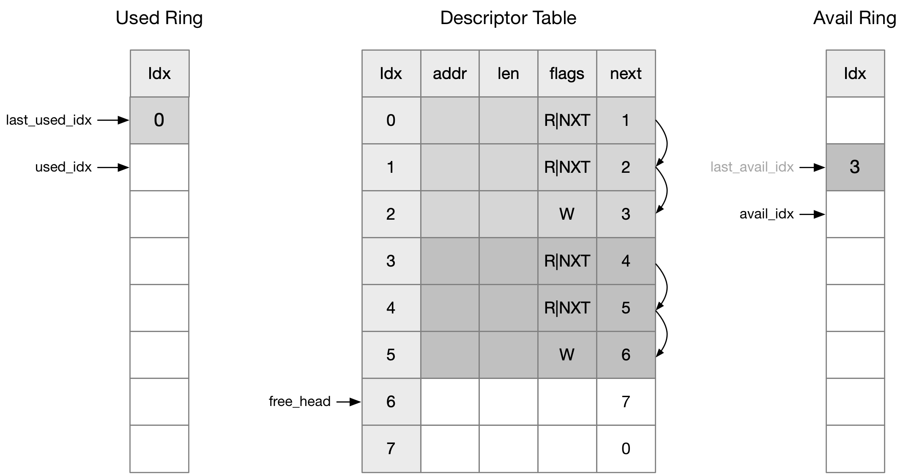
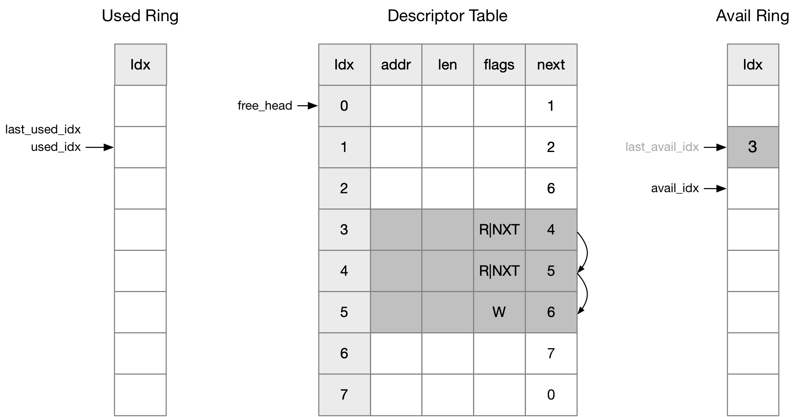

title:'Virtqueue - Split Virtqueues'
## Virtqueue - Split Virtqueues

virtio 使用 virtqueue 实现 guest 与 host 之间的通信机制

**注意**
本文描述的 virtqueue 格式是 Split Virtqueues，virtio v1.0 版本及之前都只支持该格式

### memory layout



一个设备 (virtio_device) 可以有多个 virtqueue，每个 virtqueue 实际分配有两块内存

- 其中一块内存用于存储 vring，这一块内存是 guest driver 分配的，device 可以通过内存的 dma 地址访问这一块内存
- 另一块内存用于存储 struct vring_virtqueue 数据结构


virtio 框架使用 struct vring_virtqueue 数据结构抽象 virtqueue，这个数据结构实际包含四部分

```c
struct vring_virtqueue {
	struct virtqueue vq;

	/* Actual memory layout for this queue */
	struct vring vring;

	/* other parts describing index and flags */

	/* Per-descriptor state. */
	struct vring_desc_state desc_state[];
};
```

1. struct virtqueue 结构抽象了该 virtqueue 与对应的 virtio_device 之间的联系
2. struct vring 结构抽象了该 virtqueue 的 vring 的相关信息
3. 其余内嵌的字段描述了该 virtqueue 本身的相关信息
4. 最后的 desc_state[] 数组维护了一个 struct vring_desc_state table


#### virtqueue

struct virtqueue 结构抽象了该 virtqueue 与对应的 virtio_device 之间的联系

```c
struct virtqueue {
	struct virtio_device *vdev;
	unsigned int index;
	struct list_head list;
	...
};
```

一个设备 (virtio_device) 可以有多个 virtqueue

@vdev 描述了该 virtqueue 对应的 virtio_device
@index 描述了该 virtqueue 在对应的 virtio_device 的所有 virtqueue 中的编号

同时 struct virtqueue 通过 @list 节点将其添加到对应的 virtio_device 的 @vqs 链表中 


#### vring

virtio 框架中，每个 virtqueue 维护有一个 vring 用于实现 guest driver 与 device 之间的数据传输


一个 vring 就是一块连续的物理内存，其中依次包含了 Descriptor Table、Avail Ring、Used Ring 三个部分

Descriptor Table | Available Ring (. . .padding. . .) |Used Ring
---- | ---- | ----


这三个部分有各自的大小、对齐要求

Virtqueue Part | Alignment | Size
---- | ---- | ----
Descriptor Table | 16 | 16∗(Queue Size)
Available Ring | 2 | 6 + 2∗(Queue Size)
Used Ring | 4 | 6 + 8∗(Queue Size)


struct vring 结构抽象了该 virtqueue 的 vring 的相关信息

```c
struct vring {
	unsigned int num;
	struct vring_desc *desc;
	struct vring_avail *avail;
	struct vring_used *used;
};
```

@num 描述该 vring 的大小，即可以容纳的描述符的数量
@desc/avail/used 则分别指向 vring 中的 Descriptor Table、Avail Ring、Used Ring 三块内存

##### Descriptor Table

guest driver 在处理 block layer 下发的一个 request 过程中，需要设置 Descriptor Table 中的一个或多个描述符，以描述该 request 包含的 physical segment

Descriptor Table 实际上就是一个 struct vring_desc 数组，其中容纳了 @vring->num 数量的描述符，其中的每个描述符就用 struct vring_desc 抽象

这里的一个描述符就对应一个 sglist，也就是描述一个 physical segment

block layer 下发的一个 request 中可能包含多个 physical segment，此时就需要使用多个描述符来描述这一个 request，此时这一个 request 对应的多个描述符之间通过 @next 字段组成一个链表

```c
/* Virtio ring descriptors: 16 bytes.  These can chain together via "next". */
struct vring_desc {
	/* Address (guest-physical). */
	__virtio64 addr;
	/* Length. */
	__virtio32 len;
	/* The flags as indicated above. */
	__virtio16 flags;
	/* We chain unused descriptors via this, too */
	__virtio16 next;
};
```

@addr/len 描述一个需要进行数据传输的 physical segment


> next

多个描述符之间可以通过 @next 字段组成一个链表，实际上 @next 字段存储的是下一个描述符在 Descriptor Table 中的 index；初始化完成后，链表的最后一个描述符的 @next 字段的值为 0，也就是指向 Descriptor Table 中的第一个描述符，从而使得 Descriptor Table 中的所有描述符组成一个环状结构

实际上只有 @flags 字段设置有 VRING_DESC_F_NEXT 标志时，@next 字段才是有效的

如下所示为 vring 刚创建时 Descriptor Table 的状态，此时每个描述符的 @next 字段都已经被初始化，也就是 Descriptor Table 中下一个描述符的 index；但是由于此时所有描述符的 @flags 字段均为 0，因而这些描述符实际上并没有组成一个链表



假设在传输一个 request 过程中需要消耗 Descriptor Table 中的三个描述符，那么此时前两个描述符的 @flags 字段会设置上 VRING_DESC_F_NEXT 标志，此时这三个描述符就组成了一个链表




> flags

@flags 字段描述当前描述符的相关属性，除了之前介绍的 VRING_DESC_F_NEXT 标志以外

VRING_DESC_F_WRITE 标志表示当前描述符描述的 physical segment 对于 device 来说是 write-only 的，如果该标志没有设置上，就说明当前描述符描述的 physical segment 对于 device 来说是 read-only 的


##### Available Ring

guest driver 在处理 block layer 下发的一个 request 过程中，在设置完成 Descriptor Table 中的描述符之后，需要在 Available Ring 中写入这个 request 在 Descriptor Table 中对应的 index，以通知 device

如果一个 request 消耗了多个描述符，那么此时在 Available Ring 中存储的，实际是该描述符链表的第一个描述符在 Descriptor Table 中的 index (也就是一个 u16)


Available Ring 实际包含两部分，头部的 struct vring_avail 结构，以及紧接在后的 @ring[] 数组，这个数组实际上就是一个 u16 数组，数组的大小是 @vring->num

```c
struct vring_avail {
	__virtio16 flags;
	__virtio16 idx;
	__virtio16 ring[];
};
```


##### Used Ring

device 在接到 guest driver 通知后，就会到 Available Ring 中取出一个描述符链表进行处理，处理完成后往 Used Ring 中写入已经处理完成的 request 对应的 index，以通知 guest driver


Used Ring 同样包含两部分，头部的 struct vring_used 结构，以及紧接在后的 @ring[] 数组，这个数组的大小是 @vring->num

```c
struct vring_used {
	__virtio16 flags;
	__virtio16 idx;
	struct vring_used_elem ring[];
};
```


这里往 Used Ring 中写入的实际是一个 struct vring_used_elem 结构

```c
/* u32 is used here for ids for padding reasons. */
struct vring_used_elem {
	/* Index of start of used descriptor chain. */
	__virtio32 id;
	/* Total length of the descriptor chain which was used (written to) */
	__virtio32 len;
};
```

@id 描述 device 处理完成的描述符链表的第一个描述符在 Descriptor Table 中的 index


此外 device 在处理 request 的过程中，往往需要向描述符链表描述的内存中写入数据，例如 virtio-blk 中每个 request 对应的描述符链表中的最后一个描述符描述的内存块实际存储一个 status 字段，描述了 device 是否成功处理这个 request，device 就需要对 status 进行写操作

这里的 @len 就描述了 device 往这个描述符链表中写入的数据长度，以字节为单位


##### ring index

vring 实际上就是一个循环缓冲区，以下为方便叙述，将 struct vring_virtqueue 简称为 vq

> total size

首先 vq->vring.num 描述了 vring 的大小，即可以容纳的描述符的数量

```c
struct vring {
	unsigned int num;
	...
};
```


> free size

vq->vq.num_free 描述了 vring (主要是 Descriptor Table) 的剩余大小，其初始值即为 vring 的大小即 vq->vring.num

```c
struct virtqueue {
	unsigned int num_free;
	...
};
```


> free_head

vq->free_head 描述了 Descriptor Table 中下一个可写的描述符的 index，其初始值为 0

```c
struct vring_virtqueue {
	/* Head of free buffer list. */
	unsigned int free_head;
	...
}
```

由于更新 free_head 的时候，free_head 会被更新为当前最后一个使用的描述符的 @next 字段的值（即下一个可用的描述符的 index），因而 free_head 的值实际上总是在 [0,vq->vring.num) 范围内


> avail_idx

vq->vring.avail->idx 描述了 Available Ring 中下一个可写的描述符的 index，其初始值为 0

这里需要注意的是，Descriptor Table 与 Available Ring 的 free head 的值可能是不同的。因为如果一个 request 包含三个 physical segment，那么 Descriptor Table 中需要消耗 3 个描述符，因为每个 physical segment 需要由一个描述符来描述；而 Available Ring 中只会消耗一个描述符，因为 Available Ring 中的描述符只需要记录 Descriptor Table 中描述符链表的第一个描述符的 index

```c
struct vring_avail {
	__virtio16 idx;
	...
};
```

需要注意的是 vq->vring.avail->idx 实际上是一直加加的，因而实际上

```
avail_idx = vq->vring.avail->idx & (vq->vring.num - 1)
```


> last_avail_idx

last_avail_idx 是 device 自己维护的一个 index，描述 device 上次已经处理的 Available Ring 中的描述符的 index，再加上一，表示 device 下一个可以处理的描述符；其初始值为 0

上文介绍的 avail_idx 是存储在 vring 内存块中的，因而 guest driver 和 device 都可以访问 avail_idx

假设 device 自己维护了 last_avail_idx 以描述 device 之前已经处理的 Available Ring 中的描述符的位置，之后当 guest driver 下发 request 的时候就会更新下移 avail_idx，并通知 device，Available Ring 中有新的 request 需要处理

device 在接到通知后，Available Ring 中 [last_avail_idx, avail_idx) 范围内的描述符就是 device 这次需要处理的描述符


> used_idx

类似地，vq->vring.used->idx 描述了 Used Ring 中下一个可写的描述符的 index，其初始值为 0

```c
struct vring_used {
	__virtio16 idx;
	...
};
```

需要注意的是 vq->vring.used->idx 实际上是一直加加的，因而实际上

```
used_idx = vq->vring.used->idx & (vq->vring.num - 1)
```


> last_used_idx

类似地，上文介绍的 used_idx 是存储在 vring 内存块中的，guest driver 和 device 都可以访问；而 last_used_idx 则是 guest driver 自己维护的一个 index，描述 guest driver 上次已经处理的 Used Ring 中的描述符的 index，再加上一，也就是 guest driver 下一次可以开始收割的 index；其初始值为 0


假设 guest driver 自己维护了 last_used_idx 以描述 guest driver 之前已经处理的 Used Ring 中的描述符的位置，之后当 device 处理完成 Available Ring 中的 request 的时候就会更新并下移 used_idx，并通知 guest driver

guest driver 在接到通知后，Used Ring 中 [last_used_idx, used_idx) 范围内的描述符就是 device 已经处理完成了的描述符

```c
struct vring_virtqueue {
	/* Last used index we've seen. */
	u16 last_used_idx;
	...
}
```

需要注意的是 vq->last_used_idx 实际上是一直加加的，因而实际上

```
last_used_idx = vq->last_used_idx & (vq->vring.num - 1)
```


#### descriptor state table

descriptor state 用于实现 vring descriptor 与 driver specific data 之间的联系

```c
struct vring_desc_state {
	void *data;			/* Data for callback. */
	struct vring_desc *indir_desc; /* Indirect descriptor, if any. */
};
```

例如 virtio-blk 在下发一个 request 的过程中，会在 vring Descriptor Table 的 index 偏移处设置一个对应的描述符，同时对应地在 descriptor state table 的 index 偏移处设置一个 descriptor state，其 @data 字段存放 driver specific 的数据，这里对于 virtio-blk 来说，该字段就指向 struct virtblk_req 结构

这样之后当这个 vring descriptor 请求完成的时候，通过该 vring descriptor 在 vring Descriptor Table 中的 index，就可以快速找到对应的 struct virtblk_req 结构，而对于每个 request 来说，对应的 struct virtblk_req 结构就紧接着存储在 request 后面，因而就可以找到对应的 request，从而开始执行 request completion 路径


### Routine

#### 1. init

vring 刚刚创建时初始状态为




#### 2. guest: send first buffer

guest driver 向 vring 写入数据的入口为 virtqueue_add()

接下来发送一个 request，假设该 request 需要消耗 Descriptor Table 中的三个描述符，那么

1. 消耗 Descriptor Table 中的三个描述符，同时这三个描述符组成一个链表
2. 同时更新 vq->free_head，使其指向 Descriptor Table 中下一个可写的描述符
3. 消耗 Available Ring 中的一个描述符，这个描述符存储这个 request 在 Descriptor Table 中的描述符链表中的第一个描述符的 index
4. 同时更新 avail_idx，使其指向 Available Ring 中下一个可写的描述符




#### 3. guest: send second buffer

类似地，当 guest driver 向 vring 写入第二个 request 时，vring 的状态变为




#### 4. guest: notify device

guest driver 可以多次调用 virtqueue_add() 往 vring 提交多个 request 之后，再集中调用一次 notify() 回调函数以通知 device，当前 Available Ring 中有新的 request 需要处理；通常 notify() 回调函数中会通过对 device 配置空间中的 VIRTIO_PCI_QUEUE_NOTIFY 寄存器进行写操作，以通知 device

virtio-blk guest driver 的 notify() 回调函数通常实现为 vp_notify()


#### 5. device: process first buffer

以上 guest driver 对 VIRTIO_PCI_QUEUE_NOTIFY 寄存器的写操作通常会触发 VMEXIT 从而切换到 host 端，此时 device 就会接收到这个通知，并开始处理 Available Ring 中 [last_avail_idx, avail_idx) 范围内的描述符

例如此时 last_avail_idx 为 0，因而

1. device 从 Available Ring 的 last_avail_idx 即 index 0 处取出一个描述符，这个描述符的值为 0，说明此次需要处理的 Descriptor Table 中的描述符在 Descriptor Table 中的 index 0 处
2. device 开始处理 Descriptor Table 中 index 0 处起始的描述符链表
3. 在处理完成这个描述符链表之后，device 将处理完成的描述符链表的第一个描述符在 Descriptor Table 中的 index 写入 Used Ring
4. 同时更新 used_idx
5. 并更新 last_avail_idx




#### 6. guest: receive first buffer

上一步 device 在处理完成一个 request 之后，会发起 VMENTER 操作，并在 guest 内产生一个中断来通知 guest driver，Used Ring 中存在已经处理完成的描述符；virtio-blk guest driver 的中断处理函数中通常会调用 virtblk_done()

```
vp_interrupt
    vp_vring_interrupt
        vring_interrupt
            vq->vq.callback(), that is, virtblk_done() for virtio-blk
```

此时 guest driver 的中断处理程序中就会开始处理 Used Ring 中 [last_used_idx, used_idx) 范围内的描述符

例如此时 last_used_idx 为 0，因而

1. guest driver 从 Used Ring 的 last_used_idx 即 index 0 处取出一个描述符，这个描述符的值为 0，说明此次需要处理的 Descriptor Table 中的描述符在 Descriptor Table 中的 index 0 处
2. guest driver 开始处理 Descriptor Table 中 index 0 处起始的描述符链表，向上层通知其对应的 request 已经处理完成
3. 同时更新 last_used_idx
4. 清除刚刚处理的描述符链表在 Descriptor Table 中占用的空间，这里需要注意的是，描述符链表的最后一个描述符的 @next 字段会指向 free_head 指向的描述符
5. 最后会更新 free_head 指向刚刚处理的描述符链表的第一个描述符



