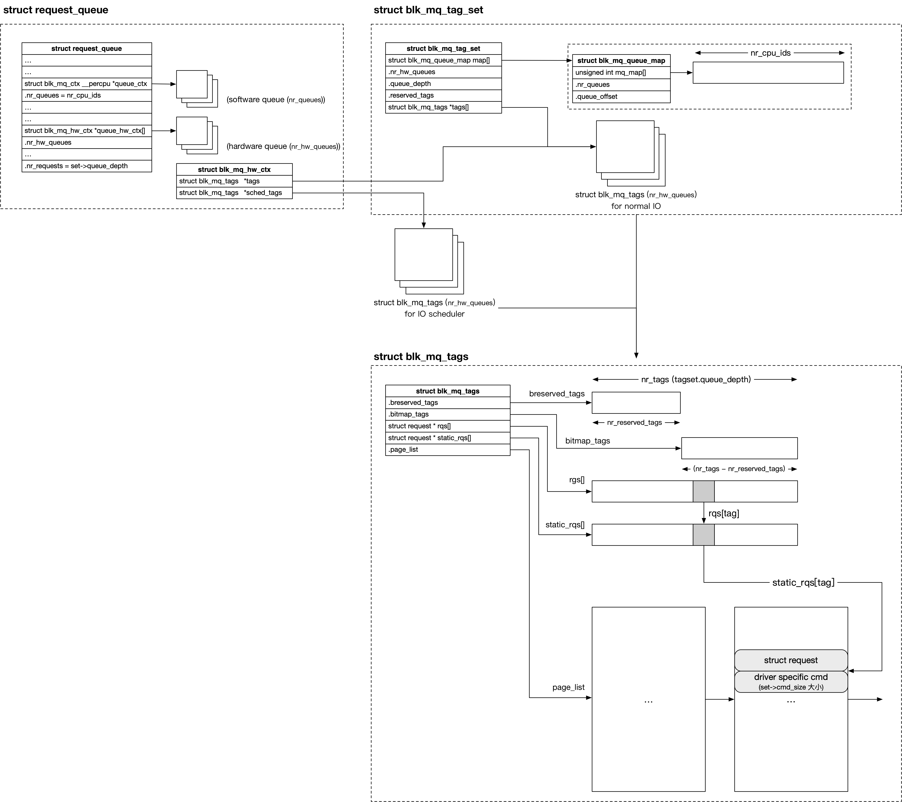

title:'Block - IO scheduler'
## Block - IO scheduler

### Concept

#### introduction

由于磁头的运动是连续的，HDD 在处理 sector 连续的 IO 请求时其效率达到最高，因而如果将上层下发的多个 request 按照 sector number 进行排序，再将排序后的 request 依次下发给设备，就可以提升 HDD 设备的 IO 性能

block layer 就使用 IO scheduler 来抽象这一概念。最初 IO scheduler 的核心只是一个链表，用于组织下发给某个设备的所有 request，并对链表中的所有 request 按照 sector number 进行排序

上层下发 bio 的时候，将该 bio 封装为一个 request，并将新封装的 request 添加到链表中的合适位置；或者只是将该 bio 与链表中的 pending request 相合并；而设备驱动则是依次处理该链表中的 pending request，由于链表中的 pending request 都是排好序的，因而设备就相当于工作在顺序访问模式


基于这个特性，由于磁头总是从磁盘的 inner track 连续运动到磁盘的 outer track，或反方向运动，这一运动特性与 elevator 直上直下的特性非常相似，因而这一算法又称为 elevator algorithm，在代码中用 "elevator" 来描述相关的数据结构


尽管最初 IO scheduler 只是用于对 request 进行排序，但是后来其功能不断扩展，例如对 read/write request 赋予不同的优先级、CFS 调度等，这也是 IO "scheduler" 名称的由来

因而在后来的 mutiqueue 框架下，即使 SSD 设备已经不再需要 IO scheduler 的排序功能，但是其涉及 IO 调度的功能仍然保留了下来，因而虽然不像 single-queue 框架下每个 request queue 都必须绑定一个 IO scheduler，在 multiqueue 框架下 request queue 可以不强制绑定 IO scheduler，但是 IO scheduler 的概念仍然存在，也就是说 multiqueue 框架下 request queue 也是可以绑定 IO scheduler 的。事实上随着 multiqueue 的发展，内核社区也提出了多个适用于 multiqueue 的 IO scheduler，例如 Bfq、Kyber 等

```sh
# IO scheduler for single-queue blkdev
noop deadline [cfq]

# IO scheduler for mq blkdev
[mq-deadline] kyber bfq none
```

对于采用 multiqueue 框架的 block device

- 当 hardware queue 的数量为 1 时，默认设置为 mq-deadline IO shceduler
- 当 hardware queue 的数量大于 1 时，默认使用 none


#### scheduler in mq

尽管 multiqueue 框架下可以不使用 IO scheduler，但是以下两种情况下会在 multiqueue 框架中使用 IO scheduler

1. 传统的 hard disk 在使用 multiqueue 机制时，必须使用 IO scheduler

由于 flash 存储介质的设备，其乱序访问的性能与顺序访问的性能相差不大，这些设备不需要 IO scheduler 的核心功能，即对 request 进行排序，因而这些设备可以不使用 IO scheduler

但是对于传统的磁盘来说，尽管这些设备内部没有实现多个 hardware queue，但是仍然可以使用 multiqueue 框架，此时会有效缓解 SMP 系统中多个 CPU 对 single request queue 的锁竞争。但同时这类存储介质的设备强依赖于 request 的排序，因而这类设备在使用 multiqueue 框架时，blkdev driver 必须指定 IO scheduler


2. IO scheduler 的功能不断扩展

虽然一开始 IO scheduler 的核心功能只是对 request 进行排序，但是随着内核的发展，其功能不断往 request 调度的方向扩展，例如 read/write 优先级分级、CFS 调度等，因而对于 flash 设备这类不强依赖于 request 排序的设备来说，依然可以使用 IO scheduler 来实现特定的 IO request 调度的功能


#### elevator_queue

struct elevator_queue 就抽象 IO scheduler

```c
struct elevator_queue
{
	struct elevator_type *type;
	void *elevator_data;
	...
};
```

@type 描述 IO scheduler type，@elevator_type.ops 抽象 IO scheduler specific 的操作

@elevator_data 保存 IO scheduler specific data，其中通常会维护 IO scheduler 自己维护的 request queue


request queue 的 @elevator 字段就指向该 request queue 使用的 IO scheduler

```c
struct request_queue {
	struct elevator_queue	*elevator;
	...
}
```


### Routine

在 multiqueue 机制下，在使用 IO scheduler 的情况下，整个 queue hierarchy 从上到下依次有

- IO scheduler request queue，实现为 @elevator_queue->elevator_data
- hardware dispatch queue


此时 generic block layer 下发的 IO request，会首先添加到 IO scheduler queue，同时 bio merge 阶段也是与 IO scheduler queue 中的 pending request 进行合并

在 dequeue 阶段也是依赖于 workqueue 机制，调度相应的 worker thread 将 IO scheduler queue 中的 pending request 转移到 hardware dispatch queue，并最终调用 mq_ops->queue_rq() 回调函数，将这些 request 下发给 device controller 处理


#### init

```sh
blk_mq_init_queue
    blk_mq_init_queue_data
        blk_alloc_queue
        blk_mq_init_allocated_queue

device_add_disk
    __device_add_disk
        elevator_init_mq
            elevator_get_default // "mq-deadline" for single-queue,
                                 // "none" for mq
            blk_mq_init_sched
                blk_mq_sched_alloc_tags // allocate sched tag_map for_each_hw_ctx
                e->ops.init_sched() // allocate elevator_queue and scheduler specific data
```




#### enqueue

##### bio merge

bio enqueue 时，会首先尝试将该 bio 与 IO scheduler queue 中的 pending request 合并

```sh
blk_mq_submit_bio
    blk_mq_sched_bio_merge
        __blk_mq_sched_bio_merge
            e->type->ops.bio_merge()
                blk_mq_sched_try_merge
                    rq = elv_rqhash_find(q, bio->bi_iter.bi_sector) // find request in elevator_queue matching bio's sector
                     elv_bio_merge_ok(__rq, bio) // check if mergeable
                        e->type->ops.allow_merge()
                    bio_attempt_back_merge // merge if check passed
```

其中会调用 elv_ops.bio_merge() 回调函数，其中通常会调用 blk_mq_sched_try_merge()

elevator_queue 中定义有一个 @hash hash table，其中组织所有添加到 elevator queue 的 request，key 为 request 描述的 sector range 的 end sector

```c
struct elevator_queue
{
	...
	DECLARE_HASHTABLE(hash, ELV_HASH_BITS);
};
```

blk_mq_sched_try_merge() 实际上就是从 @hash hash table 中找到一个 sector range 与当前需要合并的 bio 的 sector range 相邻的 request，两者进行 back merge


##### alloc request

若 bio 不能够合并，则需要为该 bio 分配一个新的 request，需要注意的是，此时是从 hctx->sched_tags 中分配的 tag

```sh
blk_mq_submit_bio
    __blk_mq_alloc_request
        blk_mq_get_tag
            # allocate tag from hctx->sched_tags
```


##### request enqueue

之后就会将 request 添加到 elevator queue 中

```sh
blk_mq_submit_bio
    blk_mq_sched_insert_request
        e->type->ops.insert_requests()
            blk_mq_sched_try_insert_merge
                elv_attempt_insert_merge // check if requests mergeable
            # insert request into elevator queue
            elv_rqhash_add // add request into elevator_queue's hash table
```


#### dequeue

下发 IO 过程中会调度 kblockd 运行 hardware dispatch queue

```sh
blk_mq_submit_bio
    blk_mq_sched_insert_request
        e->type->ops.insert_requests()
        blk_mq_run_hw_queue // queue work into kblockd
        

blk_mq_run_work_fn
    __blk_mq_run_hw_queue
        blk_mq_sched_dispatch_requests
            __blk_mq_sched_dispatch_requests
                blk_mq_do_dispatch_sched
                    __blk_mq_do_dispatch_sched
                        e->type->ops.has_work() // check if IO in elevator queue
                        e->type->ops.dispatch_request() // called in loop, move at max queue->nr_requests requests from elevator queue to @rq_list local list
                        blk_mq_dispatch_rq_list // dispatch @rq_list local list, calling driver's mq_ops->queue_rq()
```

其中会将 elevator queue 中的 requests 转移到 @rq_list 本地链表中，但是一次性最多只能转移 @queue->nr_requests 数量的 requests

之后就会调用 blk_mq_dispatch_rq_list() 处理 @rq_list 本地链表中的 requests，其中实际上就是调用驱动的 mq_ops->queue_rq() 回调函数进行处理

如果由于资源限制，@rq_list 本地链表中的 requests 不能全部提交给驱动处理，就会将该链表中剩余未下发的 requests 缓存到 @hctx->dispatch 链表中
