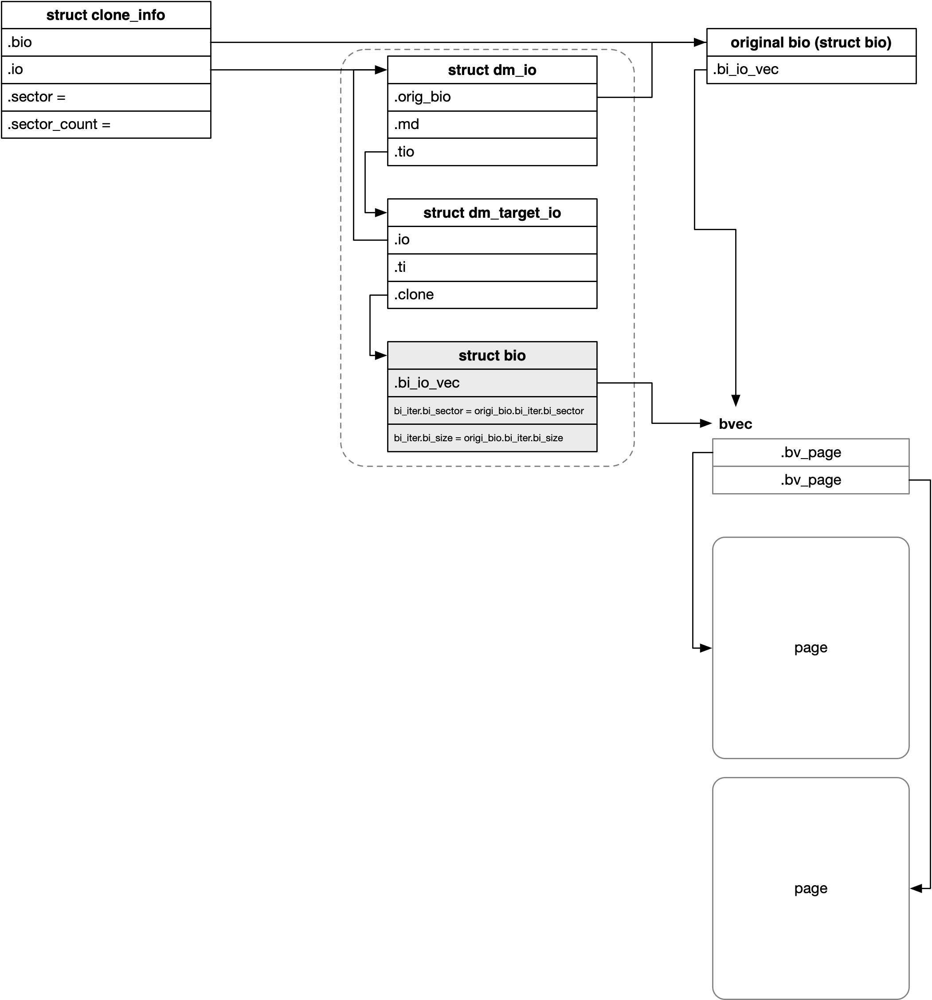

title:'dm - 3 bio-based IO Routine'
## dm - 3 bio-based IO Routine


### Concept

bio 由 mapped device 传递到底层的 target device 的过程中，原来的 bio 有可能需要拆分为多个 bio，例如一个 stripe 类型的 mapped device，其对应的 target device 可以为 target device A、target device B，此时这个 mapped device 的一个 bio 就有可能需要拆分为两个 bio，也就是发往 target device A 的一个 bio、以及发往 target device B 的一个 bio

为方便叙述，我们将一开始 mapped device 的一个 bio 称为 original bio，device mapper 的 IO routine 中，往往需要以 original bio 为基础创建多个 cloned bio，每个 cloned bio 发往一个 target device


#### dm_target_io

struct dm_target_io 就用于抽象一个 cloned bio，实际上用于 cloned bio 的 struct bio 结构就内嵌在 @clone 字段

根据地址映射，一个 original bio 可以对应一个或多个 cloned bio，因而也就对应一个或多个 struct dm_target_io 结构

```c
struct dm_target_io {
	struct dm_target *ti;
	unsigned target_bio_nr;
	struct bio clone;
	...
};
```


#### dm_io

此外每个 original bio 还对应一个 struct dm_io 结构

```c
struct dm_io {
	struct mapped_device *md;
	atomic_t io_count;
	struct bio *orig_bio;
	...
};
```

@orig_bio 指向 original bio
@io_count 计数描述 original bio 对应的 cloned bio 的数量


此外需要注意的是，dm_io 的 @tio 字段就内嵌了一个 struct dm_target_io，而 dm_target_io 中又内嵌一个 bio，因而 dm_io 中实际就内嵌有一个 cloned bio

```c
struct dm_io {
	...
	struct dm_target_io tio;
};
```


#### clone_info

此外在将 original bio 映射为多个 cloned bio 的过程中，会使用到 struct clone_info 结构进行辅助

```c
struct clone_info {
	struct bio *bio;
	struct dm_io *io;
	sector_t sector;
	unsigned sector_count;
	...
};
```

@bio 指向 original bio
@io 指向该 original bio 对应的 struct dm_io 结构


#### bioset

每个 dm table 中维护有两个 bioset，其中

- @io_bs 实际用于分配 struct dm_io，也就是说 `io_bs` bioset 分配出来的 bio 实际内嵌在 struct dm_io 中
- @bs 实际用于分配 struct dm_target_io，也就是说 `bs` bioset 分配出来的 bio 实际内嵌在 struct dm_target_io 中

```c
struct dm_table {
	struct dm_md_mempools *mempools;
	...
}

struct dm_md_mempools {
	struct bio_set bs;
	struct bio_set io_bs;
};
```


此外需要注意的是

@io_bs bioset 分配出来的内存布局实际为

```
target_type_specific + struct dm_io + struct dm_target_io + struct bio
```

@bs bioset 分配出来的内存布局实际为

```
target_type_specific                + struct dm_target_io + struct bio
```

这里 “target_type_specific” 表示 target type specific 的数据，在 target_type->ctr() 回调函数中可以通过设置 @per_io_data_size 字段的值，来描述这段内存的大小

```c
struct dm_target {
	/*
	 * The minimum number of extra bytes allocated in each io for the
	 * target to use.
	 */
	unsigned per_io_data_size;
	...
}
```


### Logical Routine

#### cloning routine

根据映射关系，一个 original bio 可以对应一个或多个 cloned bio，因而往往需要以 original bio 为基础创建多个 cloned bio，每个 cloned bio 发往一个 target device

本节描述为一个 original bio 创建多个 cloned bio 的过程


同时需要注意的是，此时 cloned bio 与 original bio 共享 bvec (struct bio_vec * 数组) 与 page，这些都是 original bio 的 bvec 与 page




> 1. initial sector/len

```c
struct clone_info {
	sector_t sector;
	unsigned sector_count;
	...
};
```

clone_info 的 @sector、@sector_count 字段描述了 original bio 中接下来还需要传输的 sector range

@sector、@sector_count 字段的初始值来自 original bio

```
sector = bio->bi_iter.bi_sector
sector_count = bio_sectors(bio)
```


之后为方便叙述，将 original bio 的 sector range 记为 (o_sector, o_sector_count)


因而此时 clone_info 的 @sector、@sector_count 字段的值实际为

```
sector = o_sector
sector_count = o_sector_count
```


> 2. mapping for first cloned bio

如之前所述，clone_info 的 @sector、@sector_count 字段描述了 original bio 中接下来还需要传输的 sector range

根据映射关系，假设这个 sector range 的前 @len 部分映射到 target device A，剩余部分映射到 target device B，那么这个 original bio 就需要两个 cloned bio

- 第一个 cloned bio 描述前半部分的 sector range 即 (o_sector, len)，发往 target device A
- 第二个 cloned bio 描述后半部分的 sector range 即 (o_sector+len, o_sector_count-len)，发往 target device B


> 3. allocate first cloned bio

接下来会创建第一个 cloned bio，也就是 struct dm_target_io 结构

实际上第一个 cloned bio 是和 struct dm_io 结构一起创建的，由于每个 original bio 都有一个对应的 struct dm_io 结构，因而在创建第一个 cloned bio 的时候，会将这两个数据结构的创建合在一起

实际上 struct dm_io 的 @tio 字段就内嵌了一个 struct dm_target_io，因而这里实际上只是分配一个 struct dm_io 结构，其中内嵌的 struct dm_target_io 就作为第一个 cloned bio

```c
struct dm_io {
	...
	struct dm_target_io tio;
};
```


接下来需要初始化 cloned bio 的关键字段

- sector range

bio 的 @bi_iter.bi_sector、@bi_iter.bi_size 字段描述了这个 bio 需要传输的 sector range，这两个字段的值实际为

```
bi_iter.bi_sector = clone_info->sector = o_sector_count
bi_iter.bi_size = len
```


- target device

bio->bi_disk 字段需要指向对应的 target device 的 gendisk

@dm_target_io->ti 已经指向当前 cloned bio 映射的 target device，此时以 dm-linear 为例，dm_target->private 字段存储 target type specific 的数据结构，顺着这个结构可以找到 target device 的 block device，从而找到对应的 gendisk


> 4. update clone_info

在第一个 cloned bio 初始化完成后，需要更新 clone_info 的 @sector、@sector_count 字段

```
sector += len
sector_count -= len
```


在更新完成后 @sector、@sector_count 字段的值为

```
sector = o_sector + len
sector_count = o_sector_count - len
```


> 5. allocate second cloned bio

接下来需要创建第二个 cloned bio，也就是 struct dm_target_io 结构；其实除了第一个 cloned bio 是内嵌在 struct dm_io 中的以外，其余的 cloned bio 都是单独分配一个 struct dm_target_io 结构


接下来类似地也是需要初始化 cloned bio 的关键字段；bio->bi_disk 字段的设置都是完全类似的，接下来再简单介绍一下 sector range 的设置

```
bi_iter.bi_sector = clone_info->sector = o_sector_count + len
bi_iter.bi_size = o_sector_count - len
```

> 6. update clone_info

类似地，在第二个 cloned bio 初始化完成后，也需要更新 clone_info 的 @sector、@sector_count 字段

```
sector += o_sector_count - len
sector_count -= o_sector_count - len
```


在更新完成后 @sector、@sector_count 字段的值为

```
sector = o_sector + o_sector_count
sector_count = 0
```


> 7. finish cloning

最后 clone_info 的 @sector_count 字段变为 0，标志着 original bio 映射为 cloned bio 的过程已经全部完成


#### queuing routine

接下来就需要将 cloned bio 分发给各自的 target device

例如 bio-based 中就是通过 generic block layer 的接口来将 cloned bio 分发给对应的 target device 的

在上一节中描述过，在创建 cloned bio 的过程中，cloned bio 的 @bi_disk 字段已经被设置为对应 target device 的 gendisk，因而 generic block layer 的接口中 cloned bio 就会被添加到对应的 target device 的 request queue 中


#### return of map()

之前介绍过都是调用对应 target type 的 map() 回调函数将，相对于 mapped device 的 sector 地址，映射为，相对于 target device 的 sector 地址

map() 回调函数有不同的返回值，调用者需要根据不同的返回值进行相应的不同处理

```c
	r = ti->type->map(ti, clone);
	switch (r) {
	case DM_MAPIO_SUBMITTED:
		break;
	case DM_MAPIO_REMAPPED:
		ret = submit_bio_noacct(clone);
		break;
	case DM_MAPIO_KILL:
		free_tio(tio);
		dec_pending(io, BLK_STS_IOERR);
		break;
	case DM_MAPIO_REQUEUE:
		free_tio(tio);
		dec_pending(io, BLK_STS_DM_REQUEUE);
		break;
	default:
		DMWARN("unimplemented target map return value: %d", r);
		BUG();
	}
```

> DM_MAPIO_REMAPPED

描述 sector 地址已经映射完成，此时需要将映射后的 bio 下发给 block layer

> DM_MAPIO_SUBMITTED

DM_MAPIO_SUBMITTED 的意思也就是说 target type 内部负责相应 bio 的下发，此时 map() 回调函数的调用者不需要负责 bio 的下发

DM_MAPIO_SUBMITTED 有两种情况

1. end bio in advance because of error 

一种是 target type 的 map() 回调函数处理过程中发生不可逆的错误，此时 map() 回调函数中就会对传入的 clone bio 执行 bio_endio()，以提前结束该 clone bio 的流程；同时返回 DM_MAPIO_SUBMITTED 以通知 dm core 不需要再下发该 clone bio

例如 dm-strip 设备处理 DISCARD IO 的时候，由于 dm-strip 设备的一个 struct dm_target 实际对应多个 underlying device，此时 @num_discard_bios 字段会被设置为 underlying device 的数量，这个时候上面下发的一个 DISCARD bio 会映射为多个 underlying DISCARD bio，也就是说此时会为每个 underlying device 分配一个 clone bio

但是上面下发的 DISCARD bio 描述的 sector range 可能并没有覆盖所有的 underlying device，对于 sector range 没有覆盖到的 underlying device，其 clone bio 实际上并不需要真的下发给对应的 underlying device，此时 map() 回调函数就会返回 DM_MAPIO_SUBMITTED

```sh
type->map(), that is, stripe_map
    stripe_map_range // for DISCARD IO
        // if the sector range doesn't map to the target stripe */
		      bio_endio(bio);  // with bio->bi_status = default 0
		      return DM_MAPIO_SUBMITTED;
```

类似地 dm-thin 的 map() 回调函数中当发生不可逆错误时，就会返回 DM_MAPIO_SUBMITTED

```sh
type->map(), that is, thin_map
    thin_bio_map
        if (get_pool_mode(...) == PM_FAIL):
            bio->bi_status = BLK_STS_IOERR;
            bio_endio(bio);
            return DM_MAPIO_SUBMITTED;
```

2. more complex functionality

另一种则是有些 target type 实现的功能比较复杂，map() 回调函数需要实现的功能不止简单的 sector 地址映射

例如 dm-crypt 中还需要对数据进行加解密处理，写入设备的数据已经不是 original bio 中的数据，而是加密之后的数据，因而 dm-crypt 中会自己调用相关接口将对应加密后的 bio 下发给 block layer，同时返回 DM_MAPIO_SUBMITTED

```sh
type->map(), that is, crypt_map
    // enqueue clone bio
    return DM_MAPIO_SUBMITTED;
```


> DM_MAPIO_REQUEUE

map() 回调函数中可能涉及一些资源（例如内存）的分配，如果因为资源紧张（例如 NOMEM）而导致资源分配失败，那么此时 map() 回调函数就会返回 DM_MAPIO_REQUEUE

DM_MAPIO_REQUEUE 的意思是此次 map() 因为资源紧张而失败，调用者可以在之后继续尝试


> DM_MAPIO_KILL

DM_MAPIO_KILL 描述当前需要执行 map() 的 bio 无法下发，例如 dm-crypt 中要求下发的 bio 的 sector 地址必须是按照加解密算法对齐的，如果下发的 bio 不符合这一要求，那么 map() 就会返回 DM_MAPIO_KILL，此时调用者就应该立即执行该 bio 的 completion 操作，返回失败


#### completing routine

如之前所述的，每个 original bio 都对应一个 struct dm_io 结构，
@io_count 字段描述 original bio 对应的 cloned bio 的数量

```c
struct dm_io {
	atomic_t io_count;
	...
};
```

- initial count

在 dm_io 分配的时候，@io_count 计数初始值为 1

```
blk_dops->submit_bio(), that is, dm_submit_bio
    __split_and_process_bio
        init_clone_info
            alloc_io
                atomic_set(&io->io_count, 1)
```


- inc count

之后每个 dm_target_io 都会增加 @io_count 计数

```
blk_dops->submit_bio(), that is, dm_submit_bio
    __split_and_process_bio
        __split_and_process_non_flush
            __clone_and_map_data_bio
                __map_bio
                    atomic_inc(&io->io_count)
                    type->map()
```


- drop initial count

在将 original bio 切分为对应的 clone bio 之后，就会移除一开始的 initial count

```sh
blk_dops->submit_bio(), that is, dm_submit_bio
    __split_and_process_bio
        __split_and_process_non_flush
            __clone_and_map_data_bio
                __map_bio
        dec_pending
            atomic_dec_and_test(&io->io_count) // drop initial count
```


- dec count

cloned bio 的 bi_end_io() 回调函数为 clone_endio()

```
__clone_and_map_simple_bio
    __map_bio
        clone->bi_end_io = clone_endio;
        target_type->map()
```

clone_endio() 中会调用 target type 的 end_io() 回调函数，以执行 dm target specific 的操作

```
bio_endio(clone)
    bio->bi_end_io(clone), that is, clone_endio
        type->end_io(dm_target, clone, clone->bi_status)
```

之后每个 cloned bio 在完成的时候都会将对应的 dm_io->io_count 计数减一，最后当 dm_io->io_count 计数变为 0，也就是一个 original bio 对应的所有 cloned bio 都已经完成的时候，就会触发调用 original bio 自己的 bi_end_io() 回调函数

```sh
bio_endio(clone)
    bio->bi_end_io(clone), that is, clone_endio
        free_tio(tio)
            bio_put(&tio->clone) // free clone bio and dm_target_io
        dec_pending(io, error)
            if (atomic_dec_and_test(&io->io_count)):
                free_io
                    bio_put(&io->tio.clone) // free clone bio and dm_io
                bio_endio(io->orig_bio) // end original bio
```

此外一个 original bio 对应的多个 cloned bio 的完成状态可能存在差异，只有所有 cloned bio 的完成状态都是 BLK_STS_OK，也就是对应的所有 cloned bio 都成功完成时，original bio 才认为是成功完成


### Routine

linear/stripe/thin-pool 都是 bio-based 的，bio-based 的 make_request_fn() 回调函数均为 dm_make_request()

> nvme bio-based

对于 nvme bio-based 的 request queue，READ/WRITE IO 的调用链为

```
dm_make_request
    __process_bio
        __clone_and_map_simple_bio
            __map_bio
                target_type->map()
                    (DM_MAPIO_REMAPPED) generic_make_request(clone)

```

对于 nvme bio-based，此时 cloned bio 与 original bio 共享 bvec (struct bio_vec * 数组) 与 page，这些都是 original bio 原先的 bvec 与 page


> other bio-based

对于其他 bio-based 的 request queue，READ/WRITE IO 的调用链为

```
dm_make_request
    __split_and_process_bio
        blk_queue_split
        __split_and_process_non_flush
            __clone_and_map_data_bio
                __map_bio
                    target_type->map()
                        (DM_MAPIO_REMAPPED) generic_make_request(clone)
```

两者的主要区别是，当 mapped device 只包含一个 nvme 类型的 target device 时，这个 mapped device 被称为是 nvme bio-based 的

因而一般的 non-nvme 的 bio-based 的 mapped device，其可能对应多个 target device，因而在 IO routine 中一个 original bio 就有可能被拆分为多个 cloned bio 发往各自的 target device

而由于 nvme bio-based mapped device 只包含一个 nvme 类型的 target device，因而 IO routine 中就不需要再拆分 original bio，其 IO 处理的流程相当于是 non-nvme bio-based 的 IO 处理流程的简化版本


此时 cloned bio 与 original bio 也是共享 bvec (struct bio_vec * 数组) 与 page，也就是 original bio 原先的 bvec 与 page；需要注意的是此时一个 original bio 可能拆分为多个 cloned bio，此时这些多个 bio 都共享一组 bvec 与 page，只是每个 cloned bio 的 @bi_iter 字段的值不同


