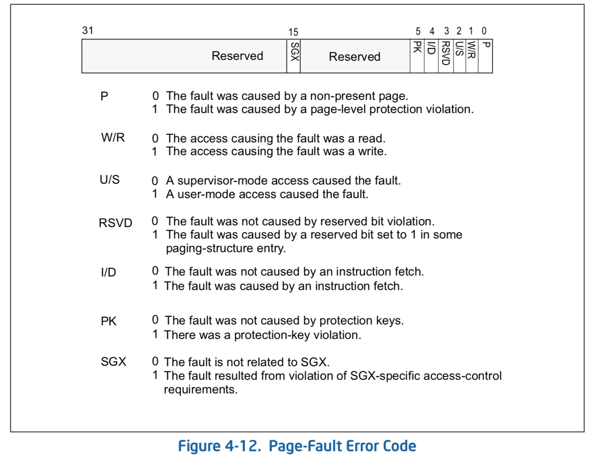

title:'MM - 3 Page Fault Log - x86'
## MM - 3 Page Fault Log - x86


当发生无法修复的 page-fault exception（例如访问空指针、权限检查失败等）时，则发生 oops，在系统退出之前会打印相关日志

```sh
page_fault_oops
    show_fault_oops
```


1. title

- 如果内存地址 <addr> 小于 PAGE_SIZE，那么认为是 NULL dereference

```
BUG: unable to handle kernel NULL pointer dereference at <addr>
```

- 否则就是一般的非法地址访问

```
BUG: unable to handle kernel paging request at <addr>
```


2. oops

之后还会打印一个 error code，error code 为 16 bit，描述 page fault 的类型

```
Oops: <error_code>
```


x86 架构下的 Page-Fault Error Code 的格式为



```
- P  flag  (bit 0). This flag is 0 if there is no translation for the linear address because the P flag was 0 in one of the paging-
structure entries used to translate that address.
- W/R (bit 1). If the access causing the page-fault exception was a write, this flag is 1; otherwise, it is 0. This flag 
describes the access causing the page-fault exception, not the access rights specified by paging.
- U/S (bit 2). If a user-mode access caused the page-fault exception, this flag is 1; it is 0 if a supervisor-mode access did 
so. This flag describes the access causing the page-fault exception, not the access rights specified by 
paging.
- RSVD  flag  (bit 3). This flag is 1 if there is no translation for the linear address because a reserved bit was set in one of the 
paging-structure entries used to translate that address.
- I/D flag (bit 4). This flag is 1 if the access causing the page-fault exception was an instruction fetch. This flag describes the 
access causing the page-fault exception, not the access rights specified by paging.
- PK  flag  (bit 5). This flag is 1 if the access causing the page-fault exception was a data access to a user-mode address with 
protection key disallowed by the value of  the PKRU register.
- SGX flag (bit 15). This flag is 1 if the exception is unrelated to paging and resulted from violation of SGX-specific access-
control requirements. Because such a violation can occur only if there is no ordinary page fault, this flag is 
set only if the P flag (bit 0) is 1 and the RSVD flag (bit 3) and the PK flag (bit 5) are both 0.
```


3. regs

```sh
page_fault_oops
    show_fault_oops
    __die
        __die_body
            show_regs
                __show_regs
```

```
RIP: 0010:io_wqe_enqueue+...
Code: ...
RSP: ...
...
```

这里 RIP 的地址是当前执行指令的地址，也就是触发 page fault 的那一条指令的地址


4. stacktrace

```sh
page_fault_oops
    show_fault_oops
    __die
        __die_body
            show_regs
                show_trace_log_lvl
```

```
Call Trace:
 io_iopoll_complete+0xXX/0xXX
 io_iopoll_getevents+0xXX/0xXX
 __se_sys_io_uring_enter+0xXX/0xXX
 do_syscall_64+0xXX/0xXX
 entry_SYSCALL_64_after_hwframe+0xXX/0xXX
```

这里的偏移地址一般是 "call <sub-func>" 指令的下一条指令
