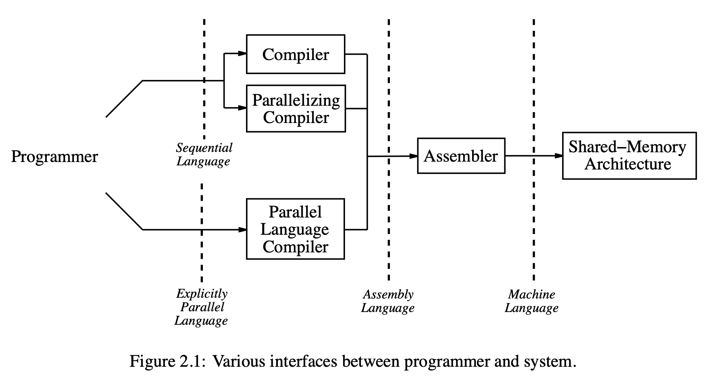
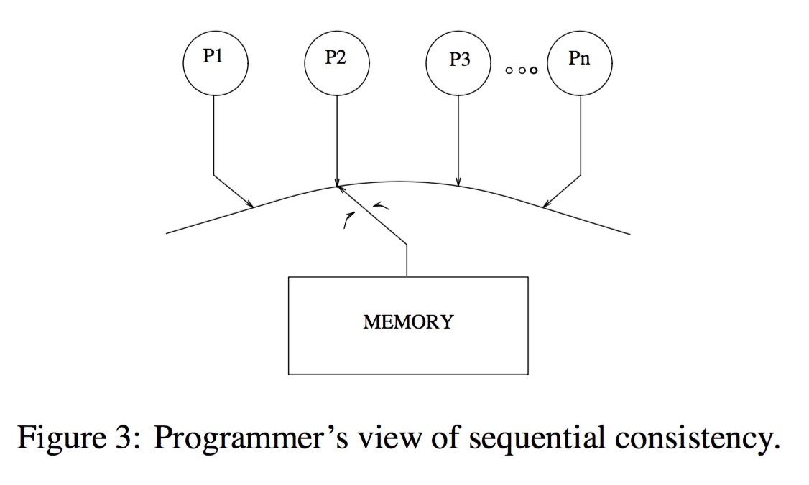

title:'Barrier - Memory Model'
## Barrier - Memory Model

### Concept

#### what is memory model?

memory model 的概念通常限定在 multi-processor 架构下讨论

在 multi-processor 架构下，多个处理器之间需要实现信息传递（同步）操作，通常有两种机制用于实现这一操作。

一种是使用 message-passing 机制，在该机制下每个处理器自己有一个 local memory 的内存地址空间，每个处理器只能访问各自的 local memory 地址空间，处理器之间的信息传递则依赖于显式的 message 操作；这样系统就必须实现两套指令分别用于访问 local memory 与 message 操作，这给架构设计和程序设计都带来了额外的复杂度

与之相对的另一种机制是系统中的所有处理器共用同一个 shared-memory 地址空间，此时系统中只需要实现一套访问内存的指令即可，多个处理器之间通过读写 shared-memory 实现信息传递，很大程度上简化了架构设计与程序设计的复杂度

然而在 shared-memory 机制下，多个处理器可能并行访问内存的同一地址，这个时候就必须抽象出一套规则来描述对同一地址处的内存进行访问，返回的结果是怎样的，这一套规则就称为 memory consistency model，有时候也简称为 memory model

或者换一个角度，memory model 描述了在多线程环境下，一个线程对某个内存地址的写操作之后，该写操作的效果在什么时候对当前线程或其它线程可见，即写操作之后多久，当前线程或其它线程的读操作可以反映之前写操作写入的值

> Since shared-memory systems allow multiple processors to simultaneously read and write the same memory locations, programmers require a conceptual model for the semantics of memory operations to allow them to correctly use the shared memory. This model is typically referred to as a memory consistency model or memory model.
> 
> *Kourosh Gharachorloo. "Memory Consistency Models for Shared-Memory Multiprocessors."*




源码由 high level language 经过编译器编译为机器代码，并在特定的硬件处理器上执行，这一过程会经过多层抽象，因而在每一层抽象上实际上都可以实现相应的 memory model，例如操作系统 (Linux)、语言 (C/C++)、体系结构 (x86/arm) 层面都实现有 memory model


#### ordering

在深入介绍 memory model 之前，有必要先引入几个概念

1. program order

program order 描述了指令在源码中的顺序。由于 memory model 只关心内存操作指令，因而实际上是指内存操作指令在源码中的顺序

考虑以下源码，我们可以说按照 program order，对 'buf' 内存的写指令，先于对 'flag' 内存的写指令

```c
int buf = 1;
int flag = 1;
```

2. execution order

execution order 指内存操作指令实际在处理器上执行的顺序。execution order 有可能与 program order 不一致，这是因为编译器和处理器都会对编译出来的指令的顺序进行重排，这称为 reorder，这是现代编译器和处理器非常重要的优化措施，能极大地提升程序的执行性能

还是对于以上示例代码，按照 execution order，对 'flag' 内存的写指令，反而可能先于对 'buf' 内存的写指令


### sequential memory model

一种最为直观的 memory model 是 sequential consistency memory model (简称为 SC)

#### SC in single-processor

single-processor 天然就是 sequential memory model 的，此时 sequential memory model 可以简单理解为，所有对内存的访问是串行执行的；此时的 memory model 是明确的，即 read 操作读取的值就是 program order 中上一次对该地址的 write 操作写入的值

这是因为编译器与处理器的 reorder 是在不改变单线程程序执行结果的基础上进行的，也就是说在单处理器下，reorder 虽然依旧存在，但是只会对非内存操作的指令之间进行 reorder，或者对不同内存地址的内存操作指令之间进行 reorder

例如对于以下实例代码，实际上包含有以下三条内存操作指令，分别记为 WRITE(buf)、WRITE(flag)、READ(flag)

```c
int buf = 1;
int flag = 1;
int x = flag;
```

那么 WRITE(buf) 可能会乱序排到 WRITE(flag) 之后，甚至可能乱序排到 READ(flag) 之后，但是 WRITE(flag) 与 READ(flag) 之间不会发生乱序，因为 reorder 保证不会对同一地址的内存操作指令进行重排


正是因为 single-processor 场景下的 memory model 是确定的，也就是 sequential memory model，因而在 single-processor 场景下讨论 memory model 往往意义不大，只有在 multi-processor 场景下才有讨论 memory model 的意义

更进一步地说，只有在 1) multi-processor 场景下同时 2) 每个 processor 上跑一个 thread，同时 3) 这些多个 processor 上跑的多个 thread 会并行访问同一个内存地址的时候，讨论 memory model 才是有意义的，因而以下关于 memory model 的讨论都在满足以上三点的情况下进行


#### SC in multi-processor

##### SC without cache

当计算机架构演化到 multi-processor 架构时，一种朴素的想法就是将 single-processor 架构下的 sequential memory model 适用到 multi-processor 架构中来

此时 multi-processor 架构下的 sequential memory model 定义为

> [A multiprocessor system is sequentially consistent if] the result of any execution is the same as if the operations of all the processors were executed in some sequential order, and the operations of each individual processor appear in this sequence in the order specified by its program.
> 
> *Leslie Lamport. "How to make a multiprocessor computer that correctly executes multiprocess programs."*

简单地来说，多个处理器的内存访问指令必须是串行执行的，为满足这一点系统必须满足以下两个条件

- maintaining a single sequential order among operations from all processors. 
- maintaining program order among operations from individual processors


首先多个处理器之间的内存访问指令必须是按照 program order 串行执行的，同一时刻只能有一个处理器执行内存访问指令，这就好像内存资源在多个处理器之间分时复用一样



例如对于以下程序

```sh
P1                          P2
buf = 1;                    while (flag ==1) {
flag = 1;                       data = buf;
                            }
```

为了实现 sequential memory model，必须确保两个处理器对 'flag' 内存地址的访问是串行执行的，程序执行过程中，要么处理器 P1 先访问 flag，要么处理器 P2 先访问 flag，而不能存在两个处理器同时访问 flag 内存的情况


此外只满足以上条件还不能实现 sequential memory model，例如上述示例代码中，由于编译器或处理器的 reorder 而导致处理器 P1 执行的指令发生重排，导致 WRITE(flag) 重排到 WRITE(buf) 之前，此时试想以下执行顺序

```
P1: WRITE(flag)
P2: READ(flag)
P2: READ(buf)
P1: WRITE(buf) 
```

此时处理器 P2 读取的 buf 的值还是原来的旧值也就是 0，这显然是不符合 sequential memory model 语义的，其原因就是编译器或处理器的 reorder 导致单个处理器上的内存指令发生重排

我们之前说过，编译器或处理器的 reorder 并不影响 single-processor 架构下的 sequential memory model 语义，这里发生的 reorder 重排处理器 P1 自身是不感知的，无论是否发生重排，都不影响 P1 上代码的执行结果；但是其他处理器是能够感知到 P1 上发生的重排的

因而为了符合 sequential memory model 语义，还必须满足另一个条件，即单个处理器上的内存操作指令必须是按照 program order 串行执行的


因而 sequential memory model 的充分条件实际上是：

> (a) Each processor issues memory requests in the order specified by its program.
> (b) Memory requests from all processors issued to an individual memory module are serviced from a single FIFO queue. Issuing a memory request consists of placing the request in this queue.
> 
> *Leslie Lamport. "How to make a multiprocessor computer that correctly executes multiprocess programs."*


##### SC with cache

以上介绍的 sequential memory model 的充分条件，实际上是在不讨论 cache 或者架构中不存在 cache 的情况下得出的，然而现代计算机架构普遍采用 cache 机制以减小内存访问的延时，此时以上的充分条件便不再适用，考虑以下示例代码

```c
P1                  P2                  P3
A = 1               u = A               v = B
                    B = 1               w = A
```

假设 A 的值同时存在于处理器 P1/2/3 的缓存中，同时考虑以下执行顺序

```
P1: WRITE(A)
P2: READ(A) (new value)
P2: WRITE(B)
P3: READ(B) (new value)
P3: READ(A) (old value)
```

- 处理器 P1 执行 WRITE(A) 时，需要向处理器 P2/3 发送 invalidate message
- 由于处理器拓扑结构的差异，P1 发送的 invalidate message 到达各个处理器的时间可能存在差异；假设 invalidate message 率先到达处理器 P2，处理器 P2 依次执行 READ(A)、WRITE(B) 操作，在执行 WRITE(B) 过程中，处理器 P2 也会向其他处理器发送 invalidate message
- 假设处理器 P2 发送的 invalidate message 先于处理器 P1 发送的 invalidate message 到达处理器 P3，这就导致处理器 P3 最终读取的 A 值仍然是原来的旧值，这显然与 sequential memory model 语义相违背


以上矛盾的主要原因在于，在讨论 sequential memory model 的充分条件时，一个隐含的前提是内存操作都是 atomic 的，在没有 cache 的架构下这一点天然是满足的；然而在引入 cache 机制后，同一个地址处内存的值的拷贝可能保存在多个处理器的缓存中，此时为了确保 write 操作的 atomicity 属性，仅仅向其他处理器发送 invalidate message 还远远不够，因为 invalidate message 到达其他处理器的时延可能是不同的，这就导致这中间存在一个时间窗口，使得其他处理器感知到的这个 write 操作的结果是不同，正如上述示例中，处理器 P2 感知到的 A 是更新后的新值，而处理器 P3 感知到的 A 仍然是原来的旧值

因而后来更新了适用于 cache 架构的新的 sequential memory model 的充分条件：

> (a) Each processor issues memory requests in the order specified by its program.
> (b) After a write operation is issued, the issuing processor should wait for the write to complete before issuing its next operation.
> (c) After a read operation is issued, the issuing processor should wait for the read to complete, and for the write whose value is being returned by the read to complete, before issuing its next operation.
> (d) Write operations to the same location are serialized in the same order with respect to all processors.
> 
> *Christoph Scheurich and Michel Dubois. "Correct memory operation of cache-based multiprocessors."*


新版的充分条件在原来的基础上，主要增加了 cache 架构下确保内存访问操作的 atomicity 特性的条件

- write atomicity: 在对内存执行一次 write 操作后，整个系统必须等待收到所有其他处理器回复的 invalidate response message 之后，这个 write 操作才算结束，之后才能继续执行其他内存访问操作
- read atomicity: 在对内存执行一次 read 操作过程中，必须等待之前一次对同一内存地址的 write 操作结束，才认为这个 read 操作结束，之后才能继续执行其他内存访问操作

例如 processor 1 对某个内存地址执行写操作之后，会向其它 processor 发送 invalidate message，之后当 processor 2 对该内存地址执行读操作时，只有当所有其它 processor 都接收到 processor 1 的invalidate message（即 processor 1 接收到所有其它 processor 回复的 invalidate response message），也就是当所有其它 processor 都看到该写操作时，processor 2 的读操作才能返回


从另一个角度，为满足 sequential memory model 语义，系统必须满足以下条件

> - program order requirement，即 a processor must ensure that its previous memory operation is complete before proceeding with its next memory operation in program order
> - write atomicity，即 writes to the same location be serialized (i.e., writes to the same location be made visible in the same order to all processors) and that the value of a write not be returned by a read until all invalidates or updates generated by the write are acknowledged


### relaxed memory model

从以上的介绍可以看出，sequential memory model 的语义相对来说是非常严格的，这直接限制了现代处理器架构下广泛使用的优化措施，例如编译器和处理器的 reorder 优化无法使用，从而导致系统的性能收到损害

sequential memory model 的要求往往过于严格而影响性能，有时在一些方面降低一些要求，同样可以实现 memory consistency，同时相较于 sequential memory model 具有更好的性能，这一类 memory model 统称为 relaxed memory model

现代处理器大多采用 relaxed memory model，relaxed memory model 的限制通常比 sequential consistency model 更为宽松，其通常在以下方面放松同步的要求

1. program order requirement

sequential memory model 中要求 single-processor 中内存操作的指令只能串行执行，无论该操作的内存地址是否相同；而 relaxed memory model 中只有当前后两个指令操作的内存地址相同时，才要求这两条内存指令串行执行，具体分为以下四种情况

- read after write (RAW)
- between two writes (WAW)
- write after read (WAR)
- between two reads (RAR)

实际上按照宽松程度的不同，relaxed memory model 也分为几类


#### x86

##### processor consistency

x86 架构下采用一种称为 processor consistency (PC) 的 memory model，其中放宽了 RAW 的要求

> - Reads are not reordered with other reads.
> - Writes are not reordered with older reads.
> - Writes to memory are not reordered with other writes.
> - Reads may be reordered with older writes to different locations but not with older writes to the same location.
> - Reads may be reordered with older writes to the same location in case of Intra-Processor Forwarding.
> 
> Intel Architecture Software Developer Manual, volume 3A, chapter 8, section 8.2 "Memory Ordering"

x86 memory model 下只有 RAW (read after write) 可能发生 reorder，但是只限于对不同内存地址的操作

例如以下示例代码中，A、B 为内存地址，因而以下代码分别执行了 WRITE(A)、READ(B) 操作

```c
P1
A = 1
u = B
```

由于 x86 memory model 下对不同内存地址的 RAW 操作可以 reorder，因而以上 WRITE(A)、READ(B) 操作可能会 reorder


再考虑以下代码，分别执行了 WRITE(A)、READ(A) 操作

```c
P1
A = 1
u = A
```

原则上上述 WRITE(A)、READ(A) 操作不能发生 reorder，即 WRITE(A) 操作过程中必须等待接收到其他处理器回复的 invalidate acknowledge message 之后，才能继续执行 READ(A) 操作，但是如果处理器实现有 store buffer 机制，那么 READ(A) 操作就可以跳过等待接收 invalidate acknowledge message 的阶段，直接从 store buffer 中获取 A 的值


##### CPU barrier

Linux kernel 中定义了三种类型的 CPU barrier

- smp_rmb() 保证 barrier 之前的 load 操作先于 barrier 之后的 load 操作完成
- smp_wmb() 保证 barrier 之前的 store 操作先于 barrier 之后的 store 操作完成
- smp_mb()  保证 barrier 之前的 load/store 操作先于 barrier 之后的 load/store 操作完成

由于 x86 memory model 下只存在 RAW reorder，因而

- smp_rmb() 与 smp_wmb() 实际上都是 no-op
- smp_mb() 则实现为 "lock; addl" 指令以禁止 RAW reorder


#### aarch64

##### weak ordering

aarch64 架构下采用一种称为 weak ordering (WO) 的 memory model

weak ordering 中 RAW、WAW、RAR、WAR 四种都可以发生 reorder，当然前提是前后两条指令操作的内存地址不同，如果前后两条指令操作的是同一内存地址，那么就不能发生 reorder

weak ordering 中所有四种指令顺序都可以发生 reorder，当处理器之间需要同步的时候，使用专门的指令来显式地同步，这样就可以尽可能地利用编译器和处理器的 reorder 优化，从而提升系统性能


##### CPU barrier

也正是由于 weak ordering 中所有四种指令顺序都可以发生 reorder，因而 aarch64 架构下 Linux kernel 中的三个 CPU barrier 实际都编译为 dmb 指令

> DMB (data memory barrier) causes the specified type of operations to appear to have completed before any subsequent operations of the same type. The “type” of operations can be all operations or can be restricted to only writes (similar to the Alpha wmb and the POWER eieio instructions). In addition, ARM allows cache coherence to have one of three scopes: single processor, a subset of the processors (“inner”) and global (“outer”).

