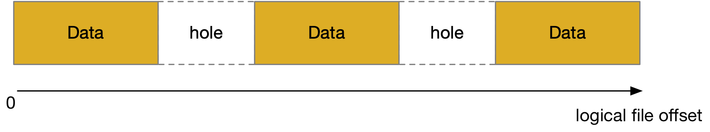

## Control - FIEMAP


### FIEMAP

FIEMAP ioctl 用于获取文件的 extent 信息

```c
int ioctl(int fd, FS_IOC_FIEMAP, struct fiemap *fiemap);
```

```
FS_IOC_FIEMAP ioctl
    ksys_ioctl
        do_vfs_ioctl
            ioctl_fiemap
                i_op->fiemap(), e.g., ext4_fiemap()
                    ext4_fill_fiemap_extents/iomap_fiemap
```

v5.7 版本 ext4 的 fiemap 切换到 iomap 框架


#### fiemap request

```c
struct fiemap {
	__u64	fm_start;	 /* logical offset (inclusive) at
				  * which to start mapping (in) */
	__u64	fm_length;	 /* logical length of mapping which
				  * userspace cares about (in) */
	__u32	fm_flags;	 /* FIEMAP_FLAG_* flags for request (in/out) */
	__u32	fm_mapped_extents; /* number of extents that were
				    * mapped (out) */
	__u32	fm_extent_count; /* size of fm_extents array (in) */
	__u32	fm_reserved;
	struct fiemap_extent fm_extents[0]; /* array of mapped extents (out) */
};
```

@fm_start/fm_length 描述需要获取映射 (fm_start, fm_start + fm_length) logical block range 的 extent

最终获取的 extent 保存在 @fm_extents[] 数组内，且该数组必须紧接在 struct fiemap 之后，因而用户在分配 struct fiemap 的时候需要一起分配 fm_extents[] 数组

@fm_extent_count 描述了 fm_extents[] 数组的大小，获取的 extent 保存在 @fm_extents[] 数组内，同时在 @fm_mapped_extents 保存 fm_extents[] 数组中实际写入的 extent 的数量

如果传入的 struct fiemap 并没有分配相应的 fm_extents[] 数组，即 fm_extent_count 为 0，那么内核只是清点指定的 logical block range 内 extent 的数量，并保存在 @fm_mapped_extents 字段


#### extent mapping

@fm_extents[] 数组实际上是 struct fiemap_extent 数组，一个 extent 就对应一个 struct fiemap_extent，但是 hole 并不对应

```c
struct fiemap_extent {
	__u64	fe_logical;  /* logical offset in bytes for the start of
			      * the extent */
	__u64	fe_physical; /* physical offset in bytes for the start
			      * of the extent */
	__u64	fe_length;   /* length in bytes for the extent */
	__u64	fe_reserved64[2];
	__u32	fe_flags;    /* FIEMAP_EXTENT_* flags for this extent */
	__u32	fe_reserved[3];
};
```

@fe_flags 描述了当前 extent 的类型

- FIEMAP_EXTENT_LAST 描述当前 extent 是文件的最后一个 extent
- FIEMAP_EXTENT_UNKNOWN 描述当前 extent 的起始 physical block number 是 unknown 的，一个典型的例子是 delalloc extent
- FIEMAP_EXTENT_DELALLOC 描述当前 extent 是一个 delalloc extent，因而 FIEMAP_EXTENT_DELALLOC 往往和 FIEMAP_EXTENT_UNKNOWN 一起出现
- FIEMAP_EXTENT_UNWRITTEN 描述当前 extent 是一个 unwritten extent


### Extent Type

文件的 extent 大致可以分为 written/unwritten/delalloc/hole 三种类型，其中 written/unwritten 对应有分配的磁盘空间，而 delalloc/hole 则没有对应的磁盘空间，因而 on-disk extent tree 只存储 written/unwritten 类型的 extent

但是这些 extent 一般都计算在文件的大小 (inode->i_size) 内


#### written

written extent 就是我们平常所说的 extent，对应有分配的磁盘空间


#### unwritten

unwritten extent 也对应有分配的磁盘空间，但是对其执行读操作应该返回 0，其主要描述用户通过 fallocate() 系统调用预分配的磁盘空间

为了满足”对预分配的磁盘空间执行读操作应该返回 0“的语义，一种实现是对预分配的磁盘空间做填 0 处理，但是这种操作比较低效，更高效的做法是在 extent tree 中区分 written/unwritten extent，written extent 就是映射通过正常的写操作分配的 physical block，而 unwritten extent 则是映射通过 fallocate 预分配的 physical block，这样 read 过程中遇到 unwritten extent 的时候，就可以将读取的内容直接返回 0


#### delalloc

一般每次 write 过程中都会为当前写入的数据分配 physical block，尽管此时这些数据还在 page cache 中而尚未写入磁盘；而 delalloc 特性会延迟 physical block 的分配，此时 write routine 中不会分配 physical block，physical block 会推迟到 page cache writeback 的时候再进行

但是这里就存在一个问题，我们知道 extent tree 是存储在磁盘上的，在开启 delalloc 特性的时候并没有为写入的数据分配 physical block，那么自然文件的 extent tree 也就没有更新。此时如果要区分文件的一个 extent，到底是 delalloc 的，还是 hole，就只能去看文件的 address space 中有没有该 extent 对应的 pagecache，但是这种实现存在很多问题

> Without extent status tree, ext4 identifies a delayed extent by looking
> up page cache, this has several deficiencies - complicated, buggy,
> and inefficient code.


因而后面的实现是在内存中维护一棵 extent status tree，delalloc 的时候，write routine 中不会为写入的数据分配 physical block，但是会往 extent status tree 中插入一个 delay extent status

> Currently the first step has been done.  All delayed extents are
> tracked in the tree.  It maintains the delayed extent when a delayed
> allocation is issued, and the delayed extent is written out or
> invalidated.  Therefore the implementation of fiemap and bigalloc
> are simplified, and SEEK_DATA/SEEK_HOLE are introduced.


#### hole




文件中可以存在 hole，这部分区间并不存储数据，即不对应磁盘空间，对这部分区间执行读操作时会返回 0

当对文件执行写操作时，如果需要写入的 offset 大于当前文件的大小，就会在文件中形成一个 hole
