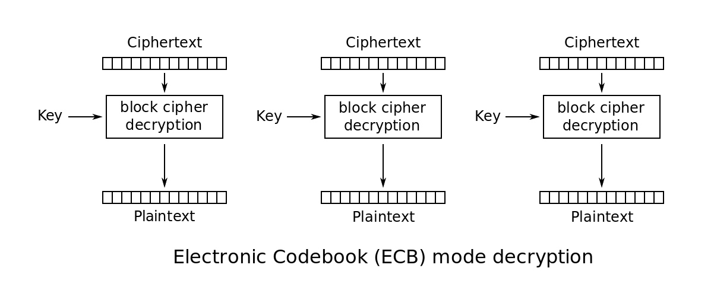
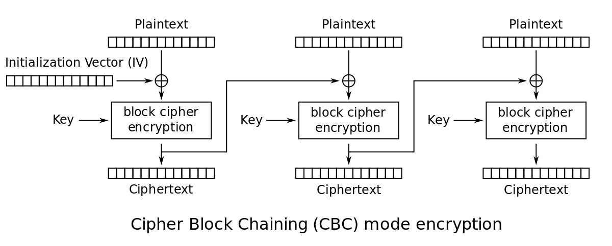
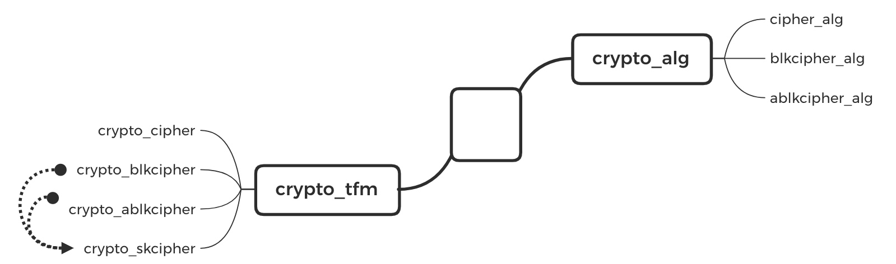
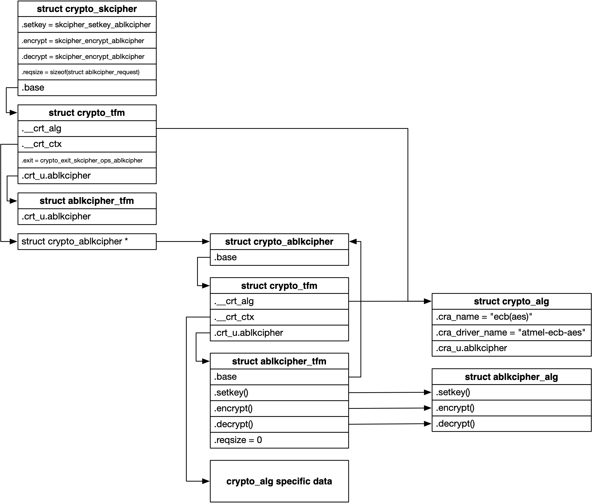

title:'Crypto Framework'
## Crypto Framework


### Concept

#### cipher type

首先简单介绍下加解密算法中的几个概念。

我们知道加密的过程实际上就是，将密钥 (key) 与原文 (plaintext) 通过某种算法进行计算并最终输出密文 (ciphertext)，从而达到数据加密的效果

加解密算法可以分为，对称加密 (Symmetric-key algorithm) 和非对称加密 (Asymmetric-Key Encryption) 两种，其中前者是指加密和解密过程中使用的密钥是相同的

此外加解密算法还可以分为，分组加密 (block cipher) 和流加密 (stream cipher) 两种，其中前者每次只能对固定长度的数据 (block) 执行加解密操作

以上两种加解密算法的分类是相互正交的


#### chainmode

分组加密 (block cipher) 只能对**固定长度**的数据进行加解密操作，对于变长数据来说，必须将数据划分为固定长度的分组，数据尾部长度不够的需要进行填充，之后再对每个分组分别进行加解密操作；在将数据划分为分组的过程中，工作模式 (chainmode) 描述了划分分组的方法、上一个分组的输出是否影响下一个分组等因素

同一个算法可以有不同的工作模式，以下简单介绍 ECB 与 CBC 两种

ECB (Electronic CodeBook, 电子密码模式) 是指每个分组单独计算，分组之间互不影响，因而该模式下不同的分组可以并行计算




CBC (Cipher Block Chaining, 密码分组链接模式) 是指上一个分组的计算结果同时作为下一个分组的输入，在实现上也就是将上一个分组的计算结果与下一个分组的明文进行 XOR 异或运算，之后再将运算的结果与密钥进行计算，并最终得到密文；因而该模式下各个分组的计算相当于是串行的

需要注意的是，第一个分组需要与 IV (Initial Vector) 进行 XOR 计算，IV 通常是通过 hash 算法生成的




### Crypto Framework



#### crypto_alg

struct crypto_alg 抽象加密算法的类型，使用 crypto_register_alg() 接口注册 crypto_alg

```c
struct crypto_alg {
	const struct crypto_type *cra_type;
	u32 cra_flags;

	union {
		struct ablkcipher_alg ablkcipher;
		struct blkcipher_alg blkcipher;
		struct cipher_alg cipher;
		struct compress_alg compress;
	} cra_u;
	...
};
```

crypto 框架发展至今，除了最开始的加解密算法之外，现在还支持压缩/解压缩、hash 等功能，此时 @cra_type/@cra_flags 字段就用于标识算法的不同类型


##### Single-Block Cipher

single block cipher 算法是指每次只能对一个 single block 执行加解密操作，且前后两次操作的 single block 之间没有任何联系，类似于之前介绍的 ECB (Electronic CodeBook) 模式

single block cipher 的 @cra_type 为空，@cra_flags 为 CRYPTO_ALG_TYPE_CIPHER 标识当前算法为 single block cipher 类型


single block cipher 需要实现 struct cipher_alg 结构中的回调函数，保存在 struct crypto_alg 的 @cra_u.cipher 字段

single block cipher 算法是指每次只能对一个 single block 执行加解密操作，这一点从 @cia_encrypt() 回调函数的原型也可以看出

```c
struct cipher_alg {
	int (*cia_setkey)(struct crypto_tfm *tfm, const u8 *key,
	                  unsigned int keylen);
	void (*cia_encrypt)(struct crypto_tfm *tfm, u8 *dst, const u8 *src);
	void (*cia_decrypt)(struct crypto_tfm *tfm, u8 *dst, const u8 *src);
	...
};
```


执行 encrypt/decrypt 操作时，传入的 @src/@dst 缓存的大小必须为 @cra_blocksize 大小，同时必须按照 @cra_alignmask 对齐

```c
struct crypto_alg {
	unsigned int cra_blocksize;
	unsigned int cra_alignmask;
	...
};
```


single block cipher 的代表为 AES (Advanced Encryption Standard)，例如

```c
static struct crypto_alg aes_alg = {
	.cra_name		=	"aes",
	.cra_driver_name	=	"aes-generic",
	.cra_flags		=	CRYPTO_ALG_TYPE_CIPHER,
	.cra_blocksize		=	AES_BLOCK_SIZE,
	.cra_u			=	{
		.cipher = {...}
	}
	...
};
```


##### Multi-Block Cipher
 
之前介绍的 single block cipher 算法每次只能对一个 single block 执行加解密操作，一些硬件加解密设备支持同时对多个 block 执行加解密操作，此时使用 scatterlist 描述缓存

其实 multi block cipher 也分为 synchronous multi-block cipher 与 asynchronous multi-block cipher 两类，其中前者是同步的，而后者是异步的，此时用户只是提交一个 struct ablkcipher_request，里面包含一个 completion 回调函数，用户提交 struct ablkcipher_request 的时候会立即返回，之后当任务完成时再调用用户的 completion 回调函数


###### synchronous multi-block cipher

此时

- @cra_flags 为 CRYPTO_ALG_TYPE_BLKCIPHER
- @cra_type 为 crypto_blkcipher_type


同时需要实现 struct blkcipher_alg 结构中的回调函数，保存在 struct crypto_alg 的 @cra_u.blkcipher 字段

```c
struct blkcipher_alg {
	int (*setkey)(struct crypto_tfm *tfm, const u8 *key,
	              unsigned int keylen);
	int (*encrypt)(struct blkcipher_desc *desc,
		       struct scatterlist *dst, struct scatterlist *src,
		       unsigned int nbytes);
	int (*decrypt)(struct blkcipher_desc *desc,
		       struct scatterlist *dst, struct scatterlist *src,
		       unsigned int nbytes);
	...
};
```


###### asynchronous multi-block cipher

此时

- @cra_flags 为 CRYPTO_ALG_TYPE_ABLKCIPHER
- @cra_type 为 crypto_ablkcipher_type


同时需要实现 struct ablkcipher_alg 结构中的回调函数，保存在 struct crypto_alg 的 @cra_u.ablkcipher 字段

```c
struct ablkcipher_alg {
	int (*setkey)(struct crypto_ablkcipher *tfm, const u8 *key,
	              unsigned int keylen);
	int (*encrypt)(struct ablkcipher_request *req);
	int (*decrypt)(struct ablkcipher_request *req);
	...
};
```


#### crypto_tfm

struct crypto_tfm 抽象加密算法的一个实例

```c
struct crypto_tfm {
	union {
		struct ablkcipher_tfm ablkcipher;
		struct blkcipher_tfm blkcipher;
		struct cipher_tfm cipher;
		struct compress_tfm compress;
	} crt_u;
	...
	
	struct crypto_alg *__crt_alg;
	void *__crt_ctx[] CRYPTO_MINALIGN_ATTR;
};
```

不同类型的算法通常使用自己特有的数据类型来描述对应的实例，这些数据类型都只是对 struct crypto_tfm 的简单封装

- struct crypto_cipher 抽象 single block cipher 实例，此时使用 crt_u.cipher 字段
- struct crypto_blkcipher 抽象 synchronous multi-block cipher 实例，此时使用 crt_u.blkcipher 字段
- struct crypto_ablkcipher 抽象 asynchronous multi-block cipher 实例，此时使用 crt_u.ablkcipher 字段


同时不同类型的算法通常使用不同的接口来创建对应的 crypto_tfm 示例，例如

- crypto_alloc_cipher() 创建 single block cipher 实例
- crypto_alloc_blkcipher() 创建 synchronous multi-block cipher


#### crypto_skcipher

v4.3 中引入 crypto_skcipher 接口来替代之前的 crypto_blkcipher 与 crypto_ablkcipher 接口，即 crypto_skcipher 接口既可以创建 synchronous multi-block cipher 实例，也可以创建 asynchronous multi-block cipher 实例

此时根据传入的加解密算法的名字来判断是使用同步接口还是异步接口，这部分的逻辑是根据传入的加解密算法的名字找到对应的 crypto_alg，之后根据 crypto_alg 来判断是使用同步接口还是异步接口

- 如果 crypto_alg.cra_type 为 crypto_blkcipher_type，那么当时使用同步接口
- 如果 crypto_alg.cra_type 为 crypto_ablkcipher_type，那么当时使用异步接口

此时使用 crypto_skcipher (symmetric key cipher) 来描述 synchronous/asynchronous multi-block cipher 实例一个统一的抽象


crypto_skcipher 实际上也是对 struct crypto_tfm 的封装，此时使用 crypto_alloc_skcipher() 接口创建 crypto_skcipher 实例




skcipher 执行加密操作的入口为 skcipher_encrypt_ablkcipher()

```c
int skcipher_encrypt_ablkcipher(struct skcipher_request *req)
```

最终实际上是调用对应的 crypto_alg.cra_ablkcipher 实现的 encrypt() 回调函数

```
skcipher_encrypt_ablkcipher
    alg->cra_ablkcipher.encrypt()
```


#### asynchronous IO rutine

每个实现有 asynchronous multi-block cipher 的驱动实际上都会利用 crypto_queue 对提交的所有 asynchronous request 进行管理

```c
struct crypto_queue {
	struct list_head list;
	struct list_head *backlog;

	unsigned int qlen;
	unsigned int max_qlen;
};
```

@list 链表就用于组织提交的所有 asynchronous request
@qlen 描述该链表中的 asynchronous request 的数量

软件或硬件的算力是有限的，因而这个 crypto_queue 队列不能无限增长，@max_qlen 描述了队列的最大长度，也就是可以容纳的 asynchronous request 的数量上限


struct crypto_async_request 就用于抽象一个 asynchronous request

```c
struct crypto_async_request {
	struct list_head list;
	crypto_completion_t complete;
	void *data;
	...
};
```

@list 字段就用于将该 asynchronous request 添加到 crypto_queue 队列中

当这个 asynchronous request 处理完成时，就会调用 @complete() 回调函数


skcipher 执行加密操作的入口为 skcipher_encrypt_ablkcipher()，我们以这个接口为例

1. enqueue first asynchronous request

假设此时算法的 crypto_queue 队列为空，当提交第一个 asynchronous request 时，这个 asynchronous request 添加到算法的 crypto_queue 队列中，同时会在当前进程上下文中设置硬件的相关寄存器，之后立即返回


2. when @qlen <= @max_qlen

之后继续提交 asynchronous request，同样会将这个 asynchronous request 添加到算法的 crypto_queue 队列中

此时如果硬件支持同时处理多个 asynchronous request，那么和 step 1 中一样，在当前进程上下文中设置硬件的相关寄存器，之后立即返回

而如果硬件不支持同时处理多个 asynchronous request，或者当前同时处理的 asynchronous request 数量已经达到上限，那么当前进程上下文会立即返回 -EINPROGRESS，表示 crypto 框架已经受理该 asynchronous request，但是加密/解密操作尚未完成


3. when @qlen > @max_qlen

继续提交 asynchronous request，如果此时 crypto_queue 队列中 asynchronous request 的数量已经达到上限，那么此时实际上还是会将当前提交的 asynchronous request 添加到 crypto_queue 队列中，之后当前进程上下文立即返回 -EBUSY，表示 crypto 框架的 crypto_queue 队列已满而无法再受理更多的 asynchronous request，虽然进程当前提交的 asynchronous request 已经成功入队列，但是进程接下来必须暂停更多 asynchronous request 的下发

这里需要注意的是，当 crypto_queue 队列中 asynchronous request 的数量已经达到上限的时候，当前提交的 asynchronous request 同样会被添加到 crypto_queue 队列中，同时 @backlog 会指向这个新入队列的 asynchronous request


```
            @max_qlen
<----------------------------->
+----+----+----+----+----+----+----+----+----+----+----+
   ^                            ^
 @list                       @backlog
```

@backlog 的初始值就指向 @list，如果 @qlen 一直小于等于 @max_qlen，那么 @backlog 就一直指向 @list，也就是说明当前 crypto_queue 队列仍未满

而当 @qlen 超过 @max_qlen 时，@backlog 就指向 crypto_queue 队列中第一个超过 @max_qlen 的 asynchronous request（之后继续提交的 asynchronous request 会添加到 crypto_queue 队列的尾部），因而如果 @backlog != @list，那就说明当前 crypto_queue 队列已满，同时 @backlog 就指向第一个“积压”的 asynchronous request


4. complete first asynchronous request

step 1 中只是设置相应的硬件寄存器，将这个 asynchronous request 提交给硬件设备，之后当硬件设备完成这个 asynchronous request 的任务时，就会调用 @complete() 回调函数，回调函数的 @error 参数描述了处理的结果，0 表示处理成功；同时会调用 tasklet 等机制调度处理 crypto_queue 队列中的 pending asynchronous request

此时如果 @qlen <= @max_qlen 也就是 crypto_queue 队列未满，那么类似于 step 2，只是此时是在 tasklet 上下文中向硬件提交该 asynchronous request 的处理


5. wakeup waiter

之前在 step 3 中介绍过，提交 asynchronous request 的时候，如果此时 @qlen 超过了 @max_qlen 也就是 crypto_queue 队列已满，那么当前提交的 asynchronous request 仍然会被添加到 crypto_queue 队列中，同时返回 -EBUSY

调用者接收到 -EBUSY 返回值，说明当前算法的 crypto_queue 队列已满，此时调用者就必须暂停接下来 asynchronous request 的下发，并进入睡眠等待状态


同时就像 step 4 中描述的那样，当硬件设备完成上一个提交的 asynchronous request 时，会调用 tasklet 等机制调度处理 crypto_queue 队列中的 pending asynchronous request，此时如果 @qlen 超过了 @max_qlen 也就是 crypto_queue 队列已满，那么此时除了跟 step 4 中一样，从 crypto_queue 队列中取出第一个 asynchronous request 开始处理之外，还会从 @backlog 取出积压的第一个 pending asynchronous request，调用其 complete() 回调函数，只是此时返回的 @error 参数为 -EINPROGRESS，这表示这个 asynchronous request 由原先“积压”在 crypto_queue 队列之外，成功“升格”并进入 crypto_queue 队列之中

此时这个 asynchronous request 的 complete() 回调函数调用的时候，对应的 asynchronous request 任务并没有实际完成，这实际上只是一个信号，通知调用者当前 crypto_queue 队列腾出了一定的空间来接纳更多的 asynchronous request，因而这个 complete() 回调函数中只是会唤醒之前因为接收到 -EBUSY 返回值而进入睡眠等待状态的进程


6. summary

最后有必要总结一下 skcipher_encrypt_ablkcipher() 的返回值

- 0 表示整个 asynchronous request 任务已经成功完成，此时相当于变成了同步操作
- -EINPROGRESS 表示 crypto 框架已经受理 asynchronous request，但是加密操作尚未完成，此时就是异步操作
- -EBUSY 表示 crypto 框架的 crypto_queue 队列已满而无法再受理更多的 asynchronous request，此时进程必须暂停 asynchronous request 的下发


