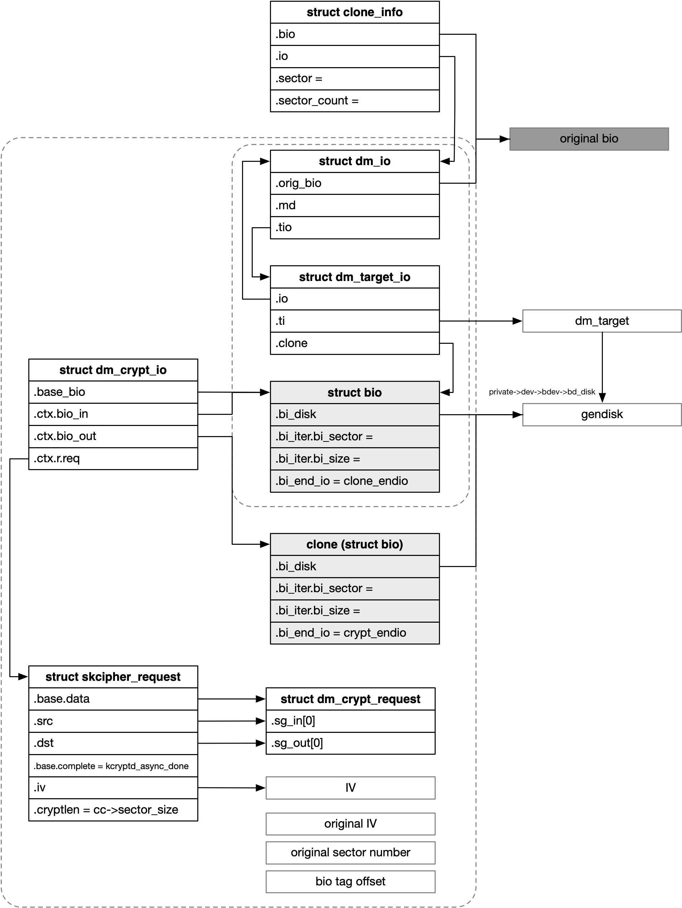
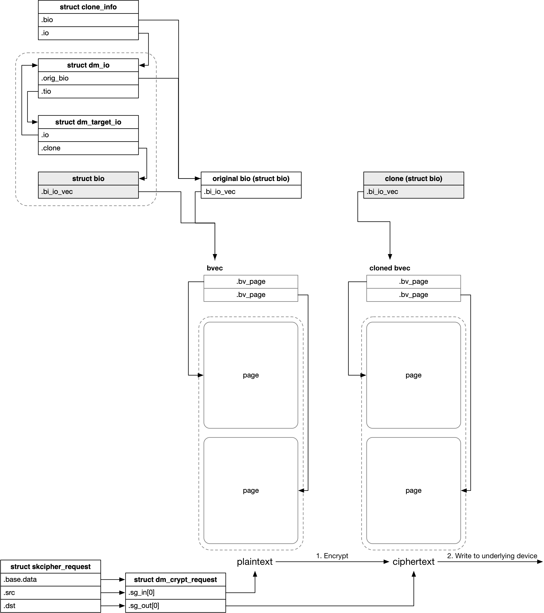
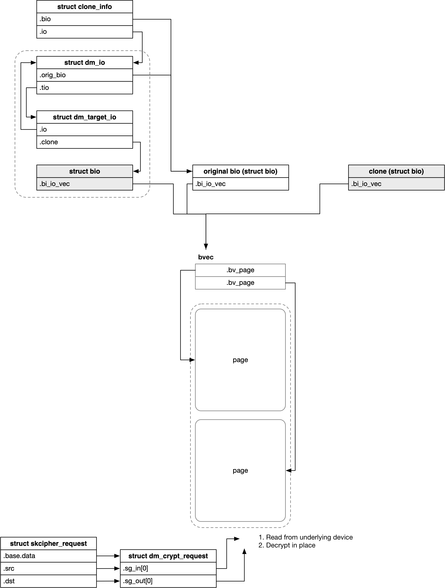

## dm-crypt - Base


### Concept

#### crypt_config

dm-crypt 中，传入的 mapping table 的相关信息就保存在 struct crypt_config 中，struct crypt_config 会作为 dm-crypt 的 struct target_device 的 private data

此外 struct crypt_config 中还保存了加密算法的实例，即 struct crypto_skcipher

```c
struct crypt_config {
	union {
		struct crypto_skcipher **tfms;
		...
	} cipher_tfm;
	...
}
```


#### bio memory layout

之前介绍过，dm IO routine 中会创建 original bio 的拷贝，此时实际上分配的是 struct dm_io/dm_target_io，需要的 cloned bio 就内嵌在分配的 struct dm_io/dm_target_io 结构中

实际上 target type 还可以在分配 cloned bio 的时候，指定分配 target type specific 的数据，因而对于 dm-crypt 来说，每个分配的 cloned bio 其真实的内存布局实际为

```
struct dm_crypt_io + 
struct skcipher_request + 
struct crypto_skcipher.reqsize (e.g. struct ablkcipher_request) +
struct dm_crypt_request +
IV (cc->iv_size) +
original IV (cc->iv_size) +
original sector number (uint64_t) +
bio tag offset (unsigned int)
```

其中后三者 (original IV + original sector number + bio tag offset) 作为 per-bio integrity metadata，用于 integrity 特性


### IO Routine




#### write routine

dm-crypt 使用的是 crypto 框架中的 ablkcipher 即异步接口，因而整个 IO routine 会涉及到多个进程上下文

```
- process context
.map(), that is, crypt_map
    kcryptd_queue_crypt
        # queue dm_crypt_io to "kcryptd" workqueue

- "kcryptd" workqueue
kcryptd_crypt
    kcryptd_crypt_write_convert
        crypt_convert
            while () crypt_convert_block_skcipher
                crypto_skcipher_encrypt
                    tfm->encrypt()

- Crypto (IRQ context or workqueue)
req->complete(), that is, kcryptd_async_done
    kcryptd_crypt_write_io_submit
        # insert cloned bio into @cc->write_tree rbtree
        # wakeup "dmcrypt_write" kthread

- "dmcrypt_write" kthread
dmcrypt_write
    while (@cc->write_tree rbtree not empty)
        kcryptd_io_write # process one cloned bio
            generic_make_request(clone)

- "crypt_endio"
crypt_endio
    crypt_dec_pending(dm_crypt_io)
        bio_endio(dm_crypt_io->base_bio, error)
```

1. process context

当前进程对 dm-crypt 设备发起 IO 时，首先会在当前进程上下文中调用 dm-crypt 的 map() 回调函数即 crypt_map()，这里只是将 dm_crypt_io 添加到 "kcryptd" workqueue 中


2. "kcryptd" workqueue

dm_crypt_io 的 work function 为 kcryptd_crypt()，因而接下来会由 worker 执行 kcryptd_crypt()

这里会再创建一个 cloned bio，我们将 dm_io/dm_target_io 中内嵌的 bio 称为 src bio，dm-crypt 驱动中创建的 cloned bio 称为 dst bio；在 write routine 中，在将 IO 下发给底层的物理设备之前，必须先对 IO 传输的数据进行加密操作，因而这里实际上就是对 src bio 中的数据进行加密，加密后的数据保存在 dst bio 中



需要注意的是，src buf 就是 src bio 的 bvec，实际上是共享的 original bio 的 bvec，dst buf 是来源于 dst bio 自己分配的 bvec


dm-crypt 实际上就是调用指定的加密算法的 encrypt() 回调函数，来执行加密操作

dm-crypt 一般使用的是分组加密，每次只能对固定长度的数据进行加解密，单次能够加解密的数据长度即 skcipher_request 描述的数据长度由 @cc->sector_size 指定，例如 8/24/32 字节，因而一个 bio 实际上需要向 crypto 框架提交多次 skcipher_request


3. crypto complete

由于 dm-crypt 使用异步接口，因而 "kcryptd" workqueue 中在提交 skcipher_request 之后会立即返回，之后当 crypto 框架中完成数据的加解密操作后，会调用传入的 complete() 回调函数即 kcryptd_async_done()

上文介绍过，一个 bio 可能对应多个 skcipher_request，而 crypto 框架每完成一个 skcipher_request 都会调用一次 complete() 回调函数，而实际上当一个 bio 对应的所有 skcipher_request 都完成的时候，才能继续下一步操作即唤醒 "dmcrypt_write" 内核线程，从而将 cloned bio 下发给底层的物理设备

因而 dm_crypt_io 的 @ctx.cc_pending 字段维护了一个 atomic_t 的引用计数

- 在处理一个 dm_crypt_io 的时候， @ctx.cc_pending 计数的初始值会被设置为 1，即 initial refcount
- 每次下发一个 skcipher_request 的时候，都会增加 @ctx.cc_pending 计数
- 之后当一个 dm_crypt_io 对应的所有 skcipher_request 都下发下去之后，再减去  @ctx.cc_pending 计数的 initial refcount

- 之后在 complete() 回调函数中，也就是每完成一个 skcipher_request 的时候，都会减小 @ctx.cc_pending 计数
- complete() 回调函数中，如果 @ctx.cc_pending 计数减小为 0 也就是一个 dm_crypt_io 对应的所有 skcipher_request 都完成的时候，就会继续下一步操作也就是调用 kcryptd_crypt_write_io_submit() 以唤醒 "dmcrypt_write" 内核线程，这个内核线程中会将 cloned bio 下发给底层的物理设备


以下为 @ctx.cc_pending 引用计数的更新路径

```
- "kcryptd" workqueue
kcryptd_crypt
    kcryptd_crypt_write_convert
        crypt_convert
            atomic_set(&ctx->cc_pending, 1) # initial refcount
            while ()
                atomic_inc(&ctx->cc_pending) # inc refcount
                crypt_convert_block_skcipher # qenqueue one skcipher_request
        atomic_dec_and_test(&io->ctx.cc_pending)

- Crypto
req->complete(), that is, kcryptd_async_done
    if (atomic_dec_and_test(&ctx->cc_pending))
        kcryptd_crypt_write_io_submit
```


4. "dmcrypt_write" kthread

"dmcrypt_write" 内核线程会负责将 cloned bio 下发给底层的物理设备


5. bio complete

之后当下发给底层物理设备的 cloned bio 完成的时候，就会调用 cloned bio 的 @bi_end_io() 回调函数即 bi_end_io()，其中会对内嵌在 dm_io/dm_target_io 中的 bio 执行 complete 操作


#### read routine

```
- process context
.map(), that is, crypt_map
    kcryptd_io_read
        generic_make_request(clone)

- (optional when previous step failed) "kcryptd_io" workqueue
kcryptd_io_read_work
    kcryptd_io_read
        generic_make_request(clone)

- cloned bio complete
crypt_endio
    kcryptd_queue_crypt
        # queue dm_crypt_io to "kcryptd" workqueue

- "kcryptd" workqueue
kcryptd_crypt
    kcryptd_crypt_read_convert
        crypt_convert
            while () crypt_convert_block_skcipher
                crypto_skcipher_decrypt
                    tfm->decrypt()

- Crypto (IRQ context or workqueue)
req->complete(), that is, kcryptd_async_done
    kcryptd_crypt_read_done
```


1. process context

当前进程对 dm-crypt 设备发起 IO 时，首先会在当前进程上下文中调用 dm-crypt 的 map() 回调函数即 crypt_map()，这里会创建一个 cloned bio，并将这个 cloned bio 下发给底层的设备，之后就返回了

需要注意的是，dm-crypt 中创建的 cloned bio 是与 original bio 以及 dm 框架中创建的 cloned bio 共用 bvec (struct bio_vec * 数组) 与 page 的




这里还需要注意的是，kcryptd_io_read() 中如果因为其他原因例如内存资源紧张导致 cloned bio 创建失败时，会将这个 dm_crypt_io 添加到 "kcryptd_io" workqueue 中，之后用户进程即返回了

```
- process context
.map(), that is, crypt_map
    kcryptd_io_read
        # failed to create cloned bio
    kcryptd_queue_read
        # queue dm_crypt_io to "kcryptd_io" workqueue

```

之后 "kcryptd_io" workqueue 的 worker thread 会再次尝试分配 cloned bio，并将这个 cloned bio 下发给底层的设备

```
- "kcryptd_io" workqueue
kcryptd_io_read_work
    kcryptd_io_read
        generic_make_request(clone)
```


2. cloned bio complete

接下来当 block layer 完成 cloned bio 时，就会调用 cloned bio 的 complete() 回调函数即 crypt_endio()，其中会将这个 dm_crypt_io 添加到 "kcryptd" workqueue 中


3. "kcryptd" workqueue

dm_crypt_io 的 work function 为 kcryptd_crypt()，因而接下来会由 worker 执行 kcryptd_crypt()

这里就会调用指定的算法的 decrypt() 回调函数，来执行解密操作，这里需要注意的是，decrypt() 传入的 src buf 和 dst buf 都是 original bio 原先的 page vector


4. crypto complete

当一个 original bio 对应的所有 skcipher_request 都完成的时候，就会执行 dm_io 的 complete 函数，并最终执行 original bio 的 complete 函数


### opt_params

#### same_cpu_crypt

dm-crypt 模块依赖于 workqueue 机制执行加解密操作，其中加解密操作都是依赖于 "kcryptd" workqueue 执行的

默认情况下，"kcryptd" workqueue 是 unbound 的，即 worker 可以在一组 CPU 上运行，由调度器决定 worker 具体在哪一个 CPU 上运行，从而确保所有 CPU 的 load balance

当指定 `same_cpu_crypt` 参数时，"kcryptd" workqueue 就变成了 bound 的，这样哪个 CPU 调用 submit_bio()，最终执行这个 IO 的加解密操作的 worker 也就运行在那个 CPU 上，从而确保 IO 的下发和加解密操作是在同一个 CPU 上


#### submit_from_crypt_cpus

默认情况下，write 有以下两条路径

1. sync submit bio

"kcryptd" worker 在向 crypto 框架下发加密请求之后，如果在 "kcryptd" worker 退出之前，这个加密请求就已经完成了，那么这个时候 "kcryptd" worker 会直接唤醒 "dmcrypt_write" 内核线程，之后这个内核线程就会负责下发加密后的 bio

```sh
- process context
# queue IO request to "kcryptd" workqueue

- "kcryptd" workqueue
# encrypt (submit encrypt request to skcipher)
# if encrypt request already completed when return, wake "dmcrypt_write" kthread

- "dmcrypt_write" kthread
# submit one cloned bio, generic_make_request(clone)

- "crypt_endio"
# completion of dm_io
```


2. async submit bio

同样地 "kcryptd" worker 负责向 crypto 框架下发加密请求，在下发完成后，如果在 "kcryptd" worker 退出之前，这个加密请求还没有完成，那么这个时候 "kcryptd" worker 就直接返回了

之后这个加密请求完成的时候，一般 crypto 驱动的中断上下文或者 worker 上下文中会唤醒 "dmcrypt_write" 内核线程，之后这个内核线程就会负责下发加密后的 bio

```sh
- process context
# queue IO request to "kcryptd" workqueue

- "kcryptd" workqueue
# encrypt (submit encrypt request to skcipher)

- Crypto (IRQ context or workqueue)
# when completed, wakeup "dmcrypt_write" kthread

- "dmcrypt_write" kthread
# submit one cloned bio, generic_make_request(clone)

- "crypt_endio"
# completion of dm_io
```


而在设置了 `submit_from_crypt_cpus` 参数之后，以上路径 2 并不会改变，但是会改变路径 1，此时 "kcryptd" worker 在向 crypto 框架下发加密请求之后，在退出之前，如果这个加密请求已经完成了，那么这个时候不会再将下发加密后 bio 的任务 offload 给 "dmcrypt_write" 内核线程，而是直接在 "kcryptd" worker 上下文中下发加密后的 bio，也就是此时 IO 的加密操作，和加密后的 IO 的下发，是在同一个进程上下文（也就是同一个 CPU）上进行的


#### no_write_workqueue

默认情况下，dm-crypt 模块依赖于 workqueue 机制执行加解密操作，以 write routine 为例，这一过程中

- "kcryptd" workqueue 负责向 crypto 框架下发加密请求
- "dmcrypt_write" kthread 负责下发加密后的 bio


而在设置 `no_write_workqueue` 参数之后，write routine 变为

- 跳过 "kcryptd" workqueue，在调用 submit_bio() 的进程上下文中直接向 crypto 框架下发加密请求
- 跳过 "dmcrypt_write" kthread，在加密请求完成的上下文中直接下发加密后的 bio

```sh
- process context
.map(), that is, crypt_map
    kcryptd_queue_crypt
        kcryptd_crypt
            # encrypt (submit encrypt request to skcipher)

- Crypto (IRQ context or workqueue)
# submit one cloned bio, generic_make_request(clone)

- "crypt_endio"
# completion of dm_io
```

也就是 no_write_workqueue 参数可以 bypass write routine 中的 "kcryptd" workqueue 与 "dmcrypt_write" kthread，相当于是同步下发


#### no_read_workqueue

类似地，read routine 中，在读取到 raw data 之后，会调度 "kcryptd" workqueue 向 crypto 框架下发解密请求

而在设置 `no_read_workqueue` 参数之后，就会 bypass "kcryptd" workqueue，此时在读取到 raw data 之后，在 raw bio completion 上下文中就直接向 crypto 框架下发解密请求

```sh
- process context
.map(), that is, crypt_map
# submit bio (read raw data into clone bio)

- (optional when previous step failed) "kcryptd_io" workqueue
# submit bio (read raw data into clone bio)

- cloned bio complete
crypt_endio
    kcryptd_crypt
        # encrypt (submit encrypt request to skcipher)

- Crypto (IRQ context or workqueue)
# completion of dm_io
```


