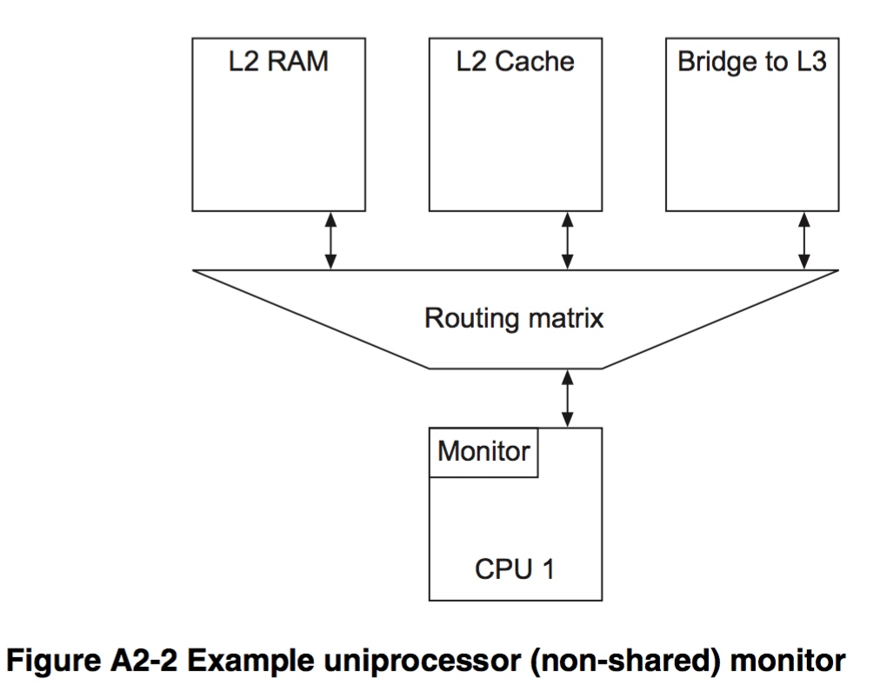
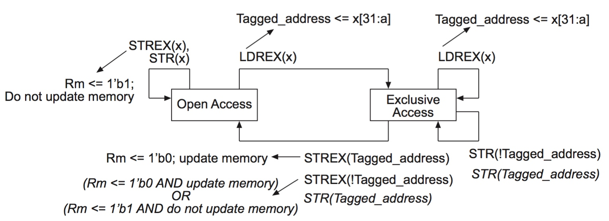
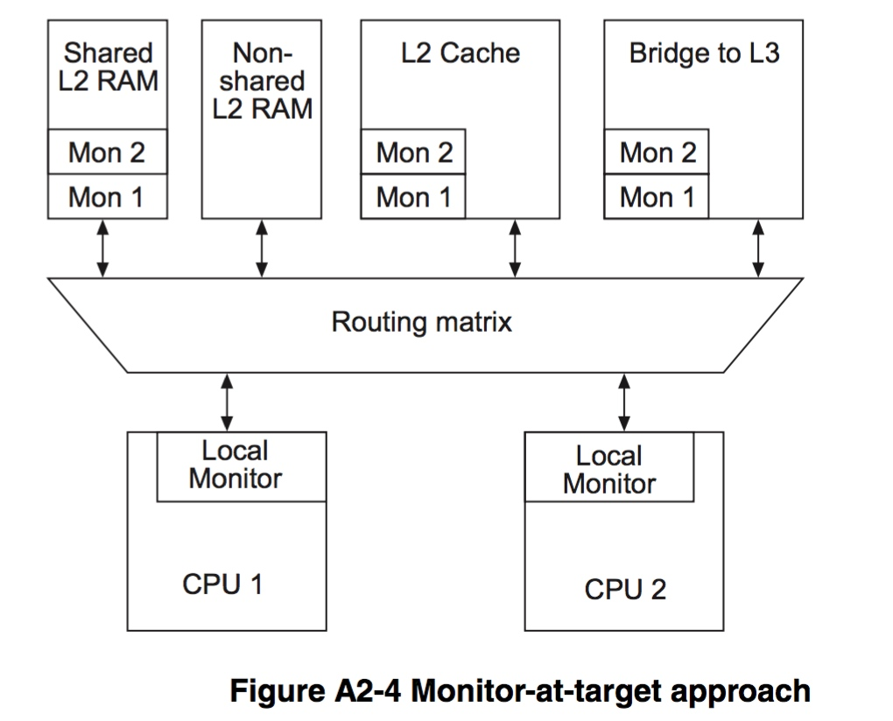
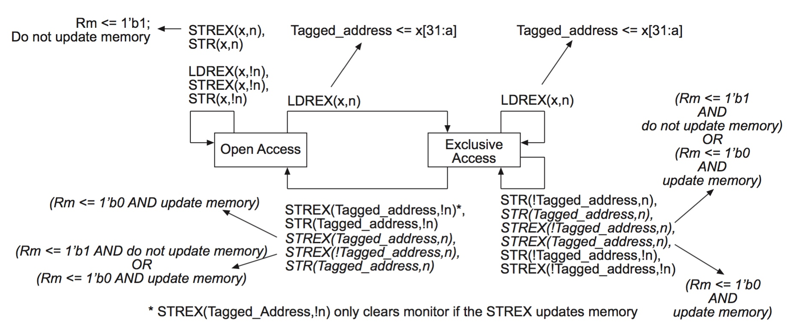

title:'Atomic - Arch - ARM Synchronization Model'
## Atomic - Arch - ARM Synchronization Model

同其他现代 CPU 架构一样，ARM 保证整型数据（最大 64 bit）的读或写操作，即 load/store 操作原生就是 atomic 的，但是 RMW (read-modify-write) 操作（例如 add/sub 指令）原生不是 atomic 的

本文介绍 ARM 架构下 atomic RMW (read-modify-write) 的实现

ARM 提供 LDREX 与 STREX 特殊指令来实现 atomic RMW (read-modify-write)，其一般流程为

```
LDREX Rd, [memory_addr]
modify Rd
STREX Rd, [memory_addr]
```

此时需要确保 LDREX 与 STREX 指令的内存地址 memory_addr 一致


### Non-shared Memory

单处理器系统往往只需支持非共享内存的同步，此时单处理器内部的监视器（address monitor）维护一个状态机用于表示当前时刻该处理器对某一地址内存的独占性访问状态

- Open Access 表示当前可以对内存进行独占性访问
- Exclusive Access 表示之前已经执行 LDREX 对内存进行独占性访问同时未执行 STREX




> LDREX

当处理器执行 LDREX 指令对某一地址的内存进行独占性访问时

- 若 monitor 处于 Open Access 状态，则 monitor 记录该独占性访问的内存地址，同时 monitor 转变为 Exclusive Access 状态
- 若 monitor 处于 Exclusive Access 状态，则 monitor 更新该独占性访问的内存地址，之前保存的内存地址将被覆盖，即被覆盖的地址不再具有独占性，同时 monitor 继续保持 Exclusive Access 状态


> STREX

而当处理器执行 STREX 指令对某一地址的内存进行独占性访问时，寄存器 Rm 用于保存 STREX 指令执行的返回值，其中 1'b0 表示指令成功更新内存，1'b1 表示指令更新内存失败

- 若 monitor 的状态为 Open Access，则该 STREX 指令并不能更新内存，寄存器 Rm 保存 1，同时 monitor 继续保持为 Open Access 状态
- 若 monitor 的状态为 Exclusive Access，继续判断该指令需要更新的内存地址是否与 monitor 当前保存的内存地址一致，即当前执行的 STREX 指令的内存地址与之前执行的 LDREX 指令的内存地址是否一致
    - 若两者一致，则该 STREX 指令更新内存成功，寄存器 Rm 保存 0，同时 monitor 变为 Open Access 状态
    - 若两者不一致，则该 LDREX 指令可能更新内存，也有可能并不更新内存，具体采用哪种方式与具体实现相关，同时 monitor 变为 Exclusive Access 状态




图中斜体 () 内的内容都是具体实现相关的

其他非独占性的对内存的写操作（如 STR 等）是否改变 monitor 的状态是由具体实现决定的，同时其他处理器对内存的访问操作对该状态机是不可见的，因而当 monitor 处于 Exclusive Access 时，其他处理器对该内存地址的 STR、STREX 操作的后果是不可知的


### Shared Memory

多处理器系统需要实现共享内存的同步机制，下图中每个处理器均拥有各自的本地监视器（local monitor），同时在共享资源模块中拥有各自的全局监视器（global monitor），每个 gloabal monitor 维护各自的状态机 state machine



由于在多处理器系统中每个处理器都拥有各自的 global monitor，而每个 global monitor 维护各自的 state machine，同时各个处理器的内存访问操作对所有的 global monitor 可见，因而其他处理器的 LDREX 指令不会改变本处理器对应的 global monitor 的状态，STREX 指令可能改变本处理器对应的 global monitor 的状态（当其他处理器执行 STREX 对同一地址进行操作时，若本处理器的 global monitor 处于 Open Access 状态，则继续保持为 Open Access 状态，若本处理器的 global monitor 处于 Exclusive Access 状态，则转变为 Open Access 状态）


#### influence to local processor

在多处理器系统中，其他处理器的 STREX 指令可能会改变当前处理器的 global monitor 的状态，之后该处理器执行 STREX 指令时再通过 Rm 寄存器返回 STREX 操作是否成功

以下讨论只限于处理器执行的指令对其对应的 state machine 的影响

> LDREX

当一个处理器执行 LDREX 指令对某一地址的内存进行独占性访问时

- 若对应的 global monitor 处于 Open Access 状态，则 global monitor 记录该独占性访问的内存地址，同时 global monitor 转变为 Exclusive Access 状态
- 若 global monitor 处于 Exclusive Access 状态，则 global monitor 更新该独占性访问的内存地址，之前保存的内存地址将被覆盖，即被覆盖的地址不再具有独占性，同时 global monitor 继续保持 Exclusive Access 状态


> STREX

而当处理器执行 STREX 指令对某一地址的内存进行独占性访问时，寄存器 Rm 用于保存 STREX 指令执行的返回值，其中 1'b0 表示指令成功更新内存，1'b1 表示指令更新内存失败

- 若 gloabal monitor 的状态为 Open Access，则该 STREX 指令并不能更新内存，寄存器 Rm 保存 1，同时 gloabal monitor 继续保持为 Open Access 状态
- 若 gloabal monitor 的状态为 Exclusive Access，继续判断该指令需要更新的内存地址是否与 gloabal monitor 当前保存的内存地址一致，即当前执行的 STREX 指令的内存地址与之前执行的 LDREX 指令的内存地址是否一致
    - 若两者一致，则该 STREX 指令更新内存成功，寄存器 Rm 保存 0，同时 gloabal monitor 可能继续保持为 Exclusive Access 状态，也有可能转变为 Open Access，具体采用哪种方式与具体实现相关
    - 若两者不一致，则该 STREX 指令可能更新内存，也有可能并不更新内存，同时 gloabal monitor 可能继续保持为 Exclusive Access 状态，也有可能转变为 Open Access，具体采用哪种方式与具体实现相关


#### influence to remote processor

之后讨论其他处理器执行的指令对本处理器对应的 state machine 影响

当本处理器对应的 state machine 的状态为 Exclusive Access 时

- 当其他处理器执行的 STREX 指令的内存地址与本处理器之前执行的 LDREX 指令的内存地址不一致时，state machine 的状态继续保持为 Exclusive Access
- 当其他处理器执行的 STREX 指令的内存地址与本处理器之前执行的 LDREX 指令的内存地址一致时，state machine 的状态转变为 Open Access




图中斜体 () 内的内容都是具体实现相关的

这样当处理器 1 执行 LDREX 指令读取内存地址 addr1 处的内存，此时处理器 2 也可以执行 LDREX 指令读取内存地址 addr1 处的内存，因为共享内存的读操作并不需要保护

之后当处理器 2 执行 STREX 指令写入内存地址 addr1 处的内存时，该操作成功更新内存，同时处理器 1 对应的 state machine 的状态变为 Open Access，此时处理器 1 再执行 STREX 指令写入内存地址 addr1 处的内存时，该操作将返回失败值，从而实现在多处理器系统中对共享内存的保护


#### example

atomic_t 的 add/sub 操作就依赖于 atomic RMW，ARM 架构使用 ldrex/strex 指令来实现 atomic RMW，以 atomic_add() 为例 

```c
static inline void atomic_add(int i, atomic_t *v)
{
	unsigned long tmp;
	int result;

	__asm__ __volatile__("@ atomic_add\n"
"1:	ldrex	%0, [%3]\n"
"	add	%0, %0, %4\n"
"	strex	%1, %0, [%3]\n"
"	teq	%1, #0\n"
"	bne	1b"
	: "=&r" (result), "=&r" (tmp), "+Qo" (v->counter)
	: "r" (&v->counter), "Ir" (i)
	: "cc");
}
```

ldrex	%0, [%3]
相当于 result = v->counter

add	%0, %0, %4
相当于 result = result+i

strex	%1, %0, [%3]
相当于 v->counter = result，将加操作的结果写回到内存中的v->counter，同时tmp保存stex指令执行的返回值

teq	%1, #0
bne	1b
若tmp为1，即strex未能更新内存的值，则跳转到1处继续循环
