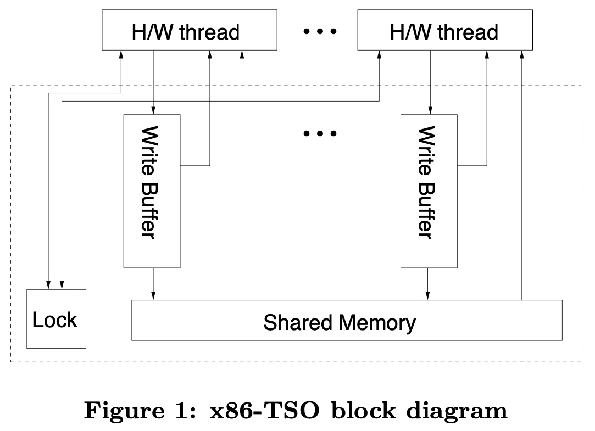

## Barrier - Arch - x86 Memory Model

x86-TSO (Total Store Ordering) 是论文 *x86-TSO: A Rigorous and Usable Programmer’s Model for x86 Multiprocessors* 提出的一种 memory model，这是论文作者根据 Intel/AMD specification 的阅读总结，提出的一种总结性的内存模型

虽然 Intel/AMD 官方一开始并不是按照这个模型进行架构设计的，但是当前这个模型可以比较好地描述 x86 架构下的 memory model，因而这个模型对于理解 x86 memory model 具有重要作用




x86-TSO 模型中存在 store buffer 但不存在 invalidate queue，同时模型可以简要归纳为以下四点

> - The store buffers are FIFO and a reading thread must read its most recent buffered write, if there is one, to that address; otherwise reads are satisfied from shared memory.
> - An MFENCE instruction flushes the store buffer of that thread.
> - To execute a LOCK’d instruction, a thread must first obtain the global lock. At the end of the instruction, it flushes its store buffer and relinquishes the lock. While the lock is held by one thread, no other thread can read.
> - A buffered write from a thread can propagate to the shared memory at any time except when some other thread holds the lock.
> 
> *x86-TSO: A Rigorous and Usable Programmer’s Model for x86 Multiprocessors*


### memory order

x86 架构下只可能存在 StoreLoad reorder，但是只限于对不同内存地址的操作

> - Reads are not reordered with other reads.
> - Writes are not reordered with older reads.
> - Writes to memory are not reordered with other writes.
> - Reads may be reordered with older writes to different locations but not with older writes to the same location.
> 
> - Reads may be reordered with older writes to the same location in case of Intra-Processor Forwarding.
> 
> Intel Architecture Software Developer Manual, volume 3A, chapter 8, section 8.2 "Memory Ordering"


首先，x86 架构下不存在 invalidate queue，因而也就不存在 LoadLoad reorder

其次 x86 架构下存在 store buffer，store buffer 有可能导致 StoreStore/StoreLoad reorder，但是 x86 架构下 single-CPU 上的多条 write 指令之间不会发生重排，即使这些 write 指令的是不同的内存地址，因而 x86 架构下不存在 StoreStore reorder

而由于 store buffer 的存在，x86 架构下是存在 StoreLoad reorder 的，但是也只限于对不同内存地址的操作，也就是说对同一内存地址的 Store/Load 指令是不会发生 reorder 的


### CPU barrier

x86 架构下只存在 StoreLoad reorder，以下方法都可以用于 x86 架构下的 CPU barrier

- LOCK instruction
- SFENCE/LFENCE/MFENCE


#### LOCK instruction

LOCK 指令可以用于 x86 架构下的 CPU barrier

LOCK 指令最初用于实现 atomic RMW (Read-Modify-Write) 操作，但是 LOCK 指令执行的时候也会作 flush store buffer 操作

> Locking operations typically operate like I/O operations in that they wait for all previous instructions to complete and for all buffered writes to drain to memory.
> 
> Intel Architecture Software Developer Manual, volume 3A, chapter 8, section 8.2 "Memory Ordering"


因而 load/store 操作都不能与 LOCK 指令发生重排，也就是说 LOCK 指令相当于一个 full barrier，因而可以用于消除 StoreLoad reorder

> Reads or writes cannot be reordered with I/O instructions, locked instructions, or serializing instructions.
> 
> Intel Architecture Software Developer Manual, volume 3A, chapter 8, section 8.2 "Memory Ordering"


#### FENCE

此外 x86 架构下专门的 FENCE 指令也可用于 CPU barrier


MFENCE 指令相当于一个 full barrier，load/store 操作都不能与其发生重排

MFENCE 指令执行时会执行 flush store buffer 操作，此时会等待 store buffer 中的所有 invalidate message 都收到对应的 invalidate acknowledge message 时，才能继续执行 MFENCE 指令之后的内存访问指令，从而消除 StoreLoad reorder

```
all memory operantions stay above the line
---------------------
       MFENCE
---------------------
all memory operantions stay below the line
```


LFENCE/SFENCE 指令则相当于是更加细粒度的 barrier

LFENCE 指令相当于一个 read barrier，前后的 load 指令都不能与 LFENCE 指令发生重排，此外 LFENCE 指令也不能与之后的 STORE 指令发生重排

```
all LOADs stay above the line
---------------------
       LFENCE
---------------------
all LOADs/STOREs stay below the line
```


SFENCE 指令则相当于一个 write barrier，前后的 store 指令都不能与 SFENCE 指令发生重排

```
all STOREs stay above the line
---------------------
       SFENCE
---------------------
all STOREs stay below the line
```


> SFENCE — Serializes all store (write) operations that occurred prior to the SFENCE instruction in the program instruction stream, but does not affect load operations.
> LFENCE — Serializes all load (read) operations that occurred prior to the LFENCE instruction in the program
> MFENCE — Serializes all store and load operations that occurred prior to the MFENCE instruction in the program instruction stream.
> 
> Intel Architecture Software Developer Manual, volume 3A, chapter 8, section 8.2 "Memory Ordering"


> Reads cannot pass earlier LFENCE and MFENCE instructions.
> Writes and executions of CLFLUSH and CLFLUSHOPT cannot pass earlier LFENCE, SFENCE, and MFENCE instructions.
> LFENCE instructions cannot pass earlier reads.
> SFENCE instructions cannot pass earlier writes or executions of CLFLUSH and CLFLUSHOPT.
> MFENCE instructions cannot pass earlier reads, writes, or executions of CLFLUSH and CLFLUSHOPT.
> 
> Intel Architecture Software Developer Manual, volume 3A, chapter 8, section 8.2 "Memory Ordering"
