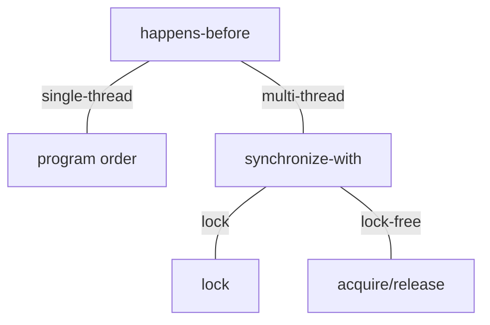

title:'Barrier - Acquire/Release'
## Barrier - Acquire/Release




### happens-before

happens-before 是 memory model 中的一种语义，其定义为

> Let A and B represent operations performed by a multithreaded process. If A happens-before B, then the memory effects of A effectively become visible to the thread performing B before B is performed.


在 single-thread 程序中，如果源码中操作 A 先于操作 B，那么 A 总是 **happens-before** B，也就是说single-thread 程序中 happens-before 与 program order 是确切相关的

```c
int A, B;

void foo()
{
    // This store to A ...
    A = 5;

    // ... effectively becomes visible before the following loads. Duh!
    B = A * A;
}
```

例如上例 foo() 函数中，STORE(A) 总是 happens-before LOAD(A)

这是因为 compiler/CPU memory reordering 的基本原则，都是 memory reordering 造成的指令乱序现象不会影响 single-thread 程序的行为，因而在 multi-thread/multi-CPU 语境下分析 happens-before 更具有现实意义

在 multi-thread/multi-CPU 中，通常使用 synchronize-with 实现 happens-before


### synchronize-with

synchronize-with 用于实现 multi-thread 之间的 happens-before 关系

> Whenever there’s a synchronizes-with relationship between two operations, typically on different threads, there’s a happens-before relationship between those operations as well.


synchronize-with 可以使用各种 lock mechanism 实现；而在 lock-free 环境下，则可以使用 acquire/release 语义实现


> synchronize-with with locking

synchronize-with 关系可以使用各种 lock mechanism 实现，其中各种锁本身例如 mutex 本身作为 guard variable，锁保护的数据或 critical area 作为 payload


在 UP 系统中系统的并行性只来自于一个 CPU 上并行运行的线程，因而在 lock 操作中只需要 disable preemption 即可以消除并行性，从而实现同步，在 unlock 操作中恢复 enable preemption


在 SMP 系统中系统的并行性除了来自于一个 CPU 上并行运行的线程，还来自多个 CPU 上严格并行运行的线程，因而在 lock 操作中，除了 disable preemption 以消除同一个 CPU 的并行性，还需要维护一个计数 count，通过对该计数的 atomic read-modify-write 操作以消除多个 CPU 之间的并行性

因而 SMP 中 lock machanism 通常具有以下两种特性来实现 synchronize-with 关系

1. lock mechanism 中通常使用架构相关的指令实现对锁的原子操作，例如在 ARM 架构下使用 ldrex/strex 指令实现对 spinlock 内部维护的一个计数的 atomic read/atomic read-modify-write 操作
2. 单单对计数进行 atomic 操作还不够，因为 memory reordering 可能会将 lock 操作之后的内存访问指令放到 lock 操作之前执行，也有可能将 unlock 操作之前的内存访问指令放到 unlock 操作之后执行，因而 spinlock machanism 在 lock 操作的最后以及 unlock 操作的最开始都会调用 memory barrier 以确保 lock/unlock 之间的内存访问指令一定位于 lock/unlock 之间，例如 ARM 架构下使用 dmb 指令实现 memory barrier


```
pthread_mutex_lock(&mutex);
---------------------
all memory operations 
stay between the lines
---------------------
pthread_mutex_unlock(&mutex);
```


### acquire/release

在 lock-free programming 中，acquire/release 语义用于实现 synchronize-with 语义，其定义为

> Acquire semantics is a property that can only apply to operations that read from shared memory, whether they are read-modify-write operations or plain loads. The operation is then considered a read-acquire. Acquire semantics prevent memory reordering of the read-acquire with any read or write operation that follows it in program order.

```
    read acquire
---------------------
all memory operations 
stay below the line
```

在 acquire read 操作之后调用相应的 memory barrier，以确保 read acquire 之后的内存访问指令都在 read acquire 之后执行

因而 load acquire barrier 具有抑制 LoadLoad/LoadStore reordering 的作用


> Release semantics is a property that can only apply to operations that write to shared memory, whether they are read-modify-write operations or plain stores. The operation is then considered a write-release. Release semantics prevent memory reordering of the write-release with any read or write operation that precedes it in program order.

```
all memory operations 
stay above the line
---------------------
    write release
```

在 write release 之前调用相应的 memory barrier，以确保 write release 之前的内存访问指令都在 write release 之前执行

因而 store release barrier 具有抑制 LoadStore/StoreStore reordering 的作用


> acquire/release barrier

full barrier (smp_mb) 实际上是一个相对比较重的操作，内核中有以下两个 CPU barrier 来实现更细粒度的 acquire/release 语义

- smp_load_acquire()

```
    read acquire
---- smp_load_acquire ----
all memory operations stay below the line
```

在此之前的 read 操作，不会与在此之后的 read/write 操作发生乱序

- smp_store_release()

```
all memory operations stay above the line
---- smp_store_release ----
    write release
```

在此之后的 write 操作，不会与在此之前的 read/write 操作发生乱序


首先来看一下 x86 架构下的定义，由于 x86 架构下只存在 StoreLoad reorder，因而 x86 架构天生满足 acquire/release 语义，因而 x86 架构下以上这两个 barrier 的定义都为空

aarch64 架构下以上这两个 barrier 则实现为 dmb 指令


