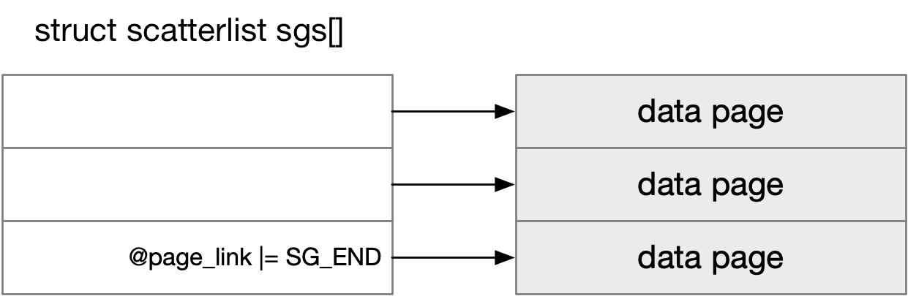
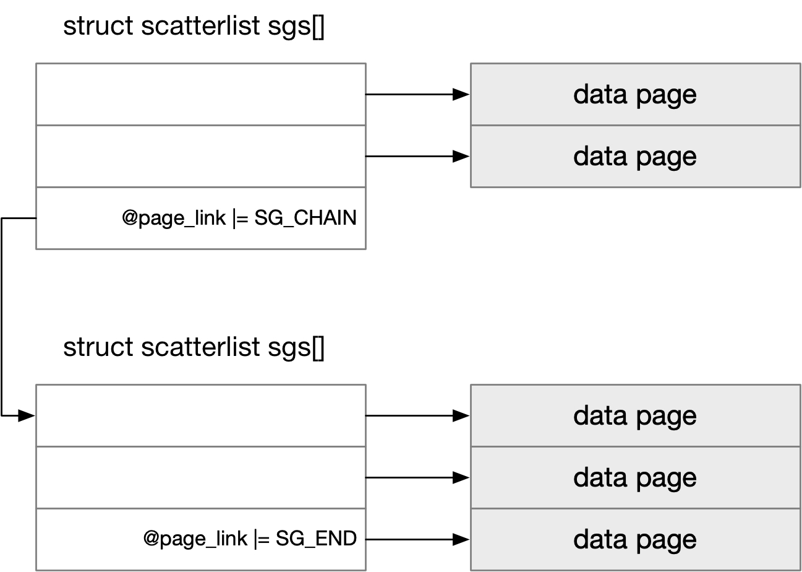

title:'scatterlist'
## scatterlist

### Concept

#### SG entry

struct scatterlist 用于抽象 SG entry，一个 SG entry 就描述一段连续的内存区间

```c
struct scatterlist {
	unsigned long	page_link;
	unsigned int	offset;
	unsigned int	length;
	dma_addr_t	dma_address;
};
```

@page_link 实际上就存储对应的 struct page* 指针

sg_set_page() 用于初始化 SG entry


#### SG table

struct scatterlist 数组可以组成一个 SG table，此时该数组中的所有 SG entry 相当于组成一个链表

```c
struct scatterlist sgs[]
```

此时数组中的最后一个 SG entry 会复用 @page_link 字段，设置上 SG_END 标志，以表明当前 SG entry 是所在链表中的最后一个 SG entry

sg_init_table() 用于初始化 SG table




#### SG chain

前文介绍的 SG table 是一个 scatterlist 数组，其中所有的 SG entry 在内存上是连续的，实际上两个（内存上不连续的）SG table 也可以组成一个链表

为了将两个 SG table 联系在一起，前一个 SG table 的最后必须添加一个 SG entry，此时这个 SG entry 并不是和其他 SG entry 一样指向一个 data page，而是指向后一个 SG table

此时前一个 SG table 的最后一个 SG entry 的 @page_link 字段实际上存储后一个 SG table 即 struct scatterlist 数组的地址，同时复用 @page_link 字段，此时 @page_link 字段会设置上 SG_CHAIN 标志，以表明当前 SG entry 并不是指向 data page，而是指向下一个 SG table；同时这个 SG entry 的 @offset/@length 字段均为空

sg_chain() 用于将两个 SG table 链接为一个链表


