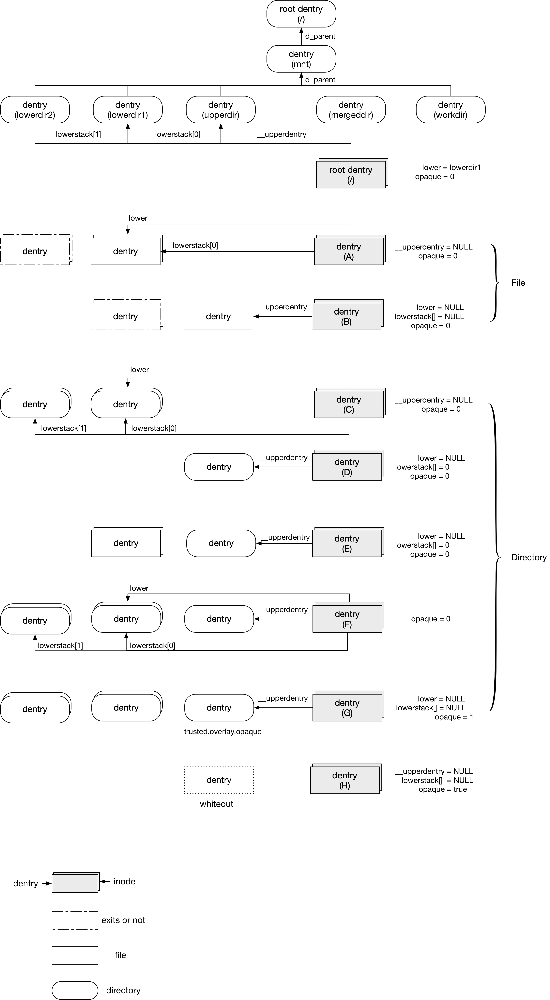

title:'overlayfs - 2 Pathname Lookup'
## overlayfs - 2 Pathname Lookup

为方便描述，对于 mergedir 下特定路径对应的文件或目录

- lowerdir 下对应的路径称为 lowerdentry
- upperdir 下对应的路径称为 upperdentry
- mergedir 下对应的路径称为 mergedentry

例如对于 /mnt/mergedir/<file> 而言

- lowerdentry 描述 /mnt/lowerdir/<file>
- upperdentry 描述 /mnt/upperdir/<file>
- mergedentry 描述 /mnt/mergedir/<file>


### pathname lookup

> pathname lookup 过程中会寻找当前搜索的路径对应的 dentry，其中首先将搜索路径划分为多个 component，之后寻找其中每个 component 对应的 dentry。在寻找每个 component 对应的 dentry 的过程中，首先在 dcache 即之前缓存的 dentry 中寻找，若 dcache 中没有找到则在内存中新建一个 dentry，并调用当前 component 的父目录对应的 inode ops 的 lookup() 回调函数以获取当前 component 对应的 inode，对应的 inode 会保存在新创建的 dentry 中

overlayfs 中，dentry 的 d_fsdata 字段用于保存一个 struct ovl_entry 结构，ovl_entry 与对应的 ovl_inode 这两个结构体中的三个字段用于描述该文件在 lowerdir、upperdir 中的映射关系

```c
struct ovl_inode {	
	struct dentry *__upperdentry;
	struct inode *lower;
	...
};
```

```c
/* private information held for every overlayfs dentry */
struct ovl_entry {
	unsigned numlower;
	struct ovl_path lowerstack[];
	...
};
```


- @__upperdentry

如果文件有来自 upperdir，即 1) upperdir 下的文件覆盖了 lowerdir 下的同名文件，或 2) upperdir 与 lowerdir 下的同名目录相合并，这两种情况下，@__upperdentry 字段会指向该文件在 upperdir 对应路径下的 dentry，即 upperdentry

- @lowerstack[] 数组 / @lower

如果文件有来自 lowerdir，即 1) upperdir 下不存在同名文件，即该文件来自 lowerdir，或 2) upperdir 与 lowerdir 下的同名目录相合并，这两种情况下，
@lowerstack[] 数组描述该文件在所有 lowerdir 对应路径下的 dentry，@numlower 描述该数组中有效 struct ovl_path 的数量

```c
struct ovl_path {
	struct ovl_layer *layer;
	struct dentry *dentry;
};
```

@dentry 描述该文件在 lowerdir 对应路径下的 dentry
@layer 描述该 lowerdir 对应的 ovl_layer，实际指向 @lower_layers[i]

同时 @lower 字段描述该文件在首个 lowerdir 对应路径下的 inode，即 lowerstack[0] 对应的 inode




> root dentry

root dentry 的 ovl_entry 会在 mount 阶段初始化完成

此时相当于 lowerdentry 与 upperdentry 都是目录

而 root dentry 以下的其他 dentry 则是在 pathname lookup 过程中，在调用 lookup()回调函数的时候初始化对应的 ovl_entry 和 ovl_inode，overlayfs 中 directory 的 inode ops 的 lookup() 回调函数为 ovl_lookup()


> file

首先考虑 dentry 是文件的情况，此时有以下几种情况

- A. upperdir 下不存在同名路径，即 mergedir 下的文件来自 lowerdir
- B. upperdir 下存在同名路径，即 mergedir 下的文件来自 upperdir，此时 upperdir 下的文件会覆盖 lowerdir 下的同名文件


> directory

其次考虑 dentry 是目录的情况，此时有以下几种情况

- C. upperdir 下不存在同名路径，此时所有 lowerdir 下所有同名的目录会合并为 mergedir 下的目录
- D. lowerdir 下不存在同名路径，此时 mergedir 下的目录即来自 upperdir 下的目录
- E. upperdir 下存在目录，lowerdir 下存在同名文件，此时 upperdir 下的目录会覆盖 lowerdir 下存在的同名文件，即此时 mergedir 下的目录即来自 upperdir 下的目录
- F. lowerdir/upperdir 下都存在同名目录，此时 lowerdir/upperdir 下所有同名的目录会合并为 mergedir 下的目录

- G. 此时若 upperdentry 描述的目录有 OVL_XATTR_OPAQUE xattr，则还会给 ovl_dentry->flags 设置上 OVL_E_OPAQUE 标志位


> whiteout

dentry 是文件或者目录的时候，还有一种特殊情况是

- H. upperdir 下存在一个同名的 whiteout 文件，此时 lowerdir 下同名的文件在 mergedir 下不可见


### open

#### open file

> open() syscall 执行过程中，会分配一个 file 结构，之后执行 pathname lookup 操作寻找文件路径对应的 dentry，并从而找到该文件对应的 inode，将 file 的 f_op 成员设置为对应 inode 的 i_fop，最后调用 file ops 的 open() 回调函数

overlayfs 中当对 mergedir 中的文件执行 open 操作时，file 的 file ops 被设置为 ovl_file_operations，其 open() 回调函数为 ovl_open()

open() syscall 返回的是 mergedentry 对应的 struct file 结构，但同时该过程中会对实际的文件 (real file) 执行 open 操作，最终获得的 real file 对应的 struct file 结构就保存在，返回的 mergedentry 对应的 struct file 结构的 @private_data 字段

```
file->private_data = <file of real file>
```

- 对于 case A 来说，此时 upperdentry 为空，mergedir 下的文件就来自 lowerdir，那么此时 realfile 就是指 lowerdentry 对应的文件
- 对于 case B 来说，此时 upperdentry 不为空，mergedir 下的文件就来自 upperdir，那么此时 realfile 就是指 upperdentry 对应的文件


#### open directory

> open() syscall 执行过程中，会分配一个 file 结构，之后执行 pathname lookup 操作寻找文件路径对应的 dentry，并从而找到该文件对应的 inode，将 file 的 f_op 成员设置为对应 inode 的 i_fop，最后调用 file ops 的 open() 回调函数

overlayfs 中当对 mergedir 中的目录执行 open 操作时，file 的 file ops 被设置为 ovl_dir_operations，其 open()回调函数为 ovl_dir_open()

open() syscall 返回的是 mergedentry 对应的 struct file 结构，但同时该过程中会创建一个对应的 struct ovl_dir_file 结构，保存在返回的 mergedentry 对应的 file 的 @private_data 字段

```
file->private_data = struct ovl_dir_file
```

```c
struct ovl_dir_file {
	bool is_real;
	bool is_upper;
	struct file *realfile;
	struct file *upperfile;
};
```


open() syscall 过程中会对实际的文件 (real file) 执行 open 操作，获得的 file 保存在 ovl_dir_file->realfile 字段

- 对于 case C 来说，此时 upperdentry 不存在，mergedir 下的目录就是 lowerdir 下对应的目录，那么此时 realfile 就是指 lowerdentry 对应的目录；如果多个 lowerdir 下都存在同名目录，那么 realfile 是指第一个 lowerdir 下的目录，即 lowerstack[0] 对应的目录
- 对于 case D/E/F 来说，此时 upperdentry 不为空，mergedir 下的目录就是 upperdir 下的目录，或者是 upperdir 下的目录与 lowerdir 下同名目录的合并，那么此时 realfile 就是指 upperdentry 对应的目录


@is_real 标志位用于描述该目录是否是一个 merged directory

目录的 ovl_inode 的 @flags 字段的 OVL_WHITEOUTS 标志用于描述该目录是否是 merged directory，即如果该目录是多个 lower directory 或 lower directory 与 upper directory 的合并，那么在 pathname lookup 阶段，对应的 ovl_inode 的 @flags 字段会设置上 OVL_WHITEOUTS 标志

因而如果该目录是多个 lower directory 或 lower directory 与 upper directory 的合并，那么 @is_real 字段为 0


@is_upper 标志位描述了 upperdir 下是否存在同名目录，即只要 upperdir 下存在同名目录，那么该标志位都是 1，否则为 0


### ls directory

> 查看目录时会调用 getdents() syscall，其中会调用该目录的 file ops 的 iterate() 回调函数，返回该目录下的所有子文件

overlayfs 中 directory 的 file ops 的 iterate()回调函数为 ovl_iterate()，此时 ovl_iterate() 中传入的 dentry 是 mergedir 下的 dentry


如果传入的目录不是一个 merged directory，那么直接对 realfile 执行 readdir 操作，其中会调用 underlying filesystem 的 file ops 的 iterate() 回调函数


而对于 merged directory，传入的 mergedentry 对应的 ovl_entry 中保存有 upperdir 与 lowerdir 下该 dentry 对应路径的 dentry，因而

- 首先对 upperdir 下对应路径的 dentry 执行 iterate_dir()函数，其中会调用 upperdir 的 underlying filesystem 的 iterate() 回调函数，以读取 upperdir 下对应路径的目录下所有的子文件
- 之后对 lowerdir 下对应路径的 dentry 执行 iterate_dir()函数，其中会调用 lowerdir 的 underlying filesystem 的 iterate() 回调函数，以读取 lowerdir 下对应路径的目录下所有的子文件
- 将以上两个过程中读取的所有子文件相整合，同时对 whiteout 文件、opaque 目录、以及 upperdir 与 lowerdir 中进行覆盖的同名文件进行相应的过滤与处理，最终就得到了 mergedir 下对应路径的目录下所有的子文件


> directory entry

overlayfs 维护有自己的 directory entry 格式，使用 struct ovl_cache_entry 抽象 overlayfs 中的一个 directory entry

```c
struct ovl_cache_entry {
	char name[];
	unsigned int len;
	unsigned int type;
	
	u64 real_ino;
	u64 ino;
	
	bool is_upper;
	bool is_whiteout;
	...
};
```

@name[]/@len 描述该 directory entry 描述的文件的名称
@type 描述文件的类型

@real_ino 描述该文件对应的 real file 的 inode number
@ino，如果该文件来自 lowerdir，那么该字段实际上就等同于 @real_ino，也就是对应的 real file 的 inode number；而如果该文件来自 upperdir，那么该字段就是 mergedir 下对应的 inode number

@is_upper 描述该文件是否来自 upperdir
@is_whiteout 描述该文件是否为 whiteout 文件


> directory entry cache

为了加快对 merged directory 的 ls 操作，使用一个 rbtree 来缓存与管理一个 merged directory 下的所有 directory entry

struct ovl_dir_cache 用于抽象该 rbtree，每个 mergedir 下的目录都维护有这么一棵 rbtree，就保存在 struct ovl_dir_file 中（overlayfs 中对 mergedir 中的目录执行 open 操作时，会为该目录创建对应的 struct ovl_dir_file 结构）

```c
struct ovl_dir_file {
	struct ovl_dir_cache *cache;
	...
};
```

这棵 rbtree 使用的 key 是 @name[] 字符串，对 merged directory 的 ls 操作，实际上依次是

- 首先对 upperdentry 执行 iterate_dir() 函数，将 upperdentry 下扫描到的所有 directory entry 添加到该 rbtree 中
- 之后按照顺序对各个 lowerdentry 执行 iterate_dir()函数，将 lowerdentry 下扫描到的所有 directory entry 添加到该 rbtree 中

这里需要注意的细节是

- 由于 upperdentry 下扫描到的 directory entry 先于 lowerdentry 添加到 rbtree，因而当 upperdentry 与 lowerdentry 下存在同名的 directory entry 时，在将 lowerdentry 下的 directory entry 添加到 rbtree 的过程中，由于此时 rbtree 中已经存在同名的 directory entry，因而此时 lowerdentry 下的 directory entry 并不会添加到 rbtree
- 上面的描述同样适用于 whiteout 文件，即 upperdentry 下存在 whiteout 文件时，这个 whiteout 文件对应的 directory entry 会添加到 rbtree，但是 lowerdentry 下同名的 directory entry 就不会添加到 rbtree 了

因而这棵 rbtree 实际上就描述了该 merged directory 下的所有的 directory entry


最后在构建完成这棵 rbtree 之后，就会将 rbtree 中的所有 directory entry 返回给上层调用的 VFS getdents() syscall，需要注意的是，这里会过滤掉 rbtree 中的 whiteout 文件

