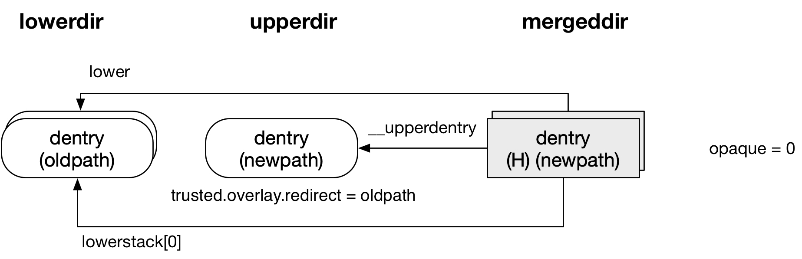

title:'overlayfs - Feature - redirect directory'
## overlayfs - Feature - redirect directory

### Background

overlayfs 的 redirect directory 特性与目录的重命名 (rename) 操作相关

在 overlayfs 中，对于文件的 rename 操作不存在该限制，如果文件是来自 upperdir，那么可以直接对 upperdir 下的 real file 执行 rename 操作；而如果文件来自 lowerdir，那么将文件从 lowerdir copy-up 到 upperdir，之后再对 upperdir 下的文件执行 rename 操作

而对于目录的 rename 操作则复杂一些，如果该目录只是来自 upperdir，那么只需要对 upperdir 下的目录执行 rename 操作

而如果目录来自单个 lowerdir，或是 upperdir 与 lowerdir 的合并，抑或是多个 lowerdir 的合并，只要有涉及到 lowerdir，此时如果需要对该目录执行 rename 操作，那么都会涉及到将 lowerdir 下同名目录下的整棵 sub-directory-tree 执行 copy-up 操作，性能势必受很大影响，因而 overlayfs 最初并不支持对这类目录执行 rename 操作，此时 rename() syscall 就会返回 EXDEV 错误

```c
int rename(const char *oldpath, const char *newpath);
```

EXDEV 错误在 POSIX 中表示 rename 操作跨越了文件系统，即 oldpath 和 newpath 不在同一个文件系统

> [EXDEV]
> The links named by new and old are on different file systems and the implementation does not support links between file systems.


Linux v4.10 引入 redirect directory 特性来解决这类目录的 rename 问题


### Parameter

redirect directory 特性实际上包含了 redirect_dir 与 redirect_follow 两个含义

```c
struct ovl_config {
	bool redirect_dir;
	bool redirect_follow;
	...
};
```

redirect_dir 在 "create redirect directory" section 介绍，redirect_follow 在 "pathname lookup" section 介绍


本节首先介绍影响是否开启 redirect directory 特性的多个参数

> mount option

用户在挂载 overlayfs 的时候可以通过 "redirect_dir=on|off|follow|nofollow" 参数控制是否开启 redirect directory 特性


> module parameter

在挂载 overlayfs 时若没有指定 redirect_dir 挂载参数，那么 "redirect_dir" 模块参数决定了 redirect_dir 挂载参数的默认值为 "on" 或 "off"

"redirect_dir" 模块参数的默认值由 CONFIG_OVERLAY_FS_REDIRECT_DIR 配置项决定


如果 redirect_dir 挂载参数为 "off"（无论是用户显式指定 "off"，还是用户没有显式指定时 "redirect_dir" 模块参数决定的默认值为 "off"），"redirect_always_follow" 模块参数决定了是否开启 redirect_follow 功能

"redirect_always_follow" 模块参数的默认值由 CONFIG_OVERLAY_FS_REDIRECT_ALWAYS_FOLLOW 配置项决定


> summary

以下表格罗列了各种参数组合时 redirect_dir 与 redirect_follow 的值

param | redirect_dir | redirect_follow
---- | ---- | ----
"on" | True | True
"follow" | False | True
"nofollow" | False | False
"off" & "redirect_always_follow"=0 | False | False
"off" & "redirect_always_follow"=1 | False | True


### Feature

之前介绍过目录的 rename 操作中，如果目录来自单个 lowerdir，或是 upperdir 与 lowerdir 的合并，抑或是多个 lowerdir 的合并，即只要有涉及到 lowerdir，对该目录执行 rename 操作时，默认会立即返回 EXDEV 错误，即不支持对这类目录执行的 rename 操作

而当开启 redirect directory 特性时，可以确保对这类目录的 rename 操作执行成功，这里主要会涉及两部分的操作

- 1) 首先是在对这类目录执行 rename 操作的过程中，在 upperdir 下创建 newpath 对应的目录，同时该目录会标记上 "trusted.overlay.redirect" xattr
- 2) 之后在对 newpath 目录作 pathname lookup 操作的时候，由 upperdir 下的 newpath 成功转到 lowerdir 下的 oldpath

redirect directory 特性包含的两个含义 redirect_dir 与 redirect_follow 就分别描述了以上这两部分的操作是否开启，其中

- redirect_dir 描述 1) 创建 redirect directory 的操作是否开启
- redirect_follow 描述 2) 对 redirect directory 的 pathname lookup 操作是否开启


例如上述 "redirect_dir=follow" 挂载参数就表示不创建 redirect directory，而只是在 pathname lookup 操作过程中 follow redirect directory，这里的一个使用场景是之前的一个 overlayfs 挂载实例是通过 "redirect_dir=on" 挂载的，之后再对这个挂载实例通过 "redirect_dir=follow" 挂载时，不再创建新的 redirect directory，在对该挂载实例中已有的 redirect directory 作 pathname lookup 操作时，还是会将 upperdir 下的 newpath 成功转到 lowerdir 下的 oldpath


#### redirect_dir

redirect directory 特性包含的第一层含义即 redirect_dir，实际上就描述了能否创建 redirect directory


以下介绍 redirect directory 的原理以及它是怎样被创建的

rename() 操作实际调用 renameat2() 系统调用，最终调用目录的 inode ops 的 rename() 回调函数，overlayfs 中是 ovl_rename()，其中会在 upperdir 下为 oldpath 创建对应的 whiteout 文件，同时在 upperdir 下创建一个新目录，这个新目录会设置上 "trusted.overlay.redirect" xattr，该属性的值是一个字符串，用于描述 oldpath 的路径

如果 oldpath 与 newpath 在同一目录下，那么该字符串描述的是 oldpath 的相对路径，也就是 oldpath 的名称；例如

```
# ls lowerdir
dir1

# ls mergdir
dir1

# mv mergdir/dir1 mergdir/renamedir
```

此时 upperdir 下就会创建一个 "renamedir" 目录，该目录有属性 trusted.overlay.redirect="dir1"


如果 oldpath 与 newpath 不在同一目录下，那么该字符串描述的是 oldpath 的绝对路径（以 lowerdir 为根目录），例如

```
# ls lowerdir
dir1    dir2

# ls mergdir
dir1    dir2

# mv mergdir/dir1 mergdir/dir2/renamedir
```

此时 upperdir 下就会创建一个 "dir2" 目录以及其下的 "renamedir" 目录，此时 "renamedir" 目录有属性 trusted.overlay.redirect="/dir1"，这里就表示 oldpath 即 "dir1" 在其所在的 lowerdir 中的绝对路径为 "/dir1"


#### redirect_follow

"redirect_dir" 挂载参数包含的第二层含义即 redirect_follow，描述对 redirect directory 作 pathname lookup 操作时，是否将 upperdir 下的 newpath 成功转到 lowerdir 下的 oldpath


如下图所示，当对 newpath 执行 pathname lookup 操作时



- @__upperdentry 字段指向的仍然是 upperdir 下的 newpath
- 但是 @lowerstack[] 字段指向的是 lowerdir 下的 oldpath，其中 oldpath 的值就是从 upperdir 下的 newpath 对应的 dentry 的 trusted.overlay.redirect xattr 获取的


这样当对 newpath 目录下的子文件进行 pathname lookup 操作时

- 先在 @__upperdentry 字段指向的目录下查找子文件，由于这里 upperdir 下的 newpath 目录只是一个空目录，它的唯一作用就是承载 trusted.overlay.redirect xattr，因而这里在 upperdir 下的 newpath 目录下自然是找不到任何子文件的
- 接下来就会去 @lowerstack[] 字段指向的目录下查找子文件，这里实际上就是在原来的 lowerdir 下的 oldpath 目录下查找子文件


