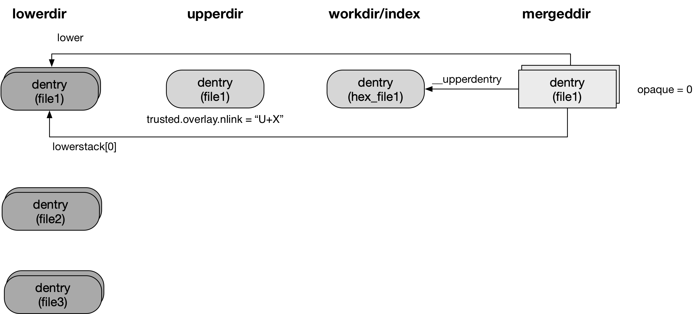
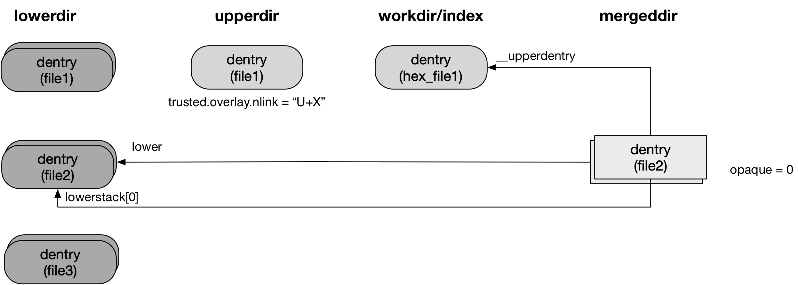

title:'overlayfs - Feature - inode index'
## overlayfs - Feature - inode index

### Background

#### hardlink copy-up

inode index 特性是为了解决 hardlink copy-up 问题

假设 lowerdir 下存在两个文件 file1 和 file2，这两个文件是 hardlink，这个时候如果对其中一个文件例如 file1 执行修改操作，此时就会触发 copy-up 操作即在 upperdir 下创建一个新的 file1 文件

此时可以看到 mergedir 下的 file1 和 file2 文件实际上是两个不同的 inode，此时对 mergedir 下的 file1 文件进行修改，file2 文件的内容并不会改变，这实际上就打破了 POSIX 中 hardlink 的语义

```sh
# ls -li /mnt/low/
total 0
1179657 -rw-r--r-- 2 root root 0 Sep  7 20:10 file1
1179657 -rw-r--r-- 2 root root 0 Sep  7 20:10 file2

# ls -li /mnt/merge/
total 0
1179657 -rw-r--r-- 2 root root 0 Sep  7 20:10 file1
1179657 -rw-r--r-- 2 root root 0 Sep  7 20:10 file2

# touch /mnt/merge/file1

# ls -li /mnt/merge/
total 0
1179659 -rw-r--r-- 1 root root 0 Sep  7 20:19 file1
1179657 -rw-r--r-- 2 root root 0 Sep  7 20:10 file2

# ls -li /mnt/upper/
total 0
1179659 -rw-r--r-- 1 root root 0 Sep  7 20:19 file1
```


#### inode index

inode index 特性的原理是，当对 file1 执行修改操作时，同样会触发 copy-up 操作，只是此时是在 <workdir>/index/ 目录下创建了一个新的文件，这个文件的名称是对 file1 文件名称 hash 得到的

之后在 upperdir 下创建一个 hardlink 文件，名称为 file1，这个 hardlink 文件实际上就指向 <workdir>/index/ 目录下新创建的文件

此时可以看到 upperdir 下新创建的 file1 文件的 hardlink count 是 2，但是在 copy-up 之前，file1 文件的 hardlink count 应该是 3，为了正确显示 hardlink count 计数，overlayfs 又引入了 "trusted.overlay.nlink" xattr

可以看到 upperdir 下的 file1 文件标记有 "trusted.overlay.nlink="U+1""，意思是说在对 mergedir 下的 file1 文件作 pathname lookup 操作时，实际展示的 hardlink count 应该是 upperdir 下的 file1 文件的 hardlink count 再加上 1

这里 "trusted.overlay.nlink" 的值的格式是 "U+X" 或 "U-X"，例如如果 lowerdir 下原本只有两个 hardlink 文件即 file1 和 file2，那么此时对 file1 作 copy-up 操作时

- upperdir 下新创建的 file1 文件的 hardlink count 是 2
- 同样在 copy-up 之前，file1 文件的 hardlink count 应该是 2
- 所以此时 upperdir 下的 file1 文件的 "trusted.overlay.nlink" 的值应该是 "U+0"


```sh
# ls -li /mnt/low/
total 0
1179657 -rw-r--r-- 3 root root 0 Sep  7 20:10 file1
1179657 -rw-r--r-- 3 root root 0 Sep  7 20:10 file2
1179657 -rw-r--r-- 3 root root 0 Sep  7 20:10 file3

# ls -li /mnt/merge/
total 0
1179657 -rw-r--r-- 3 root root 0 Sep  7 20:10 file1
1179657 -rw-r--r-- 3 root root 0 Sep  7 20:10 file2
1179657 -rw-r--r-- 3 root root 0 Sep  7 20:10 file3

# touch /mnt/merge/file1

# ls -li /mnt/merge/
total 8
1179657 -rw-r--r-- 3 root root 0 Sep  7 20:13 file1
1179657 -rw-r--r-- 3 root root 0 Sep  7 20:13 file2
1179657 -rw-r--r-- 3 root root 0 Sep  7 20:10 file3

# ls -li /mnt/upper/
total 4
1179660 -rw-r--r-- 2 root root 0 Sep  7 20:13 file1

# ls  -li /mnt/work/index/
total 4
1179660 -rw-r--r-- 2 root root 0 Sep  7 20:13 00fb1d0001da0f31ac44c344f0aff1ac52b0dac82a090012005e1bb860

# getfattr -d -m -  /mnt/upper/file1
trusted.overlay.nlink="U+1"
trusted.overlay.origin=0sAPsdAAHaDzGsRMNE8K/xrFKw2sgqCQASAF4buGA=

# getfattr -d -m -  /mnt/work/index/00fb1d0001da0f31ac44c344f0aff1ac52b0dac82a090012005e1bb860
trusted.overlay.nlink="U+1"
trusted.overlay.origin=0sAPsdAAHaDzGsRMNE8K/xrFKw2sgqCQASAF4buGA=
```


### Parameter

用户在挂载 overlayfs 的时候可以通过 "index=on|off" 参数控制是否开启 inode index 特性

当用户未显式设置 "index=on|off" 参数时，是否开启 inode index 特性的默认行为由 "index" 模块参数控制，该模块参数的默认值由 CONFIG_OVERLAY_FS_INDEX 决定


### Feature

#### hardlink copy-up

本节描述对 lowerdir 下的 hardlink 文件进行修改并触发 copy-up 的过程

```sh
ovl_copy_up_one
    ovl_do_copy_up
        ovl_copy_up_locked
            ovl_get_tmpfile  # create temp file in <workdir>/work/
            ovl_copy_up_inode # copy-up
                ovl_copy_up_data # copy data
                ovl_copy_xattr   # copy xattr
                ovl_set_origin   # set "trusted.overlay.origin"
            ovl_install_temp # install copied-up file to <workdir>/index/
    ovl_link_up
        ovl_do_link # create hardlink in upperdir targetting copied-up file in <workdir>/index/
        ovl_set_nlink_upper # set "trusted.overlay.nlink" of copied-up file in <workdir>/index/
```

首先在 ovl_do_copy_up() 和普通文件的 copy-up 过程一样，都是先将文件 copy-up 到 <workdir>/work/ 目录下，记为 <workdir>/work/<file>，只是接下来普通文件的 copy-up 过程是将 <workdir>/work/<file> 文件通过 atomic rename 的方式转移到 upperdir 下，而 hardlink 的 copy-up 过程则是将 <workdir>/work/<file> 文件转移到 <workdir>/index/ 目录下，记为 <workdir>/index/<file>

同时 copy-up 过程中会给文件设置上 "trusted.overlay.origin" 属性，该属性的值是被 copy-up 的文件在 lowerdir 下的路径，经过编码后的一串 HEX 字符串，例如

```sh
# getfattr -d -m -  /mnt/work/index/00fb1d0001da0f31ac44c344f0aff1ac52b0dac82a090012005e1bb860
trusted.overlay.nlink="U+1"
trusted.overlay.origin=0sAPsdAAHaDzGsRMNE8K/xrFKw2sgqCQASAF4buGA=
```

之后在 ovl_link_up() 中会在 upperdir 下创建一个指向 <workdir>/index/<file> 文件的 hardlink


需要注意的是，在 <workdir>/index/ 目录下的文件的名称是一串 HEX 字符串，这个 hex 编码包含了被 copy-up 的 hardlink 文件在 lowerdir 下的 inode number 等信息，例如

```sh
# ls  -li /mnt/work/index/
total 4
1179660 -rw-r--r-- 2 root root 0 Sep  7 20:13 00fb1d0001da0f31ac44c344f0aff1ac52b0dac82a090012005e1bb860
```

而 upperdir 下创建的文件的名称则是 hardlink 文件在 lowerdir 下原来的名称，例如

```sh
# ls -li /mnt/upper/
total 4
1179660 -rw-r--r-- 2 root root 0 Sep  7 20:13 file1
```


最后会给 <workdir>/index/<file> 文件设置上 "trusted.overlay.nlink" 属性，该属性的值的格式为 "U+X" 或 "U-X"，其中 

```
X = nlink_of_original_file_in_lower_dir - nlink_of_copied_up_file_in_workdir/index
```


#### pathname lookup of copied-up hardlink



```sh
inode_ops->lookup(), that is, ovl_lookup
    ovl_lookup_index
    ovl_get_inode
        ovl_get_nlink/set_nlink # recalculate nlink
        ovl_fill_inode # set ino of file in lowdir
```

对 mergedir 下的 copied-up hardlink 文件执行 pathname lookup 操作的过程中

- 会根据 upperdir 下文件的 "trusted.overlay.nlink" 属性的值，重新计算并设置 mergedir 下对应的 overlayfs inode 的 @nlink 字段
- 重新设置 mergedir 下对应的 overlayfs inode 的 @ino 字段，实际上就是重新设置为 lowerdir 下原先文件的 ino

这样就能确保 copy-up 后的 hardlink 文件符合 POSIX hardlink 语义，例如

```sh
# ls -li /mnt/merge/
total 8
1179657 -rw-r--r-- 3 root root 0 Sep  7 20:13 file1
1179657 -rw-r--r-- 3 root root 0 Sep  7 20:13 file2
1179657 -rw-r--r-- 3 root root 0 Sep  7 20:10 file3
```


这里需要注意的是，对 copied-up hardlink 文件执行 pathname lookup 操作后，@__upperdentry 字段指向的是 upperdir 下的文件，实际上也就是指向 <workdir>/index/<file> 文件

因为 overlayfs 下的 read/write 操作，实际上是对 @__upperdentry 字段指向的 real file 执行相应的操作，因而此后对 mergedir 下的 copied-up hardlink 文件执行的 read/write 操作，实际上就是对 <workdir>/index/<file> 文件的操作


#### pathname lookup of other hardlink

上文描述的是对 mergedir/file1 文件的 read/write 操作实际上就是对 workdir/index/ 目录下对应文件的操作

根据 POSIX hardlink 语义，所有的 hardlink 文件共享同一个 inode，因而对其中一个文件的修改，可以通过另一个文件反映出来；因而本节就描述对 mergedir/file2 文件的 read 操作如何反映出对 mergedir/file1 文件的修改



```sh
inode_ops->lookup(), that is, ovl_lookup
    index = ovl_lookup_index
    upperdentry = dget(index)
```

之前介绍过，workdir/indx/ 目录下的文件名称是一串 HEX 字符串，这个字符串实际上是将对应的 struct ovl_fh 结构体的内容经过 hex 编码得来的

```c
/* On-disk and in-memeory format for redirect by file handle */
struct ovl_fh {
	u8 version;	/* 0 */
	u8 magic;	/* 0xfb */
	u8 len;		/* size of this header + size of fid */
	u8 flags;	/* OVL_FH_FLAG_* */
	u8 type;	/* fid_type of fid */
	uuid_t uuid;	/* uuid of filesystem */
	u8 fid[0];	/* file identifier */
} __packed;
```

@fid 指向一个 struct fid 结构

```c
struct fid {
	u32 ino;
	u32 gen;
	u32 parent_ino;
	u32 parent_gen;
};
```

例如当对 lowerdir/file1 文件进行 copy-up 时，其对应的 struct ovl_fh 结构中，@ino 就是 lowerdir/file1 文件对应的 inode number，overlayfs 中没有使用到 @parent_ino，该字段一直为 0

由于 lowerdir/file1 和 lowerdir/file2 文件共用同一个 inode，因而这两个文件对应的 struct ovl_fh 结构中，@ino 字段是一样的，因而通过 lowerdir/file2 实际上也能定位到 mergedir/index/ 目录下对应的文件

在对 mergedir/file2 文件的 pathname lookup 过程中，也能定位到 mergedir/index/ 目录下对应的文件，并会保存在 @__upperdentry 字段中


例如上图中，mergedir/file2 的 @__upperdentry 字段实际上就指向 mergedir/index/ 目录下对应的文件

因为 overlayfs 下的 read/write 操作，实际上是对 @__upperdentry 字段指向的 real file 执行相应的操作，因而此后对 mergedir/file2 文件的 read/write 操作，实际上就是对 <workdir>/index/ 下对应文件的操作
