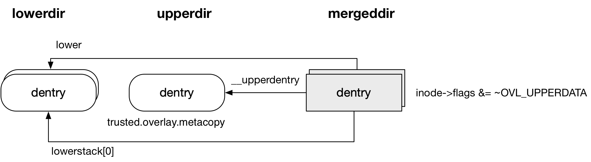

title:'overlayfs - Feature - metacopy'
## overlayfs - Feature - metacopy

### Concept

#### introduction

在 metacopy 特性之前，对 lowerdir 下的文件执行 chown() 或 chmod() syscall 都会触发 copy-up 操作，其中会对文件的 metadata 和 data 都执行 copy-up 操作，这对于大文件来说显然是不划算的，因为 chown()/chmod() 只需要修改 metadata，同时对 data 执行 copy-up 操作会极大地影响 chown()/chmod() 执行的速度

v4.19 开始引入 metacopy 特性，此时对文件执行 chown()/chmod() 操作，只会对文件的 metadata 执行 copy-up 操作；此时在 open() syscall 中，只有当 @flags 包含 FMODE_WRITE/O_TRUNC 时，才会对文件执行 copy-up 操作（包括 metadata 与 data）

metacopy 目前只支持 regular file


#### metacopy

在未开启 metacopy 时，对来自 lowerdir 下的文件执行 chmod 操作时，会将文件的 metadata/data 都 copy-up 到 upperdir 下

```sh
# ls -hl /mnt/low/
total 0
-rw-r--r-- 1 root root 1.0G Sep 12 16:19 file

# df -Th
Filesystem     Type      Size  Used Avail Use% Mounted on
/dev/vda1      ext4       20G  2.4G   17G  13% /

# chmod +x /mnt/merge/file

# df -Th
Filesystem     Type      Size  Used Avail Use% Mounted on
/dev/vda1      ext4       20G  3.4G   16G  19% /
```


而在开启 metacopy 特性时，对来自 lowerdir 下的文件执行 chmod 操作时，此时只是将文件的 metadata copy-up 到 upperdir 下

```sh
# ls -hl /mnt/merge/
total 0
-rw-r--r-- 1 root root 1.0G Sep 12 16:19 file

# chmod +x /mnt/merge/file

# df -Th
Filesystem     Type      Size  Used Avail Use% Mounted on
/dev/vda1      ext4       20G  2.4G   17G  13% /

# getfattr -d -m - -R   /mnt/upper/file
trusted.overlay.metacopy
trusted.overlay.origin=0sAPsdAAHaDzGsRMNE8K/xrFKw2sgqCQASADnpi2w=

# ls -hl /mnt/merge/
total 0
-rwxr-xr-x 1 root root 1.0G Sep 12 16:19 file

# ls -hl /mnt/upper/
total 4.0K
-rwxr-xr-x 1 root root 1.0G Sep 12 16:19 file
```


### Parameter

用户在挂载 overlayfs 的时候可以通过 "metacopy=on|off" 参数控制是否开启 metacopy 特性

当用户未显式设置 "metacopy=on|off" 参数时，是否开启 metacopy 特性的默认行为由 "metacopy" 模块参数控制，该模块参数的默认值由 CONFIG_OVERLAY_FS_METACOPY 决定


### Routine

#### chown/chmod

在开启 metacopy 特性之后，对来自 lowerdir 下的文件执行 chmod/chown 操作时，此时只是将文件的 metadata copy-up 到 upperdir 下

```sh
sys_chown
    do_fchownat
        chown_common
            notify_change
                inode_ops->setattr(), that is, ovl_setattr
                    ovl_copy_up
                        ovl_copy_up_flags # with @flags = 0
                            ovl_copy_up_one # with @flags = 0
```

```sh
ovl_copy_up_one # with @flags = 0
    ovl_do_copy_up
        ovl_copy_up_locked
            ovl_get_tmpfile  # create temp file in workdir
                ovl_create_temp
                    ovl_create_real
            ovl_copy_up_inode # copy-up
                // ovl_copy_up_data # ignore this step since metacopy
                ovl_copy_xattr   # copy xattr
                # set OVL_XATTR_METACOPY xattr
                ovl_set_size # set inode->i_size in upperdir
            ovl_install_temp # install copied-up file to upperdir
```


此时只是在 upperdir 下创建了一个新的 inode，这个新创建的 inode 是 lowerdir 下的 inode 的拷贝，同时 chmod()/chown() 新设置的信息会覆盖保存在这个新创建的 inode 中

upperdir 下的文件实际上就只是一个 inode，其 data 部分实际上并不占用任何的磁盘空间，但是此时对 upperdir 下的文件执行 ls 操作，仍然显示的是原文件的大小，这是因为 chmod()/chown() 触发的 copy-up 过程中，会在 upperdir 下的 inode->i_size 字段保存（来自 lowerdir 下的 inode->i_size）文件的大小

同时 upperdir 下的文件还会被标记上 "trusted.overlay.metacopy" xattr


#### pathname lookup



对 metacopy 的文件执行 pathname lookup 操作，其 @__upperdentry 和 @lower 一样还是和普通文件一样，分别指向 upperdir 和 lowerdir 下对应的路径，差异在于

- 对普通文件执行 pathname lookup 操作，mergedir 下的 inode->flags 会设置有 OVL_UPPERDATA 标志
- 对 metacopy 的文件执行 pathname lookup 操作，mergedir 下的 inode->flags 则没有 OVL_UPPERDATA 标志

因而之后的路径中都是通过 mergedir 下的 inode->flags 是否设置有 OVL_UPPERDATA 标志，来区分这个文件是否是 metacopy 上来的


#### stat

此时如果对 metacopy 的文件执行 stat() syscall，需要获取文件的以下信息

```c
struct stat {
   dev_t     st_dev;     /* ID of device containing file */
   ino_t     st_ino;     /* inode number */
   mode_t    st_mode;    /* protection */
   nlink_t   st_nlink;   /* number of hard links */
   uid_t     st_uid;     /* user ID of owner */
   gid_t     st_gid;     /* group ID of owner */
   dev_t     st_rdev;    /* device ID (if special file) */
   off_t     st_size;    /* total size, in bytes */
   blksize_t st_blksize; /* blocksize for file system I/O */
   blkcnt_t  st_blocks;  /* number of 512B blocks allocated */
   time_t    st_atime;   /* time of last access */
   time_t    st_mtime;   /* time of last modification */
   time_t    st_ctime;   /* time of last status change */
};
```

stat 的这些信息基本上都可以从 upperdir 下的 inode 获取（通过 mergedir 下的 inode 的 @__upperdentry 字段找到 upperdir 下对应的 inode），但是需要特殊关注 @size/blocks 这两个字段，可以参考 ext4 中这两个字段的赋值为

```
stat->size = inode->i_size;
stat->blocks = inode->i_blocks;
```

@size 字段描述文件的大小，这个字段的值直接来自 inode->i_size，之前介绍过 metacopy 过程中 upperdir 下对应的 inode->i_size 字段已经被设置为原文件的大小（来自 lowerdir 下的 inode->i_size），因而 @size 字段也可以直接从 upperdir 下的 inode 获取

@blocks 字段描述文件实际占用的磁盘空间的大小，metacopy 过程中 upperdir 下的文件由于 data 部分实际上并没有占用任何的磁盘空间，因而 upperdir 的 inode->i_blocks 字段实际上并没有与 lowerdir 下的 inode->i_blocks 字段同步，因而在 stat() syscall 中对于 metacopy 文件，只有 stat->blocks 字段是从 lowerdir 下的 inode 获取的，其余字段都是直接从 upperdir 下的 inode 获取的

```sh
inode_ops->getattr(), that is, ovl_getattr
    # get stat of upperdentry
    # if (metacopy)
        # get stat of lowerdentry
        # stat->blocks = stat of lowerdentry.blocks
```

#### read

之前介绍过，对 mergedir 下的文件执行 read/write 操作，实际上就是对底层的 realfile 执行相应的操作，即

- 如果 mergedir 下的文件就来自 lowerdir，那么此时 realfile 就是指 lowerdentry 对应的文件
- 如果 mergedir 下的文件就来自 upperdir，那么此时 realfile 就是指 upperdentry 对应的文件

但是如果对 metacopy 的文件执行 read 操作，realfile 实际上是 lowerdentry 对应的文件

因而对于 mergedir 下文件来自 upperdir 的情况，实际上扩充为

- 如果 mergedir 下的文件来自 upperdir，那么
    - 如果该 mergedir 下的文件是 metacopy 上来的，那么此时 realfile 实际上是 lowerdentry 对应的文件
    - 否则 realfile 就是指 upperdentry 对应的文件
