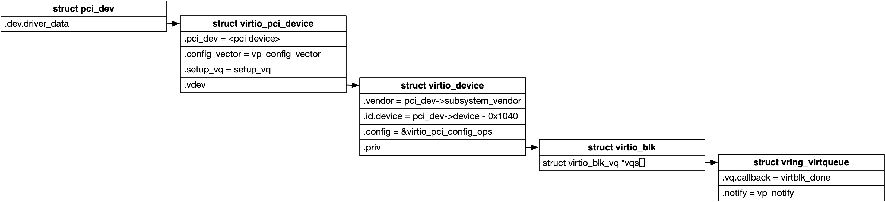
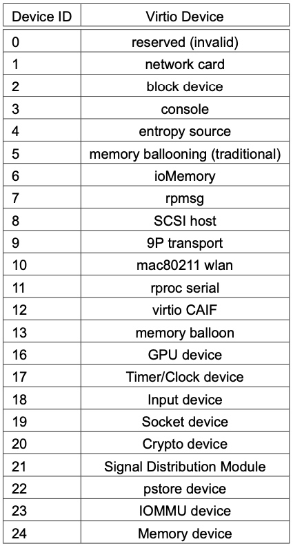

title:'Virtio-PCI'
## Virtio-PCI

struct virtio_config_ops 用于抽象一个 virtio 设备支持的操作

```
struct virtio_config_ops
    @get: read the value of a configuration field
    @set: write the value of a configuration field
    @generation: config generation counter
    @get_status: read the status byte
    @set_status: write the status byte
    @reset: reset the device
    @find_vqs: find virtqueues and instantiate them
    @del_vqs: free virtqueues found by find_vqs()
    @get_features: get the array of feature bits for this device
    @finalize_features: confirm what device features we'll be using
    @set_vq_affinity: set the affinity for a virtqueue
    @get_vq_affinity: get the affinity for a virtqueue (optional)
```

virtio 设备具有多种呈现方式，例如 Virtio Over PCI BUS、Virtio Over MMIO 等，实际上每种呈现方式都实现有自己的 virtio_config_ops，例如 virtio_pci_config_ops、virtio_mmio_config_ops




### Routine

下面以 Virtio Over PCI BUS 为例，介绍 virtio 设备的初始化过程

#### base: virtio protocol

virtio 协议中规定，virtio device 的配置空间以 PCI capability 的形式存储，包含以下部分

- Common configuration
- Notifications
- ISR Status
- Device-specific configuration (optional)
- PCI configuration access


此时每个配置空间对应的 PCI capability 具有以下格式

```c
struct virtio_pci_cap {
    u8 cap_vndr; /* Generic PCI field: PCI_CAP_ID_VNDR */
    u8 cap_next; /* Generic PCI field: next ptr. */
    u8 cap_len; /* Generic PCI field: capability length */
    u8 cfg_type; /* Identifies the structure. */
    u8 bar; /* Where to find it. */
    u8 padding[3]; /* Pad to full dword. */
    le32 offset; /* Offset within bar. */
    le32 length; /* Length of the structure, in bytes. */
};
```

描述该配置空间位于 PCI 设备的第 @bar 个 BAR (Base Address Register) 寄存器描述的 memory mapped 地址空间中的，@offset 偏移处起始的、@length 长度的地址空间

@cfg_type 描述了该配置空间的类型

```c
/* Common configuration */
#define VIRTIO_PCI_CAP_COMMON_CFG   1

/* Notifications */
#define VIRTIO_PCI_CAP_NOTIFY_CFG   2

/* ISR access */
#define VIRTIO_PCI_CAP_ISR_CFG      3

/* Device specific configuration */
#define VIRTIO_PCI_CAP_DEVICE_CFG   4

/* PCI configuration access */
#define VIRTIO_PCI_CAP_PCI_CFG      5

/* Additional shared memory capability */
#define VIRTIO_PCI_CAP_SHARED_MEMORY_CFG 8
```

内核中以上这几个类型的配置空间在 ioremap 之后的虚拟地址就保存在以下字段

```c
struct virtio_pci_modern_device {
	struct virtio_pci_common_cfg __iomem *common;
	
	/* Device-specific data (non-legacy mode)  */
	void __iomem *device;
	
	/* Base of vq notifications (non-legacy mode). */
	void __iomem *notify_base;

	/* Where to read and clear interrupt */
	u8 __iomem *isr;
	...
};
```


> Common configuration

Common configuration 配置空间具有以下格式

```c
/* Fields in VIRTIO_PCI_CAP_COMMON_CFG: */
struct virtio_pci_common_cfg {
	/* About the whole device. */
	__le32 device_feature_select; /* read-write */
	__le32 device_feature;		/* read-only */
	__le32 guest_feature_select;	/* read-write */
	__le32 guest_feature;		/* read-write */
	__le16 msix_config;		/* read-write */
	__le16 num_queues;		/* read-only */
	__u8 device_status;		/* read-write */
	__u8 config_generation;		/* read-only */

	/* About a specific virtqueue. */
	__le16 queue_select;		/* read-write */
	__le16 queue_size;		/* read-write, power of 2. */
	__le16 queue_msix_vector;	/* read-write */
	__le16 queue_enable;		/* read-write */
	__le16 queue_notify_off;	/* read-only */
	__le32 queue_desc_lo;		/* read-write */
	__le32 queue_desc_hi;		/* read-write */
	__le32 queue_avail_lo;		/* read-write */
	__le32 queue_avail_hi;		/* read-write */
	__le32 queue_used_lo;		/* read-write */
	__le32 queue_used_hi;		/* read-write */
};
```

@num_queues 描述该 virtio 设备支持的 virtqueue 的数量

virtio driver 可以向 @queue_select 写入相应的 virtqueue 的编号，这样之后的字段就会反映该 virtqueue 的属性

@queue_size 描述该 virtqueue 的大小

virtio driver 可以向 @queue_msix_vector 写入相应的 MSI-X vector 编号，以指定该 virtqueue 对应的 MSI-X vector

@queue_notify_off 描述该 virtqueue 对应的 VIRTIO_PCI_QUEUE_NOTIFY 寄存器在 Notifications 配置空间中的偏移

virtio driver 通过

- @queue_desc 向 virtio device 通知 vring 的 Descriptor Table 的地址
- @queue_avail 向 virtio device 通知 vring 的 Available Ring 的地址
- @queue_used 向 virtio device 通知 vring 的 Used Ring 的地址


#### 1. PCI bus probe

PCI bus 中，Vendor ID 0x1AF4，Device ID 0x1040~0x107F 的设备会被识别为 virtio 设备

```sh
# PCI bus
virtio_pci_probe
    # allocate virtio_pci_device
    
    virtio_pci_modern_probe
        vp_modern_probe // setup virtio configuration space, "Common configuration", "Notifications", etc.
        virtio_pci_device->vdev.config = &virtio_pci_config_ops
        virtio_pci_device->config_vector = vp_config_vector;
        virtio_pci_device->setup_vq = setup_vq;
        virtio_pci_device->del_vq = del_vq;
    
    register_virtio_device # register virtio device
```


#### 2. virtio bus probe

virtio-pci 实际上是在 PCI 总线之上实现了 virtio 总线，virtio 总线同样有 vendor ID 与 device ID

对于 virtio-pci 设备来说

- virtio_bus->vendor = PCI_bus->subsystem_vendor
- virtio_bus->device = PCI_bus->device - 0x1040


下图描述了 virtio bus 下的 device ID 与设备类型的映射关系



因而当 virtio-blk 实现为 virtio-pci 时，其在 PCI 总线下的 device ID 应该为 0x1042


virtio bus probe 过程中会调用 virtio driver 的 .probe() 回调函数，其中一般都会调用 virtio_find_vqs()

```sh
# virtio bus
bus_type->probe(), that is, virtio_dev_probe
    virtio_driver->probe(), e.g. virtblk_probe
        virtio_find_vqs
```


#### 3. init virtqueue

virtio 设备的 probe 过程中一般都会调用 virtio_find_vqs() 来初始化 virtqueue

> 3.1 allocate MSI-X IRQ

首先需要为 virtio 设备分配 MSI-X 中断，其中一个中断用于 config change interrupt，同时优先为每个 virtqueue 分配一个中断 (此时会设置上 virtio_pci_device 的 @per_vq_vectors 标志位)

如果后端给 virtio 设备分配的 MSI-X 中断数量小于以上所需的中断数量，那么设备初始化过程中会回退到请求分配两个 MSI-X 中断，此时其中一个中断仍然用于 config change interrupt，所有 virtqueue 则共用剩下的另一个中断

```sh
virtio_find_vqs
    config->find_vqs(), i.e. vp_modern_find_vqs
        vp_find_vqs
            vp_find_vqs_msix # Try MSI-X with one vector per queue
            vp_find_vqs_msix # Fallback: MSI-X with one vector for config, one shared for queues
            vp_find_vqs_intx # Finally fall back to regular interrupts
                # allocate MSI-X IRQs
                vp_request_msix_vectors
                    pci_alloc_irq_vectors_affinity
```


> 3.2 setup virtqueue

接下来会对每个 virtqueue 进行初始化

- 为每个 virtqueue 创建对应的 vring，并将其 Descriptor Table、Available Ring、Used Ring 的地址依次写入该 virtio 设备的 Common configuration 配置空间的 @queue_desc、@queue_avail、@queue_used 字段，以通知 virtio 设备后端
- 从之前分配的 MSI-X 中断中，为每个 virtqueue 分配一个对应的 MSI-X 中断，并将对应的 MSI-C vector 写入该 virtio 设备的 Common configuration 配置空间的 @queue_msix_vector 字段，以通知 virtio 设备后端

```sh
virtio_find_vqs
    config->find_vqs(), i.e. vp_modern_find_vqs
        vp_find_vqs
            vp_find_vqs_msix # Try MSI-X with one vector per queue
            vp_find_vqs_msix # Fallback: MSI-X with one vector for config, one shared for queues
            vp_find_vqs_intx # Finally fall back to regular interrupts
                # allocate MSI-X IRQs
                vp_request_msix_vectors
                    pci_alloc_irq_vectors_affinity
                
                # for each virtqueue
                    vp_setup_vq
                        vp_dev->setup_vq, that is, setup_vq()
                            vring_create_virtqueue // create vring
                            vp_modern_queue_vector // set MSI-X vector
```
