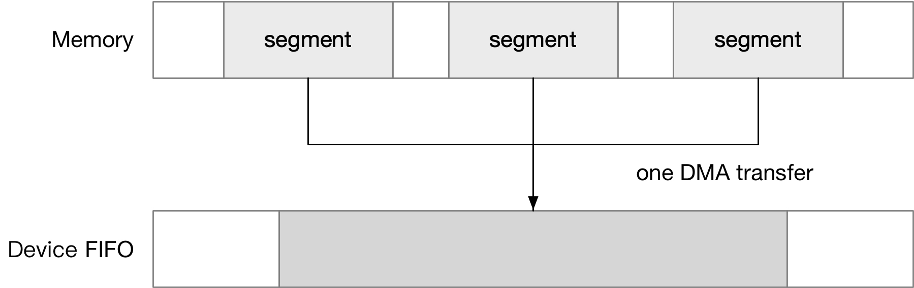

title:'Block - bio - single-page bvec'
## Block - bio - single-page bvec

### Intro

#### bvec

DMA 中使用 segment 的概念描述一段连续的物理内存区间，支持 scatter-gather 特性的 DMA controller 可以在一次 DMA transfer 中，实现一个或多个 segment (discontinuous physical memory) 和一段连续的设备物理地址区间 (adjacent disk sectors) 之间的数据传输




很多块设备就是使用 DMA 来实现数据传输的，因而体现在数据结构上，@bio->bi_io_vec[] 数组就描述了该 bio 包含的所有 "segment"，这里之所以打引号，是因为一个 struct bio_vec 并不等价于一个 segment，为了方便叙述，将其记为 bvec

```c
struct bio {
	struct bio_vec		*bi_io_vec; /* the actual vec list */
	...
};
```


bvec 实际上就描述了一段连续的物理内存区间，使用 (page, offset_in_page, len) 三元组就可以描述这一段内存区间

```c
struct bio_vec {
	struct page	*bv_page;
	unsigned int	bv_len;
	unsigned int	bv_offset;
};
```


bio 中使用数组的形式即 @bi_io_vec[] 数组描述该 bio 包含的所有 bvec

```c
struct bio {
	unsigned short		bi_vcnt; /* how many bio_vec's */
	unsigned short		bi_max_vecs; /* max bvl_vecs we can hold */
	struct bio_vec		*bi_io_vec; /* the actual vec list */
	...
};
```

@bi_max_vecs 描述这个数组的大小，即最多可以容纳的 bvec 的数量
@bi_vcnt 描述这个数组当前存储的 bvec 的数量

需要注意的是，bvec 数组占用的内存依赖于 bioset 机制（底层为 slab cache）分配，block layer 中用于 bvec 数组分配的全局 slab cache 的规格是 BIO_MAX_PAGES 即 256 个 bvec，因而 bio->bi_io_vec[] 数组最大只能包含 256 个 bvec 元素，也就是说一个 bio 最多只能包含 256 个 bvec


#### single-page bvec

之前说过 bvec 不能与 segment 完全等价，是因为最初 bio 中 bvec 的概念只是指一个 **partial page**，即一个 bvec 只是描述一个 page frame 的一个部分，其范围局限在 single page 内

```
*single-page bvec* 

struct page --> +-----------+         
 (@bv_page)     |           |                      
                |           |       
                |@@@@@@@@@@@| <- @bv_offset
                |@@@@@@@@@@@|                  
                |@@@@@@@@@@@| <- @bv_offset + @bv_len 
                |           |                         
                +-----------+
                one page frame
```

此外两个 bvec 描述的 page frame 有可能是相邻的，此时相当于是一个 segment 由两个 bvec 描述，这也就是 bvec 与 segment 不能等价的原因

```
*single-page bvec*    

+-----------+                          
|           |                        
|           |                           
|@@@@@@@@@@@| <- bv_offset1           
|@@@@@@@@@@@|                      
|@@@@@@@@@@@|                      
|@@@@@@@@@@@| <- bv_offset1 + bv_len1  
+-----------+                      
|@@@@@@@@@@@| <- bv_offset2           
|@@@@@@@@@@@|                          
|@@@@@@@@@@@| <- bv_offset2 + bv_len2   
|           |                     
|           |                        
|           |                    
+-----------+                    
```


### bio init from iovec

VFS 中使用 iovec 数组来描述传入的一组用户缓存，而 bio 中则维护一个 bio_vec 数组描述一组内存缓存，因而在下发 bio 之前就需要用 iovec 数组，来初始化 bio 的 bvec 数组

```sh
bio_iov_iter_get_pages
    do {
        __bio_iov_iter_get_pages(bio, iter);
            nr_pages = bio->bi_max_vecs - bio->bi_vcnt
            iov_iter_get_pages(..., nr_pages, ...)
		      
            while (idx--) {
                bv[idx].bv_page = 
                bv[idx].bv_len =
                bv[idx].bv_offset =
            }
		  
            iov_iter_advance
    } while (iov_iter_count(iter) && !bio_full(bio));
```

由于单个 iovec 是 multi-page 的，即大小可以超过 PAGE_SIZE，而 bvec 则是 single-page 的，因而这个过程中就需要将 iovec 数组描述的用户缓存按照 PAGE_SIZE 切分为一个个 page，然后保存到 bio 的 bvec 数组

```
iovec[0]                        bvec[0]
+-----------+                   +-----------+                          
|           |                   |           |                        
|           |                   |           |
|@@@@@@@@@@@|                   |@@@@@@@@@@@|
|@@@@@@@@@@@|                   |@@@@@@@@@@@|
|@@@@@@@@@@@|                   |@@@@@@@@@@@|
|@@@@@@@@@@@|                   |@@@@@@@@@@@|
+-----------+                   +-----------+
|@@@@@@@@@@@|                   bvec[1]
|@@@@@@@@@@@|                   +-----------+                          
|@@@@@@@@@@@|                   |@@@@@@@@@@@|
|           |                   |@@@@@@@@@@@|
|           |                   |@@@@@@@@@@@|
|           |                   |           |
+-----------+                   |           |
                                |           |
                                +-----------+


iovec[1]                        bvec[2]
+-----------+                   +-----------+                          
|           |                   |           |                        
|           |                   |           |
|@@@@@@@@@@@|                   |@@@@@@@@@@@|
|@@@@@@@@@@@|                   |@@@@@@@@@@@|
|@@@@@@@@@@@|                   |@@@@@@@@@@@|
|@@@@@@@@@@@|                   |@@@@@@@@@@@|
+-----------+                   +-----------+
|@@@@@@@@@@@|                   bvec[3]
|@@@@@@@@@@@|                   +-----------+
|           |                   |@@@@@@@@@@@|
|           |                   |@@@@@@@@@@@|
|           |                   |           |
|           |                   |           |
+-----------+                   |           |
                                |           |
                                +-----------+
```


需要注意的是，以上初始化 bio 的 bvec 数组的过程中，单个 bio 能够容纳的 bvec 的数量受到 @bi_io_vec[] 数组大小的限制

bio 通常是通过 bioset 分配的，bioset 机制实际上也是通过 slab cache 分配 bvec 所需的内存空间，block layer 中用于 bvec 数组分配的全局 slab cache 的规格是 BIO_MAX_PAGES 即 256 个 bvec，因而 bio->bi_io_vec[] 数组最大只能包含 256 个 bvec 元素，这就导致单个 bio 最多能够容纳 256 个 bvec

在这一阶段，限制单个 bio 大小的就只有 @bio->bi_io_vec[] 数组的大小，而不会受到 @max_sectors/max_segments 的限制，因而单个 bio 可以存满 256 个 bvec

之后在 block layer 执行的 blk_queue_split() 中，才会按照 @max_sectors/max_segments 参数限制，将 bio 拆分为多个 bio


### segments calculation

块设备存在 @max_segments 参数限制，即单个 request 包含的 segment 数量不能超过 @max_segments，由于 bvec 不能等价于 segment，因而就必须计算单个 bio/request 中包含的 segment 数量

#### bi_phys_segments/nr_phys_segments

在 single-page bvec 时代，在 bio/request 结构体中各维护有一个字段描述其包含的 segment 的数量

```c
struct bio {
	/* Number of segments in this BIO after
	 * physical address coalescing is performed.
	 */
	unsigned int		bi_phys_segments;
	...
}
```

```c
struct request {
	/*
	 * Number of scatter-gather DMA addr+len pairs after
	 * physical address coalescing is performed.
	 */
	unsigned short nr_phys_segments;
	...
};
```


#### bio calculation

之前介绍过，bio->bi_phys_segment 字段描述了 bio 中 physical segment 的数量，但是 bio 初始化的时候并不会设置 @bi_phys_segment 字段，后续处理过程中需要调用 blk_recount_segments() 计算 bio 包含的 physical segment 的数量，保存在 @bi_phys_segment 字段，同时在 bio->bi_flags 字段设置上 BIO_SEG_VALID 标志

request queue 的 entry point 中，在 make_request_fn() 回调函数调用过程中，调用 blk_queue_split() 的时候就会初始化 @bi_phys_segment 字段；如果 bio 不能与任一个 pending request 相合并，在将 bio 封装为一个新的 request 的过程中，也会初始化 @bi_phys_segment 字段


bio 中包含的 physical segment 数量，即 bio->bi_phys_segment 字段的计算相对简单，bio 中相邻的两个 bio_vec，如果它们各自描述的内存区间的物理地址连续，那么这两个 bio_vec 就可以视为一个 physical segment，即 bio 内部连续的 bio_vec 可以合并为一个 physical segment


#### request calculation

request 包含的 physical segment 的数量，即 @request->nr_phys_segments 字段的计算则更为复杂一些，同时计算规则也不那么“统一”

当 bio 封装为 request 的时候，@request->nr_phys_segments 字段的初始值自然是来自 @bio->bi_phys_segment

```
blk_rq_bio_prep
    rq->nr_phys_segments = bio_phys_segments(q, bio)
```

> requests merge

两个 request 合并过程中，一个 request 包含的两个相邻 bio 可以合并为一个 physical segment

例如一个 request A 与 request B 合并过程中，request A 的最后一个 bio A，以及 request B 的第一个 bio B，两个 bio 的 sector 地址连续，同时两个 bio 的 @bi_phys_segments 字段的值分别为 bi_phys_segments_A、bi_phys_segments_B，如果这两个 bio 描述的内存区间的物理地址连续，那么合并后的 request->nr_phys_segments 的值应该为 (bi_phys_segments_A + bi_phys_segments_B - 1)，也就是中间部分合并为了一个 physical segment

```
ll_merge_requests_fn
    total_phys_segments = req->nr_phys_segments + next->nr_phys_segments
    if (blk_phys_contig_segment()) total_phys_segments--
    req->nr_phys_segments = total_phys_segments
```


> bio & request merge

诡异的是 bio 与 request 合并过程中，合并后的 @request->nr_phys_segments 的计算则稍有不同，此时 bio 不会与 request 的最后一个 bio 合并为一个 physical segment，即使这两个 bio 描述的内存区间的物理地址连续

例如 bio 与 request 合并过程中，合并后的 @request->nr_phys_segments 只是合并前 @request->nr_phys_segments 与 @bio->bi_phys_segment 相加的和，而不会考虑 request 的最后一个 bio 的最后一个 bio_vec 能否与 bio 的第一个 bio_vec 合并为一个 physical segment

```
blk_mq_bio_list_merge
    bio_attempt_back_merge
        ll_back_merge_fn
            ll_new_hw_segment
                req->nr_phys_segments += bio->bi_phys_segments
```

值得一提的是，在request 与 bio 合并过程中，不存在新合并的 physical segment，因而也就用不到 @bi_seg_front_size、@bi_seg_back_size 字段


> blk_recalc_rq_segments

blk_recalc_rq_segments() 函数用于计算一个 request 中包含的 physical segment 数量即 @request->nr_phys_segments 字段，此时计算规则与 requests merge 时的规则相一致，即一个 request 包含的两个相邻 bio 可以合并为一个 physical segment

例如一个 request 中包含 bio A、bio B，两个 bio 的 sector 地址连续，同时两个 bio 的 @bi_phys_segments 字段的值分别为 bi_phys_segments_A、bi_phys_segments_B，如果这两个 bio 描述的内存区间的物理地址连续，那么此时 request->nr_phys_segments 的值应该为 (bi_phys_segments_A + bi_phys_segments_B - 1)，也就是中间部分合并为了一个 physical segment


需要注意的是，blk_recalc_rq_segments() 有两处调用链

1. partial complete

一个 request 完成的时候，其中可能只有部分数据成功下发到底层的设备，还有部分数据并没有完成，此时在 blk_update_request() 中就会调用 blk_recalc_rq_segments() 重新计算 @req->nr_phys_segments 字段的值

```
blk_end_request
    blk_update_request
        blk_recalc_rq_segments
```


2. request-based dm 设备在下发 IO 时，会按照底层映射的设备的 limits 参数重新计算 @req->nr_phys_segments

```
dm_mq_queue_rq
    map_request
        dm_dispatch_clone_request
            blk_insert_cloned_request
                blk_cloned_rq_check_limits
                    blk_recalc_rq_segments
```


#### device driver calculation

在处理 normal READ/WRTE request 时，virtio-blk/nvme 驱动会自己重新计算一遍 request 中包含的 physical segment 的数量，此时计算规则是，两个相邻 bio 可以合并为一个 physical segment

注意驱动并不会直接使用 @request->nr_phys_segments，而只是当驱动计算得到的 nsegs 大于上层 block layer 计算得到的 @request->nr_phys_segments 时，打印 warning 信息

```
virtio_queue_rq/nvme_queue_rq
    blk_rq_map_sg
        __blk_bios_map_sg
        WARN_ON(nsegs > blk_rq_nr_phys_segments(rq));
```


####  bi_seg_front_size/bi_seg_back_size

@limits.max_segment_size 参数限制了一个 physical segment 的大小上限，在 bio 与 request 合并、或两个 request 合并的过程中，如果中间可以合并为一个 physical segment，那么需要确保合并后的 physical segment 的大小没有超过 @limits.max_segment_size 参数限制

由于 bio 与 request 合并过程中，实际上是 request 的最后一个 bio (back merge) 或第一个 bio (front merge) 与该 bio 合并；两个 request 合并过程中，实际上是前一个 request 的最后一个 bio 与后一个 request 的第一个 bio 合并；因而实际上都可以抽象为两个 bio 的合并

之前介绍过，合并过程中需要判断合并后的 physical segment 的大小没有超过 @limits.max_segment_size 参数限制，为了加速这一检查过程，bio 中维护有以下两个字段

```c
struct bio {
	/*
	 * To keep track of the max segment size, we account for the
	 * sizes of the first and last mergeable segments in this bio.
	 */
	unsigned int		bi_seg_front_size;
	unsigned int		bi_seg_back_size;
	...
}
```

这两个字段只有 normal READ/WRITE bio 才会设置，其中

- @bi_seg_front_size 描述了该 bio 中包含的第一个 physical segment 的大小
- @bi_seg_back_size 描述了该 bio 中包含的最后一个 physical segment 的大小

@bi_seg_front_size、@bi_seg_back_size 在 bio split 路径中初始化

```
blk_queue_split
    blk_bio_segment_split
        bio->bi_seg_front_size =
        bio->bi_seg_back_size =
```


request merge 过程中，会调用 blk_phys_contig_segment() 检查，前面一个 request 的最后一个 physical segment 与后面一个 request 的第一个 physical segment 合并过程中，合并后的 physical segment 是否超过 @max_segment_size 限制，这一检查过程中将前一个 request 的最后一个 bio 的 @bi_seg_back_size 字段，加上后一个 request 的第一个 bio 的 @bi_seg_front_size 字段，就可以快速计算得到合并后的 physical segment 的大小

```
ll_merge_requests_fn
    blk_phys_contig_segment
            bio *bio = req_prev->biotail, 
            bio *nxt = req_next->bio
            bio->bi_seg_back_size + nxt->bi_seg_front_size > queue_max_segment_size(q)
```


