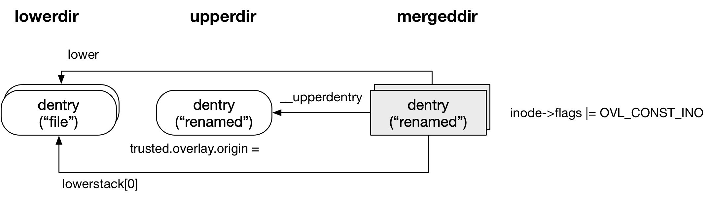
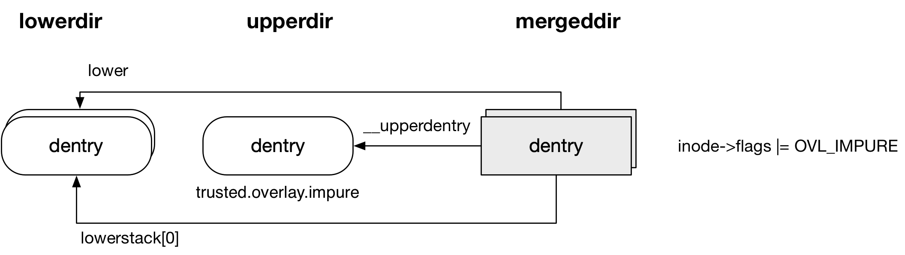

## overlayfs - Feature - xino

### Background

本文介绍的 origin/impure/xino 特性用于保证 stat(2) 返回的 st_ino/st_dev 字段的一致性

stat(2) 的 @st_dev 字段描述文件所在的 block device，@st_ino 字段描述文件的 inode number

本文介绍的特性主要应用于 copy-up 阶段，在这些特性出现之前，对 copy-up 前后的文件分别执行 stat(2)，返回的 st_ino/st_dev 字段不是一致的，这显然是不符合 POSIX 语义的


例如假设文件结构为

```
lowerdir/dir/file   upperdir/   mergedir/   workdir/
```

此时执行

```
# mv mergedir/dir/file mergedir/dir/renamed
```

会触发 copy-up 操作，此时对 lowerdir 下的文件执行 stat(2) 操作，返回的 @st_ino 反映的是 lowerdir 下文件的 inode number；而对 mergedir 下的文件执行 stat(2) 操作，返回的 @st_ino 反映的是 upperdir 下文件的 inode number

这里主要是因为文件系统并不知道 upperdir 下的文件，到底是 copy-up 上来的，还是完全新建的。例如上述例子中，"renamed" 文件是 copy-up 上来的，那么对其执行 stat(2) 操作，返回的 @st_ino 应该反映 lowerdir 下的 "file" 文件的 inode number；但是 "renamed" 文件也完全有可能是新建的，例如没有执行上述的 mv 操作，而是执行 "touch mergedir/dir/renamed"，此时对其执行 stat(2) 操作，返回的 @st_ino 就应该反映 upperdir 下的 "renamed" 文件的 inode number


### origin

为了解决上述问题，overlayfs 在 v4.12 版本引入 origin 特性

origin 特性是指在发生 copy-up 的时候，给 upperdir 下 copy-up 上来的文件设置上 "trusted.overlay.origin" xattr，其值是对应的 lowerdir 下路径 hex 编码后的一串字符串

例如

```sh
# ls -li /mnt/low/dir/
total 0
1179657 -rw-r--r-- 1 root root 1073741824 Sep 12 16:19 file

# ls -li /mnt/merge/dir/
total 0
1179657 -rw-r--r-- 1 root root 1073741824 Sep 12 16:19 file

# mv /mnt/merge/dir/file  /mnt/merge/dir/renamed

# ls -li /mnt/merge/dir/
total 1048580
1179657 -rw-r--r-- 1 root root 1073741824 Sep 12 16:19 renamed

# getfattr -d -m - -R   /mnt/upper/dir/renamed
trusted.overlay.origin=0sAPsdAAHaDzGsRMNE8K/xrFKw2sgqCQASADnpi2w=
```


#### pathname lookup



对于 copy-up 上来的文件执行 pathname lookup 操作时，即使由于重命名的关系导致 lowerdir 下没有同名文件，也还是可以根据文件的 "trusted.overlay.origin" 属性找到 lowerdir 下对应的文件，此时 @lower 字段还是会指向 lowerdir 下对应的文件，尽管此时 lowerdir 和 upperdir 下的文件名称不一样


#### stat

之后对 copy-up 上来的文件执行 stat(2) 操作时，stat 的大部分字段都还是直接来自 upperdir 下的文件，在此基础上 @st_ino/st_dev 字段则是来自 lowerdir 下的文件

```sh
inode_ops->getattr(), that is, ovl_getattr
    # get stat of upperdentry
    # if (origin)
        # get stat of lowerdentry
        # stat->ino = stat of lowerdentry.ino
        # stat->dev = ...
```


### impure

上述介绍的 origin 特性已经能够解决 copy-up 前后 @st_ino/st_dev 的一致性问题，这是通过在 pathname lookup 过程中检查文件的 "trusted.overlay.origin" 属性，来识别文件是否是 copy-up 上来的

但是 origin 特性只能解决 stat(2) 的 @st_ino/st_dev 一致性问题，并没有解决 readdir(2) 的 @d_ino 的一致性问题；readdir(2) 的 @d_ino 字段描述对应的 directory entry 描述的文件的 inode number，由于 readdir(2) 过程中只有对目录执行 pathname lookup 操作，没有对目录下文件的 pathname lookup 操作，因而之前介绍的 origin 特性并不能解决 readdir(2) 的 @d_ino 一致性问题

而如果每次执行 readdir(2) 时都检查目录下的所有文件是否设置有 "trusted.overlay.origin" 属性，由于获取 xattr 的操作属于 IO 操作，那么这势必会导致 readdir(2) 的性能下降

为了解决这一问题，overlayfs 在 v4.12 版本引入 impure 特性，其思想非常简单就是在触发 copy-up 的时候，对 upperdir 下 copy-up 文件所在的目录设置上 "trusted.overlay.impure" xattr，因而如果 upperdir 下的一个目录设置有 "trusted.overlay.impure" 属性，就说明该目录下存在 copy-up 上来的文件

```sh
# getfattr -d -m - -R   /mnt/upper/dir
trusted.overlay.impure="y"
trusted.overlay.origin=0sAPsdAAHaDzGsRMNE8K/xrFKw2sgqCgASACMkIK4=
```

此时在执行 readdir(2) 时，只有当目录设置有 "trusted.overlay.impure" 属性时，才需要检查该目录下的文件是否设置有 "trusted.overlay.origin" 属性


#### pathname lookup



在 pathname lookup 过程中，当检查到目录设置有 "trusted.overlay.impure" 属性时，目录对应的 overlayfs inode 会设置上 OVL_IMPURE 标志


### xino

之前介绍的 origin/impure 特性可以解决 stat(2) 中 st_dev/st_ino 和 readdir(2) 中 d_ino 一致性的问题，但是仍然存在以下问题，即对同一个 overlayfs 文件系统上的两个文件执行 stat(2) 操作，返回的 st_dev 可能是不一致的

假设 overlayfs 中存在两个 lowerdir，对 lowerdir1 下文件执行 stat(2) 操作，返回的 @st_dev 实际上是 lowerdir1 所在的 block device number，而对 lowerdir2 下文件执行 stat(2) 操作，返回的 @st_dev 实际上是 lowerdir2 所在的 block device number，如果 lowerdir1/2 不在同一个文件系统上，那么对这两个文件进行 stat(2) 操作返回的 @st_dev 就是两个不同的值

同一个文件系统上的两个文件执行 stat(2) 操作，返回的 @st_dev 值不一样，这显然有违 POSIX 语义

另外同一个文件系统上的两个文件执行 stat(2) 操作，返回的 @st_ino 值可能是一样的，这显然也违背了 POSIX 语义；还是以上的例子，对 lowerdir1 下文件执行 stat(2) 操作，返回的 @st_ino 实际上是 lowerdir1 下的文件在所在文件系统中的 inode number，而对 lowerdir2 下文件执行 stat(2) 操作，返回的 @st_ino 实际上是 lowerdir2 下的文件在所在文件系统中的 inode number，如果 lowerdir1/2 不在同一个文件系统上，那么对这两个文件的 inode number 就完全有可能是相同的


为了解决以上问题，overlayfs 在 v4.17 版本引入 xino 的特性，其思想是将原本各个 lowerlayer 分散的 inode number 地址空间，拼接为一个连续的 inode number 地址空间，同时让同一个 overlayfs 下的所有文件返回相同的 st_dev


#### parameter

用户在挂载 overlayfs 的时候可以通过 "xino=auto|on|off" 参数控制是否开启 xino 特性

当用户未显式设置 "xino=auto|on|off" 参数时，是否开启 xino 特性的默认行为由 "xino_auto" 模块参数控制，该模块参数的默认值由 CONFIG_OVERLAY_FS_XINO_AUTO 决定

以下表格罗列了各种参数组合时 xino 的模式

param | xino mode
---- | ----
"off" | off
"on" | on
"auto" | auto
"xino_auto"=0 | off
"xino_auto"=1 | auto


off/on 模式的含义非常直观，auto 模式的意思是

- 当系统为 32 bit 时，考虑到 @st_ino 只有 32 bit，因而不开启 xino 特性
- 当系统为 64 bit 时，@st_ino 为 64 bit，此时
    - 如果存在任意一个 lowerlayer 使用的 inode number 地址空间超过 32 bit，那么就不开启 xino 特性
    - 否则开启 xino 特性


#### feature

> return the same st_dev

此时对同一个 overlayfs 下的所有文件执行 stat(2) 操作会返回相同的 st_dev，overlayfs 执行 mount 操作的时候会为整个文件系统分配一个 anonymous block device number，stat(2) 操作返回的 st_dev 就是这里分配的 anonymous block device number


> unique inode address space

xino 特性会将原本各个 lowerlayer 分散的 inode number 地址空间，拼接为一个连续的 inode number 地址空间

其思想是尽管 inode number 占用 64 bit，但是文件系统一般用不到这么多数量的 inode number，因而可以将 64 bit 的 inode number 划分为两部分，其低位部分仍然存储原来的 inode number，高位部分（占用 xinobits bits）则用于存储 fsid

overlayfs 中每个 layer (包括 upperlayer 与所有 lowerlayer) 都有一个唯一的 fsid，如果两个 layer 位于同一个文件系统，那么这两个 layer 共用同一个 fsid，upperlayer 的 fsid 为 0，lowerlayer 的 fsid 则从 1 开始网上递增


```
lowlayer.fsid               lowlayer.ino
+---------------+-------------------------------+
|               |                               |
+---------------+-------------------------------+
    xinobits                64 - xinobits
```


64 bit 的 inode number 中，高 xinobits bits 用于存储对应的 fsid，至于 xinobits 的值具体是多少，是 overlayfs 在挂载的时候根据当前 lowerlayer 的数量计算的，例如 lowerlayer 一共有 7 层，那么 fsid 就需要占用 3 bits


同时当开启 xino 特性时，在 overlayfs 挂载的时候并不会检查 underlying lowerlayer 的 inode number 是否真的有预留出足够的空间来存储 xinobits，实际上即使挂载的时候 lowerlayer 的 inode number 有预留出 xinobits bits，但是 lowerlayer 所在文件系统中 inode 的数量可能是动态变化的，因而在挂载的时候 lowerlayer 的 inode 数量满足条件，不代表之后一直满足条件

因而这个检查会推迟到对文件执行 stat(2) 操作的时候再执行，这个时候如果检查到从 lowerlayer 获取的 inode number 的高 xinobits 位的值不是全零，那么此时会报错

```
"overlayfs: inode number too big (%pd2, ino=%llu, xinobits=%d)
```

此时 stat(2) 返回的还是 lowerlayer 下文件原先的 inode number (并没有附加 fsid)，也就是此时 xino 实际上是失效的
